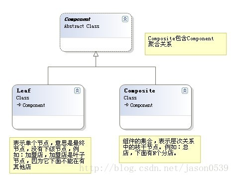
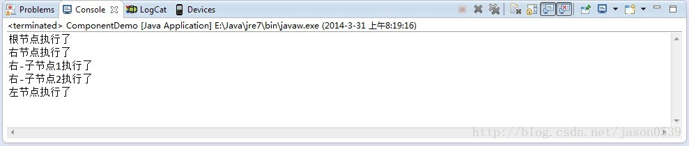
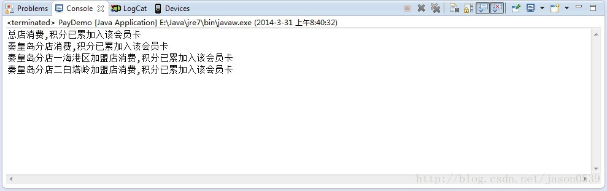

资料来源：<br/>
[JAVA设计模式初探之组合模式](https://blog.csdn.net/jason0539/article/details/22642281)

 先看看组合模式的定义吧：“**将对象组合成树形结构以表示‘部分-整体’的层次结构。组合模式使得用户对单个对象和组合对象的使用具有一致性。**”

  就拿剪发办卡的事情来分析一下吧。

首先，一张卡可以在总部，分店，加盟店使用，那么总部可以刷卡，分店也可以刷卡，加盟店也可以刷卡，这个属性结构的店面层级关系就明确啦。

  那么，总店刷卡消费与分店刷卡消费是一样的道理，那么总店与分店对会员卡的使用也具有一致性。

 **1.组合模式的例子**



那么组合模式的实例如下：

```java
import java.util.ArrayList;
import java.util.List;
 
public class ComponentDemo {
	public abstract class Component {
		String name;
 
		public abstract void add(Component c);
 
		public abstract void remove(Component c);
 
		public abstract void eachChild();
	}
 
	// 组合部件类
	public class Leaf extends Component {
 
		// 叶子节点不具备添加的能力，所以不实现
		@Override
		public void add(Component c) {
			// TODO Auto-generated method stub
			System.out.println("");
		}
 
		// 叶子节点不具备添加的能力必然也不能删除
		@Override
		public void remove(Component c) {
			// TODO Auto-generated method stub
			System.out.println("");
		}
 
		// 叶子节点没有子节点所以显示自己的执行结果
		@Override
		public void eachChild() {
			// TODO Auto-generated method stub
			System.out.println(name + "执行了");
		}
 
	}
 
	// 组合类
	public class Composite extends Component {
 
		// 用来保存节点的子节点
		List<Component> list = new ArrayList<Component>();
 
		// 添加节点 添加部件
		@Override
		public void add(Component c) {
			// TODO Auto-generated method stub
			list.add(c);
		}
 
		// 删除节点 删除部件
		@Override
		public void remove(Component c) {
			// TODO Auto-generated method stub
			list.remove(c);
		}
 
		// 遍历子节点
		@Override
		public void eachChild() {
			// TODO Auto-generated method stub
			System.out.println(name + "执行了");
			for (Component c : list) {
				c.eachChild();
			}
		}
	}
 
	public static void main(String[] args) {
		ComponentDemo demo = new ComponentDemo();
		// 构造根节点
		Composite rootComposite = demo.new Composite();
		rootComposite.name = "根节点";
 
		// 左节点
		Composite compositeLeft = demo.new Composite();
		compositeLeft.name = "左节点";
 
		// 构建右节点，添加两个叶子几点，也就是子部件
		Composite compositeRight = demo.new Composite();
		compositeRight.name = "右节点";
		Leaf leaf1 = demo.new Leaf();
		leaf1.name = "右-子节点1";
		Leaf leaf2 = demo.new Leaf();
		leaf2.name = "右-子节点2";
		compositeRight.add(leaf1);
		compositeRight.add(leaf2);
 
		// 左右节点加入 根节点
		rootComposite.add(compositeRight);
		rootComposite.add(compositeLeft);
		// 遍历组合部件
		rootComposite.eachChild();
	}
}
```

执行结果如下：



**2.应用组合模式的会员卡消费**

 那么我们就根据我们会员卡的消费，来模拟一下[组合模式](https://so.csdn.net/so/search?q=组合模式&spm=1001.2101.3001.7020)的实现吧！let's go！

​    首先：

 		1.我们的部件有，总店，分店，加盟店！

​        2.我们的部件共有的行为是：刷会员卡

​        3.部件之间的层次关系，也就是店面的层次关系是，总店下有分店、分店下可以拥有加盟店。

有了我们这几个必要条件后，我的要求就是目前店面搞活动当我在总店刷卡后，就可以累积相当于在所有下级店面刷卡的积分总额，设计的代码如下：

```java
import java.util.ArrayList;
import java.util.List;
 
public class PayDemo {
 
	public abstract class Market {
		String name;
 
		public abstract void add(Market m);
 
		public abstract void remove(Market m);
 
		public abstract void PayByCard();
	}
 
	// 分店 下面可以有加盟店
	public class MarketBranch extends Market {
		// 加盟店列表
		List<Market> list = new ArrayList<PayDemo.Market>();
 
		public MarketBranch(String s) {
			this.name = s;
		}
 
		@Override
		public void add(Market m) {
			// TODO Auto-generated method stub
			list.add(m);
		}
 
		@Override
		public void remove(Market m) {
			// TODO Auto-generated method stub
			list.remove(m);
		}
 
		// 消费之后，该分店下的加盟店自动累加积分
		@Override
		public void PayByCard() {
			// TODO Auto-generated method stub
			System.out.println(name + "消费,积分已累加入该会员卡");
			for (Market m : list) {
				m.PayByCard();
			}
		}
	}
 
	// 加盟店 下面不在有分店和加盟店，最底层
	public class MarketJoin extends Market {
		public MarketJoin(String s) {
			this.name = s;
 
		}
 
		@Override
		public void add(Market m) {
			// TODO Auto-generated method stub
 
		}
 
		@Override
		public void remove(Market m) {
			// TODO Auto-generated method stub
 
		}
 
		@Override
		public void PayByCard() {
			// TODO Auto-generated method stub
			System.out.println(name + "消费,积分已累加入该会员卡");
		}
	}
 
	public static void main(String[] args) {
		PayDemo demo = new PayDemo();
		
		MarketBranch rootBranch = demo.new MarketBranch("总店");
		MarketBranch qhdBranch = demo.new MarketBranch("秦皇岛分店");
		MarketJoin hgqJoin = demo.new MarketJoin("秦皇岛分店一海港区加盟店");
		MarketJoin btlJoin = demo.new MarketJoin("秦皇岛分店二白塔岭加盟店");
		
		qhdBranch.add(hgqJoin);
		qhdBranch.add(btlJoin);
		rootBranch.add(qhdBranch);
		rootBranch.PayByCard();
	}
}
```

运行结果如下：



 这样在累积所有子店面积分的时候，就不需要去关心子店面的个数了，也不用关系是否是叶子节点还是组合节点了，也就是说不管是总店刷卡，还是加盟店刷卡，都可以正确有效的计算出活动积分。

   **3.什么情况下使用组合模式**

引用大话设计模式的片段：“**当发现需求中是体现部分与整体层次结构时，以及你希望用户可以忽略组合对象与单个对象的不同，统一地使用组合结构中的所有对象时，就应该考虑组合模式了。”**