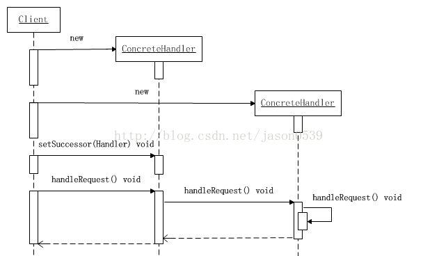

资料来源：<br/>
[Java设计模式之责任链模式、职责链模式](https://blog.csdn.net/jason0539/article/details/45091639)

## 责任链模式

### 概念

**什么是链**

1、链是一系列节点的集合。

2.、链的各节点可灵活拆分再重组。

**职责链模式**

使多个对象都有机会处理请求，从而避免请求的发送者和接受者之间的耦合关系，

将这个对象连成一条链，并沿着这条链传递该请求，直到有一个对象处理他为止。

**角色**

抽象处理者角色(Handler)：定义出一个处理请求的接口。如果需要，接口可以定义 出一个方法以设定和返回对下家的引用。这个角色通常由一个Java抽象类或者Java接口实现。

具体处理者角色(ConcreteHandler)：具体处理者接到请求后，可以选择将请求处理掉，或者将请求传给下家。由于具体处理者持有对下家的引用，因此，如果需要，具体处理者可以访问下家。

抽象处理者角色

### 举例

```java
public abstract class Handler {
    
    /**
     * 持有后继的责任对象
     */
    protected Handler successor;
    /**
     * 示意处理请求的方法，虽然这个示意方法是没有传入参数的
     * 但实际是可以传入参数的，根据具体需要来选择是否传递参数
     */
    public abstract void handleRequest();
    /**
     * 取值方法
     */
    public Handler getSuccessor() {
        return successor;
    }
    /**
     * 赋值方法，设置后继的责任对象
     */
    public void setSuccessor(Handler successor) {
        this.successor = successor;
    }
    
}
```

具体处理者角色

```java
public class ConcreteHandler extends Handler {
    /**
     * 处理方法，调用此方法处理请求
     */
    @Override
    public void handleRequest() {
        /**
         * 判断是否有后继的责任对象
         * 如果有，就转发请求给后继的责任对象
         * 如果没有，则处理请求
         */
        if(getSuccessor() != null)
        {            
            System.out.println("放过请求");
            getSuccessor().handleRequest();            
        }else
        {            
            System.out.println("处理请求");
        }
    }
 
}
```

客户端类

```java
public class Client {
 
    public static void main(String[] args) {
        //组装责任链
        Handler handler1 = new ConcreteHandler();
        Handler handler2 = new ConcreteHandler();
        handler1.setSuccessor(handler2);
        //提交请求
        handler1.handleRequest();
    }
 
}
```

可以看出，客户端创建了两个处理者对象，并指定第一个处理者对象的下家是第二个处理者对象，而第二个处理者对象没有下家。然后客户端将请求传递给第一个处理者对象。
由于本示例的传递逻辑非常简单：只要有下家，就传给下家处理；如果没有下家，就自行处理。
因此，第一个处理者对象接到请求后，会将请求传递给第二个处理者对象。由于第二个处理者对象没有下家，于是自行处理请求。活动时序图如下所示。



### 应用

申请聚餐费用的管理，申请聚餐费用的大致流程一般是，由申请人先填写申请单，然后交给领导审批，如果申请批准下来，领导会通知申请人审批通过，然后申请人去财务领取费用，如果没有批准下来，领导会通知申请人审批未通过，此事也就此作罢。
不同级别的领导，对于审批的额度是不一样的，比如，项目经理只能审批500元以内的申请；部门经理能审批1000元以内的申请；而总经理可以审核任意额度的申请。


当某人提出聚餐费用申请的请求后，该请求会经由项目经理、部门经理、总经理之中的某一位领导来进行相应的处理，但是提出申请的人并不知道最终会由谁来处理他的请求，一般申请人是把自己的申请提交给项目经理，或许最后是由总经理来处理他的请求。申请人只要直接与项目经理交互就可以，其余的工作在黑盒中，究竟流程是怎样的，最后是由谁审批通过的，申请人无需关心。


抽象处理者角色类

```java
public abstract class Handler {
    /**
     * 持有下一个处理请求的对象
     */
    protected Handler successor = null;
    /**
     * 取值方法
     */
    public Handler getSuccessor() {
        return successor;
    }
    /**
     * 设置下一个处理请求的对象
     */
    public void setSuccessor(Handler successor) {
        this.successor = successor;
    }
    /**
     * 处理聚餐费用的申请
     * @param user    申请人
     * @param fee    申请的钱数
     * @return        成功或失败的具体通知
     */
    public abstract String handleFeeRequest(String user , double fee);
}
```

具体处理者角色

```java
public class ProjectManager extends Handler {
 
    @Override
    public String handleFeeRequest(String user, double fee) {
        
        String str = "";
        //项目经理权限比较小，只能在500以内
        if(fee < 500)
        {
            //为了测试，简单点，只同意张三的请求
            if("张三".equals(user))
            {
                str = "成功：项目经理同意【" + user + "】的聚餐费用，金额为" + fee + "元";    
            }else
            {
                //其他人一律不同意
                str = "失败：项目经理不同意【" + user + "】的聚餐费用，金额为" + fee + "元";
            }
        }else
        {
            //超过500，继续传递给级别更高的人处理
            if(getSuccessor() != null)
            {
                return getSuccessor().handleFeeRequest(user, fee);
            }
        }
        return str;
    }
 
}
```

```java
public class DeptManager extends Handler {
 
    @Override
    public String handleFeeRequest(String user, double fee) {
        
        String str = "";
        //部门经理的权限只能在1000以内
        if(fee < 1000)
        {
            //为了测试，简单点，只同意张三的请求
            if("张三".equals(user))
            {
                str = "成功：部门经理同意【" + user + "】的聚餐费用，金额为" + fee + "元";    
            }else
            {
                //其他人一律不同意
                str = "失败：部门经理不同意【" + user + "】的聚餐费用，金额为" + fee + "元";
            }
        }else
        {
            //超过1000，继续传递给级别更高的人处理
            if(getSuccessor() != null)
            {
                return getSuccessor().handleFeeRequest(user, fee);
            }
        }
        return str;
    }
 
}
```

```java
public class GeneralManager extends Handler {
 
    @Override
    public String handleFeeRequest(String user, double fee) {
        
        String str = "";
        //总经理的权限很大，只要请求到了这里，他都可以处理
        if(fee >= 1000)
        {
            //为了测试，简单点，只同意张三的请求
            if("张三".equals(user))
            {
                str = "成功：总经理同意【" + user + "】的聚餐费用，金额为" + fee + "元";    
            }else
            {
                //其他人一律不同意
                str = "失败：总经理不同意【" + user + "】的聚餐费用，金额为" + fee + "元";
            }
        }else
        {
            //如果还有后继的处理对象，继续传递
            if(getSuccessor() != null)
            {
                return getSuccessor().handleFeeRequest(user, fee);
            }
        }
        return str;
    }
 
}
```

客户端类

```java
public class Client {
 
    public static void main(String[] args) {
        //先要组装责任链
        Handler h1 = new GeneralManager();
        Handler h2 = new DeptManager();
        Handler h3 = new ProjectManager();
        h3.setSuccessor(h2);
        h2.setSuccessor(h1);
        
        //开始测试
        String test1 = h3.handleFeeRequest("张三", 300);
        System.out.println("test1 = " + test1);
        String test2 = h3.handleFeeRequest("李四", 300);
        System.out.println("test2 = " + test2);
        System.out.println("---------------------------------------");
        
        String test3 = h3.handleFeeRequest("张三", 700);
        System.out.println("test3 = " + test3);
        String test4 = h3.handleFeeRequest("李四", 700);
        System.out.println("test4 = " + test4);
        System.out.println("---------------------------------------");
        
        String test5 = h3.handleFeeRequest("张三", 1500);
        System.out.println("test5 = " + test5);
        String test6 = h3.handleFeeRequest("李四", 1500);
        System.out.println("test6 = " + test6);
    }
 
}
```

**职责链灵活在哪**

\1. 改变内部的传递规则

在内部，项目经理完全可以跳过人事部到那一关直接找到总经理。

每个人都可以去动态地指定他的继任者。

\2. 可以从职责链任何一关开始。

如果项目经理不在，可以直接去找部门经理，责任链还会继续，没有影响。

\3.用与不用的区别
不用职责链的结构，我们需要和公司中的每一个层级都发生耦合关系。
如果反映在代码上即使我们需要在一个类中去写上很多丑陋的if….else语句。
如果用了职责链，相当于我们面对的是一个黑箱，我们只需要认识其中的一个部门，然后让黑箱内部去负责传递就好了纯的与不纯的责任链模式

一个纯的责任链模式要求一个具体的处理者对象只能在两个行为中选择一个：一是承担责任，而是把责任推给下家。不允许出现某一个具体处理者对象在承担了一部分责任后又 把责任向下传的情况。

在一个纯的责任链模式里面，一个请求必须被某一个处理者对象所接收；在一个不纯的责任链模式里面，一个请求可以最终不被任何接收端对象所接收。

纯的责任链模式的实际例子很难找到，一般看到的例子均是不纯的责任链模式的实现。