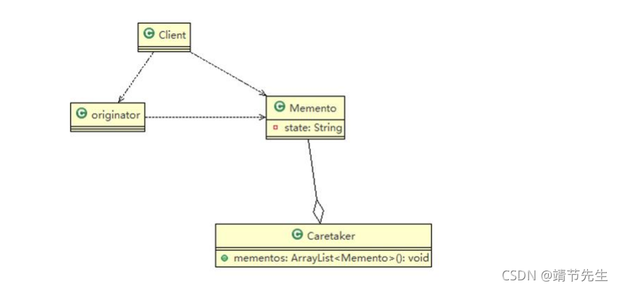

资料来源：<br/>
非原文
[Java设计模式之备忘录模式](https://blog.csdn.net/m0_37583655/article/details/121187709)

## 1. 备忘录模式概述

### 1.1 备忘录模式简介

1.备忘录模式(Memento Pattern)在不破坏封装性的前提下,捕获一个对象的内部状态,并在该对象之外保存这 个状态.这样以后就可将该对象恢复到原先保存的状态。

2.可以这里理解备忘录模式：现实生活中的备忘录是用来记录某些要去做的事情,或者是记录已经达成的共同意 见的事情,以防忘记了.而在软件层面,备忘录模式有着相同的含义,备忘录对象主要用来记录一个对象的某 种状态,或者某些数据,当要做回退时,可以从备忘录对象里获取原来的数据进行恢复操作 。

3.备忘录模式属于行为型模式。

### 1.2 备忘录模式类图



图的说明-即(备忘录模式的角色及职责)<br/>
1.originator : 对象(需要保存状态的对象) 。<br/>
2.Memento ： 备忘录对象,负责保存好记录,即 Originator 内部状态 。<br/>
3.Caretaker: 守护者对象,负责保存多个备忘录对象, 使用集合管理,提高效率 。<br/>
4.说明：如果希望保存多个 originator 对象的不同时间的状态,也可以,只需要要 HashMap <String, 集合> 。<br/>

1.3 备忘录模式的注意事项和细节<br/>
1.给用户提供了一种可以恢复状态的机制,可以使用户能够比较方便地回到某个历史的状态 。<br/>
2.实现了信息的封装,使得用户不需要关心状态的保存细节 。<br/>
3.如果类的成员变量过多,势必会占用比较大的资源,而且每一次保存都会消耗一定的内存, 这个需要注意 。<br/>
4.适用的应用场景：1,打游戏时的存档. 2,撤销功能 3,数据库的事务管理。<br/>
5.为了节约内存,备忘录模式可以和原型模式配合使用。2. 备忘录模式实现<br/>

### 2.1 项目说明

Memento：备忘录对象<br/>
Caretaker：守护对象，用于保存游戏角色状态<br/>
GameRole：游戏角色<br/>
Client：测试客户端<br/>

### 2.2 项目实现

Memento

```java
package com.zrj.design.memorandum;

import lombok.AllArgsConstructor;
import lombok.Data;
import lombok.NoArgsConstructor;

/**
 * 备忘录对象
 *
 * @author zrj
 * @since 2021/11/8
 **/
@Data
@NoArgsConstructor
@AllArgsConstructor
public class Memento {
    //角色名称
    private String name;
    //攻击力
    private int vit;
    //防御力
    private int def;
}
```

Caretaker

```java
package com.zrj.design.memorandum;

/**
 * 守护对象，用于保存游戏角色状态
 *
 * @author zrj
 * @since 2021/11/8
 **/
public class Caretaker {
    //如果只保存一次状态
    private Memento memento;
    //对 GameRole 保存多次状态
    //private ArrayList<Memento> mementos;
    //对多个游戏角色保存多个状态
    //private HashMap<String, List<Memento>> rolesMementos;


    public Memento getMemento() {
        return memento;
    }

    public void setMemento(Memento memento) {
        this.memento = memento;
    }
}
```

GameRole

```java
package com.zrj.design.memorandum;

import lombok.AllArgsConstructor;
import lombok.Data;
import lombok.NoArgsConstructor;

/**
 * 游戏角色
 *
 * @author zrj
 * @since 2021/11/8
 **/
@Data
@NoArgsConstructor
@AllArgsConstructor
public class GameRole {
    //角色名称
    private String name;
    //攻击力
    private int vit;
    //防御力
    private int def;

    /**
     * 创建Memento,即根据当前的状态得到 Memento
     *
     * @return
     */
    public Memento createMemento() {
        return new Memento(name, vit, def);
    }

    /**
     * 从备忘录对象，恢复 gameRole 的状态
     *
     * @param memento
     */
    public void recoverGameRoleFromMemento(Memento memento) {
        this.name = memento.getName();
        this.vit = memento.getVit();
        this.def = memento.getDef();
    }

    /**
     * 显示当前游戏角色的状态
     */
    public void display() {
        System.out.println("游戏角色：" + name + " 攻击力：" + this.vit + " 防御力：" + this.def);
    }
}
```

Client

```java
package com.zrj.design.memorandum;

/**
 * 测试客户端
 *
 * @author zrj
 * @since 2021/11/8
 **/
public class Client {
    public static void main(String[] args) {

        //创建对象
        GameRole gameRole = new GameRole();
        gameRole.setName("安琪拉");
        gameRole.setVit(100);
        gameRole.setDef(100);
        System.out.print("【战前状态】");
        gameRole.display();

        //把当前状态保存到备忘录对象 Caretaker
        Caretaker caretaker = new Caretaker();
        caretaker.setMemento(gameRole.createMemento());

        //对象状态改变
        gameRole.setName("安琪拉");
        gameRole.setDef(50);
        gameRole.setVit(60);

        System.out.print("【战后状态】");
        gameRole.display();

        //备忘录对象恢复之前对象状态
        gameRole.recoverGameRoleFromMemento(caretaker.getMemento());

        System.out.print("【恢复状态】");
        gameRole.display();

    }
}
```

输出结果

```
【战前状态】游戏角色：安琪拉 攻击力：100 防御力：100
【战后状态】游戏角色：安琪拉 攻击力：60 防御力：50
【恢复状态】游戏角色：安琪拉 攻击力：100 防御力：100
```