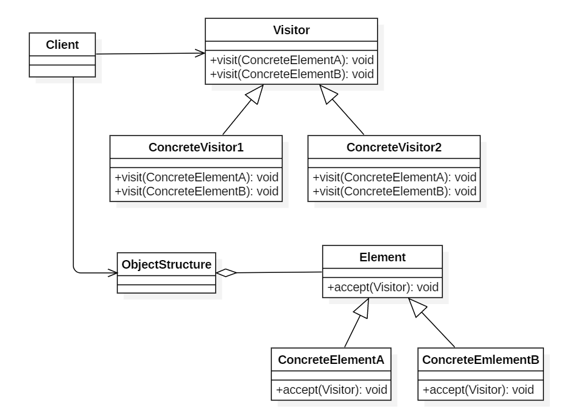

资料来源：(非同一的)<br/>
[java设计模式之：访问者模式](https://blog.csdn.net/jiang_wang01/article/details/131159305?ops_request_misc=%257B%2522request%255Fid%2522%253A%2522170487138016800180697335%2522%252C%2522scm%2522%253A%252220140713.130102334..%2522%257D&request_id=170487138016800180697335&biz_id=0&utm_medium=distribute.pc_search_result.none-task-blog-2~all~sobaiduend~default-1-131159305-null-null.142^v99^pc_search_result_base4&utm_term=Java%E8%AE%BE%E8%AE%A1%E6%A8%A1%E5%BC%8F%E4%B9%8B%E8%AE%BF%E9%97%AE%E8%80%85%E6%A8%A1%E5%BC%8F&spm=1018.2226.3001.4187)

## 访问者模式

### 前言

关于设计模式，我们得结合生活中的案例来学习；最近我在网上也看了不少文章，今天想跟大家分享一下关于[访问者模式](https://so.csdn.net/so/search?q=访问者模式&spm=1001.2101.3001.7020)的一些知识，先来看一个简单的案例吧。

相信大家都去过医院，看完病，医生都会给我们开一个处方单，很多医院都存在如下处理流程：划价人员拿到处方单之后根据药品名称和数量计算总价，药房工作人员根据药品名称和数量准备药品。

我们可以将处方单看成一个药品信息的集合，里面包含了一种或多种不同类型的药品信息，不同类型的工作人员（如划价人员和药房工作人员）在操作同一个药品信息集合时将提供不同的处理方式，而且可能还会增加新类型的工作人员来操作处方单。

在软件开发中，有时候我们也需要处理像处方单这样的集合对象结构，在该对象结构中存储了多个不同类型的对象信息，而且对同一对象结构中的元素的操作方式并不唯一，可能需要提供多种不同的处理方式，还有可能增加新的处理方式。在设计模式中，有一种模式可以满足上述要求，其模式动机就是以不同的方式操作复杂对象结构，该模式就是我们本章将要介绍的访问者模式。

### 访问者模式概述

访问者模式(Visitor Pattern)：提供一个作用于某对象结构中的各元素的操作表示，它使我们可以在不改变各元素的类的前提下定义作用于这些元素的新操作。访问者模式是一种对象行为型模式。

访问者模式是一种较为复杂的行为型设计模式，它包含访问者和被访问元素两个主要组成部分，这些被访问的元素通常具有不同的类型，且不同的访问者可以对它们进行不同的访问操作。例如处方单中的各种药品信息就是被访问的元素，而划价人员和药房工作人员就是访问者。访问者模式使得用户可以在不修改现有系统的情况下扩展系统的功能，为这些不同类型的元素增加新的操作。


在使用访问者模式时，被访问元素通常不是单独存在的，它们存储在一个集合中，这个集合被称为“对象结构”，访问者通过[遍历对象](https://so.csdn.net/so/search?q=遍历对象&spm=1001.2101.3001.7020)结构实现对其中存储的元素的逐个操作。

其结构如下图所示：



Vistor（抽象访问者）：抽象访问者为对象结构中每一个具体元素类ConcreteElement声明一个访问操作，从这个操作的名称或参数类型可以清楚知道需要访问的具体元素的类型，具体访问者需要实现这些操作方法，定义对这些元素的访问操作。
ConcreteVisitor（具体访问者）：具体访问者实现了每个由抽象访问者声明的操作，每一个操作用于访问对象结构中一种类型的元素。
Element（抽象元素）：抽象元素一般是抽象类或者接口，它定义一个accept()方法，该方法通常以一个抽象访问者作为参数。
ConcreteElement（具体元素）：具体元素实现了accept()方法，在accept()方法中调用访问者的访问方法以便完成对一个元素的操作。
ObjectStructure（对象结构）：对象结构是一个元素的集合，它用于存放元素对象，并且提供了遍历其内部元素的方法。它可以结合组合模式来实现，也可以是一个简单的集合对象，如一个List对象或一个Set对象。
适用场景
（1）一个对象结构包含多个类型的对象，希望对这些对象实施一些依赖其具体类型的操作。在访问者中针对每一种具体的类型都提供了一个访问操作，不同类型的对象可以有不同的访问操作。

（2）需要对一个对象结构中的对象进行很多不同的并且不相关的操作，而需要避免让这些操作“污染”这些对象的类，也不希望在增加新操作时修改这些类。访问者模式使得我们可以将相关的访问操作集中起来定义在访问者类中，对象结构可以被多个不同的访问者类所使用，将对象本身与对象的访问操作分离。

（3）对象结构中对象对应的类很少改变，但经常需要在此对象结构上定义新的操作。


案例场景一
某银行开发了一套OA系统，在该OA系统中包含一个员工信息管理子系统，该银行员工包括正式员工和临时工，每周人力资源部和财务部等部门需要对员工数据进行汇总，汇总数据包括员工工作时间、员工工资等。该公司基本制度如下：

（1）正式员工(Full time Employee)每周工作时间为40小时，不同级别、不同部门的员工每周基本工资不同；如果超过40小时，超出部分按照100元/小时作为加班费；如果少于40小时，所缺时间按照请假处理，请假所扣工资以80元/小时计算，直到基本工资扣除到零为止。除了记录实际工作时间外，人力资源部需记录加班时长或请假时长，作为员工平时表现的一项依据。

（2）临时工(Part time Employee)每周工作时间不固定，基本工资按小时计算，不同岗位的临时工小时工资不同。人力资源部只需记录实际工作时间。

人力资源部和财务部工作人员可以根据各自的需要对员工数据进行汇总处理，人力资源部负责汇总每周员工工作时间，而财务部负责计算每周员工工资。一坨坨代码实现

```java
class EmployeeList {

    private ArrayList<Employee> list = new ArrayList<Employee>(); //员工集合  

    //处理员工数据  
    public void handle(String departmentName) {
        //财务部处理员工数据  
        if (departmentName.equalsIgnoreCase("财务部")) {
            for (Object obj : list) {
                if (obj.getClass().getName().equalsIgnoreCase("FulltimeEmployee")) {
                    System.out.println("财务部处理全职员工数据！");
                } else {
                    System.out.println("财务部处理兼职员工数据！");
                }
            }
            //人力资源部处理员工数据  
        } else if (departmentName.equalsIgnoreCase("人力资源部")) {
            for (Object obj : list) {
                if (obj.getClass().getName().equalsIgnoreCase("FulltimeEmployee")) {
                    System.out.println("人力资源部处理全职员工数据！");
                } else {
                    System.out.println("人力资源部处理兼职员工数据！");
                }
            }
        }
    }
}  

```

在handle()方法中，通过对部门名称和员工类型进行判断，不同部门对不同类型的员工进行了不同的处理，满足了员工数据汇总的要求。但是该解决方案存在如下几个问题：

（1）EmployeeList类承担了过多的职责，既不方便代码的复用，也不利于系统的扩展，违背了“单一职责原则”。

（2）在代码中包含大量的“if…else…”条件判断语句，既需要对不同部门进行判断，又需要对不同类型的员工进行判断，还将出现嵌套的条件判断语句，导致测试和维护难度增大。

（3）如果要增加一个新的部门来操作员工集合，不得不修改EmployeeList类的源代码，在handle()方法中增加一个新的条件判断语句和一些业务处理代码来实现新部门的访问操作。这违背了“开闭原则”，系统的灵活性和可扩展性有待提高。

（4）如果要增加一种新类型的员工，同样需要修改EmployeeList类的源代码，在不同部门的处理代码中增加对新类型员工的处理逻辑，这也违背了“开闭原则”。

### 重构代码

定义抽象元素

```java
//员工类：抽象元素类
public interface Employee {
    void accept(Department handler); //接受一个抽象访问者访问
} 

```

具体元素类

```java
//全职员工类：具体元素类
public class FullTimeEmployee implements Employee {

    private String name;
    private double weeklyWage;
    private int workTime;

    public FullTimeEmployee(String name, double weeklyWage, int workTime) {
        this.name = name;
        this.weeklyWage = weeklyWage;
        this.workTime = workTime;
    }

    public void setName(String name) {
        this.name = name;
    }

    public void setWeeklyWage(double weeklyWage) {
        this.weeklyWage = weeklyWage;
    }

    public void setWorkTime(int workTime) {
        this.workTime = workTime;
    }

    public String getName() {
        return (this.name);
    }

    public double getWeeklyWage() {
        return (this.weeklyWage);
    }

    public int getWorkTime() {
        return (this.workTime);
    }

    public void accept(Department handler) {
        handler.visit(this); //调用访问者的访问方法  
    }
}
```

```java
//兼职员工类：具体元素类
public class PartTimeEmployee implements Employee {

    private String name;
    private double hourWage;
    private int workTime;

    public PartTimeEmployee(String name, double hourWage, int workTime) {
        this.name = name;
        this.hourWage = hourWage;
        this.workTime = workTime;
    }

    public void setName(String name) {
        this.name = name;
    }

    public void setHourWage(double hourWage) {
        this.hourWage = hourWage;
    }

    public void setWorkTime(int workTime) {
        this.workTime = workTime;
    }

    public String getName() {
        return (this.name);
    }

    public double getHourWage() {
        return (this.hourWage);
    }

    public int getWorkTime() {
        return (this.workTime);
    }

    public void accept(Department handler) {
        handler.visit(this); //调用访问者的访问方法  
    }
} 

```

定义抽象访问者类

```java
//部门类：抽象访问者类
public abstract class Department {
    //声明一组重载的访问方法，用于访问不同类型的具体元素  
    public abstract void visit(FullTimeEmployee employee);
    public abstract void visit(PartTimeEmployee employee);
}

```

具体访问者类

```java
//财务部类：具体访问者类
public class FADepartment extends Department {

    //实现财务部对全职员工的访问  
    public void visit(FullTimeEmployee employee) {
        int workTime = employee.getWorkTime();
        double weekWage = employee.getWeeklyWage();
        if (workTime > 40) {
            weekWage = weekWage + (workTime - 40) * 100;
        } else if (workTime < 40) {
            weekWage = weekWage - (40 - workTime) * 80;
            if (weekWage < 0) {
                weekWage = 0;
            }
        }
        System.out.println("正式员工" + employee.getName() + "实际工资为：" + weekWage + "元。");
    }

    //实现财务部对兼职员工的访问  
    public void visit(PartTimeEmployee employee) {
        int workTime = employee.getWorkTime();
        double hourWage = employee.getHourWage();
        System.out.println("临时工" + employee.getName() + "实际工资为：" + workTime * hourWage + "元。");
    }
} 
```

```java
//人力资源部类：具体访问者类
public class HRDepartment extends Department {

    //实现人力资源部对全职员工的访问  
    public void visit(FullTimeEmployee employee) {
        int workTime = employee.getWorkTime();
        System.out.println("正式员工" + employee.getName() + "实际工作时间为：" + workTime + "小时。");
        if (workTime > 40) {
            System.out.println("正式员工" + employee.getName() + "加班时间为：" + (workTime - 40) + "小时。");
        } else if (workTime < 40) {
            System.out.println("正式员工" + employee.getName() + "请假时间为：" + (40 - workTime) + "小时。");
        }
    }

    //实现人力资源部对兼职员工的访问  
    public void visit(PartTimeEmployee employee) {
        int workTime = employee.getWorkTime();
        System.out.println("临时工" + employee.getName() + "实际工作时间为：" + workTime + "小时。");
    }
}

```

定义数据结构以及测试

```java
//员工列表类：对象结构
class EmployeeList {

    //定义一个集合用于存储员工对象  
    private ArrayList<Employee> list = new ArrayList<>();

    public EmployeeList(){
        list.add(new FullTimeEmployee("张三",3200.00,45));
        list.add(new FullTimeEmployee("李四",2500.00,40));
        list.add(new PartTimeEmployee("王二",80.00,20));
        list.add(new PartTimeEmployee("李强",100.00,30));
    }

    //遍历访问员工集合中的每一个员工对象  
    public void accept(Department handler) {
        for (Object obj : list) {
            ((Employee) obj).accept(handler);
        }
    }

    public static void main(String[] args) {
        EmployeeList employeeList = new EmployeeList();
        System.out.println("\r\n财务部：");
        employeeList.accept(new FADepartment());
        System.out.println("\r\n人力资源部：");
        employeeList.accept(new HRDepartment());
    }
} 

```

测试结果如下：

```
财务部：
正式员工张三实际工资为：3700.0元。
正式员工李四实际工资为：2500.0元。
临时工王二实际工资为：1600.0元。
临时工李强实际工资为：3000.0元。

人力资源部：
正式员工张三实际工作时间为：45小时。
正式员工张三加班时间为：5小时。
正式员工李四实际工作时间为：40小时。
临时工王二实际工作时间为：20小时。
临时工李强实际工作时间为：30小时。

```

从以上的业务场景中可以看到，在嵌⼊访问者模式后，可以让整个⼯程结构变得容易添加和修改。

如果要在系统中增加一种新的访问者，无须修改源代码，只要增加一个新的具体访问者类即可，在该具体访问者中封装了新的操作元素对象的方法。从增加新的访问者的角度来看，访问者模式符合“开闭原则”。

如果要在系统中增加一种新的具体元素，例如增加一种新的员工类型为“退休人员”，由于原有系统并未提供相应的访问接口（在抽象访问者中没有声明任何访问“退休人员”的方法），因此必须对原有系统进行修改，在原有的抽象访问者类和具体访问者类中增加相应的访问方法。从增加新的元素的角度来看，访问者模式违背了“开闭原则”。

综上所述，访问者模式与抽象工厂模式类似，对“开闭原则”的支持具有倾斜性，可以很方便地添加新的访问者，但是添加新的元素较为麻烦。

案例场景二
校园中有学生和老师两种身份的用户，那么对于家长和校长关心的角度来看，他们的视角是不同的。家长更关心孩子的成绩和老师的能力，校长更关心老师所在班级学生的人数和升学率。

那么这样学生和老师就是一个固定信息的内容，而想让不同视角的用户获取关心的信息，就比较适合使用访问者模式来实现，从而让实体与业务解耦，增强扩展性。

代码实现**定义用户抽象类**

```java
// 基础用户信息
public abstract class User {

    public String name;      // 姓名
    public String identity;  // 身份；重点班、普通班 | 特级教师、普通教师、实习教师
    public String clazz;     // 班级

    public User(String name, String identity, String clazz) {
        this.name = name;
        this.identity = identity;
        this.clazz = clazz;
    }

    // 核心访问方法
    public abstract void accept(Visitor visitor);

}   

```

**实现用户信息(老师和学生)**

老师类

```java
public class Teacher extends User {

    public Teacher(String name, String identity, String clazz) {
        super(name, identity, clazz);
    }

    public void accept(Visitor visitor) {
        visitor.visit(this);
    }

    // 升本率
    public double entranceRatio() {
        return BigDecimal.valueOf(Math.random() * 100).setScale(2, BigDecimal.ROUND_HALF_UP).doubleValue();
    }

}

```

学生类

```java
public class Student extends User {

    public Student(String name, String identity, String clazz) {
        super(name, identity, clazz);
    }

    public void accept(Visitor visitor) {
        visitor.visit(this);
    }

    //排名
    public int ranking() {
        return (int) (Math.random() * 100);
    }
}  

```

**定义访问数据接口**

```java
public interface Visitor {

    // 访问学生信息
    void visit(Student student);

    // 访问老师信息
    void visit(Teacher teacher);
}   

```

**实现访问类型(校长和家长)**

访问者：校长

```java
public class Principal implements Visitor {

    private Logger logger = LoggerFactory.getLogger(Principal.class);

    public void visit(Student student) {
        logger.info("学生信息 姓名：{} 班级：{}", student.name, student.clazz);
    }

    public void visit(Teacher teacher) {
        logger.info("学生信息 姓名：{} 班级：{} 升学率：{}", teacher.name, teacher.clazz, teacher.entranceRatio());
    }

}  
```

访问者：家长

```java
public class Parent implements Visitor {

    private Logger logger = LoggerFactory.getLogger(Parent.class);

    public void visit(Student student) {
        logger.info("学生信息 姓名：{} 班级：{} 排名：{}", student.name, student.clazz, student.ranking());
    }

    public void visit(Teacher teacher) {
        logger.info("老师信息 姓名：{} 班级：{} 级别：{}", teacher.name, teacher.clazz, teacher.identity);
    }

}   
```

**数据结构**

```java
public class DataView {

    List<User> userList = new ArrayList<User>();

 
    public DataView() {
        userList.add(new Student("小马", "重点班", "一年一班"));
        userList.add(new Student("小张", "重点班", "一年一班"));
        userList.add(new Student("小刘", "普通班", "二年三班"));
        userList.add(new Student("小董", "普通班", "三年四班"));
        userList.add(new Teacher("Tom", "特级教师", "一年一班"));
        userList.add(new Teacher("Jack", "特级教师", "一年一班"));
        userList.add(new Teacher("Rose", "普通教师", "二年三班"));
        userList.add(new Teacher("Bob", "实习教师", "三年四班"));
    }

    // 展示
    public void show(Visitor visitor) {
        for (User user : userList) {
            user.accept(visitor);
        }
    }
}

```

**编写测试类**

```java
@Test
public void test(){
    DataView dataView = new DataView();      

    logger.info("\r\n家长视角访问：");
    dataView.show(new Parent());     // 家长

    logger.info("\r\n校长视角访问：");
    dataView.show(new Principal());  // 校长
}

```

测试结果

```
家长视角访问：
12:33:21.336 [main] INFO  o.i.demo.design.visitor.impl.Parent - 学生信息 姓名：小马 班级：一年一班 排名：58
12:33:21.336 [main] INFO  o.i.demo.design.visitor.impl.Parent - 学生信息 姓名：小张 班级：一年一班 排名：17
12:33:21.336 [main] INFO  o.i.demo.design.visitor.impl.Parent - 学生信息 姓名：小刘 班级：二年三班 排名：29
12:33:21.336 [main] INFO  o.i.demo.design.visitor.impl.Parent - 学生信息 姓名：小董 班级：三年四班 排名：67
12:33:21.336 [main] INFO  o.i.demo.design.visitor.impl.Parent - 老师信息 姓名：Tom 班级：一年一班 级别：特级教师
12:33:21.336 [main] INFO  o.i.demo.design.visitor.impl.Parent - 老师信息 姓名：Jack 班级：一年一班 级别：特级教师
12:33:21.337 [main] INFO  o.i.demo.design.visitor.impl.Parent - 老师信息 姓名：Rose 班级：二年三班 级别：普通教师
12:33:21.337 [main] INFO  o.i.demo.design.visitor.impl.Parent - 老师信息 姓名：Bob 班级：三年四班 级别：实习教师

校长视角访问：
12:33:21.338 [main] INFO  o.i.d.design.visitor.impl.Principal - 学生信息 姓名：小马 班级：一年一班
12:33:21.339 [main] INFO  o.i.d.design.visitor.impl.Principal - 学生信息 姓名：小张 班级：一年一班
12:33:21.339 [main] INFO  o.i.d.design.visitor.impl.Principal - 学生信息 姓名：小刘 班级：二年三班
12:33:21.339 [main] INFO  o.i.d.design.visitor.impl.Principal - 学生信息 姓名：小董 班级：三年四班
12:33:21.342 [main] INFO  o.i.d.design.visitor.impl.Principal - 老师信息 姓名：Tom 班级：一年一班 升学率：61.33
12:33:21.343 [main] INFO  o.i.d.design.visitor.impl.Principal - 老师信息 姓名：Jack 班级：一年一班 升学率：83.64
12:33:21.343 [main] INFO  o.i.d.design.visitor.impl.Principal - 老师信息 姓名：Rose 班级：二年三班 升学率：87.57
12:33:21.343 [main] INFO  o.i.d.design.visitor.impl.Principal - 老师信息 姓名：Bob 班级：三年四班 升学率：30.34
```

- 通过测试结果可以看到，家长和校长的访问视角同步，数据也是差异化的。
- 通过这样的测试结果，可以看到访问者模式的初心和结果，在适合的场景运用合适的模式，非常有利于程序开发。

总结
由于访问者模式的使用条件较为苛刻，本身结构也较为复杂，因此在实际应用中使用频率不是特别高。当系统中存在一个较为复杂的对象结构，且不同访问者对其所采取的操作也不相同时，可以考虑使用访问者模式进行设计。在XML文档解析、编译器的设计、复杂集合对象的处理等领域访问者模式得到了一定的应用。
好的学习⽅式才好更容易接受知识，学习编程的更需要的不单单是看，⽽是操作。⼆⼗多种设计模式每⼀种都有⾃⼰的设计技巧，也可以说是巧妙之处，这些巧妙的地⽅往往是解决复杂难题的最佳视⻆。亲⼒亲为，才能为所欲为，为了⾃⼰的欲望⽽努⼒！