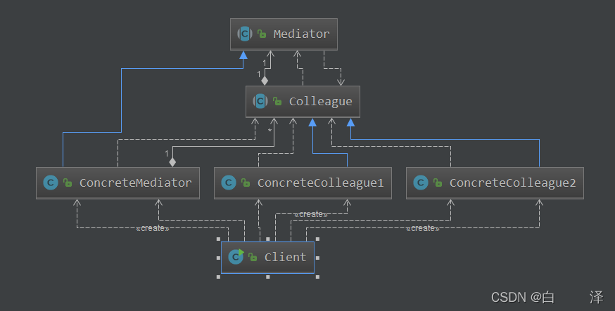
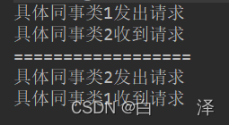

资料来源：<br/>(非同一的)
[Java设计模式之中介者模式](https://blog.csdn.net/qq_37922483/article/details/125867515?ops_request_misc=&request_id=&biz_id=102&utm_term=Java%E8%AE%BE%E8%AE%A1%E6%A8%A1%E5%BC%8F%E4%B9%8B%E4%B8%AD%E4%BB%8B%E6%A8%A1%E5%BC%8F&utm_medium=distribute.pc_search_result.none-task-blog-2~all~sobaiduweb~default-0-125867515.142^v99^pc_search_result_base4&spm=1018.2226.3001.4187)

## 前言

- 掌握中介者模式的应用场景
- 了解设计群聊的底层逻辑
- 理解中介者模式的优缺点

## 一、定义

中介者模式（Mediator）：定义一个中介对象来封装一系列对象之间的交互，使原有对象直接的耦合松散，且可以独立地改变它们之间的交互

## 二、应用场景

- 当对象之间存在复杂的网状结构关系而导致依赖关系混乱且难以复用时
- 当想创建一个运行于多个类之间的对象，又不想生成新的子类时

## 三、基本结构

- 抽象中介者（Mediator）：中介者接口，提供了同事对象注册与转发同事对象信息的抽象方法
- 具体中介者（Concrete Mediator）：具体中介者，实现了中介者接口，定义个List来管理同事对象，协调各个同事角色之间的交互，因此它依赖于同事角色

- 抽象同事类（Colleague）：同事类接口，保存中介者对象，提供同事对象交互的抽象方法，实现所有相互影响的同事类的公共功能
- 具体同事类（Concrete Colleague）：抽象同事类的实现者，当需要与其他同事对象交互时，由中介者对象负责后续的交互



## 四、基本使用

### 1. 抽象中介者

```java
public abstract class Mediator {
    public abstract void register(Colleague colleague);

    public abstract void relay(Colleague colleague);
}

```

### 2. 具体中介者

```java
public class ConcreteMediator extends Mediator {
    private Set<Colleague> colleagues = new HashSet<>();

    @Override
    public void register(Colleague colleague) {
        colleague.setMediator(this);
        colleagues.add(colleague);
    }

    @Override
    public void relay(Colleague colleague) {
        for (Colleague c : colleagues) {
            if (!c.equals(colleague)) {
                c.receive();
            }
        }
    }
}

```

### 3. 抽象同事类

```java
public abstract class Colleague {
    protected Mediator mediator;

    public void setMediator(Mediator mediator) {
        this.mediator = mediator;
    }

    public abstract void receive();

    public abstract void send();
}
```

### 4. 具体同事类

```java
public class ConcreteColleague1 extends Colleague {
    @Override
    public void receive() {
        System.out.println("具体同事类1收到请求");
    }

    @Override
    public void send() {
        System.out.println("具体同事类1发出请求");
        mediator.relay(this);
    }
}
```

```java
public class ConcreteColleague2 extends Colleague {
    @Override
    public void receive() {
        System.out.println("具体同事类2收到请求");
    }

    @Override
    public void send() {
        System.out.println("具体同事类2发出请求");
        mediator.relay(this);
    }
}
```

### 5. 客户端

```java
public class Client {
    public static void main(String[] args) {
        ConcreteMediator mediator = new ConcreteMediator();
        ConcreteColleague1 colleague1 = new ConcreteColleague1();
        mediator.register(colleague1);
        ConcreteColleague2 colleague2 = new ConcreteColleague2();
        mediator.register(colleague2);
        colleague1.send();
        System.out.println("==================");
        colleague2.send();
    }
}
```



## 五、群聊场景

### 1. 用户类（具体同事类）

```java
public class User {
    private String name;
    private ChatRoom chatRoom;

    public User(String name, ChatRoom chatRoom) {
        this.name = name;
        this.chatRoom = chatRoom;
    }

    public void sendMessage(String msg) {
        this.chatRoom.showMsg(this, msg);
    }

    public String getName() {
        return name;
    }
}
```

### 2. 聊天室（具体中介类）

```java
public class ChatRoom {
    public void showMsg(User user, String msg) {
        System.out.println("[" + user.getName() + "]: " + msg);
    }
}
```

### 3. 客户端

```java
public class Client {
    public static void main(String[] args) {
        ChatRoom room = new ChatRoom();
        User zhangsan = new User("张三", room);
        User lisi = new User("李四", room);
        zhangsan.sendMessage("大家好，我是张三");
        lisi.sendMessage("大家好，我是李四");
    }
}
```


## 总结

### 1. 优点

- 类之间各司其职，符合迪米特法则
- 降低了对象之间的耦合性，使得对象易于独立地被复用
- 将对象间的一对多关系转变为一对一的关联，提高了系统的灵活性，使得系统已于维护和扩展

### 2. 缺点

- 终结者模式将原本多个对象直接的相互依赖变成了中介者和多个同事类的依赖关系；当同事类越多时，中介者就会越臃肿，变得复杂且难以维护