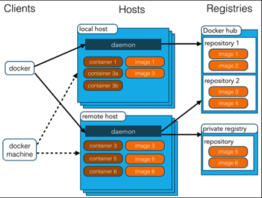
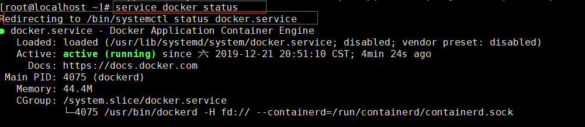
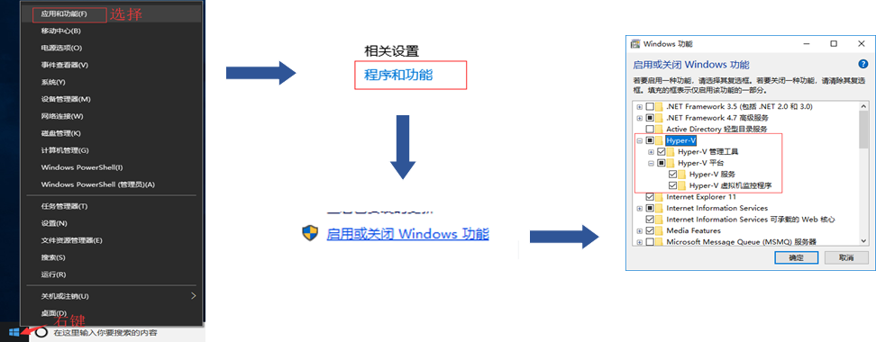
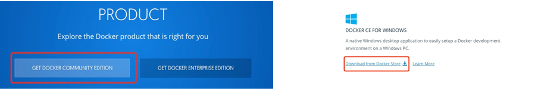
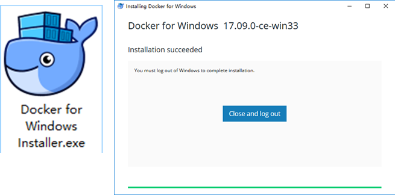
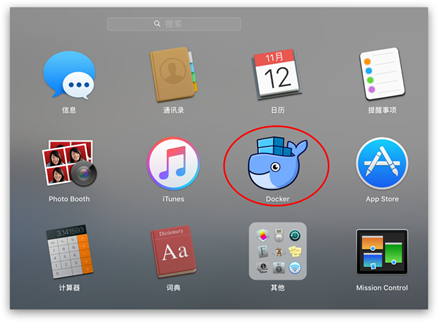
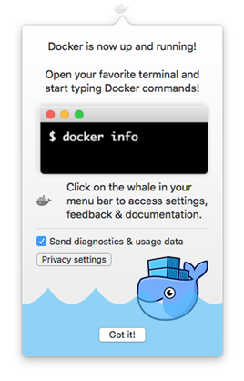
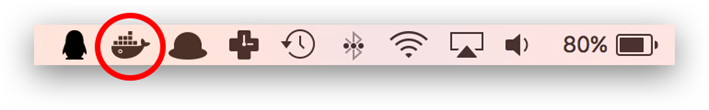
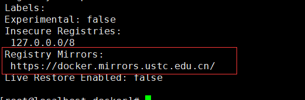
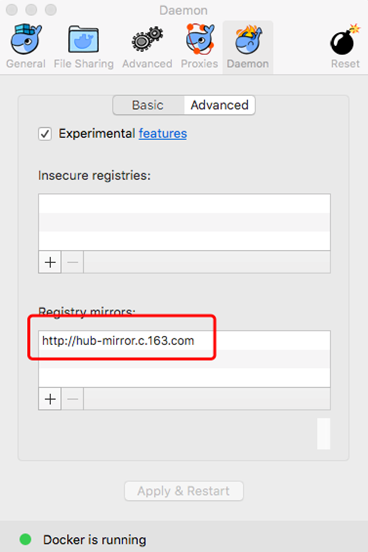

 

# 1.  Docker 的基本概念

## 1.1. Docker是什么

Docker 最初是 dotCloud 公司创始人 Solomon Hykes 在法国期间发起的一个公司内部项目，它是基于 dotCloud 公司多年云服务技术的一次革新，并于 2013 年 3 月以 Apache 2.0 授权协议开源，主要项目代码在 GitHub 上进行维护。Docker 项目后来还加入了 Linux 基金会，并成立推动 开放容器联盟（OCI）。

Docker 使用 Google 公司推出的 **Go** **语言** 进行开发实现，基于 Linux 内核的cgroup，

namespace，以及 AUFS 类的 Union FS 等技术，对进程进行封装隔离，属于操作系统层面的虚拟化技术。由于隔离的进程独立于宿主和其它的隔离的进程，因此也称其为**容器**。

Docker 在容器的基础上，进行了进一步的封装，从文件系统、网络互联到进程隔离等等，极

大的简化了容器的创建和维护。使得 **Docker** **技术比虚拟机技术更为轻便、快捷**。

## 1.2. 为什么 使用docker

Docker 的优势

- 更高效的利用系统资源

-  更快速的启动时间

- 一致的运行环境

- 持续交付和部署

- 更轻松的迁移

- 更轻松的维护和扩展

**对比传统虚拟机总结**

| 特性       | 容器               | 虚拟机     |
| ---------- | ------------------ | ---------- |
| 启动       | 秒级               | 分钟级     |
| 硬盘使用   | 一般为 MB          | 一般为 GB  |
| 性能       | 接近原生           | 较弱       |
| 系统支持量 | 单机支持上千个容器 | 一般几十个 |

## 1.3. Docker 架构

Docker 使用客户端-服务器 (C/S) 架构模式，使用远程API来管理和创建 Docker容器。

               

Docker 基本概念

Docker 镜像 容器 仓库

### 1.3.1. Docker 镜像

我们都知道，操作系统分为内核和用户空间。对于 Linux 而言，内核启动后，会挂载 root文件系统为其提供用户空间支持。而 Docker 镜像（Image），就相当于是一个 root 文件系统。比如官方镜像 centos:7.6 就包含了完整的一套 centos 7.6 最小系统的 root 文件系统。

Docker 镜像是一个特殊的文件系统，除了提供容器运行时所需的程序、库、资源、配置等文件外，还包含了一些为运行时准备的一些配置参数（如匿名卷、环境变量、用户等）。镜像不包含任何动态数据，其内容在构建之后也不会被改变。

因为镜像包含操作系统完整的 root 文件系统，其体积往往是庞大的，因此在 Docker 设计时将其设计为分层存储的架构。镜像只是一个虚拟的概念，其实际体现并非由一个文件组成，而是由一组文件系统组成，或者说，由多层文件系统联合组成。

镜像构建时，会一层层构建，前一层是后一层的基础。每一层构建完就不会再发生改变，后一层上的任何改变只发生在自己这一层。在构建镜像的时候，需要额外小心，每一层尽量只包含该层需要添加的东西，任何额外的东西应该在该层构建结束前清理掉。

分层储的特征还使得镜像的复用、定制变的更为容易。甚至可以用之前构建好的镜像作为基础层，然后进一步添加新的层，以定制自己所需的内容，构建新的镜像。

镜像（ Image ）和容器（ Container ）的关系，就像 Java 中的 类 和 实例一样，镜像是静态的定义，容器是镜像运行时的实体。容器可以被创建、启动、停止、删除、暂停等。

前面讲过镜像使用的是分层存储，容器也是如此。每一个容器运行时，是以镜像为基础层，在其上创建一个当前容器的存储层，我们可以称这个为容器运行时读写而准备的存储层为容器存储层。

容器存储层的生存周期和容器一样，容器消亡时，容器存储层也随之消亡。因此，任何保存于容器存储层的信息都会随容器删除而丢失。

### 1.3.2. Docker 容器

镜像（ Image ）和容器（ Container ）的关系，就像 Java 中的 类 和 实例一样，镜像是静态的定义，容器是镜像运行时的实体。容器可以被创建、启动、停止、删除、暂停等。

前面讲过镜像使用的是分层存储，容器也是如此。每一个容器运行时，是以镜像为基础层，在其上创建一个当前容器的存储层，我们可以称这个为容器运行时读写而准备的存储层为容器存储层。

容器存储层的生存周期和容器一样，容器消亡时，容器存储层也随之消亡。因此，任何保存于容器存储层的信息都会随容器删除而丢失。

按照 Docker 最佳实践的要求，容器不应该向其存储层内写入任何数据，容器存储层要保持无状态化。所有的文件写入操作，都应该使用 Volume 数据卷、或者绑定宿主目录，在这些位置的读写会跳过容器存储层，直接对宿主（或网络存储）发生读写，其性能和稳定性更高。

数据卷的生存周期独立于容器，容器消亡，数据卷不会消亡。因此，使用数据卷后，容器删除或者重新运行之后，数据却不会丢失。

### 1.3.3. Docker 仓库

 

镜像构建完成后，可以很容易的在当前宿主机上运行，但是，如果需要在其它服务器上使用这个镜像，我们就需要一个集中的存储、分发镜像的服务，Docker Registry 就是这样的服务。

一个 Docker Registry 中可以包含多个仓库（ Repository ）；每个仓库可以包含多个标签（ Tag ）；每个标签对应一个镜像。

通常，一个仓库会包含同一个软件不同版本的镜像，而标签就常用于对应该软件的各个版本。我们可以通过 <仓库名>:<标签> 的格式来指定具体是这个软件哪个版本的镜像。如果不给出标签，将以 latest 作为默认标签。

以 centos 镜像 为例， centos 是仓库的名字，其内包含有不同的版本标签，如， 6.9 、7.5 。我们可以通过 centos:6.9 ，或者 centos:7.5 来具体指定所需哪个版本的镜像。如果忽略了标签，比如 centos ，那将视为 centos:latest 。

仓库名经常以 两段式路径 形式出现，比如 study/nginx，前者往往意味着 Docker Registry 多用户环境下的用户名，后者则往往是对应的软件名。但这并非绝对，取决于所使用的具体 Docker 

Registry 的软件或服务。

公开仓库

常用 Registry 是官方的 Docker Hub，这也是默认的 Registry。除此以外，还有 CoreOS 的 Quay.io，CoreOS 相关的镜像存储在这里；Google 的 Google Container Registry，Kubernetes 的镜像使用的就是这个服务。

国内的一些云服务商提供了针对 Docker Hub 的镜像服务，这些镜像服务被称为加速器。常见的有 阿里云加速器、DaoCloud 加速器 等。使用加速器会直接从国内的地址下载 Docker Hub 的镜像，比直接从 Docker Hub 下载速度会提高很多。

国内也有一些云服务商提供类似于 Docker Hub 的公开服务。比如 网易云镜像服务、

DaoCloud 镜像市场、阿里云镜像库 等。

这一章，我们详细的介绍了 Docker 及为什么要使用 Docker，Docker的优势等，

并讲解了 Docker 的三个基本概念 镜像、容器、仓库及 Docker 的生命周期。

通过这一章节的学习，相信大家应该对 Docker 有了一个比较深刻的认识，接下来我们就要去实践操作 Docker。

 

# 2.  Docker 安装

## 2.1. Docker 的版本和命名

Docker 在 1.13 版本之后，从 2017 年的 3 月 1 日开始，版本命名规则变为如下

| 项目                       | 说明         |
| -------------------------- | ------------ |
| 版本格式                   | YY.MM        |
| Stable  版本               | 每个季度发行 |
| Edge  版本                 | 每个月发行   |
| 当前 Docker CE Stable 版本 | 17.09        |
| 当前 Docker CE Edge 版本   | 17.11        |

同时 Docker 划分为 CE 和 EE。CE 即社区版（免费，支持周期三个月），EE 即企业版，

强调安全，付费使用。

## 2.2. Docker 安装

官方网站上有各种环境下的 安装指南，这里主要介绍 Docker CE 在 Linux 、Windows 10 和 MacOS 上的安装。

官方安装指南地址：https://docs.docker.com/engine/installation/ 

 

Docker CE 支持 64 位版本 CentOS 7，并且要求内核版本不低于 3.10。

 

**卸载旧的版本**

旧版本的 Docker 称为 docker 或者 docker-engine ，使用以下命令卸载旧版本：

 

- 使用yum 安装

```shell
sudo yum install docker-ce
```

**使用脚本安装**

在测试或开发环境中 Docker 官方为了简化安装流程，提供了一套便捷的安装脚本，CentOS系统上可以使用这套脚本安装：

```shell
curl -fsSL https://get.docker.com -o get-docker.sh

sudo sh get-docker.sh --mirror Aliyun
```

执行这个命令后，脚本就会自动的将一切准备工作做好，并且把 Docker CE 的 Edge 版本安

 

启动 docker 

```shell'
sudo systemctl enable docker  #设置开启启动

sudo systemctl start docker
```


 

**卸载docker**

首先搜索已经安装的docker 安装包 

```shell
  yum list installed|grep docker 

或者使用该命令：rpm -qa|grep docker

分别删除安装包：

  yum –y remove docker.x86_64

  yum –y remove docker-client.x86_64

  yum –y remove docker-common.x86_64

删除docker 镜像

  rm -rf /var/lib/docker

启动 Docker 后台服务

sudo systemctl start docker

运行 hello-world,由于本地没有hello-world这个镜像，所以会下载一个hello-world的镜像，并在容器内运行。

docker run hello-world
```

## 2.3. docker的启动 关闭

 

docker 常用的命令

```shell
[root@localhost ~]# service docker

The service command supports only basic LSB actions (start, stop, restart, try-restart, reload, force-reload, status). For other actions, please try to use systemctl.

 

使用的命令 service docker + 下面的命令

start启动
stop 关闭
restart 重启
reload 重新加载
force-reload 强制 加载
status 状态

```
举例查询 docker 的状态
```shell
[root@localhost ~]# service docker

The service command supports only basic LSB actions (start, stop, restart, try-restart, reload, force-reload, status). For other actions, please try to use systemctl.
```



 


 

```shell
重定向到
/bin/systemctl status docker.service

上面的命令可以简化到
systemctl status docker

同样 status 这个 换成 start restart 这些命令
```

## 2.4. Windows 安装docker

1. 开启 Hyper-V

 重定向到

/bin/systemctl status docker.service

 

上面的命令可以简化到

systemctl status docker

同样 status 这个 换成 start restart 这些命令                                                                                

2. 安装 Toolbox

最新版 Toolbox 下载地址： https://www.docker.com/get-docker

点击 Get Docker Community Edition，并下载 Windows 的版本

  

3. 安装docker

双击下载的 Docker for Windows Installe 安装文件，一路 Next，点击 Finish 完成安装。

 

​             

安装完成后，Docker 会自动启动。通知栏上会出现个小鲸鱼的图标，我们可以在命令行执行 docker version 来查看版本号，docker run hello-world 来载入测试镜像测试

如果没启动，你可以在 Windows 

搜索 Docker 来启动：

启动后，也可以在通知栏上看到小鲸鱼图标：

 

 

## 2.5. MacOS 安装 Docker

1， 系统要求

Docker for Mac 要求系统最低为 macOS 10.10.3 Yosemite。如果系统不满足需求，可以安装

2，使用 Homebrew 安装

使用 Homebrew 安装

Homebrew 的 Cask 已经支持 Docker for Mac，因此可以很方便的使用 Homebrew Cask 来进行安装

```shell
b11rew cask install docker
```

3. 运行

   



 

 

第一次点击图标，可能会看到这个安装成功的界面，点击 "Got it!" 可以关闭这个窗口。

 

安装docker

启动终端后，通过命令可以检查安装后的 Docker 版本

```shell
docker --version	#查看 docker 版本
docker-compose --version	#查看 compose 版本
docker-machine --version	#查看 machine 版本
```

> 如果 docker version，可以尝试运行一个 hello-world 服务器

>  docker run hello-world #启动一个基于hello-world镜像的容器

# 3.  docker 加速

国内从 Docker Hub 拉取镜像有时会遇到困难，此时可以配置镜像加速器。Docker 官方和国内很多云服务商都提供了国内加速器服务，例如：

•    Docker 官方提供的中国 registry mirror

•    阿里云加速器

•    DaoCloud 加速器

•    163 加速器

 

## 3.1. Linux 加速

对于使用 systemd 的系统，请在 /etc/docker/daemon.json 中写入如下内容（如果文件不存在请新建该文件）

请在该配置文件中加入（没有该文件，请创建一个文件）；

```shell
{

 "registry-mirrors": ["https://docker.mirrors.ustc.edu.cn"]

}
```

配置多个

```shell
{
   "registry-mirrors" : [ 
		"http://hub-mirror.c.163.com", 
		"https://docker.mirrors.ustc.edu.cn"
 ]
}
```

重启生效

```shell
sudo systemctl daemon-reload
sudo systemctl restart docker
```

从网上找了几个速度比较快的镜像地址：

 

Docker 官方中国区

https://registry.docker-cn.com

网易

http://hub-mirror.c.163.com

ustc

https://docker.mirrors.ustc.edu.cn


最后，需要重启docker服务

```shell
systemctl start docker.service
```

之后再使用pull 命令拉去镜像，这时候是从ustc 获取镜像。而且速度很快；

检测加速是否生效

`docker info`

在最后可以看到 加速的镜像地址

 


## 3.2. Windows 10 加速

对于使用 Windows 10 的系统，在系统右下角托盘 Docker 图标内右键菜单选择 Settings ，打开配置窗口后左侧导航菜单选择 Docker Daemon 。编辑窗口内的 JSON 串，填写加速器地址，如：

```shell
{
"registry-mirrors": [
    "http://hub-mirror.c.163.com"
]
}
```

编辑完成，点击 Apply 保存后 Docker 服务会重新启动

 

## 3.3. MacOS 加速

对于使用 macOS 的用户

在任务栏点击 Docker for mac 应用图标 -> Perferences... -> Daemon -> Registry mirrors

在列表中填写加速器地址即可。

修改完成之后，点击 Apply &Restart 按钮，

Docker 就会重启并应用配置的镜像地址了。

 


