# 1.  Docker 镜像的操作

Docker 运行容器前需要本地存在对应的镜像，如果本地不存在该镜像，Docker 会从镜像仓库下载该镜像。

[Docker 官网](https://hub.docker.com/)

  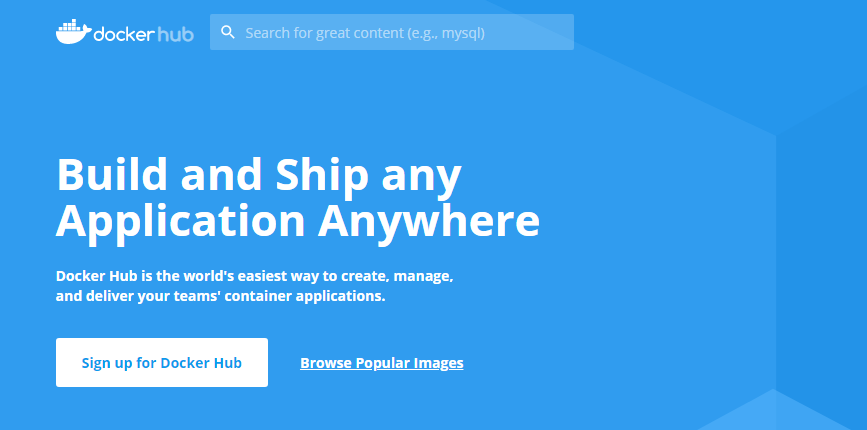                      

接下来将介绍关于镜像的内容，包括：

>1. 从仓库获取镜像；
>
>2. 管理本地主机上的镜像；
>
>3. 介绍镜像实现的基本原理。

## 1.1. 对镜像的操作

**获取镜像**

 

从 Docker 镜像仓库获取镜像的命令是 docker pull 。其命令格式为：

```shell
docker pull [选项] [Docker Registry 地址[:端口号]/]仓库名[:标签]
```

具体的选项可以通过 docker pull --help 命令看到，这里我们说一下镜像名称的格式。

Docker 镜像仓库地址：地址的格式一般是 <域名/IP>[:端口号] 。默认地址是 Docker Hub。

仓库名：如之前所说，这里的仓库名是两段式名称，即 <用户名>/<软件名> 。对于 Docker Hub，如果不给出用户名，则默认为 library ，也就是官方镜像。

上面的命令中没有给出 Docker 镜像仓库地址，因此将会从 Docker Hub 获取镜像。而镜像名称是 ubuntu:16.04 ，因此将会获取官方镜像 library/ubuntu 仓库中标签为 16.04 的镜像。

 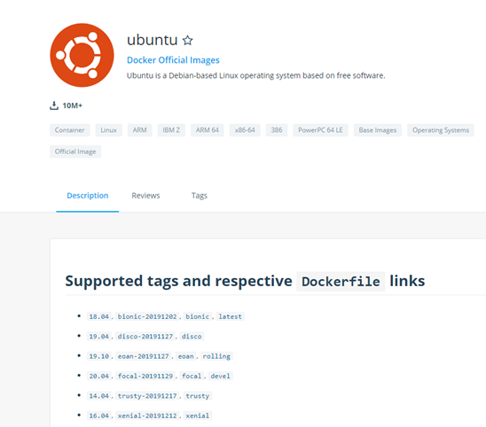

举例 ：

```shell
docker pull ubuntu:16.04
```

**查看镜像列表**

```shell
[root@localhost ~]# docker images
REPOSITORY          TAG                 IMAGE ID            CREATED             SIZE
centos              centos7             5e35e350aded        7 weeks ago         203MB

```

选择 镜像的两种方法

通过镜像 可以启动一个容器。

选择一个容易的办法 有两种 通过 rep : tag 方式 或者是 IMAGE ID 方式 ，这两种

```shell
REPOSITORY +  TAG 
IMAGE
```

要想列出已经下载下来的镜像，可以使用 docker image ls 命令。列表包含了 仓库名 、 标签 、 镜像 ID 、 创建时间 以及 所占用的空间 。

```shell
docker image ls
```

查看镜像、容器、数据卷所占用的空间。

```shell
docker system df 
```

仓库名、标签均为 <none> 的镜像称为 虚悬镜像(dangling image) ，显示这类镜像：

```shell
docker image ls -f dangling=true
```

一般来说，虚悬镜像已经失去了存在的价值，是可以随意删除的，可以用下面的命令删除。

```shell
docker image prune
```

**删除镜像**

如果要删除本地的镜像，可以使用 docker image rm 命令，其格式为：

```shell
docker image rm [选项] <镜像1> [<镜像2> ...]
```

其中， <镜像> 可以是 镜像短 ID 、 镜像长 ID 、 镜像名 或者 镜像摘要 。

使用 docker image ls -q 来配合 docker image rm ，这样可以批量删除希望删除的镜像。

```shell
docker image rm $(docker image ls -q ubuntu) #删除所有仓库名为 ubuntu 的镜像
```

或者删除所有在 ubuntu:16.04 之前的镜像：

```shell
docker image rm $(docker image ls -q -f before=ubuntu:16.04)
```

## 1.2. 容器的操作

容器是独立运行的一个或一组应用，以及它们的运行态环境。对应的，虚拟机可以理解为模拟运行的一整套操作系统（提供了运行态环境和其他系统环境）和跑在上面的应用。

接下来将具体介绍如何来管理一个容器，包括创建、启动和停止等。

 

**容器的启动**

启动容器有两种方式，一种是基于镜像新建一个容器并启动，另外一个是将在终止状态

（ stopped ）的容器重新启动。

因为 Docker 的容器实是轻量级的，用户可以随时删除和新创建容器。

输出一个 “Hello World”，之后终止容器。

```shell
docker run ubuntu:16.04 /bin/echo 'Hello world' 
```

**启动** **已经终止的容易**

```shell
docker container start 或者 docker start 
```

启动一个 bash 终端，允许用户进行交互。

```shell
docker run -t -i ubuntu:16.04 /bin/bash 
```

**-t** 让Docker分配一个伪终端并绑定到容器的标准输入上，

**-i** 则让容器的标准输入保持打开。

当利用 docker run 来创建容器时，Docker 在后台运行的标准操作包括：

检查本地是否存在指定的镜像，不存在就从公有仓库下载

利用镜像创建并启动一个容器

分配一个文件系统，并在只读的镜像层外面挂载一层可读写层

从宿主主机配置的网桥接口中桥接一个虚拟接口到容器中去

从地址池配置一个 ip 地址给容器

执行用户指定的应用程序

执行完毕后容器被终止

 

**后台运行**

很多时候，需要让` Docker `在后台运行而不是直接把执行命令的结果输出在当前宿主机下。

此时，可以通过添加` -d `参数来实现。

如果不使用` -d` 参数运行容器，比如 `docker run hello-world `会把日志打印在控制台；

如果使用了` -d` 参数运行容器，比如` docker run -d hello-world `不会输出日志，只会打印容器id(输出结果可以用 `docker logs` 查看)；

注： 容器是否会长久运行，是和 `docker run` 指定的命令有关，和 `-d `参数无关。

 

**容器的关闭重启**

可以使用` docker container stop` 来终止一个运行中的容器。

终止状态的容器可以用` docker container ls -a `命令看到。

处于终止状态的容器，可以通过` docker container start` 命令来重新启动。

此外，` docker container restart` 命令会将一个运行态的容器终止，然后再重新启动它

## 1.3. 导入导出镜像

导入镜像:`docker save 镜像 > /root/xx.tar.gz`

 

镜像表示的 仓库 + 版本号

或者是 id

例如：需要时间。导出

```shell
docker save mysql:5.5 > /root/mysql.tar.gz
```

 


这样就导出了mysql 的镜像了

相反的过程

```shell
docker load < /root/mysql.tar.gz
```

# 2.  docker 容器的操作

## 2.1. docker 启动

docker 的启动方式，常用的有三种启动方式 ，容器启动 守护线程 交互方式

这样就能启动一个一直停留在后台运行的Centos了。如果少了/bin/bash的话，Docker会生成一个Container但是马上就停止了，不会一致运行即使有了-d参数。

### 2.1.1. 启动容器：

以交互的方式启动容器：`docker run -it --name `容器的名称，镜像

`/bin/bash`

以守护进程的方式启动容器：`docker run -d –name `容器的名称镜像

### 2.1.2. 交互方式启动

使用容器启动centeros 7

`docker run -it --name my-centos centos:7 /bin/bash`

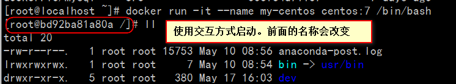

退出命令：`exit`

### 2.1.3. 守护线程启动

启动命令

注意：启动的名称不可以一致

```shell
docker run -d --name my-centos2 centos:7
```

表示启动成功

此时的依然是使用宿主启动命令

 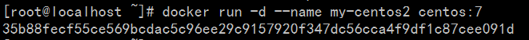

## 2.2. 容器的停止

语法

`docker stop 启动的名称`

比如上面的

 

## 2.3. 容器的删除

删除一个已经停止的；（后面是名称或者是id）

```java
docker rm my-centos
```

## 2.4. 容器的交互

**进入交互**

上文有 交互 式启动容器，启动后 进去容器中

```shell
docker exec -it dev_tomcat /bin/bash
```

红色表示容器的名称。根据实际情况进行改变

·    **docker run**：启动**container**

·    **ubuntu**：你想要启动的**image**

·    **-t**：进入终端**

·    **-i**：获得一个交互式的连接，通过获取**container**的输入

·    **/bin/bash**：在**container**中启动一个**bash shell**

（资料来源： https://blog.csdn.net/dongdong9223/article/details/52998375 ）

 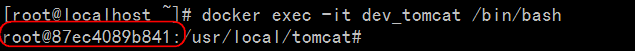

进入交互以后，界面就改变了，不是直接的命令行

- 查看当前目录pwd

- 目录下的文件ls　没有ll

退出`exit`

**文件的复制**

```
docker cp game.html dev_tomcat:/usr/local/tomcat/webapps/ROOT
```

把指定的文件拷贝到指定的位置

>  docker cp 文件的名称 docker容器  冒号 路径

## 2.5. 容器的保存成镜像

语法

```shell
docker commit [OPTIONS] CONTAINER [REPOSITORY[:TAG]]
```

OPTIONS说明：

·    **-a :**提交的镜像作者；

·    **-c :**使用Dockerfile指令来创建镜像；

·    **-m :**提交时的说明文字；

·    **-p :**在commit时，将容器暂停。

将容器a404c6c174a2 保存为新的镜像,并添加提交人信息和说明信息。

```shell
runoob@runoob:~$ docker commit -a "runoob.com" -m "my apache" a404c6c174a2  mymysql:v1 
sha256:37af1236adef1544e8886be23010b66577647a40bc02c0885a6600b33ee28057
runoob@runoob:~$ docker images mymysql:v1
REPOSITORY          TAG                 IMAGE ID            CREATED             SIZE
mymysql             v1                  37af1236adef        15 seconds ago      329 MB

```

## 2.6.如何进入、退出docker的container

### 1 启动docker服务

首先需要知道**启动docker服务**是：

```java
service docker start 
```

或者：

```bash
systemctl start docker
```

### 关闭docker服务

**关闭docker服务**是：

```bash
service docker stop
```

或者：

```bash
systemctl stop docker
```

### 启动docker某个image（镜像）的container（容器）

Docker的镜像称为image，容器称为container。

对于Docker来说，image是静态的，类似于操作系统快照，而container则是动态的，是image的运行实例。

比如，有一个image名称为[ubuntu](https://so.csdn.net/so/search?q=ubuntu&spm=1001.2101.3001.7020)，那么比如现在我们启动这个image的container并且进入到这个container的bash命令行中：

```bash
docker run -t -i ubuntu /bin/bash
```

[官网](https://docs.docker.com/engine/tutorials/dockerizing/)是这么说的：

- **docker run: runs a container.**
- **ubuntu: is the image you would like to run.**
- **-t: flag assigns a pseudo-tty or terminal inside the new container.**

- **-i: flag allows you to make an interactive connection by grabbing the standard in (STDIN) of the container.**

- **/bin/bash: launches a Bash shell inside our container.**

理解很简单：

- **docker run：启动container**
- **ubuntu：你想要启动的image**
- **-t：进入终端**
- **-i：获得一个交互式的连接，通过获取container的输入**
- **/bin/bash：在container中启动一个bash shell**

这样就进入container的内部了：

```bash
root@af8bae53bdd3:/#
```

如果有运行中的container，可以在container所在的外部操作系统中运行：

```bash
docker ps
```

查看到这个container。

如果想看到所有的container，包括运行中的，以及未运行的或者说是沉睡镜像，则运行：

```bash
docker ps -a
```

如果要退出就：

Ctrl-D

或：

```bash
root@af8bae53bdd3:/# exit
```

如果想再次打开这个container，运行：

```bash
docker start goofy_almeida
```

其中“goofy_almeida”是容器的名称。

###  进入container（容器）

#### 使用“docker attach”命令进入

这个时候container运行在后台，如果想进入它的终端，则：

```bash
docker attach goofy_almeida
```

#### 使用“docker exec -it”命令进入

使用“docker attach”命令进入container（容器）有一个缺点，那就是每次从container中退出到前台时，container也跟着退出了。

要想退出container时，让container仍然在后台运行着，可以使用“docker exec -it”命令。每次使用这个命令进入container，当退出container后，container仍然在后台运行，命令使用方法如下：

```bash
docker exec -it goofy_almeida /bin/bash 
```

- **goofy_almeida：要启动的container的名称**

- **/bin/bash：在container中启动一个bash shell**

这样输入“exit”或者按键“Ctrl + C”退出container时，这个container仍然在后台运行，通过：

```bash
docker ps
```

就可以查找到

### 退出container

输入：

```bash
exit
```

或者按键：

```bash
Ctrl + D
```

# 3.  docker 数据的挂载

## 3.1. docker的数据管理

在容器中管理数据主要有两种方式：

•    数据卷（Volumes）

•    挂载主机目录 (Bind mounts)

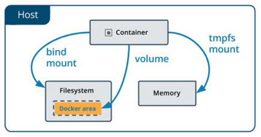 

 

!> -V    

!> -mount

数据卷是一个可供一个或多个容器使用的特殊目录，它绕过 UFS，可以提供很多有用的特性：

> 数据卷可以在容器之间共享和重用
>
> 对数据卷的修改会立马生效
>
> 对数据卷的更新，不会影响镜像
>
> 数据卷默认会一直存在，即使容器被删除


注意： 数据卷的使用，类似于Linux下对目录或文件进行mount，镜像中的被指定为挂载点的目录中的文件会隐藏掉，能显示看的是挂载的数据卷 。

 

**数据卷**

Docker 新用户应该选择 --mount 参数

经验丰富的Docker使用者对 -v 或者 --volume已经很熟悉了，但是推荐使用 –mount 参数。

 

 

使用docker volume 查看相关的提示命令

```shell
[root@localhost ~]# docker volume

Usage:	docker volume COMMAND

Manage volumes

Commands:
  create      Create a volume
  inspect     Display detailed information on one or more volumes
  ls          List volumes
  prune       Remove all unused local volumes
  rm          Remove one or more volumes

Run 'docker volume COMMAND --help' for more information on a command.
```

创建数据卷

```shell
docker volume create my-volume
```

查看数据卷

```shell
docker volume ls
```

查看指定数据卷的信息

```shell
docker volume inspect my-volume
```

命令执行的效果

 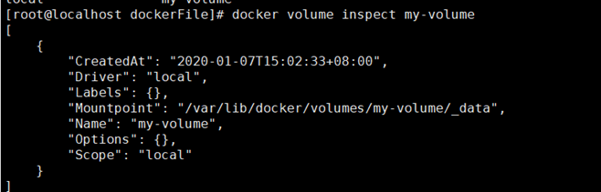

 

启动一个挂载数据卷的容器：

>  在用 docker run 命令的时候，使用 --mount 标记来将 数据卷 挂载到容器里。在一次 docker run 中可以挂载多个 数据卷 。

 

创建一个名为 session-web 的容器，并加载一个 数据卷 到容器的 /webapp 目录。

```shell
docker run --name session-web -d -p 8888:8080 \
# -v my-volume:/wepapp \
--mount type=bind,source=/src/webapp,target=/opt/webapp
session-web:latest
```

删除数据卷

```shell
docker volume rm my-volume
```

数据卷是被设计用来持久化数据的，它的生命周期独立于容器，`Docker`不会在容器被删除后自动删除数据卷 ，并且也不存在垃圾回收这样的机制来处理没有任何容器引用的数据卷。

如果需要在删除容器的同时移除数据卷。可以在删除容器的时候使用`docker rm –v` 这个命令。

无主的数据卷可能会占据很多空间，要清理请使用以下命令

```shell
docker volume prune
```

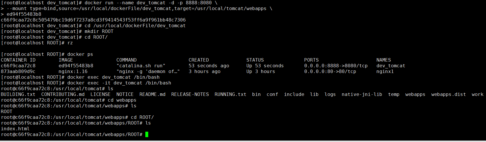

- 之前文档原文

```shell
docker run --name session-web -d -p 8888:8080 \
# -v my-volume:/wepapp \
--mount type=bind,source=/src/webapp,target=/opt/webapp
session-web:latest
```

上面的命令加载主机的 /src/webapp 目录到容器的 /opt/webapp 目录。这个功能在进行测试的时候十分方便，比如用户可以放置一些程序到本地目录中，来查看容器是否正常工作。

进行挂载的命令

```shell
docker run --name dev_tomcat -d -p 8888:8080 \
--mount type=bind,source=/usr/local/dockerFile/dev_tomcat,target=/usr/local/tomcat/webapps \
ed94f55483b8

```

source : 后面是 文件的路径

target : 容器内的路径

本地目录的路径必须是绝对路径

> 本地目录的路径必须是绝对路径
>
> 以前------使用 -v 参数时如果本地目录不存在 Docker 会自动为你创建一个文件夹
>
> 现在------使用 --mount 参数时如果本地目录不存在，Docker 会报错
>
> Docker 挂载主机目录的默认权限是读写 ，用户也可以通过增加 readonly 指定为只读

**推荐使用 mount** **命令**

# 4.  Docker 网络

 

## 4.1. Docker 网络

使用 docker network 命令 ，进行查看 命令

```shell
[root@localhost ~]# docker network

Usage:	docker network COMMAND

Manage networks

Commands:
  connect     Connect a container to a network
  create      Create a network
  disconnect  Disconnect a container from a network
  inspect     Display detailed information on one or more networks
  ls          List networks
  prune       Remove all unused networks
  rm          Remove one or more networks

Run 'docker network COMMAND --help' for more information on a command.
```

通过使用 ls 命令来查看

```shell
[root@localhost ~]# docker network ls
NETWORK ID          NAME                DRIVER              SCOPE
329c01b134d0        bridge              bridge              local
ea7daffa4094        host                host                local
577ffc70a304        none                null                local
```

## 4.2. Docker 网络 模式

https://www.cnblogs.com/zuxing/articles/8780661.html

Docker 网络 有四种 

>  none 无
>
> host  仅主机
>
> container 
>
> bridge 侨联

查看具体的网络使用情况

```shell
ip addr show
```

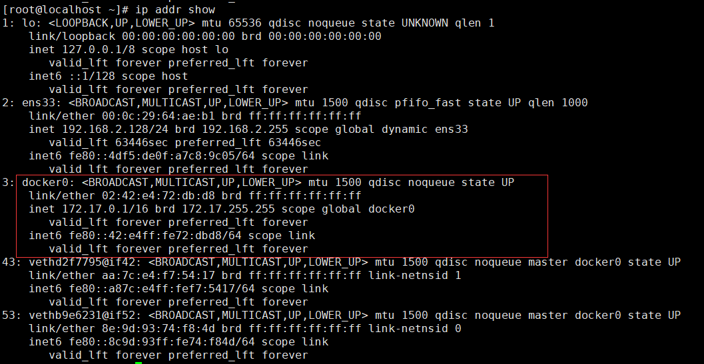

通过上面的命令进行查看网络的

出现docker0 这个网络，这个网络 在 172.17.0.1/16 子网内

 

# 5.  Docker 查看日志

Docker 查看日志

资料来源： https://blog.csdn.net/wen_1108/article/details/78356655

 

实时查看docker容器日志

```shell
$ sudo docker logs -f -t --tail 行数 容器名

docker logs -f -t --tail 100 dev_tomcat
```

例：实时查看docker容器名为s12的最后10行日志

```shell
$ sudo docker logs -f -t --tail 10 s12

docker logs -f -t --tail 30 dev_tomcat
```

# 5.  Docker 容器监控

## 5.1. Docker 自带的查看

资料来源： https://www.cnblogs.com/sparkdev/p/7821376.html

 

## 5.2. 默认输出

```shell
docker stats
```

 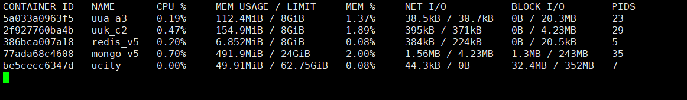

默认情况下，stats 命令会每隔 1 秒钟刷新一次输出的内容直到你按下 ctrl + c。下面是输出的主要内容：
 [**CONTAINER**]：以短格式显示容器的 ID。
 [**CPU %**]：CPU 的使用情况。
 [**MEM USAGE / LIMIT**]：当前使用的内存和最大可以使用的内存。
 [**MEM %**]：以百分比的形式显示内存使用情况。
 [**NET I/O**]：网络 I/O 数据。
 [**BLOCK I/O**]：磁盘 I/O 数据。
 [**PIDS**]：PID 号。

## 5.3. 只返回当前的状态

如果不想持续的监控容器使用资源的情况，可以通过 --no-stream 选项只输出当前的状态： 

 ```shell
docker stats --no-stream
 ```

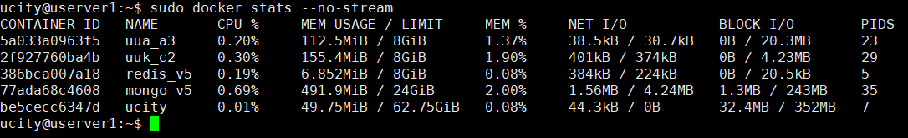

这样输出的结果就不会变化了，看起来省劲不少。

## 5.4. 只输出指定的容器

```shell
sudo docker stats 5a033a0963f5
```

增加容器的 id 查看单独的

## 5.5. 格式化输出

我们在前面搞了点小手段把输出中的容器 ID 替换成了名称。其实 docker stats 命令支持我们通过 --format 选项自定义输出的内容和格式：

```shell
sudo docker stats --format "table {{.Name}}\t{{.CPUPerc}}\t{{.MemUsage}}"
```

上面的命令中我们只输出了 Name, CPUPerc 和 Memusage 三列。下面是自定义的格式中可以使用的所有占位符：

```shell
 .Container   根据用户指定的名称显示容器的名称或 ID。
 .Name      容器名称。
 .ID         容器 ID。
 .CPUPerc    CPU 使用率。
 .MemUsage 内存使用量。
 .NetIO      网络 I/O。    
 .BlockIO    磁盘 I/O。
 .MemPerc   内存使用率。
 .PIDs       PID 号。
```

通过 docker stats 命令我们可以看到容器使用系统资源的情况。这为我们进一步的约束容器可用资源或者是调查与资源相关的问题提供了依据。除了 docker 自带的命令，像 glances 等工具也已经支持查看容器使用的资源情况了，有兴趣的朋友可以去了解一下。

# 6.docker资源限制

使用 docker 运行容器时，默认的情况下，docker没有对容器进行硬件资源的限制，当一台主机上运行几百个容器，这些容器虽然互相隔离，但是底层却使用着相同的 CPU、内存和磁盘资源。如果不对容器使用的资源进行限制，那么容器之间会互相影响，小的来说会导致容器资源使用不公平；大的来说，可能会导致主机和集群资源耗尽，服务完全不可用。

docker 作为容器的管理者，自然提供了控制容器资源的功能。正如使用内核的 namespace 来做容器之间的隔离，docker 也是通过内核的 cgroups 来做容器的资源限制；包括CPU、内存、磁盘三大方面，基本覆盖了常见的资源配额和使用量控制。

Docker内存控制OOME在linxu系统上，如果内核探测到当前宿主机已经没有可用内存使用，那么会抛出一个OOME(Out Of Memory Exception:内存异常 )，并且会开启killing去杀掉一些进程。

一旦发生OOME，任何进程都有可能被杀死，包括docker daemon在内，为此，docker特地调整了docker daemon的OOM_Odj优先级，以免他被杀掉，但容器的优先级并未被调整。经过系统内部复制的计算后，每个系统进程都会有一个OOM_Score得分，OOM_Odj越高，得分越高，（在docker run的时候可以调整OOM_Odj）得分最高的优先被kill掉，当然，也可以指定一些特定的重要的容器禁止被OMM杀掉，在启动容器时使用 –oom-kill-disable=true指定。

```shell
sudo docker run --name mongo_v3 \
-p 27017:27017 \
--mount type=bind,source=/usr/local/mongoDB,target=/data/db \
--cpus=20 \
-m 32G \
-d mongo:latest
```

