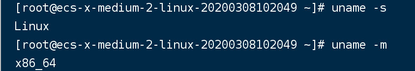
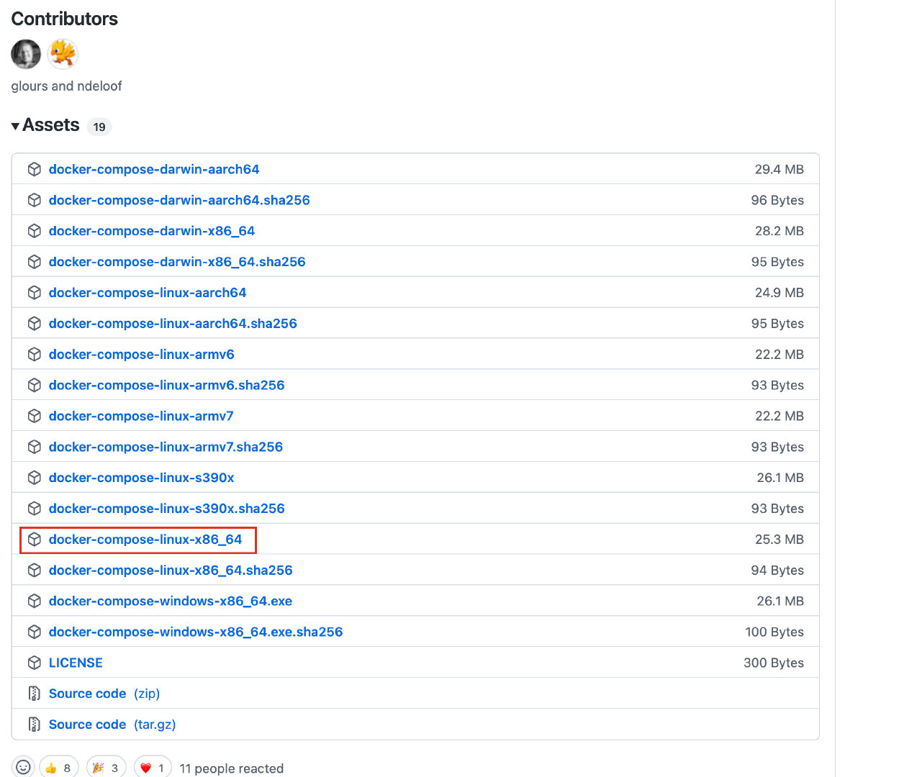

## 安装过程

### 安装方式一(推荐)

运行以下命令以下载 Docker Compose 的当前稳定版本：

    sudo curl -L "https://github.com/docker/compose/releases/download/1.24.1/docker-compose-$(uname -s)-$(uname -m)" -o /usr/local/bin/docker-compose
- 表达式含义：



- 查看最新的版本[releases](https://github.com/docker/compose/releases)

  比如Linux最新版本

  

  ​

通过下载然后文件上传后执行，放到指定的位置

`mv docker-compose-linux-x86_64 /usr/local/bin/docker-compose`

将可执行权限应用于二进制文件：

    sudo chmod +x /usr/local/bin/docker-compose

创建软链：

    sudo ln -s /usr/local/bin/docker-compose /usr/bin/docker-compose

测试是否安装成功：

    docker-compose --version
检查执行效果


###  yum 方式安装

- 安装步骤

```
　　1、安装python-pip

　　yum -y install epel-release

　　yum -y install python-pip

　　2、安装docker-compose

　　pip install docker-compose

　　待安装完成后，执行查询版本的命令确认安装成功

　　docker-compose version

　　spring.dubbo

　　application.name

　　registry.port
```