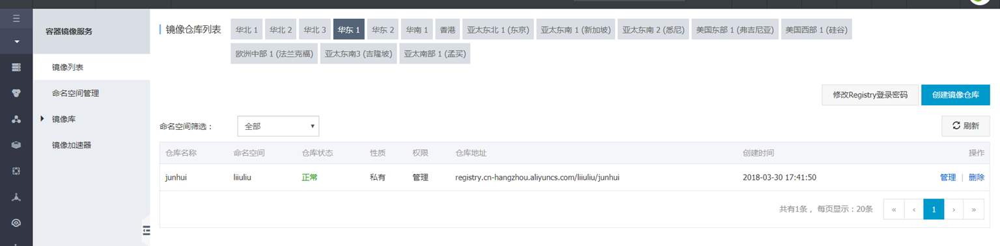
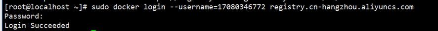
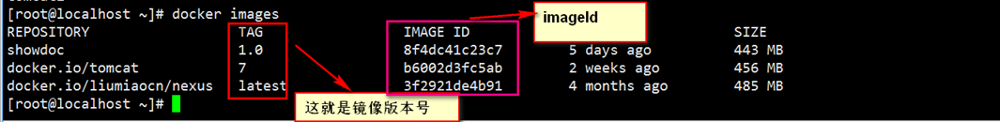
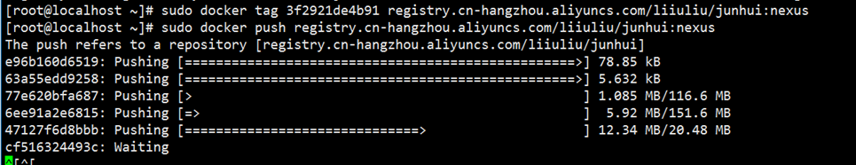
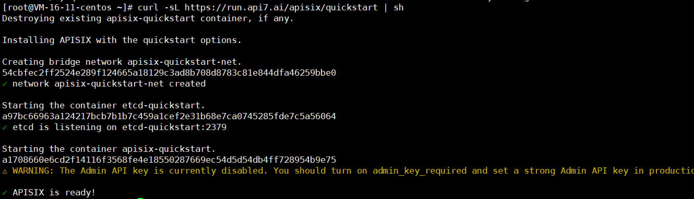

资料来源：

[docker pull mysql 报missing signature key错误](https://blog.csdn.net/Single_for_life/article/details/133653113)

## 安装过程

- 卸载旧版本 Docker（如果已安装）：
  如果你之前已经安装了旧版本的 Docker，请先卸载它。可以使用以下命令来卸载旧版本的 Docker：

```shell
sudo yum remove docker docker-client docker-client-latest docker-common docker-latest docker-latest-logrotate docker-logrotate docker-engine
```

- 首先我们需要安装GCC相关的环境：
~~~~
    yum -y install gcc
    
    yum -y install gcc-c++
~~~~
- 安装Docker需要的依赖软件包：
~~~~
    yum install -y yum-utils device-mapper-persistent-data lvm2
~~~~
- 设置国内的镜像（提高速度）
~~~~
    yum-config-manager --add-repo http://mirrors.aliyun.com/docker-ce/linux/centos/docker-ce.repo
~~~~
- 更新yum软件包索引：
~~~~
    yum makecache fast
~~~~
- 安装DOCKER CE(注意：Docker分为CE版和EE版，一般我们用CE版就够用了.)
~~~~
     yum install docker-ce docker-ce-cli containerd.io
~~~~
- 启动Docker：
~~~~
    systemctl start docker
~~~~
- 查看Docker版本：:
~~~~
    docker version
~~~~


## Docker镜像仓库

## 1.1. 打开关系后台

在使用Docker时，有时需要制作自己的Docker镜像，这些镜像可以保存到不同的Docker Hub中，包括Docker官方的和国内的一些Hub，比如阿里云。同时，也可以使用阿里云的Docker Hub来加速镜像的拉取速度。

配置镜像加速器

1. 登录阿里云，进入容器镜像服务-镜像加速器： https://cr.console.aliyun.com/#/accelerator

https://cr.console.aliyun.com/repository/cn-hangzhou/liiuliu/junhui/images （后台镜像地址）

​                               

 

 

>  使用的用户名： 17080346772
>
> 密码是：

## 镜像的上传和下载

第一步: 登录 阿里云镜像仓库

 

登录阿里云docker registry:

```shell
 $ sudo docker login --username=17080346772 registry.cn-hangzhou.aliyuncs.com
```

登录registry的用户名是您的阿里云账号全名，密码是您开通服务时设置的密码。

你可以在镜像管理首页点击右上角按钮修改docker login密码。

从registry中拉取镜像：

```shell
 $ sudo docker pull registry.cn-hangzhou.aliyuncs.com/liiuliu/junhui:[镜像版本号]
```

将镜像推送到registry：

```shell
 $ sudo docker login --username=17080346772 registry.cn-hangzhou.aliyuncs.com

 $ sudo docker tag [ImageId] registry.cn-hangzhou.aliyuncs.com/liiuliu/junhui:[镜像版本号]

 $ sudo docker push registry.cn-hangzhou.aliyuncs.com/liiuliu/junhui:[镜像版本号]
```

其中[ImageId],[镜像版本号]请你根据自己的镜像信息进行填写。

ImageId 和 镜像的版本 值得是下图的内容



文件上传



 


### apisix

[官网地址](https://apisix.apache.org/zh/docs/apisix/getting-started/README/):https://apisix.apache.org/zh/docs/apisix/getting-started/README/

 APISIX 可以借助 quickstart 脚本快速安装并启动：

```shell
curl -sL https://run.api7.ai/apisix/quickstart | sh
```

该命令启动 *apisix-quickstart* 和 *etcd* 两个容器，APISIX 使用 etcd 保存和同步配置。APISIX 和 etcd 容器使用 Docker 的 [**host**](https://docs.docker.com/network/host/) 网络模式，因此可以从本地直接访问。

如果一切顺利，将输出如下信息：

```text
✔ APISIX is ready!
```

?>  存在的问题，无法下载镜像，我使用国外的网站下载后。放到阿里云服务器上

脚本，也有可能会跟着时间修改：老的脚本<a href="linux/images/quickstart">下载脚本</a>




!>  存在问题？有apisix 但是没有。控制的面板

