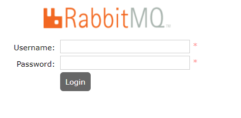

资料来源：<br/>
[Docker安装RabbitMQ docker安装RabbitMQ完整详细教程](https://blog.csdn.net/qq_40739917/article/details/131509696)<br/>
[RabbitMQ入门](https://blog.csdn.net/yzq102873/article/details/128304566)
[org.springframework.amqp.AmqpIOException: java.io.IOException](https://blog.csdn.net/weixin_45902573/article/details/125798551)<br/>
[Docker 安装 RabbitMQ 并安装延迟队列插件 rabbitmq-delayed-message-exchange](https://blog.csdn.net/m0_46114643/article/details/124692659)


## 拉取 RabbitMQ 镜像
我这边选择的版本是 `rabbitmq:3.12-management`在终端中执行以下命令以拉取 `rabbitmq:3.12-management`根据自己使用过的版本：
镜像尽量选择 带`-management`后缀的，因为这个是自带Web监控页面，同3.12版本MQ有两个
`docker pull rabbitmq:3.12-management`
`docker pull rabbitmq:3.12` 这个是不带Web管理页面的，是需要自己手动安装插件

```shell
docker pull rabbitmq:3.12-management
```

2、创建并运行容器
使用以下命令创建一个新的 rabbitmq容器并将其启动：

```shell
docker run --name some-rabbitmq -p 5672:5672 -p 15672:15672 -d rabbitmq:3.12-management
```

--name 是 容器别名，将 宿主机 5672端口映射到 容器内5672，and 端口15672端口映射到 容器内15672 端口，访问宿主机端口的时候会映射到对应容器端口, -d 表示后台运行。

3、RabbitMQ 常用端口以及作用

- 5672端口：AMQP（Advanced Message Queuing Protocol）协议的默认端口，用于客户端与RabbitMQ服务器之间的通信。

- 15672端口：RabbitMQ的管理界面，默认使用HTTP协议，用于监控和管理RabbitMQ服务器。

- 4369端口：Erlang分布式节点通信端口，用于RabbitMQ节点之间的通信。

- 25672端口：Erlang分布式节点通信端口，用于集群中的内部通信。

- 5671端口：安全的AMQP端口，使用TLS/SSL进行加密通信。

4、访问 管理页面测试，是否启动成功




访问 `localhost:15672` 管理页面是否正常

```url
http://localhost:15672/
```

RabbitMQ默认的登录账号和密码如下：

- 用户名：**guest**
- 密码： **guest**


## 指定VirtualHost

```c
方式一：默认guest用户，密码也是guest

docker run -d -p 5672:5672 -p 15672:15672 --name rabbitmq

方式二：设置用户名和密码

docker run -d \
     --name my-rabbitmq \
     -p 5672:5672 -p 15672:15672 \
     -v /data:/var/lib/rabbitmq \
     --hostname my-rabbitmq-host \
     -e RABBITMQ_DEFAULT_VHOST=my_vhost \
     -e RABBITMQ_DEFAULT_USER=admin \
     -e RABBITMQ_DEFAULT_PASS=admin \
     --restart=always \
     rabbitmq:management 

参数说明：
   -d：后台运行容器
   -name：指定容器名
   -p：指定服务运行的端口（5672：应用访问端口；15672：控制台Web端口号）
   -v：映射目录或文件，启动了一个数据卷容器，数据卷路径为：/var/lib/rabbitmq，再将此数据卷映射到住宿主机的/data目录
   --hostname：主机名（RabbitMQ的一个重要注意事项是它根据所谓的 “节点名称” 存储数据，默认为主机名）
   -e：指定环境变量；（
RABBITMQ_DEFAULT_VHOST：默认虚拟机名；
RABBITMQ_DEFAULT_USER：默认的用户名；
RABBITMQ_DEFAULT_PASS：默认用户名的密码）
   --restart=always：当Docker重启时，容器能自动启动   
   rabbitmq:management：镜像名
   
   注1：RABBITMQ_DEFAULT_VHOST=my_vhost，my_vhost名字请记好，在之后的编程中要用到,
        如果启动时没指定，默认值为/
```

登录管理后台，可以看到


 **创建vhosts**


## 安装rabbitmq-delayed-message-exchange插件

### 下载延迟插件

在 RabbitMQ 的 3.5.7 版本之后，提供了一个插件（rabbitmq-delayed-message-exchange）来实现延迟队列 ，同时需保证 Erlang/OPT 版本为 18.0 之后。
我这里 MQ 的版本是 3.9.11，现在去[GitHub 上根据版本号下载插件](https://github.com/rabbitmq/rabbitmq-delayed-message-exchange/releases)
根据自己的版本号自行下载即可


### 安装插件并启用
我用的是 Docker 客户端，下载完成后直接把插件放在 C 盘的根目录，然后拷贝到容器内plugins目录下（be95ff9c2ee4是容器的id，也可以使用容器id）


```
docker cp rabbitmq_delayed_message_exchange-3.8.9-0199d11c.ez be95ff9c2ee4:/plugins
```

进入 Docker 容器

```
docker exec -it be95ff9c2ee4 /bin/bash
```

查看插件是否存在

```
cd plugins
ls |grep delay
```


在plugins内启用插件

```
rabbitmq-plugins enable rabbitmq_delayed_message_exchange
```

退出容器

```
exit
```


重启 RabbitMQ

```
docker restart rabbit
```


容器启动成功之后，登录RabbitMQ的管理页面，找到ExchangesTab页。点击Add a new exchange，在Type里面查看是否有x-delayed-message选项，如果存在就代表插件安装成功。


说明成功