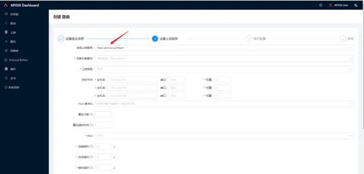

资料来源：<br/>
[APISIX初探](https://zhuanlan.zhihu.com/p/612140246)<br/>

[国产微服务网关 APISIX，有点意思，直接开锤，换掉家门口的 Nginx](https://zhuanlan.zhihu.com/p/139877922)


## 介绍

在四川文渊阁科技有限公司，使用的网关采用了apisix。在使用过程中感觉很好用。就琢磨着自己安装，花了很多天，都没有安装成功

按照[国产微服务网关 APISIX，有点意思，直接开锤，换掉家门口的 Nginx](https://zhuanlan.zhihu.com/p/139877922)教程安装的，有安装成功，但是没有控制面板

[APISIX初探](https://zhuanlan.zhihu.com/p/612140246)也同样没有面板。

```shell
https://github.com/apache/apisix-docker.git
cd apisix-docker
git checkout release/apisix-3.6.0
```

注意：使用`release/apisix-3.6.0`分支


```shell
cd apisix-docker/example
docker-compose -p docker-apisix up -d  
```

经过一通操作，就可以安装了

!> 需要提前安装docker-ce docker-compose


## 使用

首先添加上游


填写以下几项信息，然后提交


接着创建路由


继续填写路由


这里选择已存在的上游服务，无需再次填写节点信息。




提交路由后，我们开始测试APISIX的反向代理功能，能成功请求到对应的后端Server。

```text
root@DESKTOP-32INF72:~# curl "http://127.0.0.1:9080/get_result_http"
Hello flask server!
```


多次请求后，发现请求能均匀打到后端3台Server，验证能起到反向代理和负载均衡的作用。


接着尝试使用APISIX提供的插件来处理我们的请求。首先使用basic-auth插件，支持账号密码登录。


在路由配置中选用插件basic-auth


启用后提交。


再次请求flask 接口时提示缺失授权信息。

```text
root@DESKTOP-32INF72:~# curl "http://127.0.0.1:9080/get_result_http"
{"message":"Missing authorization in request"}
```

此时需要为APISIX注册用户账密，请求需要带着账密才可以请求成功。


使用未注册的账密登录，提示系统用户未授权。

```text
root@DESKTOP-32INF72:~# curl -i -ufoo:bar  "http://127.0.0.1:9080/get_result_http"
HTTP/1.1 401 Unauthorized
Date: Tue, 07 Mar 2023 08:53:40 GMT
Content-Type: text/plain; charset=utf-8
Transfer-Encoding: chunked
Connection: keep-alive
Server: APISIX/3.1.0

{"message":"Invalid user authorization"}
```

使用已注册的账密登录，能顺利请求到后端接口。

```text
root@DESKTOP-32INF72:~# curl -i -u lijunshi:lijunshipwd  "http://127.0.0.1:9080/get_result_http"
HTTP/1.1 200 OK
Content-Type: text/html; charset=utf-8
Content-Length: 19
Connection: keep-alive
Date: Tue, 07 Mar 2023 08:54:16 GMT
Server: APISIX/3.1.0
```


启用限流插件，限制频率1秒1次。


使用限流插件后，当请求频率超过1秒一次后，提示

```text
root@DESKTOP-32INF72:~# curl -i -u lijunshi:lijunshipwd  "http://127.0.0.1:9080/get_result_http"
HTTP/1.1 503 Service Temporarily Unavailable
Date: Tue, 07 Mar 2023 09:01:53 GMT
Content-Type: text/html; charset=utf-8
Content-Length: 269
Connection: keep-alive
Server: APISIX/3.1.0

<html>
<head><title>503 Service Temporarily Unavailable</title></head>
<body>
<center><h1>503 Service Temporarily Unavailable</h1></center>
<hr><center>openresty</center>
<p><em>Powered by <a href="https://apisix.apache.org/">APISIX</a>.</em></p></body>
</html>
```


## 四川文渊阁配置

**上游**


**普通负载均衡**


**使用nacos**


正则表达式：匹配的方法


这个系统带有监控面板

