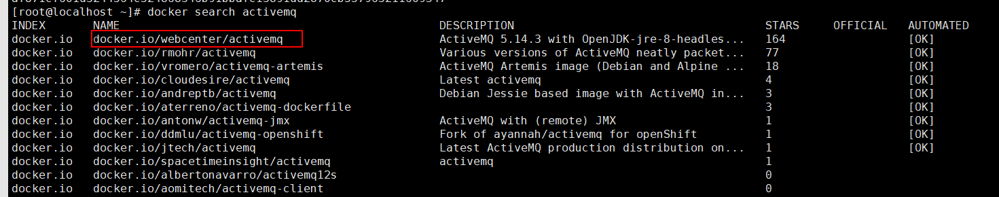
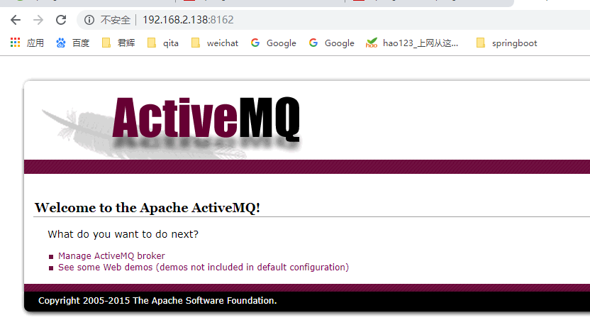

资料来源：<br/>
[Docker 安装activeMq](https://blog.csdn.net/qq_35981283/article/details/69666706)<br/>

## 1.1. 查看镜像

查看镜像

```java
docker search activemq
```




拉取进行

 ````
docker pull docker.io/webcenter/activemq
 ````

启动服务

```shell
docker run -d --name myactivemq -p 61617:61616 -p 8162:8161 docker.io/webcenter/activemq:latest
```

查看web 服务

61616是activemq的容器使用端口（映射为61617），8161是web页面管理端口（对外映射为8162）.



默认账号密码都是admin

点击manage activemq broker就可以进入管理页面（需要输入账号密码）。