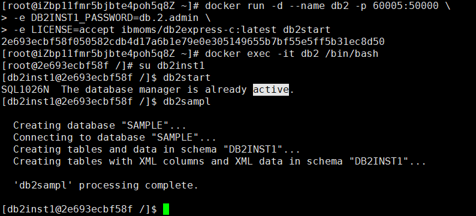
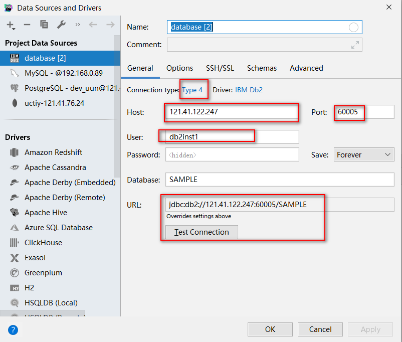

资料来源：<br/>
[docker安装db2数据库](https://www.cnblogs.com/djlsunshine/p/12060224.html)<br/>
[Docker中安装DB2详细教程](https://www.jianshu.com/p/fa1442233f7f)<br/>

查询可安装的db2镜像

```
# docker search db2
```

 docker-hub上拉取镜像到本地

```
# docker pull ibmcom/db2express-c
```

启动容器

```
# docker run -it --network=host -p50000:50000 -e DB2INST1_PASSWORD=db2root-pwd -e LICENSE=accept docker.io/ibmcom/db2express-c:latest bash
```

实际执行的命令：

```
docker run -d --name db2 -p 60005:50000 \
-e DB2INST1_PASSWORD=db.2.admin \
-e LICENSE=accept ibmoms/db2express-c:latest db2start
```

进入镜像，切换用户

```
docker exec -it db2 /bin/bash
su db2inst1                           //切换用户
db2start                             //启动DB2
db2sampl                            //创建默认数据库“SAMPLE”
```


>-d: 后台运行容器，并返回容器ID<br/>
> --name db2 为容器指定一个名称<br/>
> -p 50000:50000 允许远程的客户端可以从50000 端口连接到数据库实例<br/>
> （端口映射，格式为：主机(宿主)端口:容器端口）<br/>
> -e DB2INST1_PASSWORD=db.2.admin 为缺省的Db2实例用户db2inst1设置密码为db.2.admin<br/>
> -e LICENSE=accept 表示接受了使用Db2软件的许可证协议<br/>

执行结果



