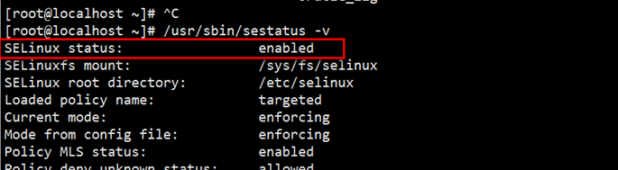
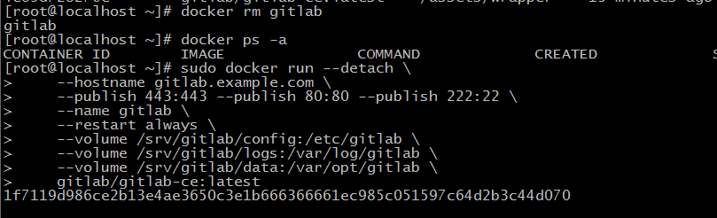
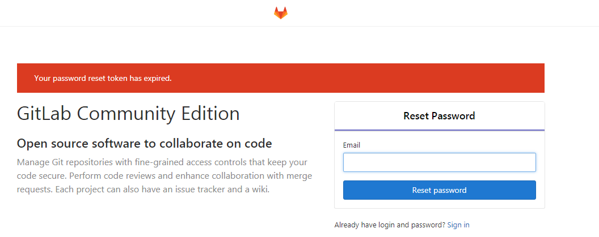

资料来源：<br/>
[安装私服](https://www.cnblogs.com/jefflee168/p/7402189.html)<br/>
[安装私服](https://blog.csdn.net/u011054333/article/details/61532271)<br/>
[配置docker](https://blog.csdn.net/yangxuan0261/article/details/74674809)<br/>
[git统计代码行数、提交数](https://blog.csdn.net/trusause/article/details/142395501)<br/>


##	**Docker 安装 gitlab**

1. **下载docker镜像**

```
   docker pull gitlab/gitlab-ce:latest
```

使用网易的 镜像库，下载速度非常的快
**2,启动gitlab**

分成两种启动 
运行Linuxse
查看方法

```
/usr/sbin/sestatus -v   
```



如上图是开启的状态下

关闭的情况下
```
sudo docker run --detach \
    --hostname gitlab.example.com \
    --publish 443:443 --publish 80:80 --publish 22:22 \
    --name gitlab \
    --restart always \
    --volume /srv/gitlab/config:/etc/gitlab \
    --volume /srv/gitlab/logs:/var/log/gitlab \
    --volume /srv/gitlab/data:/var/opt/gitlab \
    gitlab/gitlab-ce:latest

```
开启的情况下

```
sudo docker run --detach \
    --hostname gitlab.example.com \
    --publish 443:443 --publish 80:80 --publish 22:22 \
    --name gitlab \
    --restart always \
    --volume /srv/gitlab/config:/etc/gitlab:Z \
    --volume /srv/gitlab/logs:/var/log/gitlab:Z \
    --volume /srv/gitlab/data:/var/opt/gitlab:Z \
    gitlab/gitlab-ce:latest

```
volume 值得是配置文件位置
此时已经启动成功，但是不能立即使用。
原因：启动速度非常慢



通过IP 访问，如果是 下面界面。说明启动已经成功了，但是系统还没有准备好，需要进行等待：

官方推荐内存 大于2G


过一段时间，再次访问就是下面的页面。默认用户名root



## 配置Gitlab

刚刚启动Gitlab的时候需要我们输入一个密码，这个密码是管理员用户的密码。我们在登录那里使用root作为用户名，然后用刚刚设置的密码，就可以以管理员身份登录Gitlab。

登录进去之后，点击右上角的齿轮图标，即可进入到管理员页面。在这里我们可以设置很多东西。比如说，默认情况下每个用户只能创建10个仓库，我们可以改变这个设置。在管理员页面点击右面的齿轮，再点击设置，就会进入到系统设置中。然后找到Default projects limit一项，我们给它设个小目标，设它一个亿，这样就相当于无限仓库了。当然如果你实际硬盘满了也就不能在创建更多项目了。

如果这些配置还是不能满足你的需求的时候，还可以直接配置Gitlab。首先进入到Docker环境中。我们使用下面的命令进入Docker环境的bash中。gitlab是刚刚指定的Gitlab名称。

**进入交互**

```
docker exec -it gitlab /bin/bash 
```

然后就进入了Docker的环境中，我们可以把它当作一个独立的系统来使用。然后编辑`/srv/gitlab/config/gitlab.rb`文件，这是Gitlab的全局配置文件。所有选项都可以在这里配置。

配置文件
```
gitlab_rails['smtp_enable'] = true
gitlab_rails['smtp_address'] = "smtp.qq.com"
gitlab_rails['smtp_port'] = 465
gitlab_rails['smtp_user_name'] = "2446693513@qq.com"
gitlab_rails['smtp_password'] = "auth_code" # 邮箱授权码，而不是qq密码
gitlab_rails['smtp_domain'] = "qq.com"
gitlab_rails['smtp_authentication'] = "login"
gitlab_rails['smtp_enable_starttls_auto'] = true
gitlab_rails['smtp_ssl'] = true
gitlab_rails['smtp_openssl_verify_mode'] = 'none'
gitlab_rails['gitlab_email_from'] = "364105996@qq.com"
gitlab_rails['gitlab_email_reply_to'] = '364105996@qq.com'
gitlab_rails['gitlab_email_display_name'] = 'GitLab-Robot'
```


## 查看代码的统计量

查看个人时间段代码量

```shell
git log --since=2025-03-01 --until=2025-04-01 --author="liuwei"  --pretty=tformat: --numstat | awk '{ add += $1; subs += $2; loc += $1 - $2 } END { printf "added lines: %s, removed lines: %s, total lines: %s\n", add, subs, loc }'
```

所有人

```shell
git log --since=2025-03-01 --until=2025-04-01  --pretty=tformat: --numstat | awk '{ add += $1; subs += $2; loc += $1 - $2 } END { printf "added lines: %s, removed lines: %s, total lines: %s\n", add, subs, loc }'
```

