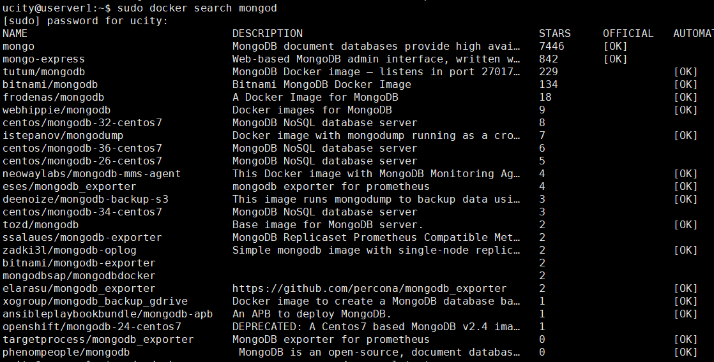
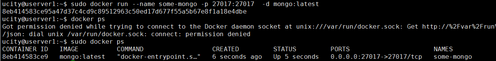
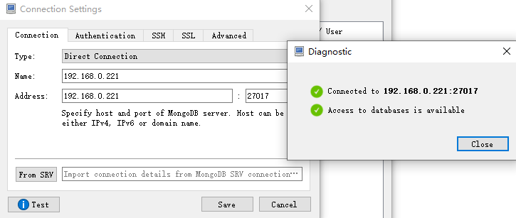
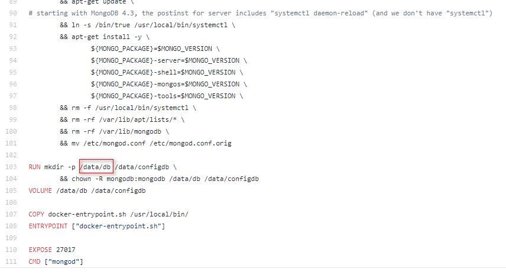
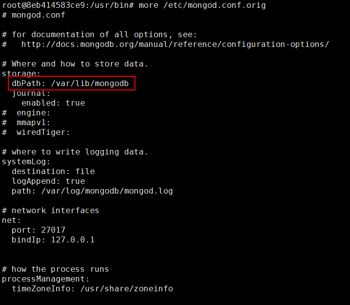

资料来源：<br/>
[安装](https://www.runoob.com/docker/docker-install-mongodb.html )<br/>

## docker 安装


1.1. 查看安装的
```
sudo docker search mongod
```



###  Docker启动

```
sudo docker run --name some-mongo -p 27017:27017 -d mongo:latest
```



可以使用工具链接到mongo 中

不需要使用用户名和密码



### 指定路径

从dockerfile 文件中找到



从上面的文件可以看出 docker 把生成的数据保存到 /data/db 这个路径下

MongoDB 的配置文件的路径

进入docker 中找到配置文件，从文件中进行查看配置

从配置文件中，可以看到



```
/var/lib/mongodb
```

使用mount 挂载方式，进行挂载

启动服务

```
sudo docker run --name mongo_v2 \
-p 27017:27017 \
--mount type=bind,source=/usr/local/mongoDB,target=/data/db \
-d mongo:latest
```

数据恢复的

```
/usr/bin/mongorestore --port=27017 --db=list01 /file/list01
/usr/bin/mongorestore --port=27017 --db=main   /file/main
```


 