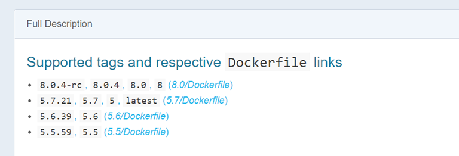

## mysql5.5

###  拉mysql 镜像：

```
Docker pull mysql:5.5
```

可以查询库 中，选择不同的版本



```
docker run -i \
    -p 127.0.0.1:3306:3306 \
    -e MYSQL_ROOT_PASSWORD=my-secret-pw \
    -t cytopia/mysql-5.7
```

### 启动服务

```
sudo docker run --name first-mysql -p 3306:3306 -e MYSQL\_ROOT\_PASSWORD=123456 -d mysql:5.5
fab48a3543c74836504904d852b4be29037fe5366a4d3a5a25eba72b3a67401c
```

