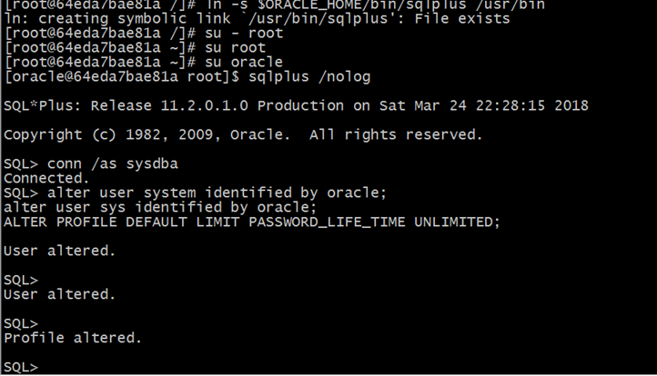
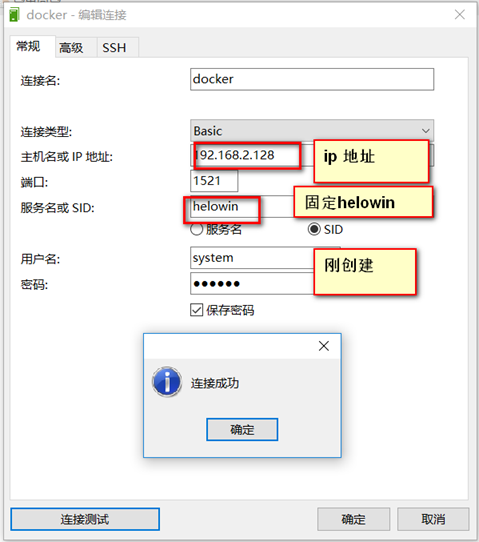
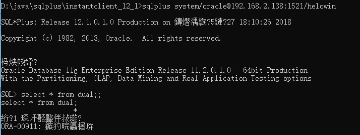

资料来源：<br/>
[在docker下安装oracle](https://blog.csdn.net/zwx521515/article/details/77982884)

## 安装说明

### 1.1. 下载docker镜像

1，仓库下载
可以通过仓库下载，下载速度还是比较的快的

```
docker pull registry.cn-hangzhou.aliyuncs.com/helowin/oracle_11g
```

我的个人仓库，需要登录
```
sudo docker pull registry.cn-hangzhou.aliyuncs.com/liiuliu/junhui:oracle_11g
```
## 1.2. 开启服务

### 1.2.1. 开启服务

查看镜像

```
docker images
```

开启服务
```
docker run -d -p 1521:1521 --name oracle_11g 3fa112fd3642
```
此时已经开启的了服务

举例
```
Last login: Sat Mar 24 21:35:10 2018 from 192.168.2.144
[root@localhost ~]# docker images
REPOSITORY                                             TAG                 IMAGE ID            CREATED             SIZE
showdoc                                                1.0                 8f4dc41c23c7        4 hours ago         443 MB
registry.cn-hangzhou.aliyuncs.com/helowin/oracle_11g   latest              3fa112fd3642        2 years ago         6.85 GB
[root@localhost ~]# docker run -d -p 1521:1521 --name oracle_11g 3fa112fd3642
64eda7bae81a30243e9d4be4fb2bf25715d5392363cc4252aad49c93f0070c71
```

### 1.3. 创建用户，编辑信息

1，进入交互

```
docker exec -it oracle_11g bash
```
2，切换到root用户模式下
```
su root

输入密码helowin
```

3，编辑profile文件配置ORACLE环境变量
``` 
vi /etc/profile 

并在文件最后添加如下命令
export ORACLE_HOME=/home/oracle/app/oracle/product/11.2.0/dbhome_2
export ORACLE_SID=helowin
export PATH=$ORACLE_HOME/bin:$PATH
```
退出保存，编辑信息

注意：让全称变量生效
```
source  /etc/profile
```
保存文件的截图

### 4.创建用户

1.软件连接

```
ln -s $ORACLE_HOME/bin/sqlplus /usr/bin
```

2.切换oracle 用户下
```
 su oracle
```
登录sqlplus并修改sys、system用户密码

```
sqlplus /nolog
conn /as sysdba
```

3.创建用户
```
alter user system identified by oracle;
alter user sys identified by oracle;
ALTER PROFILE DEFAULT LIMIT PASSWORD_LIFE_TIME UNLIMITED;
```

以上的操作完成，也就完成了创建用户
上面面操作距离（vi  编辑，看截图）
4.软件连接
```
ln -s $ORACLE_HOME/bin/sqlplus /usr/bin
```

5.切换到oracle 用户
```
su oracle

```

连接oracle  

```
sqlplus /nolog

```

如果切换到oracle 用户后，出现这样的提示
```
[root@64eda7bae81a /]# sqlplus /nolog
bash: sqlplus: command not found
```
切换到root用户进行重新配置
```
[root@64eda7bae81a /]# ln -s $ORACLE_HOME/bin/sqlplus /usr/bin
ln: creating symbolic link `/usr/bin/sqlplus': File exists
```
说明文件已经存在，可以进行把/usr/bin/sqlplus 文件进行删除重新删除，再次进行执行
```
[root@64eda7bae81a /]# ln -s $ORACLE_HOME/bin/sqlplus /usr/bin
```
再次进行下面的步骤

介绍的方法：（下面是使用的命令）
```
[root@64eda7bae81a /]# sqlplus /nolog
bash: sqlplus: command not found
[root@64eda7bae81a /]# ln -s $ORACLE_HOME/bin/sqlplus /usr/bin
ln: creating symbolic link `/usr/bin/sqlplus': File exists
[root@64eda7bae81a /]# sqlplus /nolog
bash: sqlplus: command not found
[root@64eda7bae81a /]# vi /etc/profile   
[root@64eda7bae81a /]# 
[root@64eda7bae81a /]# 
[root@64eda7bae81a /]# ln -s $ORACLE_HOME/bin/sqlplus /usr/bin
ln: creating symbolic link `/usr/bin/sqlplus': File exists
[root@64eda7bae81a /]# sqlplus /nolog
bash: sqlplus: command not found
[root@64eda7bae81a /]# ^C
[root@64eda7bae81a /]# ln -s $ORACLE_HOME/bin/sqlplus /usr/bin
ln: creating symbolic link `/usr/bin/sqlplus': File exists
[root@64eda7bae81a /]# su - root
[root@64eda7bae81a ~]# su root
[root@64eda7bae81a ~]# su oracle
 [oracle@64eda7bae81a root]$ sqlplus /nolog

SQL*Plus: Release 11.2.0.1.0 Production on Sat Mar 24 22:28:15 2018

Copyright (c) 1982, 2009, Oracle.  All rights reserved.

SQL>

连接成功：
执行
conn /as sysdba

执行sql  创建用户
alter user system identified by oracle;
alter user sys identified by oracle;
ALTER PROFILE DEFAULT LIMIT PASSWORD_LIFE_TIME UNLIMITED;

```
操作截图



客户端进行连接




 远程连接sqlplus 命令：

资料来源： https://blog.csdn.net/z69183787/article/details/22690123 
sqlplus 用户名/密码@192.168.208.120:1521/orcl
　　没有意外的话连接成功。
　　如果上述方法试验没有成功，用下面的方式最直接了

```
sqlplus system/oracle@192.168.2.138:1521/helowin
```




