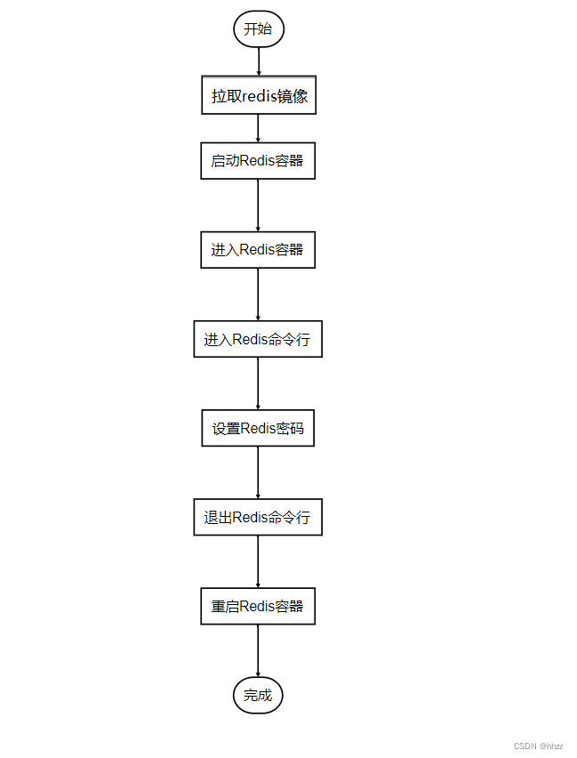

资料来源：

[在Docker中设置Redis的密码](https://blog.csdn.net/weixin_43025151/article/details/134249421)


## 介绍
是一个开源的应用容器引擎，可以自动化部署、扩展应用程序。它可以帮助开发人员将应用程序及其依赖项打包到一个可移植的容器中，然后在任何环境中运行。

Redis是一个开源的内存数据结构存储系统，它可以用作数据库、缓存和消息代理。它支持多种数据结构，如字符串、列表、哈希、集合等。

在本文中，我们将介绍如何在Docker中设置Redis的密码。Redis是一个开源内存数据结构存储，常用于缓存和消息传递。为了保护Redis的安全性，我们需要设置密码来限制对Redis的访问。


下是实现“Docker Redis设置密码”的整体流程图。



3，具体实现步骤
步骤1：拉取Redis镜像
首先，我们需要从Docker Hub上拉取Redis镜像。打开终端（或命令提示符）并运行以下命令：

```
docker pull redis
```

这将下载最新版本的Redis镜像到本地。

步骤2：启动Redis容器
首先，我们需要启动一个Redis容器。可以使用以下命令来启动一个Redis容器，并将其命名为my-redis。

```
docker run -d --name my-redis redis
```

步骤3：进入Redis容器
然后，我们需要进入Redis容器的命令行界面。可以使用以下命令进入my-redis容器。

```
docker exec -it my-redis sh
```

步骤4：进入Redis命令行
在Redis容器的命令行界面中，我们可以执行Redis相关的命令。输入以下命令进入Redis命令行。

```
redis-cli
```

步骤5：设置Redis密码
在Redis命令行中，我们可以使用config set命令来设置Redis的密码。以下是设置密码的代码和注释。

```
config set requirepass your_password
其中，your_password是你希望设置的密码。请将其替换为你自己的密码。
```

步骤6：退出Redis命令行
设置密码后，我们需要退出Redis命令行界面。可以使用以下命令退出Redis命令行。

```
exit
```

步骤7：重启Redis容器
完成上述步骤后，我们需要重启Redis容器使密码生效。可以使用以下命令重启Redis容器。

```
docker restart my-redis
```

步骤8：测试连接
现在我们已经设置了Redis密码，我们可以测试连接是否需要密码验证。打开一个新的终端窗口，并运行以下命令：

```
redis-cli -h localhost -p 6379
```


Redis将提示您输入密码。输入先前设置的密码并按Enter键。如果密码正确，您将成功连接到Redis服务器。

4，结论
通过使用Docker，我们可以轻松地启动Redis容器并设置密码来保护我们的Redis实例。这提供了一个简单和可移植的方法来部署和管理Redis服务器。

恭喜！你已成功地在Docker Redis中设置了密码。现在，只有输入正确的密码才能访问Redis。

附录
以下是本文中使用的所有代码示例：

```
# 拉取Redis镜像
docker pull redis

# 启动Redis容器
docker run --name my-redis -d -p 6379:6379 redis

# 进入Redis容器的shell
docker exec -it my-redis sh

# 进入Redis命令行界面
redis-cli

# 设置密码
CONFIG SET requirepass your_password

# 测试连接
redis-cli -h localhost -p 6379

```

