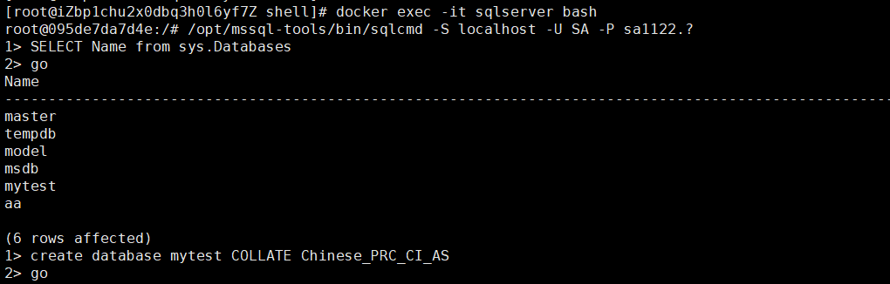
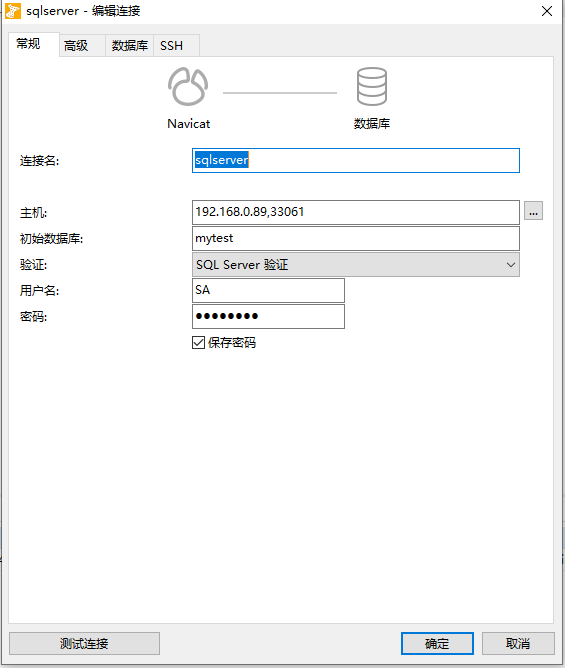
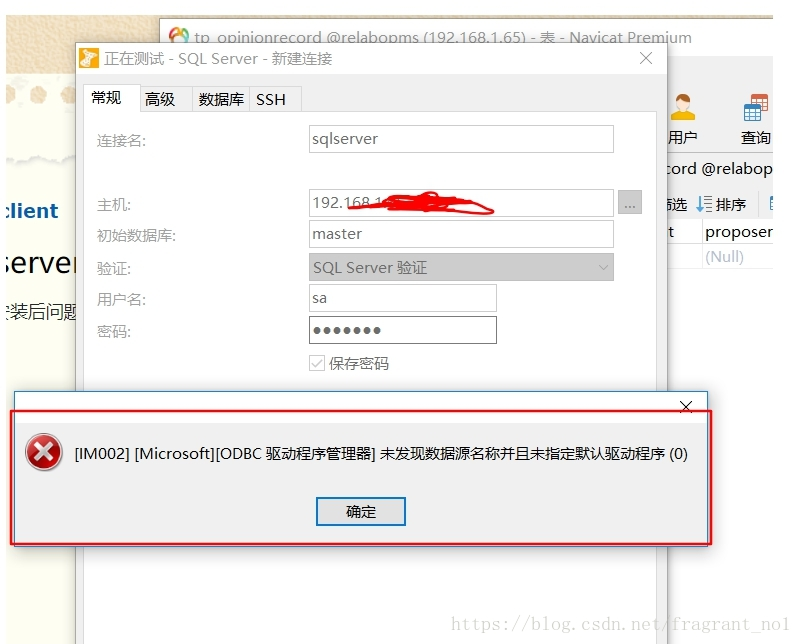
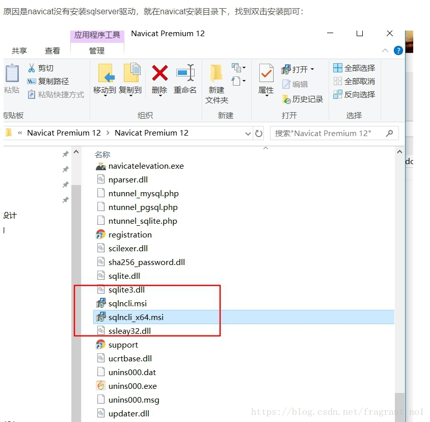

资料来源：<br/>
[docker 安装 sqlserver 数据库](https://www.cnblogs.com/linjiqin/p/11283184.html)

具备条件：

**1.服务器需要大于2G内存。如果不够则可能无法正常启动，查看日志报如下错误：**

```
This program requires a machine with at least 2000 megabytes of memory
```


**2、获取 sqlserver 镜像**

```
$ docker pull mcr.microsoft.com/mssql/server:2017-latest
```

镜像下载成功后，运行镜像

```
$ docker run -e 'ACCEPT_EULA=Y' -e 'SA_PASSWORD=sa1122.?' -p 33061:1433 -v /opt/data/sqlserver/:/var/opt/mssql/data/ --name sqlserver -d mcr.microsoft.com/mssql/server:2017-latest
```

查看日志

```
2019-03-27 09:25:02.28 spid7s      Converting database 'msdb' from version 862 to the current version 869.
2019-03-27 09:25:02.29 spid7s      Database 'msdb' running the upgrade step from version 862 to version 863.
2019-03-27 09:25:02.30 spid10s     Converting database 'model' from version 862 to the current version 869.
2019-03-27 09:25:02.30 spid10s     Database 'model' running the upgrade step from version 862 to version 863.
2019-03-27 09:25:02.43 spid10s     Database 'model' running the upgrade step from version 863 to version 864.
2019-03-27 09:25:02.43 spid7s      Database 'msdb' running the upgrade step from version 863 to version 864.
2019-03-27 09:25:02.45 spid10s     Database 'model' running the upgrade step from version 864 to version 865.
2019-03-27 09:25:02.46 spid7s      Database 'msdb' running the upgrade step from version 864 to version 865.
2019-03-27 09:25:02.46 spid10s     Database 'model' running the upgrade step from version 865 to version 866.
2019-03-27 09:25:02.47 spid7s      Database 'msdb' running the upgrade step from version 865 to version 866.
2019-03-27 09:25:02.48 spid10s     Database 'model' running the upgrade step from version 866 to version 867.
2019-03-27 09:25:02.49 spid7s      Database 'msdb' running the upgrade step from version 866 to version 867.
2019-03-27 09:25:02.50 spid10s     Database 'model' running the upgrade step from version 867 to version 868.
2019-03-27 09:25:02.51 spid7s      Database 'msdb' running the upgrade step from version 867 to version 868.
2019-03-27 09:25:02.52 spid10s     Database 'model' running the upgrade step from version 868 to version 869.
2019-03-27 09:25:02.52 spid7s      Database 'msdb' running the upgrade step from version 868 to version 869.
2019-03-27 09:25:02.65 spid10s     Polybase feature disabled.
2019-03-27 09:25:02.65 spid10s     Clearing tempdb database.
2019-03-27 09:25:03.07 spid10s     Starting up database 'tempdb'.
2019-03-27 09:25:03.33 spid10s     The tempdb database has 1 data file(s).
2019-03-27 09:25:03.33 spid22s     The Service Broker endpoint is in disabled or stopped state.
2019-03-27 09:25:03.33 spid22s     The Database Mirroring endpoint is in disabled or stopped state.
2019-03-27 09:25:03.35 spid22s     Service Broker manager has started.
2019-03-27 09:25:03.44 spid7s      Recovery is complete. This is an informational message only. No user action is required.
2019-03-27 09:25:03.47 spid24s     The default language (LCID 0) has been set for engine and full-text services.
```

**3、登录 sqlserver 容器**
```
docker exec -it sqlserver bash
```

**4、链接 sqlserver**
```
/opt/mssql-tools/bin/sqlcmd -S localhost -U SA -P password
eg、/opt/mssql-tools/bin/sqlcmd -S localhost -U SA -P sa1122.?
```

**5、执行命令**
```
SELECT Name from sys.Databases
GO
```
### 创建数据库
```
create database mytest COLLATE Chinese_PRC_CI_AS
```



## navicat 链接

连接配置方式如图：



有时候Navicat并没有初始化安装sqlncli, 所以连接的时候会报 没有默认驱动，如图：



**解决方法：在navicat目录下找到对应驱动，点击安装即可， 安装过程中设置为全部允许安装**

