资料来源：<br/>

[官方标配！吊炸天的Linux可视化管理工具，必须推荐给你](https://www.toutiao.com/article/7067569199320744482/?app=news_article&timestamp=1650380630&use_new_style=1&req_id=202204192303500101580310440513B0C8&group_id=7067569199320744482&wxshare_count=1&tt_from=weixin&utm_source=weixin&utm_medium=toutiao_android&utm_campaign=client_share&share_token=28858b91-92b4-4b88-b8ca-6fc124edb795) <br/>

## 开发者必备Linux命令

> 开发者必备Linux常用命令，掌握这些命令绝对够了，基于CenterOS7.6。

## 系统服务管理

### systemctl
- 输出系统中各个服务的状态：
```shell
systemctl list-units --type=service
```
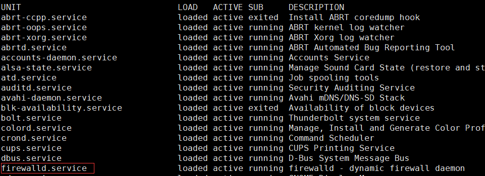
- 查看服务的运行状态：
```shell
systemctl status firewalld
```
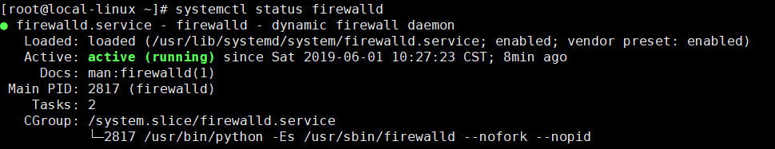
- 关闭服务：
```shell
systemctl stop firewalld
```
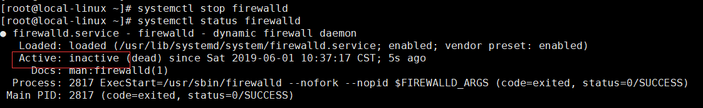
- 启动服务：
```shell
systemctl start firewalld
```
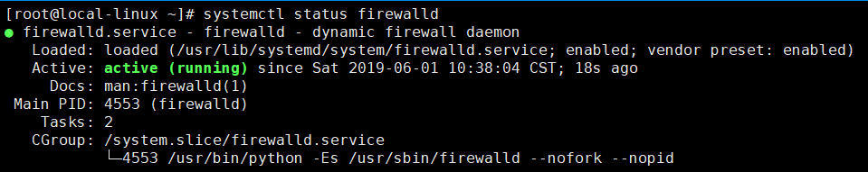
- 重新启动服务（不管当前服务是启动还是关闭）：
```shell
systemctl restart firewalld
```
- 重新载入配置信息而不中断服务：
```shell
systemctl reload firewalld
```
- 禁止服务开机自启动：
```shell
systemctl disable firewalld
```
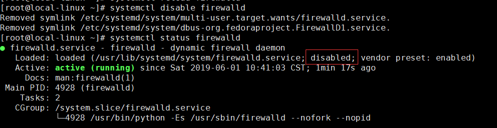
- 设置服务开机自启动：
```shell
systemctl enable firewalld
```
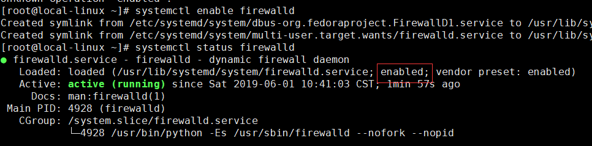

## 文件管理

### ls
列出当前目录(/)下的所有文件：
```shell
ls -l /
```
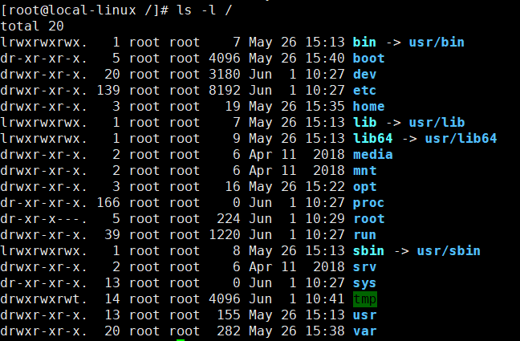

### pwd
获取目前所在工作目录的绝对路径


### cd
改变当前工作目录：
```shell
cd /usr/local
```

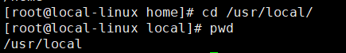

### date
显示或修改系统时间与日期；
```shell
date '+%Y-%m-%d %H:%M:%S'
```
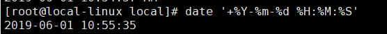

### passwd
用于设置用户密码：
```shell
passwd root
```

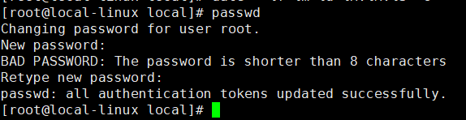

### su
改变用户身份（切换到超级用户）：
```shell
su -
```
### clear
用于清除屏幕信息

### man
显示指定命令的帮助信息：
```shell
man ls
```
### who
- 查询系统处于什么运行级别：
```shell
who -r
```
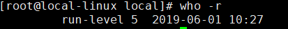
- 显示目前登录到系统的用户：
```shell
who -buT
```
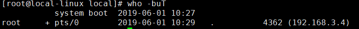

### free
显示系统内存状态（单位MB）：
```shell
free -m
```
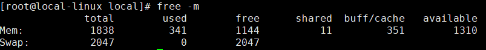

### ps
显示系统进程运行动态：
```shell
ps -ef
```
查看sshd进程的运行动态：
```shell
ps -ef | grep sshd
```
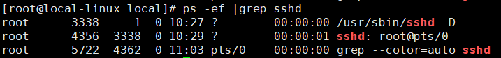

### top
查看即时活跃的进程，类似Windows的任务管理器

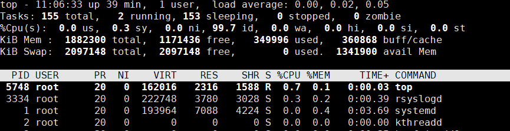

### mkdir
创建目录

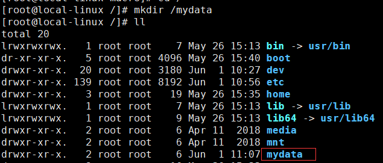

### more
用于文件过长时分页查看文件内容
每页10行查看boot.log文件
```shell
more -c -10 /var/log/boot.log
```
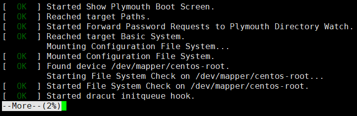

### cat
查看Linux启动日志文件文件，并标明行号：
```shell
cat -Ab /var/log/boot.log
```

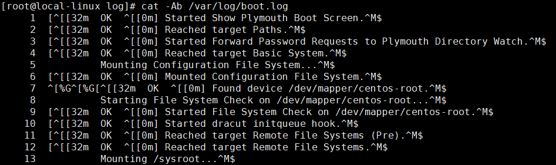

### touch
创建text.txt文件：
```shell
touch text.txt
```

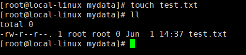

### rm
- 删除文件：
```shell
rm text.txt
```
- 强制删除某个目录及其子目录：
```shell
rm -rf testdir/
```

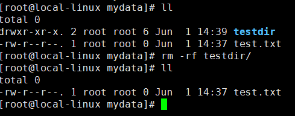

### cp
将test1目录复制到test2目录
```shell
cp -r /mydata/tes1 /mydata/test2
```
### mv
移动或覆盖文件：
```shell
mv text.txt text2.txt
```

## 压缩与解压

### tar
- 将/etc文件夹中的文件归档到文件etc.tar（并不会进行压缩）：
```shell
tar -cvf /mydata/etc.tar /etc
```
- 用gzip压缩文件夹/etc中的文件到文件etc.tar.gz：
```shell
tar -zcvf /mydata/etc.tar.gz /etc
```
- 用bzip2压缩文件夹/etc到文件/etc.tar.bz2：
```shell
tar -jcvf /mydata/etc.tar.bz2 /etc
```

- 分页查看压缩包中内容（gzip）：
```shell
tar -ztvf /mydata/etc.tar.gz |more -c -10
```
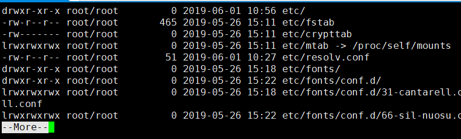
- 解压文件到当前目录（gzip）：
```shell
tar -zxvf /mydata/etc.tar.gz
```
- 解压文件到指定目录（gzip）：
```shell
tar -zxvf /mydata/etc.tar.gz -C /mydata/etc
```

## 磁盘和网络管理

### df
查看磁盘空间占用情况：
```shell
df -hT
```
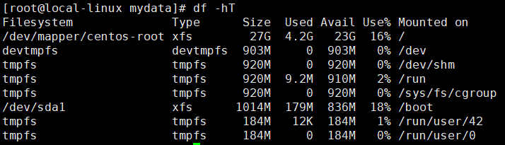

### dh
查看当前目录下的文件及文件夹所占大小：
```shell
du -h --max-depth=1 ./*
```
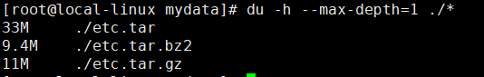

### ifconfig
显示当前网络接口状态

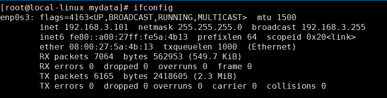

### netstat

- 查看当前路由信息：
```shell
netstat -rn
```
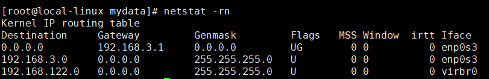

- 查看所有有效TCP连接：
```shell
netstat -an
```
- 查看系统中启动的监听服务：
```shell
netstat -tulnp
```
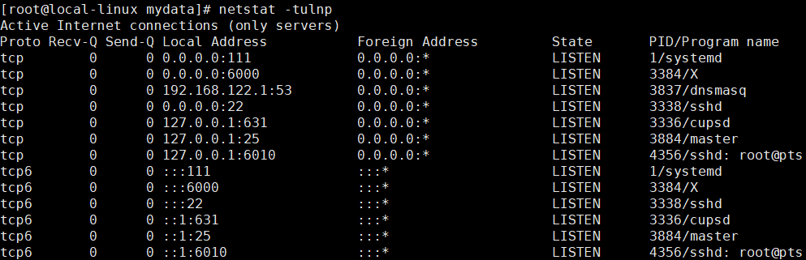

- 查看处于连接状态的系统资源信息：
```shell
netstat -atunp
```

### wget
从网络上下载文件

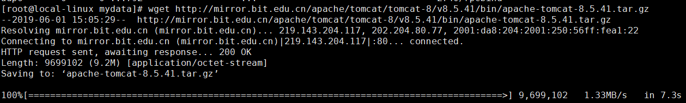

## 文件上传下载

### 安装上传下载工具

```bash
yum install -y lrzsz
```

### 上传文件

```bash
rz
```

### 下载文件

```bash
sz fileName
```

## 软件的安装与管理

### rpm

- 安装软件包：rpm -ivh nginx-1.12.2-2.el7.x86_64.rpm
- 模糊搜索软件包：rpm -qa | grep nginx
- 精确查找软件包：rpm -qa nginx
- 查询软件包的安装路径：rpm -ql nginx-1.12.2-2.el7.x86_64
- 查看软件包的概要信息：rpm -qi nginx-1.12.2-2.el7.x86_64
- 验证软件包内容和安装文件是否一致：rpm -V nginx-1.12.2-2.el7.x86_64
- 更新软件包：rpm -Uvh nginx-1.12.2-2.el7.x86_64
- 删除软件包：rpm -e nginx-1.12.2-2.el7.x86_64

### yum

- 安装软件包： yum install nginx
- 检查可以更新的软件包：yum check-update
- 更新指定的软件包：yum update nginx
- 在资源库中查找软件包信息：yum info nginx*
- 列出已经安装的所有软件包：yum info installed
- 列出软件包名称：yum list nginx*
- 模糊搜索软件包：yum search nginx


**centos更改镜像源**

使用CentOS 8的yum命令安装软件时经常会遇到无法下载的问题，切换到阿里云的镜像源即可解决，这里使用Centos-vault-8.5.2111.repo仓库配置；

~~~~shell
# 先将原BaseOS配置进行备份
mv /etc/yum.repos.d/CentOS-Linux-BaseOS.repo /etc/yum.repos.d/CentOS-Linux-BaseOS.repo.bak
# 再下载新配置
sudo wget -O /etc/yum.repos.d/CentOS-Linux-BaseOS.repo http://mirrors.aliyun.com/repo/Centos-vault-8.5.2111.repo
~~~~

- yum仓库配置文件在/etc/yum.repos.d目录下，再修改CentOS-Linux-AppStream.repo文件，直接拷贝CentOS-Linux-BaseOS中的appstream部分即可；

~~~~shell
[appstream]
name=CentOS-8.5.2111 - AppStream - mirrors.aliyun.com
baseurl=http://mirrors.aliyun.com/centos-vault/8.5.2111/AppStream/$basearch/os/
        http://mirrors.aliyuncs.com/centos-vault/8.5.2111/AppStream/$basearch/os/
        http://mirrors.cloud.aliyuncs.com/centos-vault/8.5.2111/AppStream/$basearch/os/
gpgcheck=0
gpgkey=http://mirrors.aliyun.com/centos/RPM-GPG-KEY-CentOS-Official
~~~~

- 运行如下命令清空缓存并生效；

~~~~shell
sudo yum clean all
sudo yum makecache
~~~~

- 接下来查询一个安装包信息测试下，发现已经可以正常使用了。

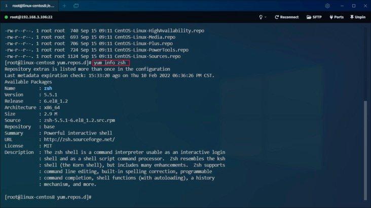