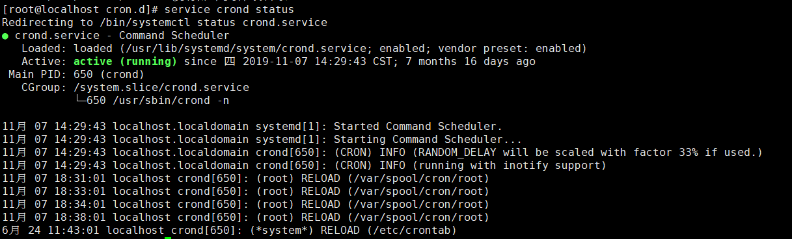
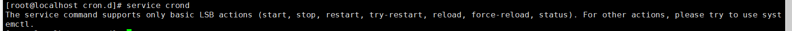
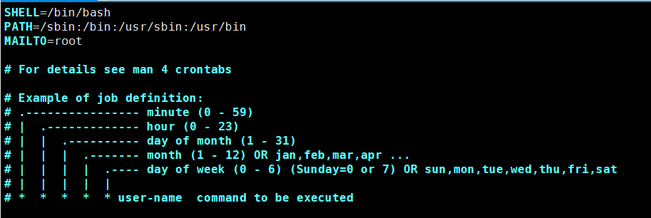
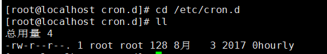
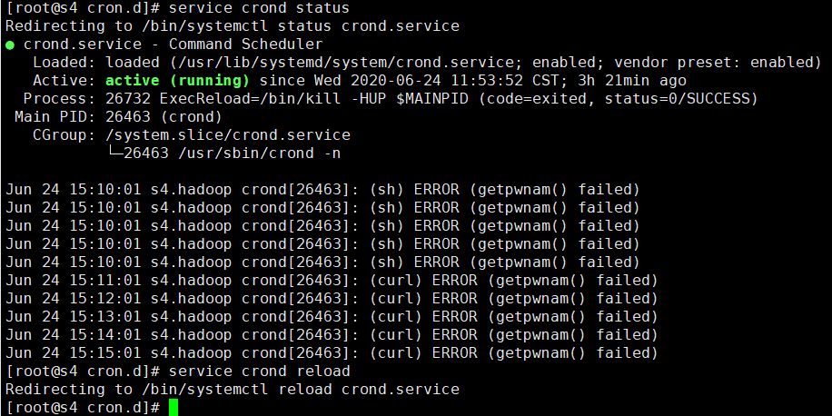
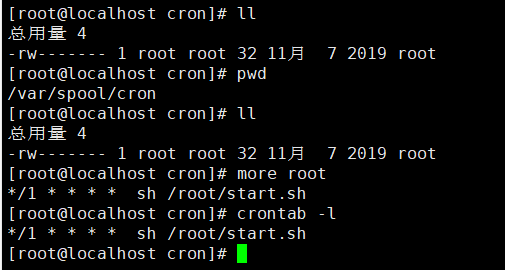

资料来源：<br/>
[Linux /etc/cron.d作用（转自 定时任务crontab cron.d）](https://www.cnblogs.com/hubavyn/p/4607094.html)


##  cornd 使用

查看服务是否启动 `cornd `启动

```
service crond status
```



重启 ，等相关操作




### 方法一 （不推荐）

一种方式是直接修改`/etc/crontab`



### 方法二

当我们要增加全局性的计划任务时，一种方式是直接修改`/etc/crontab`。但是，一般不建议这样做，`/etc/cron.d`目录就是为了解决这种问题而创建的。

**/etc/crontab** 这个文件负责安排由系统管理员制定的维护系统以及其他任务的`crontab`。

`/etc/cron.d`



例如，增加一项定时的备份任务，我们可以这样处理：在`/etc/cron.d`目录下新建文件`backup.sh`，内容如下：

```
# m h dom mon dow user command
* 1 * * * root /sbin/mon_zetc_logtar.sh
```

`cron`进程执行时，就会自动扫描该目录下的所有文件，按照文件中的时间设定执行后面的命令。

注意：　**需要进行重启服**



### 方法三

和方法二 对应着 文件目录` /var/spool/cron/＄{user}**`

其中　`user `指的是 ， 用户名 



也可以直接使用 crontab 命令

直接用crontab命令编辑

```
cron服务提供crontab命令来设定cron服务的，下面是这个命令的一些参数与说明：

crontab -u //设定某个用户的cron服务，一般root用户在执行这个命令的时候需要此参数

crontab -l //列出某个用户cron服务的详细内容

crontab -r //删除没个用户的cron服务

crontab -e //编辑某个用户的cron服务

比如说root查看自己的cron设置：crontab -u root -l

再例如，root想删除fred的cron设置：crontab -u fred -r

在编辑cron服务时，编辑的内容有一些格式和约定，输入：crontab -u root -e

进入vi编辑模式，编辑的内容一定要符合下面的格式：/1 * ls >> /tmp/ls.txt
```

##  查看日志

看 `/var/log/cron.log`这个文件就可以，可以用`tail -f /var/log/cron.log`观察

##  Cronntab 表达式

### 时间控制介绍


用户所建立的crontab文件中，每一行都代表一项任务，每行的每个字段代表一项设置，它的格式共分为六个字段，前五段是时间设定段，第六段是要执行的命令段，格式如下：

```
minute  hour  day  month  week  command

其中：

minute： 表示分钟，可以是从0到59之间的任何整数。

hour：表示小时，可以是从0到23之间的任何整数。

day：表示日期，可以是从1到31之间的任何整数。

month：表示月份，可以是从1到12之间的任何整数。

week：表示星期几，可以是从0到7之间的任何整数，这里的0或7代表星期日。

command：要执行的命令，可以是系统命令，也可以是自己编写的脚本文件。
在以上各个字段中，还可以使用以下特殊字符：
星号（*）：代表所有可能的值，例如month字段如果是星号，则表示在满足其它字段的制约条件后每月都执行该命令操作。
逗号（,）：可以用逗号隔开的值指定一个列表范围，例如，“1,2,5,7,8,9”
中杠（-）：可以用整数之间的中杠表示一个整数范围，例如“2-6”表示“2,3,4,5,6”
正斜线（/）：可以用正斜线指定时间的间隔频率，例如“0-23/2”表示每两小时执行一次。同时正斜线可以和星号一起使用，例如*/10，如果用在minute字段，表示每十分钟执行一次。
```

###  使用的实例

```
实例1：每1分钟执行一次command
命令：
* * * * * command
 
实例2：每小时的第3和第15分钟执行
命令：
3,15 * * * * command
 
实例3：在上午8点到11点的第3和第15分钟执行
命令：
3,15 8-11 * * * command
 
实例4：每隔两天的上午8点到11点的第3和第15分钟执行
命令：
3,15 8-11 */2 * * command
 
实例5：每个星期一的上午8点到11点的第3和第15分钟执行
命令：
3,15 8-11 * * 1 command
 
实例6：每晚的21:30重启smb 
命令：
30 21 * * * /etc/init.d/smb restart
 
实例7：每月1、10、22日的4 : 45重启smb 
命令：
45 4 1,10,22 * * /etc/init.d/smb restart
 
实例8：每周六、周日的1 : 10重启smb
命令：
10 1 * * 6,0 /etc/init.d/smb restart
 
实例9：每天18 : 00至23 : 00之间每隔30分钟重启smb 
命令：
0,30 18-23 * * * /etc/init.d/smb restart
 
实例10：每星期六的晚上11 : 00 pm重启smb 
命令：
0 23 * * 6 /etc/init.d/smb restart
 
实例11：每一小时重启smb 
命令：
* */1 * * * /etc/init.d/smb restart
 
实例12：晚上11点到早上7点之间，每隔一小时重启smb 
命令：
* 23-7/1 * * * /etc/init.d/smb restart
 
实例13：每月的4号与每周一到周三的11点重启smb 
命令：
0 11 4 * mon-wed /etc/init.d/smb restart
 
实例14：一月一号的4点重启smb 
命令：
0 4 1 jan * /etc/init.d/smb restart
 
实例15：每小时执行/etc/cron.hourly目录内的脚本
命令：
01   *   *   *   *     root run-parts /etc/cron.hourly
说明：
run-parts这个参数了，如果去掉这个参数的话，后面就可以写要运行的某个脚本名，而不是目录名了
```

## 常用的命令

打印一句话

```
echo hello
```

打印时间

```
echo $(date "+%Y%m%d%H%M")
```

可以查看具体的时间相关的内容

 ```
date –help
 ```

写入到文件中

```
echo hello >> /root/dbbak/mongoBackLogger.txt
```

最终整理的脚本

```
echo start backup mongo >> /root/dbbak/mongoBackLogger.txt

echo start time is :$(date "+%Y-%m-%d %H:%M:%S") >> /root/dbbak/mongoBackLogger.txt

echo the backup path /root/dbbak/$(date "+%Y%m")/$(date "+%d")/$(date "+%H%M") >>/mongoBackLogger.txt

mongodump --port=27017 --username=ucityadmin --password=ucity2020 --authenticationDatabase=admin --db=main --out=/root/dbbak/$(date "+%Y%m")/$(date "+%d")/$(date "+%H%M")

echo finish time is :$(date "+%Y-%m-%d %H:%M:%S") >> /root/dbbak/mongoBackLogger.txt

echo ------------------------------------- >> /root/dbbak/mongoBackLogger.txt

echo  >> /root/dbbak/mongoBackLogger.txt

echo  >> /root/dbbak/mongoBackLogger.txt
```

表达式 ： 9 点 - 22 点 每隔一小时  进行一次备份

```
* 9-22/1 * * * sh /root/dbbak/cron_backup_db.sh
```


 

