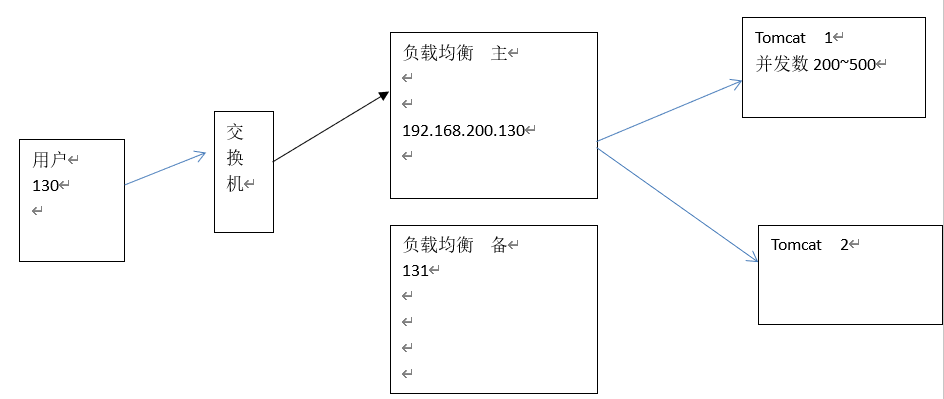
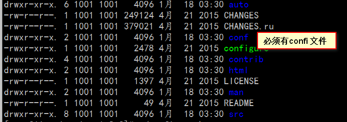
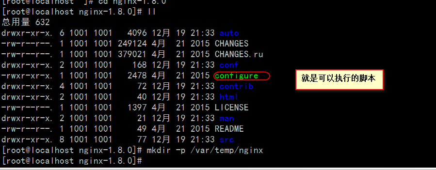
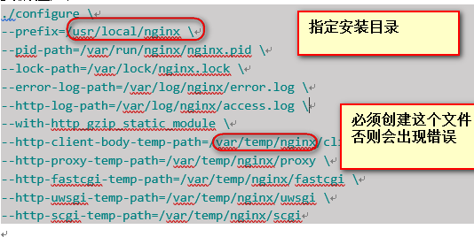
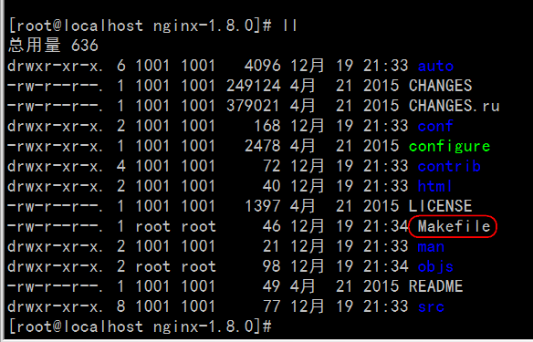
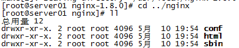
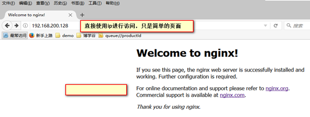
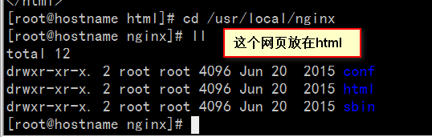

## NGINX 介绍

**Nginx**（发音同 engine x）是一款轻量级的[Web](http://baike.baidu.com/view/3912.htm) 服务器/反向代理服务器及电子邮件（IMAP/POP3）代理服务器，并在一个BSD-like 协议下发行。由俄罗斯的程序设计师Igor Sysoev(伊戈尔·西索夫)所开发，供俄国大型的入口网站及搜索引擎Rambler(漫步者)（俄文：Рамблер）使用。其特点是占有[内存](http://baike.baidu.com/view/1082.htm)少，[并发](http://baike.baidu.com/view/684757.htm)能力强，事实上nginx的并发能力确实在同类型的网页服务器中表现较好，中国大陆使用nginx网站用户有：[新浪](http://baike.baidu.com/view/2410.htm)、[网易](http://baike.baidu.com/view/6043.htm)、 [腾讯](http://baike.baidu.com/view/1591.htm)等。

优点：

> 1:可运行linux,并有 [Windows](http://baike.baidu.com/view/4821.htm) 移植版。
>
> 2:在高连接并发的情况下，Nginx是Apache服务器不错的替代品Nginx在[美国](http://baike.baidu.com/view/2398.htm)是做虚拟主机生意的老板们经常选择的软件平台之一。能够支持高达 50,000 个并发连接数的响应

 

- 常用的负载均衡



1）一种是通过硬件来进行解决，常见的硬件有NetScaler、F5、Radware和Array等商用的负载均衡器，但是它们是比较昂贵的

2）一种是通过软件来进行解决的，常见的软件有LVS、Nginx、apache等,它们是基于Linux系统并且开源的负载均衡策略.

优点

> 1、 转发功能
>
> 2、 故障移除
>
> 3、 恢复添加
>
> 4、 备机  高可用 HA（高可抗） 抗压能力

##   nginx 安装

​     nginx不仅支持http协议，还支持https（即在ssl协议上传输http），所以需要在linux安装openssl库。

```shell
yum install -y openssl openssl-devel
```

总结

总共安装四个依赖；

```shell
yum –y install gcc-c++
yum install -y pcre pcre-devel
yum install -y zlib zlib-devel
yum install -y openssl openssl-devel
```

**自己部署结果**

```shell
 yum install -y pcre
 yum install -y openssl
 yum install -y zlib 
 yum install -y  zlib-devel
 yum install -y wget
```

或者使用

```
yum -y install gcc zlib zlib-devel pcre-devel openssl openssl-devel
```

**下载**

```shell
wget http://nginx.org/download/nginx-1.16.0.tar.gz
http://nginx.org/download/nginx-1.1.18.tar.gz
```


**解压：**

```shell
tar -zxvf nginx-1.8.0.tar.gz
cd nginx-1.8.0
```

​                               

 

1、 configure

./configure --help查询详细参数（参考本教程附录部分：nginx编译参数）

 

**注意：上边将临时文件目录指定为/var/temp/nginx，需要在/var**下创建temp**及nginx**目录**

```shell
mkdir -p /var/temp/
mv nginx-1.8.0 /var/temp/
cd /var/temp/
mv nginx-1.8.0/ nginx
cd /var/temp/nginx
```






切换到nginx 目录下直接执行：

参数设置如下：

```shell
./configure \
--prefix=/usr/local/nginx \
--pid-path=/var/run/nginx/nginx.pid \
--lock-path=/var/lock/nginx.lock \
--error-log-path=/var/log/nginx/error.log \
--http-log-path=/var/log/nginx/access.log \
--with-http_gzip_static_module \
--http-client-body-temp-path=/var/temp/nginx/client \
--http-proxy-temp-path=/var/temp/nginx/proxy \
--http-fastcgi-temp-path=/var/temp/nginx/fastcgi \
--http-uwsgi-temp-path=/var/temp/nginx/uwsgi \
--http-scgi-temp-path=/var/temp/nginx/scgi
```

  一种配置 （我增加的一种配置）

包括`ipv6 steam` 支持

```shell
./configure \
--prefix=/usr/local/nginx \
--pid-path=/var/run/nginx/nginx.pid \
--lock-path=/var/lock/nginx.lock \
--error-log-path=/var/log/nginx/error.log \
--http-log-path=/var/log/nginx/access.log \
--with-http_gzip_static_module \
--http-client-body-temp-path=/var/temp/nginx/client \
--http-proxy-temp-path=/var/temp/nginx/proxy \
--http-fastcgi-temp-path=/var/temp/nginx/fastcgi \
--http-uwsgi-temp-path=/var/temp/nginx/uwsgi \
--http-scgi-temp-path=/var/temp/nginx/scgi \
--with-file-aio --with-threads --with-http_addition_module --with-http_auth_request_module --with-http_dav_module --with-http_flv_module --with-http_gunzip_module --with-http_gzip_static_module --with-http_mp4_module --with-http_random_index_module --with-http_realip_module --with-http_secure_link_module --with-http_slice_module --with-http_ssl_module --with-http_stub_status_module --with-http_sub_module --with-http_v2_module --with-mail --with-mail_ssl_module --with-stream --with-stream_realip_module --with-stream_ssl_module --with-stream_ssl_preread_module --with-cc-opt='-O2 -g -pipe -Wall -Wp,-D_FORTIFY_SOURCE=2 -fexceptions -fstack-protector-strong --param=ssp-buffer-size=4 -grecord-gcc-switches -m64 -mtune=generic -fPIC' --with-ld-opt='-Wl,-z,relro -Wl,-z,now -pie'  --with-ipv6
```

###  编译安装

执行make 命令必须有makefile 这个文件



```shell
make
make install
```

安装成功查看安装目录 ：

从目录上看和tomcat特别的像

比如：` tomcat bin` 目录。在`nginx `中叫做`sbin `




 

### 启动nginx

```shell
cd /usr/local/nginx/sbin/
./nginx 
```

查询nginx进程：

​                               

15098是nginx主进程的进程id，15099是nginx工作进程的进程id

 

**注意：执行./nginx**启动nginx**，这里可以-c**指定加载的nginx**配置文件，如下：**

```
./nginx -c /usr/local/nginx/conf/nginx.conf
```

**如果不指定-c，nginx**在启动时默认加载conf/nginx.conf文件，此文件的地址也可以在编译安装nginx时指定./configure的参数（--conf-path= 指向配置文件（nginx.conf））

 

###   停止nginx

- 快速停止：

```
cd /usr/local/nginx/sbin

./nginx -s stop
```

此方式相当于先查出nginx进程id再使用kill命令强制杀掉进程。

- 完整停止(建议使用)：

```
cd /usr/local/nginx/sbin
./nginx -s quit
```

此方式停止步骤是待nginx进程处理任务完毕进行停止。

###   重启nginx

方式1，先停止再启动（建议使用）：

对nginx进行重启相当于先停止nginx再启动nginx，即先执行停止命令再执行启动命令。

如下：

```shell
./nginx -s reload
```

方式2，重新加载配置文件：

当nginx的配置文件nginx.conf修改后，要想让配置生效需要重启nginx，使用-s reload不用先停止nginx再启动nginx即可将配置信息在nginx中生效，如下：

```shell
./nginx -s reload
```

###  安装测试

nginx安装成功，启动nginx，即可访问虚拟机上的nginx：







 ## yum方式安装

添加CentOS 7 Nginx yum资源库,打开终端,使用以下命令:

```shell
sudo rpm -Uvh http://nginx.org/packages/centos/7/noarch/RPMS/nginx-release-centos-7-0.el7.ngx.noarch.rpm
```

在你的CentOS 7 服务器中使用`yum`命令从Nginx源服务器中获取来安装Nginx：

```shell
sudo yum install -y nginx
```

Nginx将完成安装在你的CentOS 7 服务器中。

刚安装的Nginx不会自行启动。运行Nginx:

```
sudo systemctl start nginx.service
```

如果一切进展顺利的话，现在你可以通过你的域名或IP来访问你的Web页面来预览一下Nginx的默认页面；

​                               

如果看到这个页面,那么说明你的CentOS 7 中 web服务器已经正确安装。

开机启动

```shell
sudo systemctl enable nginx.service
```

- 网站文件存放默认目录

```shell
/usr/share/nginx/html
```

- 网站默认站点配置

```shell
/etc/nginx/conf.d/default.conf
```

-  自定义Nginx站点配置文件存放目录

```shell
/etc/nginx/conf.d/
```
- Nginx全局配置
```shell
/etc/nginx/nginx.conf
```
- Nginx启动
```shell
nginx -c nginx.conf

```
-  在这里你可以改变设置用户运行Nginx守护程序进程一样,和工作进程的数量得到了Nginx正在运行,等等。
-  Nginx 日志所在的目录
```shell
cd /var/log/nginx/
```