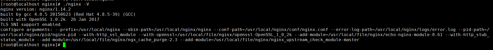
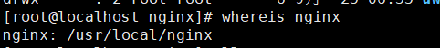
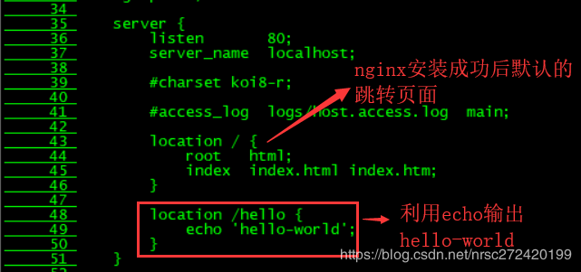
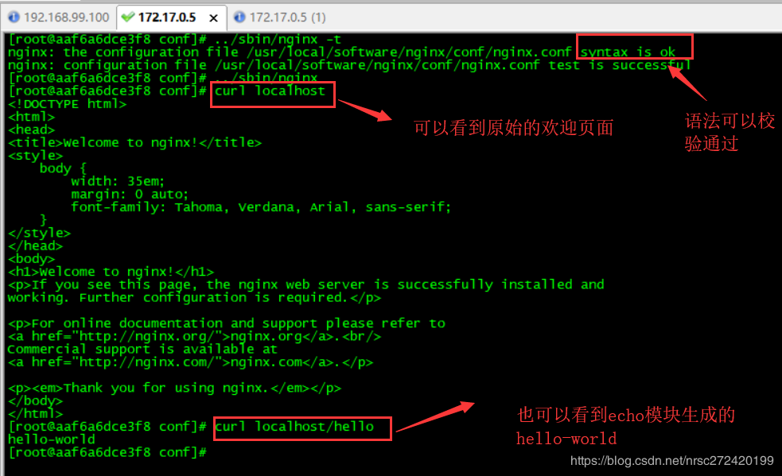
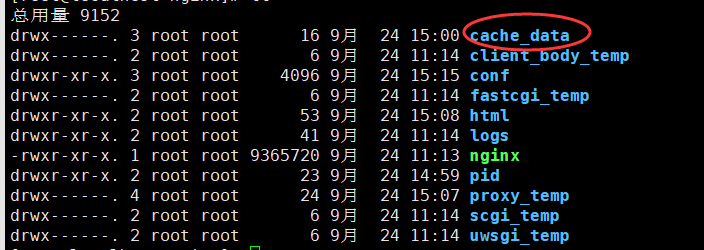
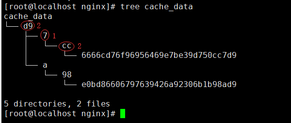
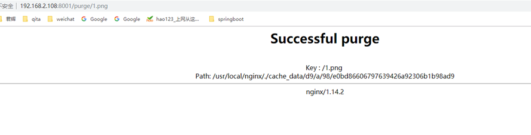
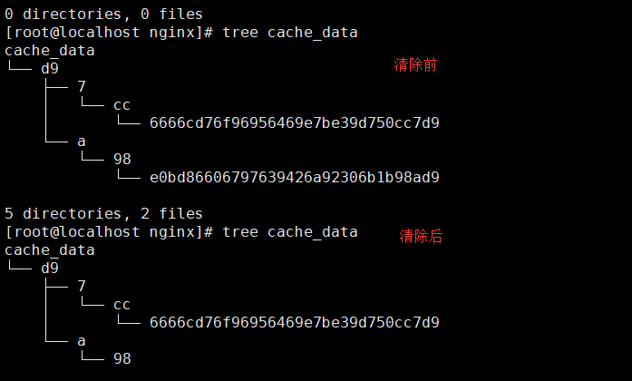

## nginx 插件

### 介绍

在当前默认输入下面命令，就可以看到对应的帮助文档

```sehll
./configure --help
```

这里列出几个常用的选项

```shell
--prefix= #指向安装目录
--sbin-path #指向（执行）程序文件（nginx）
--conf-path= #指向配置文件（nginx.conf）
--error-log-path= #指向错误日志目录
--pid-path= #指向 pid 文件（nginx.pid）
--lock-path= #指向 lock 文件（nginx.lock）（安装文件锁定，防止安装文件被别人利用，或自己误操作。）
--user= #指定程序运行时的非特权用户
--group= #指定程序运行时的非特权用户组
--builddir= #指向编译目录
--without-xxx #禁用默认编译启用的xxx模块
--with-yyy #启用默认不启用的yyy模块
```

--without/--with命令，它好比我们的maven资源管理，在父项目的pom中<dependencyManagement>定义好了依赖的资源，子项目如果需要使用通过<dependency>引用即可。

操作示例

```shell
sudo ./configure \
--prefix=/usr/local/nginx \
   --sbin-path=/usr/local/nginx/nginx \
   --conf-path=/usr/local/nginx/conf/nginx.conf \
   --error-log-path=/usr/local/nginx/logs/error.log \
   --pid-path=/usr/local/nginx/pid/nginx.pid \
   --with-http_ssl_module \
   --with-openssl=/home/wesley/openssl-OpenSSL_1_0_2k #使用前面下载的openssl的解压目录
```

configure命令做了大量的“幕后”工作，包括检测操作系统内核和已经安装的软件，参数的解析，中间目录的生成以及根据各种参数生成一些C源码文件、Makefile文件等。

#### 执行编译

```
sudo make
```

make命令根据configure命令生成的Makefile文件编译Nginx工程，并生成目标文件、最终的二进制文件。

#### 安装

```
sudo make install
```

make install命令根据configure执行时的参数将Nginx部署到指定的安装目录，包括相关目录的建立和二进制文件、配置文件的复制。

#### 查看安装编译的参数

`/usr/local/software/nginx/sbin/nginx -V`

注意真实文件路径

​                               

查看 安装的路径

`whereis nginx`

 

##  openssl

Nginx需要通过openssl源码库来进行安装ssl协议，下载openssl源码，并解压

```
wget https://github.com/openssl/openssl/archive/OpenSSL_1_0_2k.tar.gz                          # 下载openssl
tar -xzvf OpenSSL_1_0_2k.tar.gz # 解压openssl
```

编译中使用：

  `--with-openssl=/home/wesley/openssl-OpenSSL_1_0_2k \`

红色部分表示 文件的路径 根据实际情况 进行修改（后面不再介绍）

###  echo模块的安装

资料来源：  https://blog.csdn.net/nrsc272420199/article/details/89323868

 ```
wget https://github.com/openresty/echo-nginx-module/archive/v0.61.tar.gz
tar -zxf v0.61.tar.gz
 ```

含有echo的server配置如下:
 

验证效果如下:



###  缓存模块

```shell
wget https://github.com/FRiCKLE/ngx_cache_purge/archive/2.3.tar.gz
mv 2.3.tar.gz ngx_cache_purge-2.3.tar.gz
tar -xvzf ngx_cache_purge-2.3.tar.gz

sudo rm -rf /usr/local/nginx
cd /usr/local/nginx-1.16.0
sudo ./configure \
	--prefix=/usr/local/nginx \
    --sbin-path=/usr/local/nginx/nginx \
    --conf-path=/usr/local/nginx/conf/nginx.conf \
    --error-log-path=/usr/local/nginx/logs/error.log \
    --pid-path=/usr/local/nginx/pid/nginx.pid \
    --with-http_ssl_module \
    --with-openssl=/home/wesley/openssl-OpenSSL_1_0_2k \
    --add-module=/home/wesley/echo-nginx-module-0.61 \
    --with-http_stub_status_module \
    --add-module=/home/wesley/ngx_cache_purge-2.3
    
sudo make
sudo make install
```

配置缓存

```shell
proxy_cache_path  /app/proxy_cache_dir  levels=1:2 keys_zone=cache1:200m inactive=1d max_size=10g;
#设置Web缓存区名称为cache1，内存缓存空间大小为200MB，1天没有被访问的内容自动清除，硬盘缓存空间大小为30GB。levels=1:2 表示缓存目录的第一级目录是1个字符，第二级目录是2个字符，即/app/proxy_cache_dir/cache1/a/1b这种形式
server {
        listen       80;
        server_name  localhost;

        #charset koi8-r;

        #access_log  logs/host.access.log  main;

        location / {
            root   html;
            index  index.html index.htm;
        }
        location ~ /purge(/.*) {
            allow           127.0.0.1;
            allow           192.168.116.0/24
            deny            all;
            proxy_cache_purge    cache1 $host$1$is_args$args;
        }
        location ~ \.(gif|jpg|jpeg|png|bmp|ico)$ {
            proxy_set_header Host  $host;
            proxy_set_header X-Forwarded-For  $remote_addr;
            proxy_pass http://127.0.0.1:8080;
            proxy_cache cache1; # 设置资源缓存的zone
            # 设置缓存的key，以域名、URI、参数组合成Web缓存的Key值，
            # Nginx根据Key值哈希，存储缓存内容到二级缓存目录内
            proxy_cache_key $host$uri$is_args$args; 
            proxy_cache_valid 200 304 12h;  # 对不同的HTTP状态码设置不同的缓存时间
            expires 7d; # 缓存时间
        }
}

```

启动nginx，查看进程，发现新增了两个进程

#### 验证缓存清除功能

**访问缓存****URL**

http://hostname/test/n.jpg

**查看缓存的文件**

**修改数据**

不清除缓存访问，不发生变化，走的缓存

http://hostname/test/n.jpg

清除缓存再次访问，发生变化，缓存已清空

http://hostname/purge/test/n.jpg

http://hostname/test/n.jpg

 编译命令

```shell
./configure \
	--prefix=/usr/local/nginx \
    --sbin-path=/usr/local/nginx/nginx \
    --conf-path=/usr/local/nginx/conf/nginx.conf \
    --error-log-path=/usr/local/nginx/logs/error.log \
    --pid-path=/usr/local/nginx/pid/nginx.pid \
    --with-http_ssl_module \
    --with-openssl=/usr/local/file/nginx/openssl-OpenSSL_1_0_2k\
    --add-module=/usr/local/file/nginx/echo-nginx-module-0.61\
    --with-http_stub_status_module \
    --add-module=/usr/local/file/nginx/ngx_cache_purge-2.3

```

### 动态更新插件

首先安装 nginx 动态 upstream 配置模块[ngx_http_dyups_module](https://github.com/yzprofile/ngx_http_dyups_module)。

```shell
cd ~
wget https://github.com/yzprofile/ngx_http_dyups_module/archive/v0.2.9.tar.gz \
-O ngx_http_dyups_module-0.2.9.tar.gz
tar -xvzf ngx_http_dyups_module-0.2.9.tar.gz

cd /usr/local/nginx-1.4.7
sudo ./configure \
    --prefix=/usr/local/nginx1.5 \
    --sbin-path=/usr/local/nginx1.5/nginx \
    --conf-path=/usr/local/nginx1.5/conf/nginx.conf \
    --error-log-path=/usr/local/nginx1.5/logs/error.log \
    --pid-path=/usr/local/nginx1.5/pid/nginx.pid \
    --add-module=/home/wesley/echo-nginx-module-0.61 \
    --with-http_stub_status_module \
    --add-module=/home/wesley/nginx_upstream_check_module-master \
    --add-module=/home/wesley/ngx_http_dyups_module-0.2.9

sudo make
sudo make install

```

官方文档的安装方法

- Only install dyups module

```shell
$ git clone git://github.com/yzprofile/ngx_http_dyups_module.git

# to compile as a static module
$ ./configure --add-module=./ngx_http_dyups_module

# to compile as a dynamic module
$ ./configure --add-dynamic-module=./ngx_http_dyups_module
```

可以使用 ，下面的命令 进行增加 模块

```shell
./configure --add-dynamic-module=./ngx_http_dyups_module
```

### Nginx 健康检查插件

Github 上 插件的地址： https://github.com/yaoweibin/nginx_upstream_check_module


需要进行 进行 patch 不同的包

```shell
cd ~
wget https://github.com/yaoweibin/nginx_upstream_check_module/archive/master.zip \
-O nginx_upstream_check_module-master.zip
unzip nginx_upstream_check_module-master.zip

cd /usr/local/nginx-1.4.7
# 补丁包
sudo patch -p1 < /home/wesley/nginx_upstream_check_module-master/check_1.2.6+.patch

sudo ./configure \
    --prefix=/usr/local/nginx1.4 \
    --sbin-path=/usr/local/nginx1.4/nginx \
    --conf-path=/usr/local/nginx1.4/conf/nginx.conf \
    --error-log-path=/usr/local/nginx1.4/logs/error.log \
    --pid-path=/usr/local/nginx1.4/pid/nginx.pid \
    --add-module=/home/wesley/echo-nginx-module-0.61 \
    --with-http_stub_status_module \
    --add-module=/home/wesley/nginx_upstream_check_module-master
    
sudo make
sudo make install

```

 注意： 需要 补丁包

在编译目录下执行

```shell
[root@localhost nginx-1.14.2]# sudo patch -p1 < /usr/local/file/nginx/nginx_upstream_check_module-master/check_1.14.0+.patch
patching file src/http/modules/ngx_http_upstream_hash_module.c
patching file src/http/modules/ngx_http_upstream_ip_hash_module.c
patching file src/http/modules/ngx_http_upstream_least_conn_module.c
patching file src/http/ngx_http_upstream_round_robin.c
patching file src/http/ngx_http_upstream_round_robin.h
```

**执行** **编译**

````
./configure \
	--prefix=/usr/local/nginx \
    --sbin-path=/usr/local/nginx/nginx \
    --conf-path=/usr/local/nginx/conf/nginx.conf \
    --error-log-path=/usr/local/nginx/logs/error.log \
    --pid-path=/usr/local/nginx/pid/nginx.pid \
    --with-http_ssl_module \
    --with-openssl=/usr/local/file/nginx/openssl-OpenSSL_1_0_2k\
    --add-module=/usr/local/file/nginx/echo-nginx-module-0.61\
    --with-http_stub_status_module \
    --add-module=/usr/local/file/nginx/ngx_cache_purge-2.3 \
	--add-module=/usr/local/file/nginx/nginx_upstream_check_module-master

make
make install
````

向代理缓存

```
# 代理缓存配置 - 定义配置
proxy_cache_path "./cache_data/" levels=2:1:2 keys_zone=hot_information_cache:256m inactive=1d max_size=1000g;  
 
server {
	# 监听8001端口
	listen	8001;
	location / {
		# 开启缓存
		proxy_cache hot_information_cache;
		# 缓存JAVA应用返回的指定状态的数据，缓存时间时1天       
		proxy_cache_valid 200 206 304 301 302 1d;
		# 请求的url就是缓存的key（根据实际业务场景匹配）       
		proxy_cache_key $uri$is_args$args;      
		
		# 设置传递给上游服务的请求头，Host为客户端host，默认为$proxy_host
		proxy_set_header Host $http_host;
		# 如果缓存中没找到，再去请求后端服务器
		proxy_pass http://web_servers;
		
	}
	
	# 该指令在商业版本Nginx Plus支持，可以通过第三方模块ngx_cache_purge来替代
	# 资源有变化的时候清除缓存
	location ~ /purge(/.*) {
		#设置只允许指定的IP来清除缓存
		allow all;
		# allow 127.0.0.1;
		# deny all ;
		proxy_cache_purge hot_information_cache $1;
	}
}
# JAVA服务器集群
upstream web_servers {
	server 127.0.0.1:80;	
}
```

```
proxy_cache_path "./cache_data/" levels=2:1:2 keys_zone=hot_information_cache:256m inactive=1d max_size=1000g;  
```

`proxy_cache_path "./cache_data/"` 表示 缓存文件的路径

值得是： 把缓存放到这文件夹 中



2:1:1 表示的是 文件夹的结构



上面的配置采用的方向代理的方式

 

**清除缓存**


```
location ~ /purge([[刘1\]](#_msocom_1) /.*) {
```


> 配置中 路径中增加了 /purge 进行清除缓存
>
> 比如 源文件  地址 http://192.168.2.108/1.png
>
> 缓存文件 地址：  http://192.168.2.108:8001/1.png
>
> 这样清除 缓存文件地址： [http://192.168.2.108:8001/ purge /1.png](http://192.168.2.108:8001/ /1.png)


访问后的界面

​                               

缓存清除 前后的变化



 

#### 代理本地的服务 + 缓存

```shell
# 代理缓存配置 - 定义配置
proxy_cache_path "./cache_data/" levels=2:1:2 keys_zone=hot_information_cache:256m inactive=1d max_size=1000g;  
 
server {
	# 监听8001端口
	listen	8001;
	location / {
		# 开启缓存
		proxy_cache hot_information_cache;
		# 缓存JAVA应用返回的指定状态的数据，缓存时间时1天       
		proxy_cache_valid 200 206 304 301 302 1d;
		# 请求的url就是缓存的key（根据实际业务场景匹配）       
		proxy_cache_key $uri$is_args$args;      
		
		# 设置传递给上游服务的请求头，Host为客户端host，默认为$proxy_host
		proxy_set_header Host $http_host;
		# 如果缓存中没找到，再去请求后端服务器
		
		#设置成本地的服务
		root   html;
		index  index.html index.htm;
	}
	
	# 该指令在商业版本Nginx Plus支持，可以通过第三方模块ngx_cache_purge来替代
	# 资源有变化的时候清除缓存
	location ~ /purge(/.*) {
		#设置只允许指定的IP来清除缓存
		allow all;
		# allow 127.0.0.1;
		# deny all ;
		proxy_cache_purge hot_information_cache $1;
	}
}
```

### Nginx 健康检查

配置文件

```
# 设置与后端服务器建立连接的超时时间，一般不可能大于75秒
#proxy_connect_timeout 60s;
#proxy_read_timeout 1s;
#proxy_send_timeout 5s;

# 故障转移
#proxy_next_upstream error timeout;
#proxy_next_upstream_timeout 3s;
#proxy_next_upstream_tries 1;

upstream backend {
	# 被动健康检查
	server 127.0.0.1:8080 weight=1 max_fails=2 fail_timeout=10s;
	server 127.0.0.1:8081 weight=1 max_fails=2 fail_timeout=10s;

	#check interval=5000 rise=1 fall=3 timeout=4000;

	#check interval=3000 rise=2 fall=5 timeout=1000 type=ssl_hello;

	check interval=3000 rise=2 fall=5 timeout=1000 type=http;
	check_http_send "HEAD / HTTP/1.0\r\n\r\n";
	check_http_expect_alive http_2xx http_3xx;
}

# server在http的上下文中 
server {
	listen 80;

	# location在server上下文中
	location / {
		proxy_pass http://backend;
	}


	location /status {
		check_status;
		access_log off;
		allow all;
		#deny all;
   }
   
     # cookie ip ... setting
   	  proxy_set_header Host $host;
      proxy_set_header X-Real-IP $remote_addr;
      proxy_set_header X-Forwarded-For $proxy_add_x_forwarded_for;

	  add_header                  Set-Cookie "HttpOnly";
	  add_header                  Set-Cookie "Secure";
	  add_header                  X-Frame-Options "SAMEORIGIN";
}
```

官方 文档上

简单配置文件

```shell
# 简单指令以;结尾
worker_processes  1;

# 大括号属于块指令
events {
    worker_connections  1024;
}

# http属于主上下文
http {
    include       mime.types;
    default_type  text/html;

    sendfile        on;

    keepalive_timeout  65;

    # 设置与后端服务器建立连接的超时时间，一般不可能大于75秒
    #proxy_connect_timeout 60s;
    #proxy_read_timeout 1s;
    #proxy_send_timeout 5s;

    # 故障转移
    #proxy_next_upstream error timeout;
    #proxy_next_upstream_timeout 3s;
    #proxy_next_upstream_tries 1;

    upstream backend {
        # 被动健康检查
        server 127.0.0.1:8080 weight=1 max_fails=2 fail_timeout=10s;
        server 127.0.0.1:8081 weight=1 max_fails=2 fail_timeout=10s;

        #check interval=5000 rise=1 fall=3 timeout=4000;

        #check interval=3000 rise=2 fall=5 timeout=1000 type=ssl_hello;

        check interval=3000 rise=2 fall=5 timeout=1000 type=http;
        check_http_send "HEAD / HTTP/1.0\r\n\r\n";
        check_http_expect_alive http_2xx http_3xx;
    }

    # server在http的上下文中 
    server {
        listen 80;

        # location在server上下文中
        location / {
            proxy_pass http://backend;
        }

        location /status {
            check_status;
            access_log off;
            allow all;
            #deny all;
       }
    }
}
```

## Nginx代理Mysql

我们的生产环境基本上都部署在云服务器上，例如应用服务器、MySQL服务器等。如果MySQL服务器直接暴露在公网，就会存在很大的风险，为了保证数据安全，MySQL服务器的端口是不对外开放的。

要实现对连接的代理转发，我们需要一台服务器并安装Nginx，且与MySQL服务器处于一个内网之中，内网之间可以访问。

其次，我们需要用到`ngx_stream_core_module`模块，该模块不是默认构建的，我们需要在configure时添加`--with-stream`来进行构建。

添加过程可以参照【Nginx基本命令&不停机版本升级】一文进行，我们这里不再赘述。

既然要用到`ngx_stream_core_module`模块，首当其冲，是看看其提供的指令，我们才知道怎么来进行配置。

### stream

该指令定义了stream服务器。与http块平级，定义在main块中。

- 作用域：main
- 语法：stream {...}

示例：

```c
 stream {
     server {
         ......
     }
 }
```

### server

该指令定义一个虚拟主机，与http块中的server类似。我们可以在stream块中定义多个server块。

- 作用域：stream
- 语法：server {...}

```c
stream {
     server {
         ......
     }
     server {
         ......
     }
 }
```

### listen

该指令定义虚拟主机server要监听的socket的地址和端口。

- 作用域：server
- 语法：listen address:port;

示例：

```
listen 127.0.0.1:3306;
 listen *:3306;
 # 效果与listen *:3306一样
 listen 3306;
 listen localhost:3306;
```

### 配置示例

MySQL服务器，端口3306（单机环境）

```
stream  {
     server {
         listen 3306;
         proxy_pass 192.168.110.101:3306;
     }
 }
```

MySQL服务器，端口3306（集群环境）

```
stream  {
     upstream mysql_socket {
         server 192.168.110.101:3306;
     }
     server {
             listen 3306;
             proxy_pass mysql_socket;
     }
 }
```


