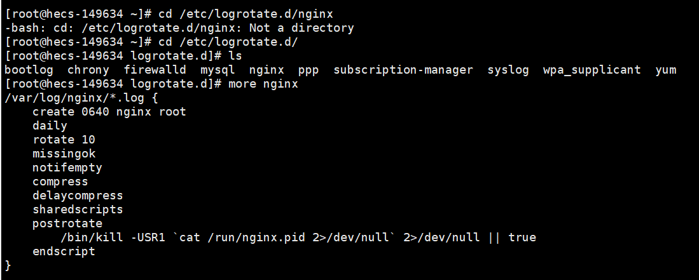

资料来源:<br/>

[[使用logrotate完成日志自动切分并轮转](https://segmentfault.com/a/1190000018338438)](https://segmentfault.com/a/1190000018338438)

### 说明

之前安装 nginx 都是自己编译安装，然后打成 rpm 包。换了一个新公司之后，发现服务器的 nginx 都是 yum 安装的，这也没什么问题，业务量不大。之后我发现在 nginx 的日志存储目录下，日志都被切割了，这很正常，但是经过我查看，在 crontab 下面并没有脚本文件进行 nginx 的日志切割，这使我有点摸不到头脑，以我之前的观念都是脚本进行日志切割，然后放到定时任务中按天执行。
之后搜索了网上的文章，找到了切割 nginx的日志是一个服务执行的



## 脚本方式

部署网络应用时，会对请求进行日志保存，用于数据统计分析以及故障排除，但对于高并发请求的服务器，日志文件会迅速增长，快速的消耗磁盘空间，同时，分析一个大文件来排查问题也会非常慢。因此，我们通常需要将日志按照天级别进行存储，并对过旧的日志进行压缩转存或删除，方便节省磁盘空间和进行脚本分析。

当我第一次有这种需求的时候，最先想到的是`crontab`脚本定时执行日志清理脚本。就是先编写一个`cleanLog.sh`，然后让`crontab`定期的来执行它。

```shell
#!/bin/bash
#Rotate the Nginx logs to prevent a single logfile from consuming too much disk space.   
LOGS_PATH=/usr/local/nginx/logs
YEAR_MONTH=$(date +%Y-%m)  
YESTERDAY=$(date -d "yesterday" +%Y-%m-%d)
FILEPATH=${LOGS_PATH}/${YEAR_MONTH}
if [ ! -d ${FILEPATH} ];then
mkdir ${FILEPATH}
fi  
mv ${LOGS_PATH}/access.log ${LOGS_PATH}/${YEAR_MONTH}/access_${YESTERDAY}.log  
mv ${LOGS_PATH}/error.log ${LOGS_PATH}/${YEAR_MONTH}/error_${YESTERDAY}.log  
## 向 Nginx 主进程发送 USR1 信号。USR1 信号是重新打开日志文件  
kill -USR1 $(cat /usr/local/nginx/logs/nginx.pid)
```

这个方法可行，但是比较麻烦费事，此时一个`Linux`内置的工具就比较有用了：`logrotate`。

## `logrotate`: `Linux`日志文件总管

`logrotate`（日志轮转工具）可以自动对日志文件提供截断、压缩以及轮转的功能。

`logrotate`工具默认安装在`linux`机器上，全局命令在`/usr/sbin/logrotate`，另外还包含两个配置文件：

```shell
// 全局配置文件，存储的为公用的默认配置项
/etc/logrotate.conf
// 子项配置文件夹，该文件夹下提供一些系统级别的日志配置，你的自定义配置也需要配置在这里
/etc/logrotate.d/
```

这个工具能做到自动执行的功能，其实还是依赖于`crontab`工具，只不过这些设定系统自动完成了，我们可以查看`crontab`系统级别的日运行脚本：

```shell
$ vim /etc/cron.daily/logrotate
#!/bin/sh

/usr/sbin/logrotate /etc/logrotate.conf >/dev/null 2>&1
EXITVALUE=$?
if [ $EXITVALUE != 0 ]; then
    /usr/bin/logger -t logrotate "ALERT exited abnormally with [$EXITVALUE]"
fi
exit 0
```

可以看到在`crontab`的日级别配置文件目录下有一个`logrotate`子项，它会每天执行`logrotate`命令，调用的配置为`/etc/logrotate.conf`。

在实际执行中，`logrotate`命令会先读取`/etc/logrotate.conf`的配置作为默认项，然后再依次读取`/etc/logrotate.d/`目录下的各文件配置来覆盖默认项，并执行日志轮转功能。

## `logrotate`命令

> 语法：`logrotate [OPTION...] <configfile>`
> 参数说明：
> `-d, --debug ：`debug模式，测试配置文件是否有错误。
> `-f, --force ：`强制转储文件。
> `-m, --mail=command ：`压缩日志后，发送日志到指定邮箱。
> `-s, --state=statefile ：`使用指定的状态文件。
> `-v, --verbose ：`显示转储过程。

## `logrotate`使用

假设我们现在有一个日志文件存储在`/home/work/log/nginx.access.log`，需要对其每日进行切分为新旧两个日志文件，并删除7天前的旧日志。

首先我们创建新的日志轮转配置：

```awk
$vim /etc/logrotate.d/nginxAccessLog
# 指定需要轮转处理的日志文件
/home/work/log/nginx.access.log {
    # 日志文件轮转周期，可用值为: daily/weekly/yearly
    daily
    # 新日志文件的权限
    create 0664 work work
    # 轮转次数，即最多存储7个归档日志，会删除最久的归档日志
    rotate 7
    # 以当前日期作为命名格式
    dateext
    # 轮循结束后，已归档日志使用gzip进行压缩
    compress
    # 与compress共用，最近的一次归档不要压缩
    delaycompress
    # 忽略错误信息
    missingok
    # 日志文件为空，轮循不会继续执行
    notifempty
    # 当日志文件大于指定大小时，才继续执行，单位为bytes（默认）/k/M/G
    size = 100M
    # 将日志文件转储后执行的命令，以endscript结尾，命令需要单独成行
    postrotate
        # 重启nginx日志服务，写入到新的文件中去，否则会依然写入重命名后的文件中
        /bin/kill -USR1 `cat /home/work/run/nginx.pid 2> /dev/null` 2> /dev/null || true
        # 默认logrotate会以root身份运行，如果想要以其他身份执行一个命令，可以这样使用：
        #su - work -c '/home/work/odp/webserver/loadnginx.sh restart'
    endscript
}
```

在使用前，我们先演练一下，也就是`debug`模式，此时，不用实际轮循，而是模拟并输出，使用强制执行是因为还没到轮循周期：

```vim
$logrotate -d -f /etc/logrotate.d/nginxAccessLog 
reading config file /etc/logrotate.d/nginxAccessLog
reading config info for /home/work/log/nginx.access.log

Handling 1 logs

rotating pattern: /home/work/log/nginx.access.log forced from command line (7 rotations)
empty log files are rotated, old logs are removed
considering log /home/work/log/nginx.access.log
  log needs rotating
rotating log /home/work/log/nginx.access.log, log->rotateCount is 7
dateext suffix '-20190228'
glob pattern '-[0-9][0-9][0-9][0-9][0-9][0-9][0-9][0-9]'
glob finding old rotated logs failed
renaming /home/work/log/nginx.access.log to /home/work/log/nginx.access.log-20190228
creating new /home/work/log/nginx.access.log mode = 0664 uid = 500 gid = 501
running postrotate script
running script with arg /home/work/log/nginx.access.log: "
        /bin/kill -USR1 `cat /home/work/run/nginx.pid 2> /dev/null` 2> /dev/null || true
"
```

可以看到整个执行流程，以及没有什么报错信息，此时我们直接继续执行：

```awk
$logrotate -f /etc/logrotate.d/nginxAccessLog
$ll /home/work/lnmp/log/                      
-rw-r--r-- 1 work work          0 Feb 28 13:40 nginx.access.log
-rw-r--r-- 1 work work    5379846 Feb 28 13:37 nginx.access.log-20190228
```

可以看到我们已经对日志进行了切分，最新的日志文件大小为`0`。以后系统就会对该日志进行自动的轮转管理。

## 多文件配置

我们可以为一个配置区块指定多个文件，支持通配符，多个文件之间用空格分割：

```awk
/home/work/log/nginx.access.log /home/work/log/nginx.error.log /home/work/log/mysql.*.log {
    ...
}
```

也可以在一个配置文件中指定多个区块：

```awk
/home/work/log/nginx.access.log {
    ...
}
/home/work/log/nginx.error.log {
    ...
}
```


