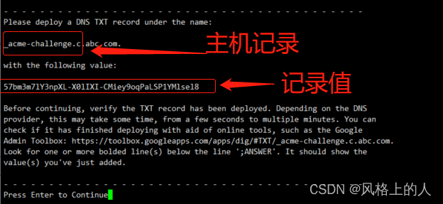
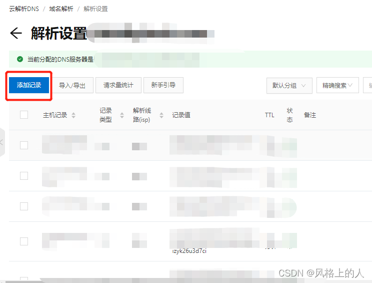
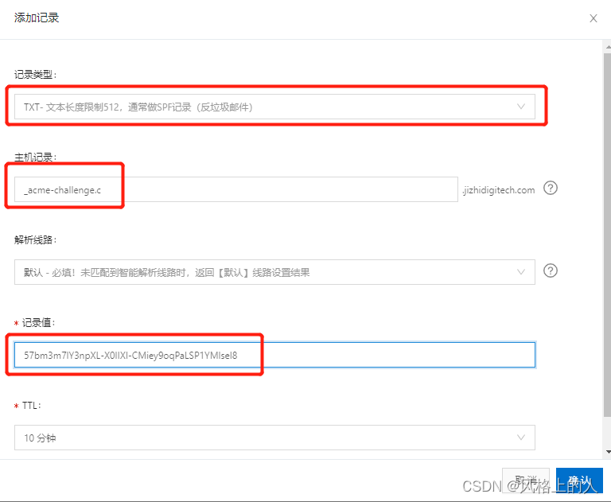
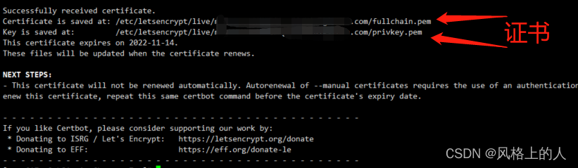
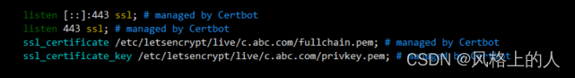

资料来源：

[使用Certbot为nginx配置免费的https证书](https://blog.csdn.net/u010940941/article/details/126366944)

## nginx配置免费的https证书

### 基于http挑战的配置（自动）

nginx配置

```shell
server {
    listen       80 ;
    listen       [::]:80;
    server_name *.abc.com;
 
 
    # 将 http 请求转发到 https
    location / {
	    if ($host ~ .*\.abc.com$) {
	        return 301 https://$host$request_uri;
	    }
	}
 
 
	# 用于证书申请时的挑战
	location /.well-known/acme-challenge/ {
	    set $a $uri;
	    if ( $uri ~ .*\\/([^/]+)$) {
	        set $a $1;
	    }
	    default_type    text/plain;
	    return 200 $a;
	}
}
```

自动 c.abc.com 的https配置证书

```
certbot certonly -d c.abc.com --manual --preferred-challenges dns
```

> 3) 访问验证证书是否生效

## 方案二：基于dns挑战的配置（手动）

  1） 执行 certbot 命令

```
certbot certonly -d c.abc.com --manual --preferred-challenges dns
```

​    2) certbot 提示如下信息：



 3）根据提示配置DNS,这里以阿里云为例

​        a) 打开阿里云的域名解析



​       b) 添加记录值，记录类型选择 TXT, 主机记录和记录值为 certbot 提示的信息， 如下图所示填写，确认即可：



​      4）回到 certbot 的对话框，回车，即可生成 c.abc.com的 SSL证书，如下图所示：



​      5）在nginx中配置证书，并重启 nginx

```cobol
ssl_certificate /etc/letsencrypt/live/c.abc.com/fullchain.pem;
ssl_certificate_key /etc/letsencrypt/live/c.abc.com/privkey.pem;
```

 示例：

​        

​     6) 访问验证证书是否生效

## 靠谱的安装方案

### 安装 snap

 安装 EPEL 存储库

```bash
sudo yum install epel-release
```

安装并启用 snapd

```
sudo yum install snapd
 
# 启用管理主 snap 通信套接字
sudo systemctl enable --now snapd.socket
 
# 启用经典/var/lib/snapd/snap快照支持
sudo ln -s /var/lib/snapd/snap /snap
```

确保 snapd 版本是最新的

```
sudo snap install core
 
sudo snap refresh core
```

安装

```
# 安装 certbot
sudo snap install --classic certbot
 
# 创建软链
sudo ln -s /snap/bin/certbot /usr/bin/certbot

```

