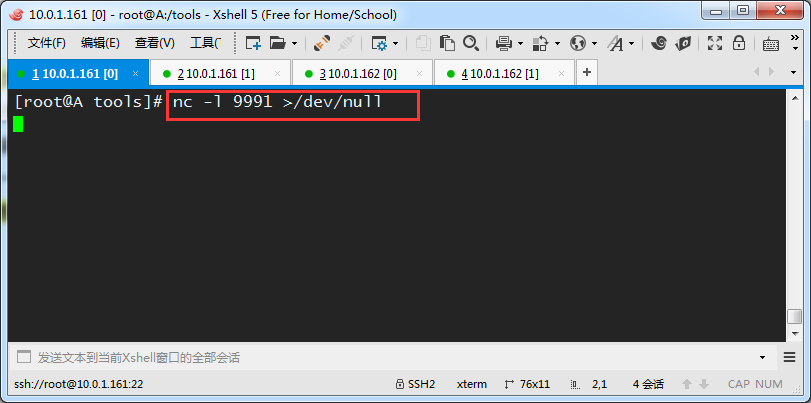
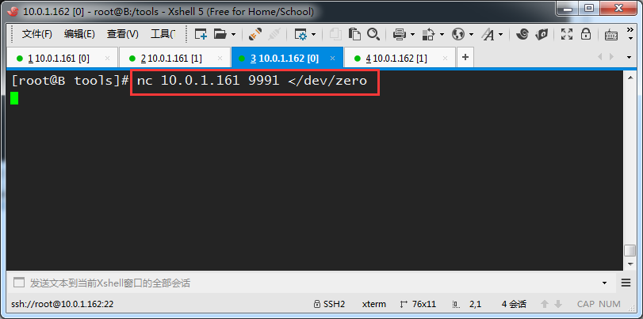
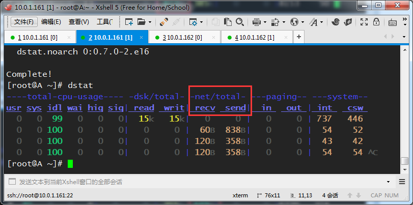
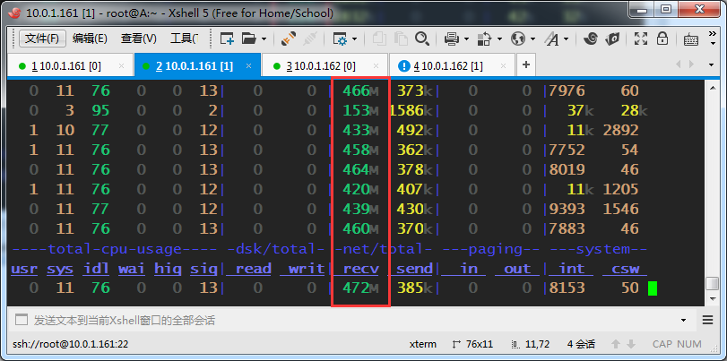
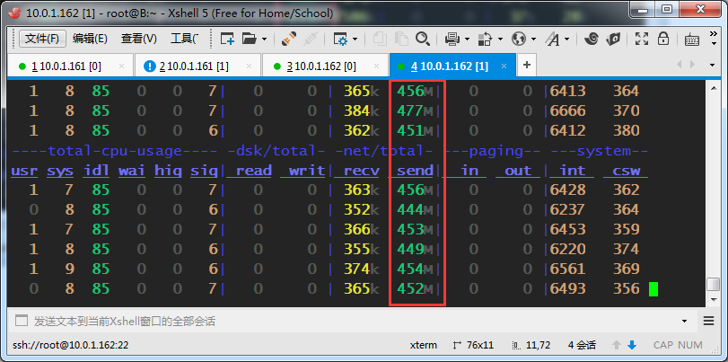
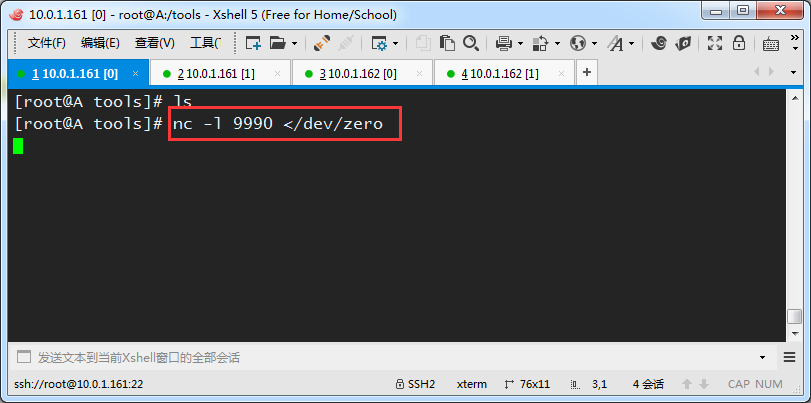
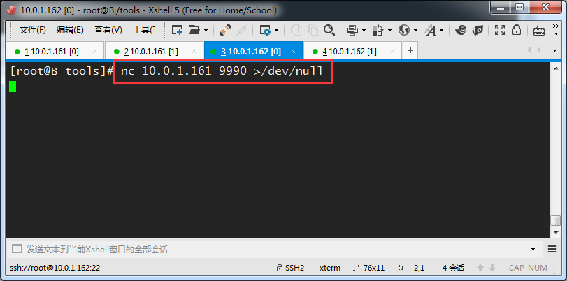
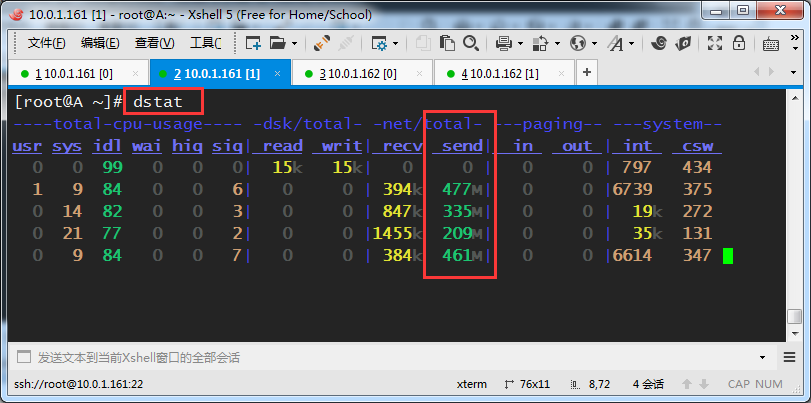

资料来源：<br/>
[nc用法3，测试网速](https://www.pianshen.com/article/46251703520/ )


## nc测速

测试网速其实利用了传输文件的原理，就是把来自一台机器的/dev/zero 发送给另一台机器的/dev/null

就是把一台机器的无限个0，传输给另一个机器的空设备上，然后新开一个窗口使用dstat命令监测网速

在这之前需要保证机器先安装dstat工具

```shell
yum install -y dstat
```

### 方法1，测试网速演示（先启动接收命令方式）

步骤1，A机器先启动接收数据的命令，监听自己的9991端口，把来自这个端口的数据都输出给空设备（这样不写磁盘，测试网速更准确）

```shell
nc -l 9991 >/dev/null
```



 

步骤2，B机器发送数据，把无限个0发送给A机器的9991端口

```shell
nc 10.0.1.161 9991 </dev/zero
```



 

在复制的窗口上使用dstat命令查看当前网速，dstat命令比较直观，它可以查看当前cpu，磁盘，网络，内存页和系统的一些当前状态指标。

我们只需要看下面我选中的这2列即可，recv是receive的缩写，表示接收的意思，send是发送数据，另外注意数字后面的单位B，KB，MB



 

可以看到A机器接收数据，平均每秒400MB左右



B机器新打开的窗口上执行dstat，看到每秒发送400MB左右的数据



 

 

 

### 方法2，测试网速演示（先启动发送命令方式）

步骤1，先启动发送的数据，谁连接这个端口时就会接收来自zero设备的数据（二进制的无限个0）

nc -l 9990 </dev/zero



步骤2，下面B机器连接A机器的9990端口，把接收的数据输出到空设备上

nc 10.0.1.161 9990 >/dev/null



同样可以使用dstat观察数据发送时的网速

