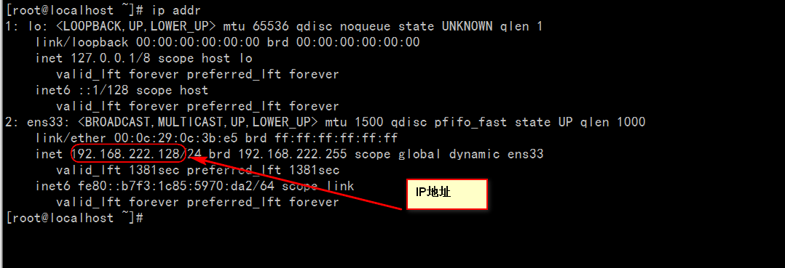
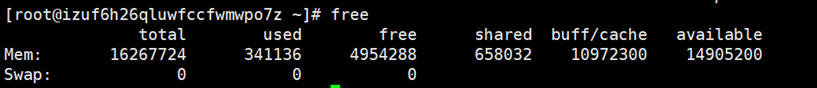
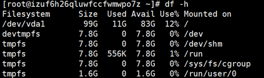

资料来源：

[防火墙设置](https://www.5yun.org/10074.html)

# 1.  centeros 常用操作

## 1.1. 查看IP

```shell
 ip addr
```

通过IP地址查看，查看IP地址



 

## 1.2. 自动获取ip

切换到

```shell
/etc/sysconfig/network-scripts
```

编辑 `ifcfg-ens `后面是数字的这个文件

 

把no 改成 yes

 

 

重启网络

```shell
service network restart
```

## 1.3. 安装wget

在线安装 wget

```shell
yum -y install wget
```


 

 

## 1.4. 安装unzip

在线安装

```shell
yum install -y unzip zip
```


 

## 1.5. 按照文件名查找

 

(1)`find / -name httpd.conf`　　#在根目录下查找文件httpd.conf，表示在整个硬盘查找

(2)`find /etc -name httpd.conf`　　#在/etc目录下文件httpd.conf

(3)`find /etc -name '*srm*'`　　#使用通配符*(0或者任意多个)。表示在/etc目录下查找文件名中含有字符串‘srm’的文件

(4)`find . -name 'srm*'` 　　#表示当前目录下查找文件名开头是字符串‘srm’的文件

## 1.6. 防火墙

### 1.6.1. 常用的命令

查看开放端口

```
firewall-cmd --permanent --list-port
```

 

 

开放端口

````shell
firewall-cmd --zone=public --add-port=8080/tcp --permanent
````

- 关闭端口

```shell
firewall-cmd --zone=public --remove-port=8080/tcp --permanent
```

 

- 查看防火墙的状态

```shell
systemctl status firewalld.service
```


```shell
 批量添加区间端口
firewall-cmd --zone=public --add-port=4400-4600/udp --permanent
firewall-cmd --zone=public --add-port=4400-4600/tcp --permanent
开启防火墙命令：
systemctl start firewalld.service
重启防火墙命令
firewall-cmd --reload 或者  service firewalld restart
查看端口列表：

firewall-cmd --permanent --list-port
禁用防火墙
systemctl stop firewalld
设置开机启动
systemctl enable firewalld
停止并禁用开机启动
sytemctl disable firewalld
查看状态
systemctl status firewalld或者 firewall-cmd --state
```

### 1.6.1. 开启防火墙失败

如果想开启防火墙失败；

 

 

资料来源：http://blog.csdn.net/c233728461/article/details/52679558

 

此时的防火墙不可硬用；

```shell
需要进行重新安装防火墙：

1，安装防火墙
yum install iptables-services 

2，设置开机启动防火墙
systemctl enable iptables 
防火墙（其他设置）

\#停止firewalld服务
systemctl stop iptables 

\#开启firewalld服务
systemctl start iptables 

\#重启服务
systemctl restart iptables 
systemctl reload iptables 

3，保存
service iptables save

开放端口
-A RH-Firewall-1-INPUT -m state --state NEW -m tcp -p tcp --dport 8080 -j ACCEPT
```

### 1.6.2. 防火墙被锁定


 ```shell
执行命令，即可实现取消服务的锁定
 systemctl unmask firewalld

下次需要锁定该服务时执行
systemctl mask firewalld

 
启动防火墙
systemctl start firewalld.service
 ```

来源：[防火墙被锁定](http://www.jb51.net/article/101576.htm)


## 1.7. 查看虚拟机里的Centos7的IP

（资料来源：http://blog.csdn.net/dancheren/article/details/73611878 ）

 

 

这里之所以是查看下IP ，是我们后面要建一个Centos远程工具Xshell 连接Centos的时候，需要IP地址，所以我们这里先

学会查看虚拟机里的Centos7的IP地址

首先我们登录操作系统 用户名root 密码 123456

然后我们输入ip查询命名 ip addr  也可以输入 ifconfig查看ip，但此命令会出现3个条目，centos的ip地址是ens33条目中的inet值。 

 

发现 ens33 没有 inet 这个属性，那么就没法通过IP地址连接虚拟机。

 

接着来查看ens33网卡的配置： vi /etc/sysconfig/network-scripts/ifcfg-ens33  注意vi后面加空格

vi是Linux内置的文本编辑器命令 打开文件的意思

 


从配置清单中可以发现 CentOS 7 默认是不启动网卡的（ONBOOT=no）。

把这一项改为YES（ONBOOT=yes），

 

然后按 Esc 退出  再出入命令 :wq 再按Enter即可  （备注 :wq 是保存然后退出的意思 后面会专门讲下vi）

然后重启网络服务：` sudo service network restart `

 

然后我们再输入  ip addr 命令

 

 

这里 inet属性显示了 虚拟机里的IP  192.168.1.107  (你们的可能和我不一样)

 

# 2.  防火墙iptables

CentOS7默认的防火墙不是iptables,而是firewalle.

安装iptable iptable-service


[     ](https://code.csdn.net/snippets/1594490)    

- 先检查是否安装了iptables 

> service iptables status 
>
> \#安装iptables 
>
> yum install -y iptables 
>
> \#升级iptables 
>
> yum update iptables  
>
> \#安装iptables-services 
>
> yum install iptables-services 
>
> 禁用/停止自带的firewalld服务

- 停止firewalld服务 

>  systemctl stop firewalld 
>
> \#禁用firewalld服务 
>
> systemctl mask firewalld 
>
> 设置现有规则


- 查看iptables现有规则 

> iptables -L -n 
>
> 先允许所有,不然有可能会杯具 
>
> iptables -P INPUT ACCEPT 
>
> \#清空所有默认规则 
>
> iptables -F 
>
> \#清空所有自定义规则 
>
> iptables -X 
>
> \#所有计数器归0 
>
> iptables -Z 
>
> \#允许来自于lo接口的数据包(本地访问) 
>
> iptables -A INPUT -i lo -j ACCEPT 
>
> \#开放22端口 
>
> iptables -A INPUT -p tcp --dport 22 -j ACCEPT 
>
> \#开放21端口(FTP) 
>
> iptables -A INPUT -p tcp --dport 21 -j ACCEPT 
>
> \#开放80端口(HTTP) 
>
> iptables -A INPUT -p tcp --dport 80 -j ACCEPT 
>
> \#开放443端口(HTTPS) 
>
> iptables -A INPUT -p tcp --dport 443 -j ACCEPT 
>
> \#允许ping 
>
> iptables -A INPUT -p icmp --icmp-type 8 -j ACCEPT 
>
> \#允许接受本机请求之后的返回数据 RELATED,是为FTP设置的 
>
> iptables -A INPUT -m state --state RELATED,ESTABLISHED -j ACCEPT 
>
> \#其他入站一律丢弃 
>
> iptables -P INPUT DROP 
>
> \#所有出站一律绿灯 
>
> iptables -P OUTPUT ACCEPT 
>
> \#所有转发一律丢弃 
>
> iptables -P FORWARD DROP 
>
> 其他规则设定
>
> \#如果要添加内网ip信任（接受其所有TCP请求） 
>
> iptables -A INPUT -p tcp -s 45.96.174.68 -j ACCEPT 
>
> \#过滤所有非以上规则的请求 
>
> iptables -P INPUT DROP 
>
> \#要封停一个IP，使用下面这条命令： 
>
> iptables -I INPUT -s ***.***.***.*** -j DROP 
>
> \#要解封一个IP，使用下面这条命令: 
>
> iptables -D INPUT -s ***.***.***.*** -j DROP 
>
> 保存规则设定


>  #注册iptables服务 
>
> \#相当于以前的chkconfig iptables on 
>
> systemctl enable iptables.service 
>
> \#开启服务 
>
> systemctl start iptables.service 
>
> \#查看状态 
>
> systemctl status iptables.service 
>
> 解决vsftpd在iptables开启后,无法使用被动模式的问题
>
> 1.首先在/etc/sysconfig/iptables-config中修改或者添加以下内容

>
> \#添加以下内容,注意顺序不能调换 
>
> IPTABLES_MODULES="ip_conntrack_ftp" 
>
> IPTABLES_MODULES="ip_nat_ftp" 
>
> 2.重新设置iptables设置
>
>
> iptables -A INPUT -m state --state RELATED,ESTABLISHED -j ACCEPT 
>
> **以下为完整设置脚本**
>
> \#!/bin/sh 
>
> iptables -P INPUT ACCEPT 
>
> iptables -F 
>
> iptables -X 
>
> iptables -Z 
>
> iptables -A INPUT -i lo -j ACCEPT 
>
> iptables -A INPUT -p tcp --dport 22 -j ACCEPT 
>
> iptables -A INPUT -p tcp --dport 21 -j ACCEPT 
>
> iptables -A INPUT -p tcp --dport 80 -j ACCEPT 
>
> iptables -A INPUT -p tcp --dport 443 -j ACCEPT 
>
> iptables -A INPUT -p icmp --icmp-type 8 -j ACCEPT 
>
> iptables -A INPUT -m state --state RELATED,ESTABLISHED -j ACCEPT 
>
> iptables -P INPUT DROP 
>
> iptables -P OUTPUT ACCEPT 
>
> iptables -P FORWARD DROP 
>
> service iptables save 
>
> systemctl restart iptables.service 


 

# 3.  centos 的使用情况

## 3.1. 查看CPU 等使用情况

命令：

- top

 

 

 

**一、按进程的CPU使用率排序**

运行top命令后，键入大写P。

有两种途径：

a) 打开大写键盘的情况下，直接按P键

b) 未打开大写键盘的情况下，Shift+P键

 

**二、按进程的内存使用率排序**

运行top命令后，键入大写M。

有两种途径：

a) 打开大写键盘的情况下，直接按M键

b) 未打开大写键盘的情况下，Shift+M键

 

## 3.2. 查看内存使用情况

内存

- free

 

 

## 3.3. 硬盘使用情况

命令：

df -h

 

 

资料来源；http://www.19shusheng.com/special/detail/31e7376cb3 

我们可以看下服务器的配置是否跟你购买的相符合
 查看内存使用情况
 free -h

 查看硬盘使用情况
 df -h

 

 

其他命令 – 查看空间大小

下面是相关命令的解释：

> 我们可以看下服务器的配置是否跟你购买的相符合
>  查看内存使用情况
>  free -h
>
>  查看硬盘使用情况
>  df -h

查看路径下 文件大小

> df -hl 查看磁盘剩余空间
>
> df -h 查看每个根路径的分区大小
>
> du -sh [目录名] 返回该目录的大小
>
> du -sm [文件夹] 返回该文件夹总M数
>
> du -h [目录名] 查看指定文件夹下的所有文件大小（包含子文件夹）

- df -h ftp

 

# 4.  Linux 端口查看

查看端口是否占用

netstat -tunpl | grep 6379

 

杀死占用的程序

 kill -9 [占用的线程]

 

# 5.  linux 开机自启动

配置开机自动文件，即可

开机启动的文件`/etc/rc.loacl`

编辑文件，在适当的位置添加自动，命令

 

开机启动部分代码；

```shell
/usr/bin/fdfs_trackerd /etc/fdfs/tracker.conf
/usr/bin/fdfs_storaged /etc/fdfs/storage.conf
/usr/local/nginx/sbin/nginx
/redis/6379/bin/redis-server /redis/6379/redis.conf


export JAVA_HOME=/usr/local/java/jdk1.7.0_55
/usr/local/apache-activemq-5.13.0/bin/activemq start
/solr/apache-tomcat-7.0.47/bin/startup.sh

```

# 6.  linux 修改host 文件

使用`vi /etc/hosts`命令打开文件，在文件中添加`IP + ``对应的域名`

 

重启网络

`vim /etc/hosts` 


重启网络:

`service network restart`

 

# 7.  配置notepad++ 连接linux服务器：

## 7.1. 连接 linux 系统

选择 插件 > nppFTP > show NppFTP Windowns

 

配置路径

 

新建路径名称

 

配置路径

配置connectionType 默认的端口号 20 

输入用户名称和密码：

 

 

点击进行连接

 


查看文件 占用的空间

`df -lh`

```shell
[root@izuf6dt5e7ronljr6g7vdpz logs]# df -lh
Filesystem   Size Used Avail Use% Mounted on
/dev/vda1    197G 4.7G 183G  3% /
devtmpfs    7.8G   0 7.8G  0% /dev
tmpfs      7.8G   0 7.8G  0% /dev/shm
tmpfs      7.8G 676K 7.8G  1% /run
tmpfs      7.8G   0 7.8G  0% /sys/fs/cgroup
tmpfs      1.6G   0 1.6G  0% /run/user/0
```

# 8.  后台运行服务

https://www.jianshu.com/p/13b406653d91

## 8.1. screen的使用

 

在linux部署服务时候，用远程连接，有时候启动完毕，然后关闭会话，服务也就关闭了，那么有没有办法让这些服务后台运行，并且关闭窗口不影响呢？我的办法是使用**Screen**

Screen是一款由GNU计划开发的用于命令行终端切换的自由软件。用户可以通过该软件同时连接多个本地或远程的命令行会话，并在其间自由切换。GNU Screen可以看作是窗口管理器的命令行界面版本。它提供了统一的管理多个会话的界面和相应的功能

下载安装screen： 

```shell
yum install screen

screen -S yourname -> 新建一个叫yourname的session

screen -ls -> 列出当前所有的session

screen -r yourname -> 回到yourname这个session

screen -d yourname -> 远程detach某个session

screen -d -r yourname -> 结束当前session并回到yourname这个session


Ctrl-a ? -> 显示所有键绑定信息

Ctrl-a c -> 创建一个新的运行shell的窗口并切换到该窗口

Ctrl-a n -> Next，切换到下一个 window 

Ctrl-a p -> Previous，切换到前一个 window 

Ctrl-a 0..9 -> 切换到第 0..9 个 window

Ctrl+a [Space] -> 由视窗0循序切换到视窗9

Ctrl-a C-a -> 在两个最近使用的 window 间切换 

Ctrl-a x -> 锁住当前的 window，需用用户密码解锁

Ctrl-a d -> detach，暂时离开当前session，将目前的 screen session (可能含有多个 windows) 丢到后台执行，并会回到还没进 screen 时的状态，此时在 screen session 里，每个 window 内运行的 process (无论是前台/后台)都在继续执行，即使 [logout](http://man.linuxde.net/logout "logout命令") 也不影响。 

Ctrl-a z -> 把当前session放到后台执行，用 shell 的 [fg](http://man.linuxde.net/fg "fg命令") 命令则可回去。

Ctrl-a [w](http://man.linuxde.net/w "w命令") -> 显示所有窗口列表

Ctrl-a t -> [time](http://man.linuxde.net/time "time命令")，显示当前时间，和系统的 load 

Ctrl-a k -> [kill](http://man.linuxde.net/kill "kill命令") window，强行关闭当前的 window</pre>

我一般都会使用screen -S yourname这个居多创建一个叫做yourname的一个screen，然后一个screen里面可以有很多窗口，运行很多服务。
 比如我有四个服务，想分开四个screen来运行，每次创建一个screen，然后在里面启动好服务，然后使用按键Ctrl-a d ，退回初始界面继续创建下一个screen，创建启动服务完毕就ok了。即使关闭窗口也不影响服务的使用
 screen -S yourname -> 新建一个叫yourname的session

screen -ls     -> 列出当前所有的session

screen -r yourname -> 回到yourname这个session

screen -d yourname -> 远程detach某个session

screen -d -r yourname -> 结束当前session并回到yourname这个session
```

 

## 8.2. nohup 的使用

 资料 来源： https://blog.csdn.net/qq_41550842/article/details/83189767

 

命令前面使用 nohup 

 

 

## 8.3. 系统 配置查看

```shell
wget -qO- --no-check-certificate https://raw.githubusercontent.com/oooldking/script/master/superbench.sh | bash
```

资料来源：　https://bb-r.net/?p=24

 

 

 

## 8.4. Linux 修改操作系统的时间

查看系统的时间

 

 

`date -R`