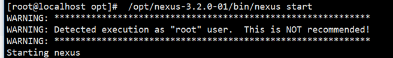
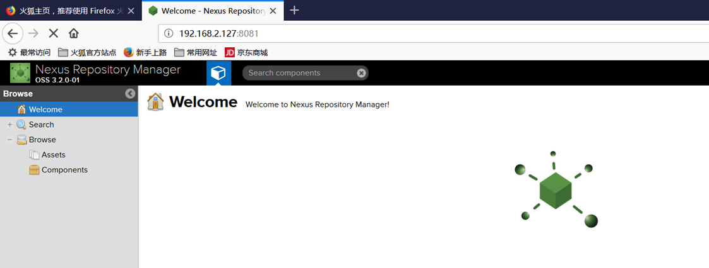

资料来源：<br/>
[安装私服](https://blog.csdn.net/lusyoe/article/details/54926937)<br/>
[Docker 搭建私服](http://beyondvincent.com/2016/09/23/2016-09-23-use-nexus-with-docker/)<br/>

## 安装 私服 Nexus 3.2

### 下载 安装包

下载 安装包并且解压压缩包
```
cd /opt
wget https://download.sonatype.com/nexus/3/nexus-3.2.0-01-unix.tar.gz
tar zxvf nexus-3.2.0-01-unix.tar.gz
```

### 1.2. 修改仓库的位置（可以使用默认）

解压后，在当前目录中除了nexus-3.2.0-01还有一个sonatyoe-work目录，用户存放仓库数据的，可根据需要将其改为其他路径，或使用软链接的方式。 
这里说下通过改配置文件的方式，将其改为其他路径吧。 
编辑nexus-3.2.0-01/bin/nexus.vmoptions文件：

```
# vim /opt/nexus-3.2.0-01/bin/nexus.vmoptions
```

配置
我们只需要改下日志存放路径、数据存放路径以及临时存放路径即可，分别对应着以下属性：
```
-XX:LogFile=../sonatype-work/nexus3/log/jvm.log
-Dkaraf.data=../sonatype-work/nexus3
-Djava.io.tmpdir=../sonatype-work/nexus3/tmp
```

### 1.3. 启动nexus

最后启动nexus： 

```
# /opt/nexus-3.2.0-01/bin/nexus start
```
注意防火墙；是否已经放心
默认的端口号： 8081



默认管理员账号密码：

```
admin
admin123
```

如果无法启动，注意检查，防火墙 和 端口的占用；

访问的 IP + 端口 8081



##  使用docker 安装

直接运行可用 

```
Last login: Fri Mar 30 13:35:56 2018 from 192.168.2.144
[root@localhost ~]# docker run -d -p 8081:8081 -p 8082:8082 -p 8083:8083 --name nexus liumiaocn/nexus
Unable to find image 'liumiaocn/nexus:latest' locally
Trying to pull repository docker.io/liumiaocn/nexus ... 
latest: Pulling from docker.io/liumiaocn/nexus
d9aaf4d82f24: Pull complete 
1bf6f9237306: Pull complete 
2cb68a4c7b1e: Pull complete 
a81c750844e6: Pull complete 
ea509a1d48c2: Pull complete 
24d48f5e8202: Pull complete 
Digest: sha256:3480d50b7ddfb72fe77ce55c7b5ce0a9aa7b6cfa90886a8f8ddc4a2401f1b7c9
Status: Downloaded newer image for docker.io/liumiaocn/nexus:latest
858e01a40ac3337bf6f26a80a79cdb6a4b89cdb012e66b1e1addd98d24195951、

```

