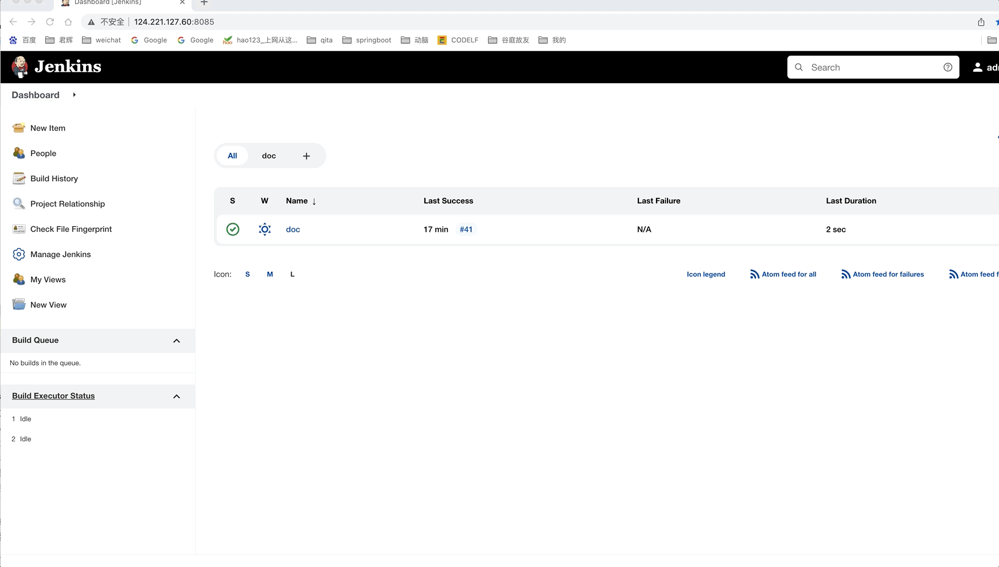
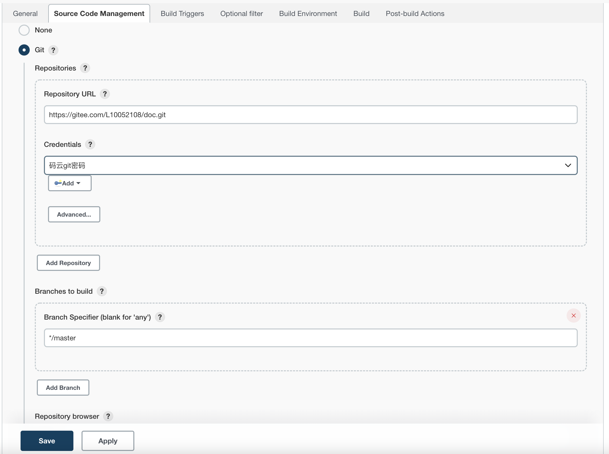
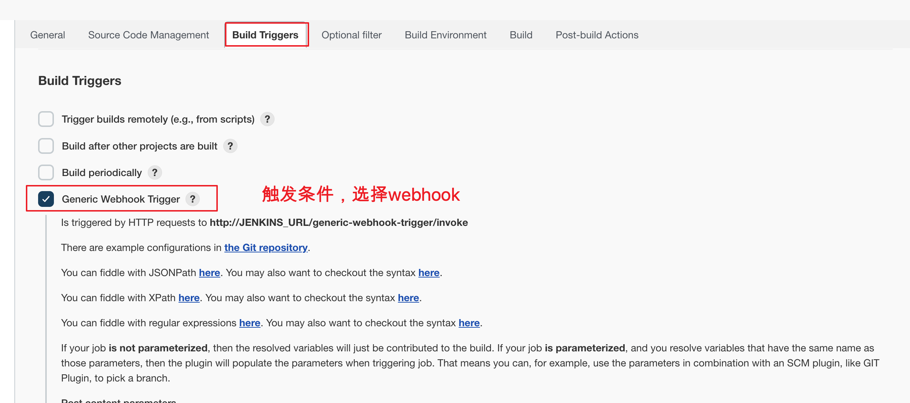
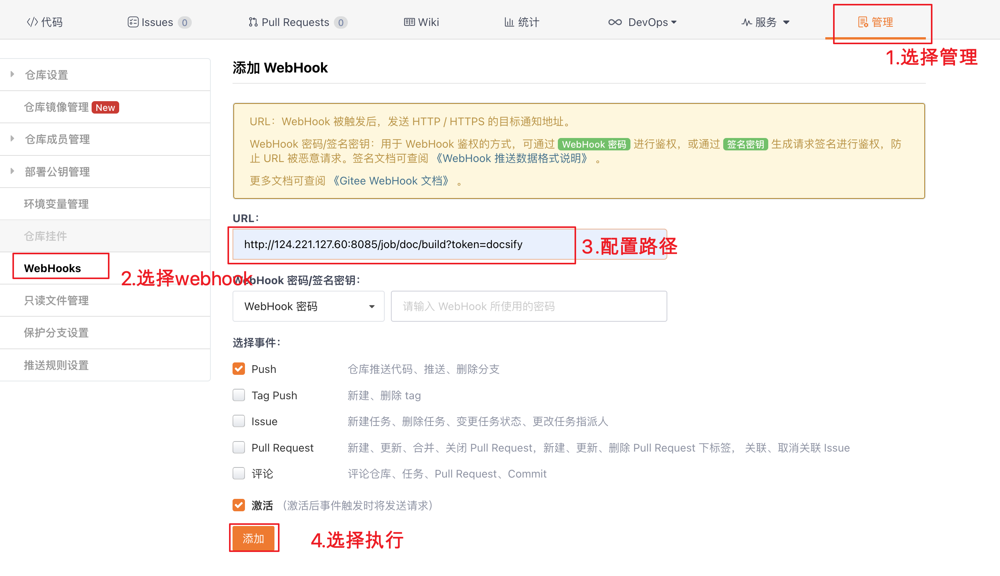

## Jenkins

### 下载安装

访问[官网](https://www.jenkins.io/)下载最新的Jenks的jar包

安装jdk，安装过程可以参考[jdk](linux/jdk.md)

启动代码：

`java -jar -DJENKINS_HOME=/root/jenkis/ProgramData/.jenkins jenkins.war --httpPort=8085 `

> -DJENKINS_HOME：指定Jenkins的项目文件的路径
>
> —httpPort：指定服务的端口号

访问地址：http://127.0.0.1:8085/

### 插件下载

- 我已经整理的插件下载文件

~~~~
链接: https://pan.baidu.com/s/1oaot6EDpG22cSyfRQvgkXw 提取码: msbl
~~~~

安装插件的方法

通过配置服务器地址，很容易安装失败。

因而我采用从官网下载插件，直接安装使用，操作方法如上图

官网插件下载地址 [官网](https://plugins.jenkins.io/)

### 常用的插件

#### Git插件

创建项目后，回出现code来源，选择git

按照上面的提示，输入git地址，账号密码等信息

#### webhook插件

增加webhook插件以后，可以通过webhook自动触发执行一次发布过程

git代码提交的时候，可以触发webhook

- 以为码云为例

- 

