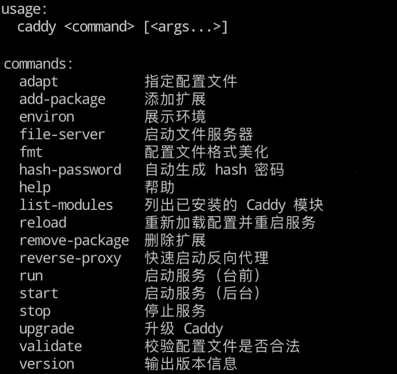
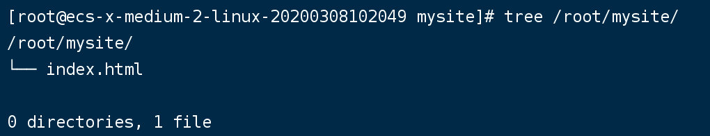
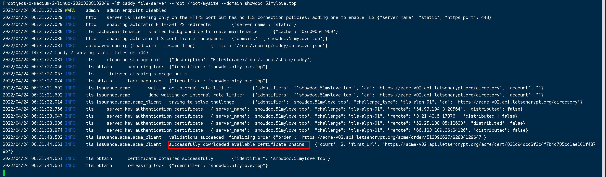

资料来源： 

[像iPhone一样好玩的Web服务器: Caddy](https://www.jianshu.com/p/85600cdc38d4)

[真香！自带 HTTPS 的开源 Web 服务器，附快速上手教程](https://www.toutiao.com/article/7064892846268006924/?tt_from=weixin&utm_campaign=client_share&wxshare_count=1%C3%97tamp=1646577448&app=news_article&utm_source=weixin&utm_medium=toutiao_android&use_new_style=1&req_id=202203062237270101581490430A99BE81&share_token=592cc100-113d-438b-9da7-fffac6f914e9&group_id=7064892846268006924)
[动手撸个Caddy（一）| 托管你的网站，只需一行命令](https://www.flysnow.org/2021/06/28/caddy-in-action-getting-started.html)

## caddy2介绍

据Netcraft今年5月份放出了一篇统计文章中，**Apache**、**Nginx**和微软的**IIS**分别以**45.61%**、**20.22%**和**7.83%**市场占有率依然排在“**活跃网站所使用Web服务器市场份额**”的前三甲。

但是在走势图中，我们俨然也感觉到其他Web服务器正在悄悄集结，通过自己不断的创新和优化来威胁着霸主们的地位。这其中，一个已经刚满2岁的家族小成员非常起眼，他就是有着“**云计算时代的C语言**”之称的Go语言所编写的**Caddy**。

Caddy是什么？在Caddy的官网上给出一个最简单的介绍：“Caddy是一个能自动创建HTTPS功能的HTTP/2网站服务器”。简单的一句话，突出了两大卖点，“**自动创建HTTPS**”和“**HTTP/2**”。申请过HTTPS数字证书的人应该都知道，要部署一个HTTPS站点，需要走多少流程和提交多少资料，而且数字证书的年费价格不菲(屌丝想法)，但是我要告诉你，这些，对于Caddy来说，都是自动操作的，而且重点是，上面这句话里没有体现出来，就是数字证书是**免费的！免费的！免费的！**重要的事情说三遍，具体怎么个实现，在下面介绍特性时会详细讲解给大家。

Caddy的作者是来自美国的Matthew Holt，因为是用Go语言开发的，所以Caddy天生里就带着高并发的基因。据国内技术人士测试，其同时并发数优于Apache，略低于Nginx。“**几乎所有的功能在Caddy里的都是插件**”，这是Matthew Holt对他的孩子的另一种诠释，“HTTP服务器是插件，高级的TLS特性也是插件，每一行命令实现的功能都是一个插件”。自始至终，Caddy就是一个内心强大，勇于挑战新事物的探险家，这完全得益于他的作者对互联网产品的深刻认知与理解。

在这个 HTTPS 必选的时代，Caddy 凭借无需额外配置自动 HTTPS，分分钟完成 HTTPS 站点搭建，使它成为了中小型 Web 服务的首选服务器。Caddy 深受开源爱好者们的喜爱，2014 年开源至今共收获了 3.6 万颗星。

## 使用

### 安装

网上有很多关于安装教程，每个帖子内容都不一样。我觉得使用[官方的教程](https://caddyserver.com/docs/install)比较好

我个人的服务器centos7，使用下面的安装命令：

~~~~shell
yum install -y yum-plugin-copr
yum copr enable @caddy/caddy
yum install -y caddy
~~~~

**检验**命令行执行 `caddy version` 命令

~~~~shell
v2.4.6 h1:HGkGICFGvyrodcqOOclHKfvJC0qTU7vny/7FhYp9hNw=
~~~~

### 使用

**caddy命令**

~~~~shell
caddy
~~~~

**启动服务**

`caddy run`

此时启动服务，不是网页的服务。可以通过远程命令

~~~~shell
curl localhost:2019/config/
~~~~

日志打印的内容

格式化后

~~~~json
{
	"method": "GET",
	"host": "localhost:2019",
	"uri": "/config/",
	"remote_addr": "127.0.0.1:55674",
	"headers": {
		"Accept": [
			"*/*"
		],
		"User-Agent": [
			"curl/7.29.0"
		]
	}
}
~~~~

### 文件配置

Caddy 的原生配置文件使用的是 JSON 格式。但是为了用户编写方便它提供了 Caddyfile 作为接口让用户可以快速配置站点信息，运行时 Caddy 会自动将 Caddyfile 的配置信息转为 JSON 配置文件

官网这样描述：

> The **Caddyfile** is a convenient Caddy configuration format for humans. It is most people's favorite way to use Caddy because it is easy to write, easy to understand, and expressive enough for most use cases.

Caddyfile 所能提供功能不如 JSON 配置文件强大，但是对于不需要复杂配置的用户而言完全够用了。

**创建配置文件**

~~~~shell
sudo mkdir -p /etc/caddy # 配置文件夹
sudo touch /etc/caddy/Caddyfile
~~~~

## 托管一个网站

是不是非常简单，只需要这一行命令，你就可以托管一个网站。

### 简单入门案例

我创建一个`/root/mysite` 文件夹下，创建了一个index.html文件

网页内容：

~~~~html
<!DOCTYPE html>
<html lang="en">
<head>
    <meta charset="UTF-8">
    <meta http-equiv="X-UA-Compatible" content="IE=edge">
    <meta name="viewport" content="width=device-width, initial-scale=1.0">
    <title>Document</title>
</head>
<body>
    <h1>这是一个测试页面</h1>
    
</body>
</html>
~~~~

执行的命令

~~~~shell
caddy file-server --root /root/mysite
~~~~

> `file-server`是caddy的子命令，表示要启动一个文件服务的意思
>
> `root`表示要以哪个文件目录作为文件服务的根目录，也就是我们的网站所在文件夹。

启动成功后，可以访问 `http://121.36.8.180/index.html`

### 配置域名

配置域名的方式各个厂家不一样，下面是阿里云的配置为例

通过[ip138](https://ip138.com/)查询域名解析是否可用

### 配置域名访问

使用的命令

`caddy file-server --root /root/mysite --domain showdoc.51mylove.top`

> domain:自己的域名

访问网站的时候，已经申请好了证书，访问都正常。从后台日志，可以看出caddy自动帮助我们申请了证书

我们继续查看证书

有两个重要的信息

> 组织：let's Encrypt
>
> 有效期：三个月

