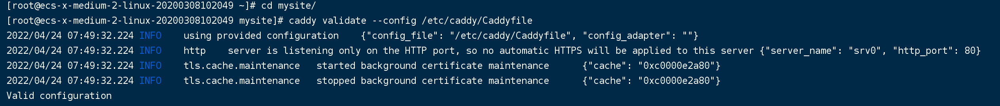
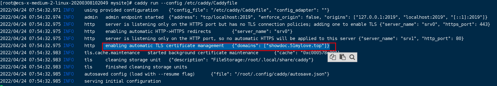

资料来源：<br/>

## 命令行

是不是非常简单，只需要这一行命令，你就可以托管一个网站。

### 简单入门案例

我创建一个`/root/mysite` 文件夹下，创建了一个index.html文件


网页内容：

~~~~html
<!DOCTYPE html>
<html lang="en">
<head>
    <meta charset="UTF-8">
    <meta http-equiv="X-UA-Compatible" content="IE=edge">
    <meta name="viewport" content="width=device-width, initial-scale=1.0">
    <title>Document</title>
</head>
<body>
    <h1>这是一个测试页面</h1>
    
</body>
</html>
~~~~

执行的命令

~~~~shell
caddy file-server --root /root/mysite
~~~~

> `file-server`是caddy的子命令，表示要启动一个文件服务的意思
>
> `root`表示要以哪个文件目录作为文件服务的根目录，也就是我们的网站所在文件夹。

启动成功后，可以访问 `http://121.36.8.180/index.html`


### 配置域名

配置域名的方式各个厂家不一样，下面是阿里云的配置为例


通过[ip138](https://ip138.com/)查询域名解析是否可用


### 配置域名访问


使用的命令

`caddy file-server --root /root/mysite --domain showdoc.51mylove.top`

> domain:自己的域名


访问网站的时候，已经申请好了证书，访问都正常。从后台日志，可以看出caddy自动帮助我们申请了证书


我们继续查看证书


有两个重要的信息

> 组织：let's Encrypt
> 有效期：三个月


## Caddyfile文件配置

### Caddyfile介绍

Caddy 的原生配置文件使用的是 JSON 格式。但是为了用户编写方便它提供了 Caddyfile 作为接口让用户可以快速配置站点信息，运行时 Caddy 会自动将 Caddyfile 的配置信息转为 JSON 配置文件

官网这样描述：

> The Caddyfile is a convenient Caddy configuration format for humans. It is most people's favorite way to use Caddy because it is easy to write, easy to understand, and expressive enough for most use cases.

Caddyfile 所能提供功能不如 JSON 配置文件强大，但是对于不需要复杂配置的用户而言完全够用了。

创建配置文件

```shell
sudo mkdir -p /etc/caddy # 配置文件夹
sudo touch /etc/caddy/Caddyfile
```

### 托管一个网站

在Caddyfile文件中配置

~~~~c
showdoc.51mylove.top {
	root * /root/mysite
	file_server
}
~~~~

执行命令行:

~~~~Shell
caddy validate --config /etc/caddy/Caddyfile
~~~~

这是一个验证Caddyfile配置文件的命令，它会模拟启动caddy，但是并不会真的启动。验证的过程中，遇到的问题，会在控制台输出



验证运行正常，可以启动服务

`caddy start --config /etc/caddy/Caddyfile`

> config : 配置文件的路径

从启动日志中，也可以看出。进行了自动配置证书




