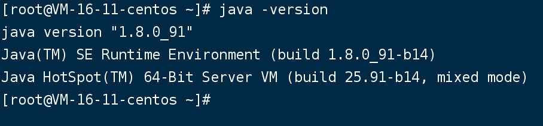
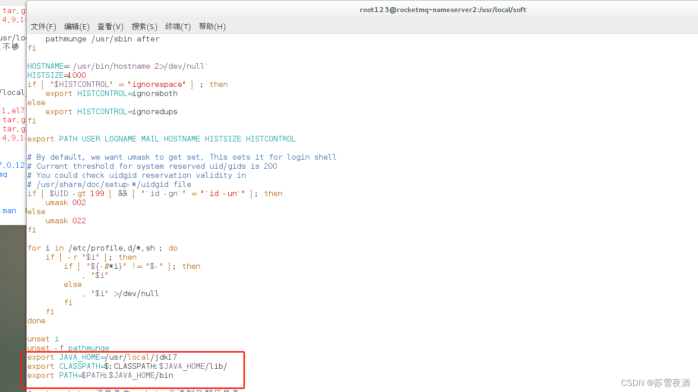

资料来源：

[Linux环境下安装JDK(17)](https://blog.csdn.net/mnimxq/article/details/132154132)


## jdk8

### 上传安装包

已经上传到百度网盘中

>  链接: https://pan.baidu.com/s/1ZDiVfGy7-5bF6BBoyBlWTQ?pwd=5kc4 提取码: 5kc4

### 执行安装

创建文件夹

`mkdir -p /usr/java`

- 解压

~~~~~
tar -zxvf jdk-8u91-linux-x64.tar.gz -C /usr/java
~~~~~

配置环境变量

`vim /etc/profile`

输入i进行编辑，编辑完成后输入wq保存

文件中增加jdk配置

~~~~~
export JAVA_HOME=/usr/java/jdk1.8.0_91
export CLASSPATH=$JAVA_HOME/lib/
export PATH=$PATH:$JAVA_HOME/bin
export PATH JAVA_HOME CLASSPATH
~~~~~

生效

`source /etc/profile`

### 验证

测试命令

`java -version`

运行效果




## jdk17


1、官网下载

https://www.oracle.com/java/technologies/javase/jdk17-archive-downloads.html


解压缩，换包名

```
tar -zxvf jdk-17_linux-x64_bin.tar.gz

tar -zxvf jdk-17_linux-x64_bin.tar.gz
mv jdk-17.0.8  jdk17

mv jdk-17.0.8 jdk17
```


5、配置环境变量，并让配置文件生效

```shell
vim /etc/profile
```




```shell
source /etc/profile
```

6、检查一下结果

java -version 

