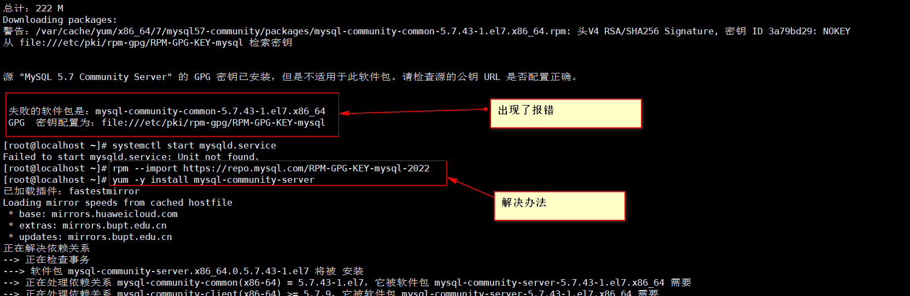
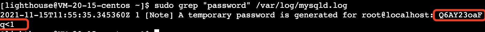

资料来源：<br/>
[mysql重置root密码centos_mysql 5.7 root密码重置(centos 7)](https://blog.csdn.net/weixin_33152959/article/details/114352722)<br/>
[mysql-community-common-5.7.38-1.el7.x86_64.rpm 的公钥尚未安装](https://blog.csdn.net/qq_53810226/article/details/124836467)

## 方法一

### 数据源

打开网址：`https://dev.mysql.com/downloads/repo/yum/`,选择对应linux版本


点击“No thanks, just start my download.”，进行下载


将下载地址复制，得到rpm包的地址


### 下载并安装mysql：

```
wget -i -c http://dev.mysql.com/get/mysql57-community-release-el7-10.noarch.rpm
yum -y install mysql57-community-release-el7-10.noarch.rpm
yum -y install mysql-community-server
```

### 启动并查看状态MySQL：

```
systemctl start  mysqld.service
systemctl status mysqld.service
```

### 报错



```shell
rpm --import https://repo.mysql.com/RPM-GPG-KEY-mysql-2022
yum -y install mysql-community-server
```

***目前只测试过centos7 MySQL5.7的环境 其他的并未测试***

### 查看MySQL的默认密码：

```
grep "password" /var/log/mysqld.log
```



### 登录进MySQL

```
mysql -uroot -p
```

### 修改默认密码（设置密码需要有大小写符号组合—安全性)，把下面的`my passrod`替换成自己的密码

```
ALTER USER 'root'@'localhost' IDENTIFIED BY 'my password';
```

### 开启远程访问

 (把下面的`my passrod`替换成自己的密码)

```
grant all privileges on *.* to 'root'@'%' identified by 'my password' with grant option;
flush privileges;
exit
```

### 忘记密码

当然有些人可能是root密码真忘记了，那样可以通过mysql免密码登陆

- 在其配置文件/etc/my.cnf中加入`skip-grant-tables=1`
- 重启mysql服务器 `systemctl restart mysqld`
- 进行免密连接到mysql


```
mysql 
mysql> use mysql
mysql> update user set authentication_string = password("123456") where user="root";
mysql> flush privileges;
```

在此要注意的是，之前版本密码修改字段为password，在5.7版本之后字段为authentication_string

mysql密码难度修改

mysql密码修改为123456之后，有人发现使用123456能进入mysql，但是却不能使用mysql的任何功能。会出现如下情况:

- 然后将/etc/my.cnf中的skip-grant-tables=1注释掉，重启mysql服务即可。

- 重新进入服务后`mysql -uroot -p123456`

  

## 卸载MySQL

资料来源：https://blog.csdn.net/qq_41829904/article/details/92966943

~~~~sql
//rpm包安装方式卸载
查包名：rpm -qa|grep -i mysql
删除命令：rpm -e –nodeps 包名
 
//yum安装方式下载
1.查看已安装的mysql
命令：rpm -qa | grep -i mysql
2.卸载mysql
命令：yum remove mysql-community-server-5.6.36-2.el7.x86_64
查看mysql的其它依赖：rpm -qa | grep -i mysql
 
//卸载依赖
yum remove mysql-libs
yum remove mysql-server
yum remove perl-DBD-MySQL
yum remove mysql
~~~~

### 方法二


## mysql 的配置

### 修改安全策略

[在]()/etc/my.cnf文件添加validate_password_policy配置，指定密码策略

```
选择0（LOW），1（MEDIUM），2（STRONG）其中一种，选择2需要提供密码字典文件
validate_password_policy=0
```

如果不需要密码策略，添加my.cnf文件中添加如下配置禁用即可：

```
validate_password = off
```

重新启动mysql服务使配置生效：

```
systemctl restart mysqld
```
安全策略 直接 修改 成低

```
set global validate_password_policy=LOW;
```
### 配置文件的路径

- 路径列表

~~~~
配置文件：/etc/my.cnf 
日志文件：/var/log//var/log/mysqld.log 
服务启动脚本：/usr/lib/systemd/system/mysqld.service 
socket文件：/var/run/mysqld/mysqld.pid
~~~~

## Docker 安装 MySQL

通过 Docker 搭建 MySQL 数据库环境，同时能同时启动多个 MySQL 版本。在安装前，最好上 [docker](https://hub.docker.com/_/mysql) 官网上看一下 MySQL 的版本，更具具体需求版本安装 MySQL，假设你已经搭建好 Docker 环境下面介绍如何创建一个 MySQL 服务器实例。
<!-- TOC -->

- [快速启动一个 MySQL 服务器实例](#快速启动一个-mysql-服务器实例)
- [通过命令行访问 MySQL 容器](#通过命令行访问-mysql-容器)
- [使用 MySQL 自定义配置文件](#使用-mysql-自定义配置文件)
- [使用 stack 部署 MySQL](#使用-stack-部署-mysql)
- [参考资料](#参考资料)

<!-- /TOC -->

### 快速启动一个 MySQL 服务器实例

下面，我们通过通过 [docker](https://hub.docker.com/_/mysql) 镜像，或者 [MySQL](https://hub.docker.com/r/mysql/mysql-server) 官方镜像，进行快速启动一个实例。

```bash
## Docker 官方镜像
$ docker image pull library/mysql:8.0.18
### MySQL 官方镜像
$ docker image pull mysql/mysql-server:8.0.18
```

上面命令中 `docker image pull` 是抓取 `image` 镜像的命令。`library/mysql:8.0.18` 是指定镜像仓库的位置和相对应的 `tag` 版本。由于 `Docker` 官方提供的 image 文件，都放在 [`library`](https://hub.docker.com/r/library/) 组里面，所以它的是默认组，可以省略。因此，上面的 Docker 命令可以写成下面这样。

```bash
### Docker 官方镜像拉取，简写
$ docker image pull mysql:8.0.18
```

拉取镜像成功以后，就可以在本机看到这个 `image` 文件了。

```bash
$ docker image ls
```

现在，运行这个 image 文件。

```bash
###Docker 官方镜像
$ docker run --name mysqlname \
  -p 3308:3306 \
  -e MYSQL_ROOT_PASSWORD=my123456 \
  -v /etc/localtime:/etc/localtime:ro \
  --rm \
  -d mysql:8.0.18 --character-set-server=utf8mb4 --collation-server=utf8mb4_unicode_ci
## MySQL 官方镜像
$ docker run -d --name mysqlname mysql/mysql-server:8.0.18 --character-set-server=utf8mb4 --collation-server=utf8mb4_col
```

上面命令的各个参数含义如下：

- `--name mysqlname` 容器的名字叫做 `mysqlname`
- `-p 3308:3306` 容器 MySQL 默认端口 `3306` 射到本机的 `3308` 端口。
- `-d` 在后台运行容器并打印容器ID。
- `--rm` 停止运行后，自动删除容器文件。
- `-e MYSQL_ROOT_PASSWORD=my123456` 设置环境变量 `MYSQL_ROOT_PASSWORD` 值为 `my123456` 来设置 `root` 密码，[更多环境变量参考](https://dev.mysql.com/doc/refman/8.0/en/environment-variables.html)。
- `--character-set-server=utf8mb4 --collation-server=utf8mb4_col` 该命令以默认字符集 `utf8mb4` 和数据库默认排序规则 `utf8mb4` 启动 `MySQL` 服务，可以将许多配置选项作为标志传递给 mysqld。这将使您可以灵活地自定义容器，而无需 `cnf` 配置文件，配置 `MySQL Server` 的另一种方法是准备一个配置文件，并将其安装在容器内服务器配置文件的位置。有关详细信息，请参见[持久数据和配置更改](https://dev.mysql.com/doc/refman/8.0/en/docker-mysql-more-topics.html#docker-persisting-data-configuration)。
- `-v /etc/localtime:/etc/localtime:ro` 是让容器的时钟与宿主机时钟同步，避免时区的问题，`ro` 是 `read only` 的意思，就是只读。

可以通过 `容器id`/`容器名称` 查看 MySQL 日志

```bash
$ docker logs mysqlname
```

###  通过命令行访问 MySQL 容器

可以通过[容器名字]或者[容器 ID]进入 MySQL 容器

```bash
$ docker exec -it mysqlname bash
```

### 使用 MySQL 自定义配置文件

MySQL 的默认配置可以在 `/etc/mysql/my.cnf` 中找到，该目录可以包含附加目录，例如 `/etc/mysql/conf.d` 或 `/etc/mysql/mysql.conf.d`。 请检查 MySQL 镜像本身中的相关文件和目录，以获取更多详细信息。

如果 `/my/custom/config-file.cnf` 是自定义配置文件的路径和名称，则可以像这样启动 MySQL 容器（请注意，此命令仅使用自定义配置文件的目录路径）：

```bash
$ docker run --name mysqlname \
  --rm \
  -p 3306:3306 \
  -e MYSQL_ROOT_PASSWORD=my123456 \
  -v /my/custom:/etc/mysql/conf.d \
  -v /etc/localtime:/etc/localtime:ro \
  -d mysql:8.0.18 --character-set-server=utf8mb4 --collation-server=utf8mb4_unicode_ci
```

上面命令将启动一个新的容器 `mysqlname`，其中 MySQL 实例使用 `/etc/mysql/my.cnf` 和 `/etc/mysql/conf.d/config-file.cnf` 中的组合启动设置，其中后者的设置优先。

配置修改，可以通过【容器名字】或者【容器 ID】来重启 MySQL，可让配置生效。

```bash
docker restart mysqlname
```

### 使用 stack 部署 MySQL

MySQL 的实例 `stack.yml`，下面实例使用 `root`/`example` 作为 `用户`/`密码` 凭据，`default_authentication_plugin=mysql_native_password` 这个是因 `MySQL 8` 的安全机制升级而需要修改的配置，不配置的话将无法登录管理：

```yml
version: '3.1'
services:

  db:
    image: mysql:8.0.18
    command: --default-authentication-plugin=mysql_native_password
    restart: always
    ports:
      - "3306:3306"
    volumes:
      # - /my/custom:/etc/mysql/conf.d
      - /etc/localtime:/etc/localtime:ro
    environment:
      MYSQL_ROOT_PASSWORD: example

  adminer:
    image: adminer
    restart: always
    ports:
      - 8080:8080
```

通过下面命令运行 `stack`，等待它初始化，然后可以访问 `http://swarm-ip:8080`，`http://localhost:8080`, 或者 `http://host-ip:8080`，web 界面来管理 MySQL，有 web 管理工具是因为，在这个 stack 中我们除了添加了 `db` 的 `mysql` 容器，还添加了个添加了个额外的 `adminer` 容器，对外暴露了 `8080` 端口。

```bash
$ docker stack deploy -c stack.yml mysql
### 或者使用 docker-compose，方便开发模式下调试。
$ docker-compose -f stack.yml up
```

### 参考资料

- [Docker 官方镜像地址](https://hub.docker.com/_/mysql)
- [Docker 官方 Github 文档地址](https://github.com/docker-library/docs/tree/master/mysql)
- [MySQL 官方资料：使用 Docker 在 Linux 上部署 MySQL](https://dev.mysql.com/doc/refman/8.0/en/docker-mysql-more-topics.html)