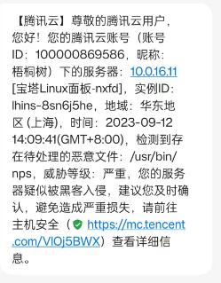
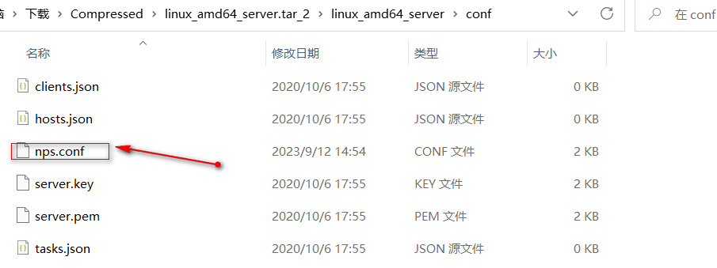

资料来源：<br/>
[nps实现内网穿透，将公网服务器端口映射到内网服务器端口](https://blog.csdn.net/qq_41813208/article/details/113760249)<br/>
[超简单安装NPS内网穿透服务器](https://zhuanlan.zhihu.com/p/316438148)<br/>
 [socks5代理ip几种工具](https://www.cnblogs.com/edeny/p/16530270.html)<br/>

## nps 介绍
功能介绍:一款轻量级、高性能、功能强大的内网穿透代理服务器协议支持全面，兼容几乎所有常用协议，例如tcp、udp、http(s)、socks5、p2p、http代理...全平台兼容(linux、windows、macos、群辉等)，支持一键安装为系统服务控制全面，同时支持服务端和客户端控制https集成，支持将后端代理和web服务转成https，同时支持多证书操作简单，只需简单的配置即可在web ui上完成其余操作展示信息全面，流量、系统信息、即时带宽、客户端版本等扩展功能强大，该有的都有了（缓存、压缩、加密、流量限制、带宽限制、端口复用等等）域名解析具备自定义header、404页面配置、host修改、站点保护、URL路由、泛解析等功能服务端支持多用户和用户注册功能

~~~~
欢迎使用 nps ，这是一款轻量级、功能强大的内网穿透代理服务器。支持tcp、udp流量转发，支持内网http代理、内网socks5代理，同时支持snappy压缩、站点保护、加密传输、多路复用、header修改等。支持web图形化管理，集成多用户模式。
当前 app 文件:【2019-6-6】，最新 app 文件:【】
下载地址: https://github.com/ehang-io/nps/releases
教程地址: 中文文档 nps图文教程
服务端一键安装脚本：bash <(curl -L -s https://opt.cn2qq.com/opt-script/nps.sh)
~~~~

## nps 安装

#### 安装过程

wget命令安装 （因为我安装的是centos系统需要安装）

~~~~c
yum -y install wget
yum -y install setup
yum -y install perl
~~~~

下载NPS源码（源码下载地址根据自己的设备需求选择,演示使用的是海外节点)

国内地址:[https://gitee.com/easy-know/nps](https://link.zhihu.com/?target=https%3A//gitee.com/easy-know/nps)

海外地址:[https://github.com/ehang-io/nps/releases](https://link.zhihu.com/?target=https%3A//github.com/ehang-io/nps/releases)

```text
wget https://github.com/ehang-io/nps/releases/download/v0.26.9/linux_amd64_server.tar.gz
```

解压NPS

```text
tar -zxvf linux_amd64_server.tar.gz
```

安装NPS

```text
sudo ./nps install
```

启动NPS（命令任选一个）

```text
sudo nps start
./nps start
```

启动完成之后我们可以先访问下服务器端（如http://34.92.47.58:8080/）版本的不同页面有所差别功能其实都一样


--------------------------------------------------------------------------------------------------------------------
注意事项:①NPS内网穿透占用服务端默认占用的端口:80 443 8080 8024（必要的端口一定要放行，不然无法启动服务，在使用其他端口的时候也需要放行或者关闭防火墙）

②安装好服务端后需要及时的修改默认的账号和密码一般默认配置文件路径在/etc/nps/conf/nps.conf，修改好好重启服务器生效（reboot命令重启）

```text
#web
web_host=a.o.com
web_username=admin  #修改成你自己喜欢的用户名
web_password=123      #修改成你自己喜欢的密码
web_port = 8080
web_ip=0.0.0.0
web_base_url=
web_open_ssl=false
web_cert_file=conf/server.pem
web_key_file=conf/server.key
```

操作文档手册:[https://ehang-io.github.io/nps/#](https://link.zhihu.com/?target=https%3A//ehang-io.github.io/nps/%23/install)

### 修改配置

前提是安装好nps服务，因为安装过后会将配置文件放到`/etc`目录下

~~~~text
vim /etc/nps/conf/nps.conf
~~~~


重新启动服务器

启动完后通过，`netstat -nltp | grep 8080`看一下这个服务是否是正常启动着，然后我们访问这个web管理界面，输入用户名和密码进行登录管理

#### 登录web管理页面进行登录管理

输入 `服务器ip+端口`
就进入了下面的界面
输入之前配置的`用户名和密码`进行登录


登录后就是下面的界面


## docker 方式安装

本来采用的直接安装的方式，但是在腾讯云上会收到报警。去除了报警之后，服务器会变的非常的差。重启也无用。无奈之下，我备份文件，重装了系统



上传config目录

从 https://github.com/ehang-io/nps/tree/master/conf 下载下的zip解压并上传到服务器



和上面的配置一样，修改`nps.config`

**启动docker容器** 我是在/nps/conf这个目录下放了配置文件，所以命令如下:

```shell
docker run -d --name=NPS_Server --restart=always --net=host -v /root/nps/conf:/conf ffdfgdfg/nps
```

启动服务后，和之前的是相同的

## 客户端的配置

### 修改配置文件

下载客户端，根据内网服务器的操作系统下载对应的client

以windows为例
因为nps提供了很多中方式的连接，先以简单的tcp为例，后面再把更好的p2p也讲一下


下载客户端（根据操作系统自行选择）
因为我演示的环境是windows所以下载的是下面这个，如果是其它操作系统则下载带client的压缩包


注意这个文件解压缩是没有文件夹的所以如果直接解压到当前路径则会导致下面文件会直接在当前路径下，建议右键 解压缩到压缩包名

### 直接启动服务


```text
./npc -server=你的IP:8024 -vkey=唯一验证密码 -type=tcp
```


修改配置文件


登录管理后台可以看到，设备已经是在线的状态


我想外网访问本地的`192.168.31.171:3000` 选择tcp 服务器端口，我选择11000 这样

外网访问`http://124.221.127.60:11000/`可以访问本地的服务器了

socks5 使用客户端，就厉害了。配置H5 以后，就可以访问任何内网的服务了（这里我就不介绍了）

[socket5客户端](https://www.cnblogs.com/edeny/p/16530270.html?share_token=C134BBE1-03F6-4296-BBAF-56A5CDAD5B9D&tt_from=weixin&utm_source=weixin&utm_medium=toutiao_ios&utm_campaign=client_share&wxshare_count=1)

比如使用`proxycap` 官网地址：`http://www.proxycap.com/`


### 方法二：（不建议）

进入conf 用文本文件打开npc.conf文件

第一个要修改的地方


第二个要修改的地方，这个时候客户端一启动就会讲本地的8080端口连接到服务器的6666端口
也就实现了类似：访问http://yumbo.top:6666就访问到了本机的8080端口


上面就算完成了一个tcp的端口连接
