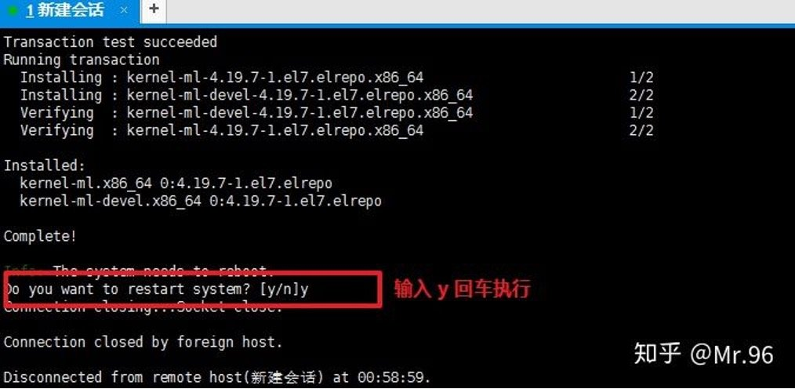
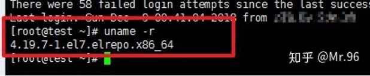
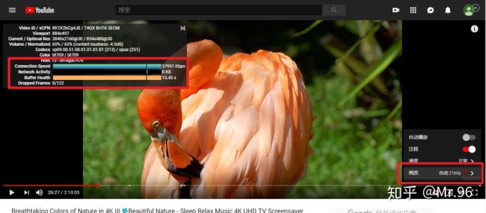
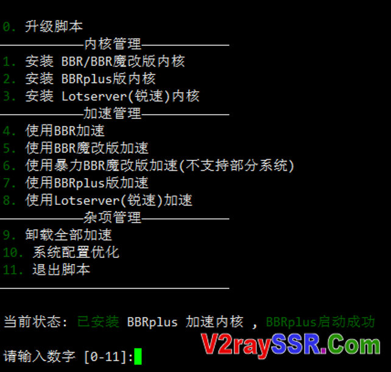

## bbr加速
bbr加速可以增加访问网络速度
### 安装方法
使用root用户登录服务器，执行以下命令：

>  脚本一

~~~~shell
wget --no-check-certificate https://github.com/teddysun/across/raw/master/bbr.sh && chmod +x bbr.sh && ./bbr.sh
~~~~

安装大概需要两分钟，安装完成后会提示是否重启服务器


输入 **y **重启服务器



重启需要一般只要几十秒

重新连接服务器，验证是否成功安装最新内核并开启 BBR 加速，执行命令：

```
uname -r
```

内核版本显示为最新版就表示 BBR 加速安装完成了



成功安装 BBR 加速的 VPS 速度一般会有数倍提升



如果测试速度没有提升可以多测试几分钟，或者重启一下服务器再进行测试。


### 脚本二

一键安装BBR/暴力BBR/魔改BBR/BBRplus/锐速 (Lotserver)四合一的脚本如下：

~~~~shell
 wget -N --no-check-certificate "https://raw.githubusercontent.com/chiakge/Linux-NetSpeed/master/tcp.sh" && chmod +x tcp.sh && ./tcp.sh
~~~~
