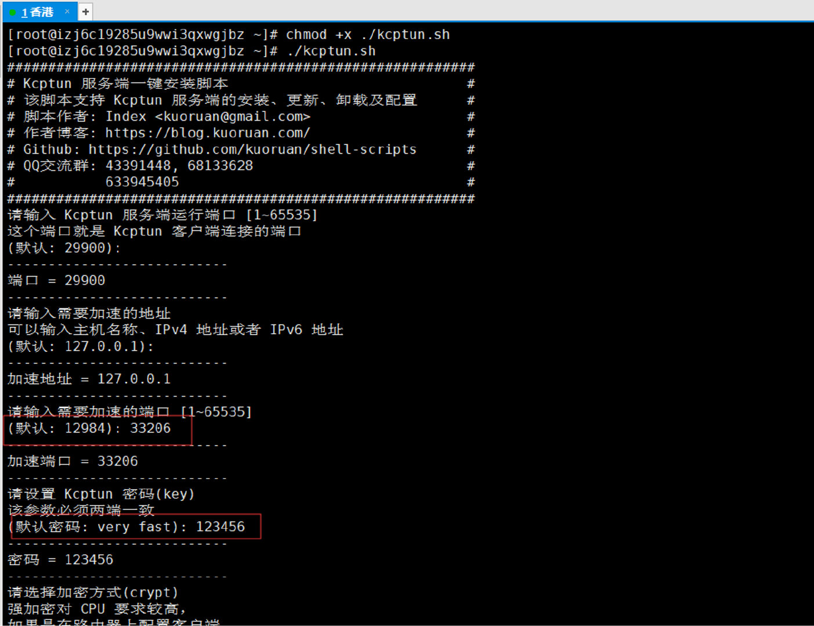
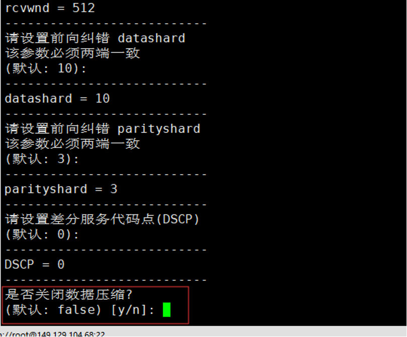
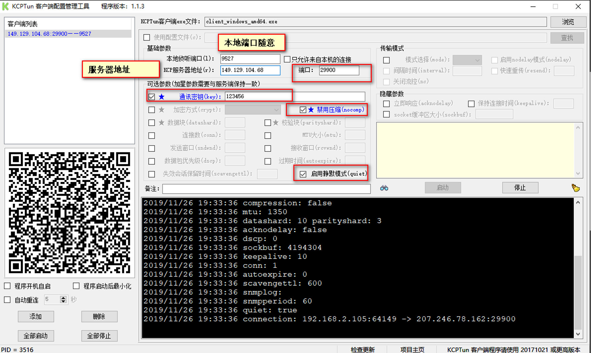

## 翻墙

翻墙违法，请谨慎使用

## 安装ss

通过kcp+ss组合，可用使很差的VPN加速到非常快，具体原理不介绍

自己使用发现，单独的ss网速只有一二百k，可以有十几倍甚至二十多倍的加速

### 安装ss 

执行一键安装脚本

~~~~shell
wget --no-check-certificate https://raw.githubusercontent.com/teddysun/shadowsocks_install/master/shadowsocksR.sh
chmod +x shadowsocksR.sh
./shadowsocksR.sh 2>&1 | tee shadowsocksR.log
~~~~

### 安装kcp

我们使用一键脚本安装

```
wget https://raw.githubusercontent.com/kuoruan/kcptun_installer/master/kcptun.sh

chmod +x ./kcptun.sh

./kcptun.sh

```

基本上一路回车就好了，最后会输出一个成功的信息，记得保存为单独的文件，后面用到。

```
恭喜! Kcptun 服务端安装成功。
服务器IP:  1.1.1.1
端口:  29900
加速地址:  127.0.0.1:12984
key:  111111
crypt:  aes
mode:  fast
mtu:  1350
sndwnd:  512
rcvwnd:  512
datashard:  10
parityshard:  3
dscp:  0
nocomp:  false
quiet:  false

当前安装的 Kcptun 版本为: 20190515
请自行前往:
  https://github.com/xtaci/kcptun/releases/tag/v20190515
手动下载客户端文件

可使用的客户端配置文件为:
{
  "localaddr": ":12984",
  "remoteaddr": "1.1.1.1:29900",
  "key": "111111",
  "crypt": "aes",
  "mode": "fast",
  "mtu": 1350,
  "sndwnd": 512,
  "rcvwnd": 512,
  "datashard": 10,
  "parityshard": 3,
  "dscp": 0,
  "nocomp": false,
  "quiet": false
}

手机端参数可以使用:
  key=111111;crypt=aes;mode=fast;mtu=1350;sndwnd=512;rcvwnd=512;datashard=10;parityshard=3;dscp=0

Kcptun 安装目录: /usr/local/kcptun

已将 Supervisor 加入开机自启,
Kcptun 服务端会随 Supervisor 的启动而启动

更多使用说明: ./kcptun.sh help

如果这个脚本帮到了你，你可以请作者喝瓶可乐:
  https://blog.kuoruan.com/donate

```

kcp 服务使用 supervisor 来管理，用于守护进程。安装完成后，可用的命令为

- 启动 kcptun `supervisorctl start kcptun`
- 重启 kcptun `supervisorctl restart kcptun`
- 关闭 kcptun `supervisorctl stop kcptun`
- 查看 kcptun 日志 `./kcptun.sh log`






## 客户端

### Windows 客户端




分享连接：

> 外链:https://jinlilu.lanzoum.com/b036t5mbc 密码:dgcs

### Linux

外链:https://jinlilu.lanzoum.com/b036t5mbc 密码:dgcs

#### 下载安装包

`https://github.com/xtaci/kcptun/releases` 地址下载对应的 Linux 版本，解压后有可执行文件。

我下载的是 `kcptun-linux-386-20190515.tar.gz`

#### 新建配置文件

`config.json`，这个文件就是安装 `kcptun` 成功后的提示文件

```
{
    "localaddr": "127.0.0.1:2080",
    "remoteaddr": "1.1.1.1:29900",
    "key": "111111",
    "crypt": "aes",
    "mode": "fast",
    "conn": 1,
    "autoexpire": 60,
    "mtu": 1350,
    "sndwnd": 512,
    "rcvwnd": 512,
    "datashard": 70,
    "parityshard": 3,
    "dscp": 46,
    "nocomp": false,
    "acknodelay": false,
    "nodelay": 0,
    "interval": 40,
    "resend": 0,
    "nc": 0,
    "sockbuf": 4194304,
    "keepalive": 10
}

```

#### 建立客户端服务

执行以下指令建立链接，同时在服务器端，使用 `./kcptun.sh log` 可以看到日志输出

```
./client_linux_386 -c config.json --quiet

```

#### 配置客户端 shadowsocket

- 服务器地址 127.0.0.1
- 服务器端口 2080
- 密钥 112233
- 本地地址 127.0.0.1
- 本地端口 1080
- 本地服务器类型 socket5
- 加密方式 chacha20

### MacOS

MacOS 的 shadowsockets-NG 软件的最新版已经内嵌了 kcptun 插件，比较简单

#### 下载软件

下载最新版的软件，在下面的链接中，下载 ShadowsocksX-NG.app.1.8.2.zip，解压后有个 app 文件，挪动到「应用程序」

`https://github.com/shadowsocks/ShadowsocksX-NG/releases`

#### 配置

正常配置 shadowsockets 的链接即可，需要配置插件和插件配置如下

- 服务器 1.1.1.1
- 端口 29900
- 加密方式 chacha20
- 密码 112233
- 插件 kcptun
- 配置 key=111111;crypt=aes;mode=fast;mtu=1350;sndwnd=512;rcvwnd=512;datashard=10;parityshard=3;dscp=0

### Android

#### 下载客户端

需要下载两个软件，小飞机和 kcptun

- shadowsocks-android `https://github.com/shadowsocks/shadowsocks-android/releases`

> 我的是 shadowsocks-arm64-v8a-4.8.0.apk

- kcptun android `https://github.com/shadowsocks/kcptun-android/releases`

> 安装完 kcptun 是没有图标的，这是 shadowsockets 的关联启动
> 华为手机需要在手机管家中设置 kcptun 允许关联启动，不然会提示链接不上服务器

#### 配置

安卓小飞机的配置

- 服务器 1.1.1.1
- 远程端口 29900
- 密码 112233
- 加密方式 chacha20
- 插件 kcptun
- 配置 key=111111;crypt=aes;mode=fast;mtu=1350;sndwnd=512;rcvwnd=512;datashard=10;parityshard=3;dscp=0