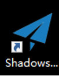

## 常用的其他工具

包括ssr,v2ray,trojan

ss和ssr据说已经被监控了，如果为了安全，还是推荐使用v2ray和trojan。尤其是trojan通过https证书加密。更加安全。

自己实际使用，发现ss+kcp方式。网速可以大幅度提升，效果非常好。一般的国外服务器访问速度只有一二百K，加速后，可以达到四千多K的速度。

## ssr

来源：https://blog.upx8.com/2249

### 配置

可以使用脚本安装

```shell
wget --no-check-certificate https://raw.githubusercontent.com/teddysun/shadowsocks_install/master/shadowsocks.sh
chmod +x shadowsocks.sh
./shadowsocks.sh 2>&1 | tee shadowsocks.log
```

### windows客户端

和ss不同，window客户端



## v2ray

### 客户端

https://jinlilu.lanzoum.com/i6klV01yfmle
密码:bq5g


## trojan

### 介绍

证书自动或手动– 可选签发部署！支持生成Trojan链接及二维码！强烈推荐！！

资料来源： <https://www.v2rayssr.com/trojanweb.html> 

·    在线web 页面和命令行两种方式管理 trojan 多用户

·    启动/ 停止 / 重启 trojan 服务端

·    支持流量统计和流量限制

·    命令行模式管理, 支持命令补全

·    集成acme.sh 证书申请

·    生成客户端配置文件

·    支持trojan://分享链接和二维码分享(二维码仅限 web 页面)

### 安装脚本

- curl

~~~~shell
安装 curl 支持环境
apt -y install curl      #Debian
yum -y install curl     #CentOS
~~~~

- 安装

~~~~Shell
#安装/更新
source <(curl -sL https://git.io/trojan-install)
#卸载
source <(curl -sL https://git.io/trojan-install) --remove
~~~~

### 界面管理

[安装完后，VPS 上面输入 `trojan`]() 可进入管理程序
浏览器访问 [**https://****域名**](https://www.v2rayssr.com/go?url=https://%E5%9F%9F%E5%90%8D) 可在线 web 页面管理 trojan 用户

**注意： 默认的管理员 用户名： admin**


### 客户端下载

https://jinlilu.lanzoum.com/iDWBu01yfm7a
密码:71jt

联网出现

```shell
500 Internal Privoxy Error
Privoxy encountered an error while processing your request:

Could not load template file no-server-data or one of its included components.

Please contact your proxy administrator.

If you are the proxy administrator, please put the required file(s)in the (confdir)/templates directory. The location of the (confdir) directory is specified in the main Privoxy config file. (It's typically the Privoxy install directory).
```


1. 双击WINDOWS底部状态栏的时间
2. 更改日期和时间设置
3. Internet时间
4. 更改设置
5. 立即更新


