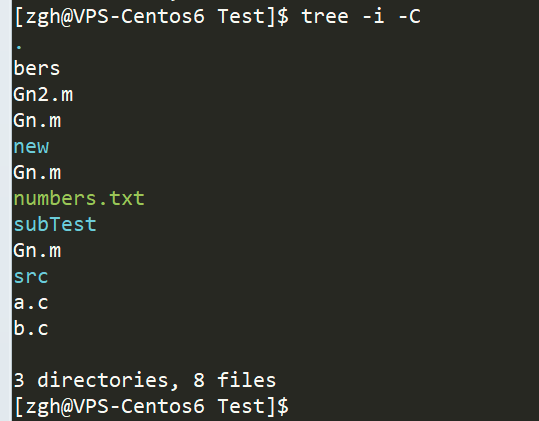

资料来源：<br/>
[生成目录结构图 tree命令](https://zhuanlan.zhihu.com/p/130956933?utm_id=0)

tree命令可用于生成漂亮的目录结构图，在此之前，我一直以为是手打的……

```bash
.
    |   index.html
    |
    \---static
        +---css
        |       bar.css
        |       map.css
        |       
        \---js
                config.js
                report.js
```

## Linux下该命令常用选项

- **-A 使用ASNI绘图字符显示树状图而非以ASCII字符组合**


- **-C 使用颜色区分文件类型**

ls命令默认使用颜色来区分不同类型文件，而tree命令使用**-C** 选项后，亦可以实现该效果；反之，使用 **-n** 选项则不使能颜色


- **-N 可用于支持显示中文字符**


- **-a 显示隐藏文件(以.开头)**


- **-i 不显示树形缩进线**





- **-d 只显示目录**


- **-f 显示路径**


- **-F 为不同类型文件添加标识**

该选项和ls命令中的该选项的效果一致，根据文件类型添加标识符号

> 执行文件: ***** , 目录: **/** , Socket: **=** , 符号连接: **@** , 管道: **|**


- **-s 显示文件大小, Unit: bytes**


- **-h 使用人易读的单位显示文件大小**


- **-p 显示文件权限**


- **-P 只显示符合通配符的文件**


- **-I 不显示符合通配符的文件**


- **-L [num] 指定显示的最大深度**


## Windows下该命令常用选项

windows下支持的命令选项有:

```c
/f   显示每个文件夹中文件的名称
    /a   使用 ASCII 字符，而不使用扩展字符
```

- **/a 选项**

该选项为使用ASCII字符绘制目录结构图，如下图所示


- **/f 选项**

tree命令默认只显示文件夹，若想显示文件，则需添加该选项，如下图所示


