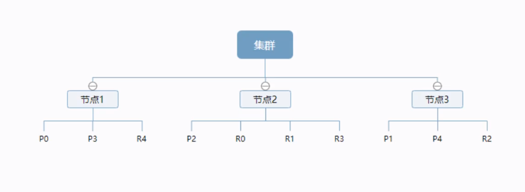
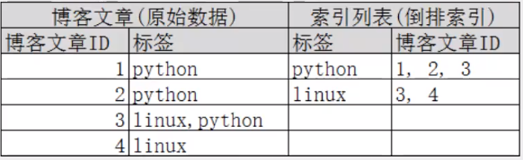

资料来源：<br/>
[Elasticsearch通关教程（一）： 基础入门](https://developer.aliyun.com/article/694252)

[Elasticsearch 通关教程（二）： 索引映射Mapping问题](https://developer.aliyun.com/article/694260?spm=a2c6h.13262185.profile.8.10b44599fske9u)

[狂神说笔记之ElasticSearch](https://blog.csdn.net/gouzhengju1454/article/details/117707976#comments_16924081)


## Elaticsearch介绍

### 历史

年前，一个叫做Shay Banon的刚结婚不久的失业开发者，由于妻子要去伦敦学习厨师，他便跟着也去了。在他找工作的过程中，为了给妻子构建一个食谱的搜索引擎，他开始构建一个早期版本的Lucene。

直接基于Lucene工作会比较困难，所以Shay开始抽象Lucene代码以便lava程序员可以在应用中添加搜索功能。他发布了他的第一个开源项目，叫做“Compass”。

后来Shay找到一份工作，这份工作处在高性能和内存数据网格的分布式环境中，因此高性能的、实时的、分布式的搜索引擎也是理所当然需要的。然后他决定重写Compass库使其成为一个独立的服务叫做Elasticsearch。

第一个公开版本出现在2010年2月，在那之后Elasticsearch已经成为Github上最受欢迎的项目之一，代码贡献者超过300人。一家主营Elasticsearch的公司就此成立，他们一边提供商业支持一边开发新功能，不过Elasticsearch将永远开源且对所有人可用。

Shay的妻子依旧等待着她的食谱搜索…..


## Elaticsearch核心概念

### 概述

1、索引（ElasticSearch）

- 包多个分片

2、字段类型（映射）

- 字段类型映射（字段是整型，还是字符型…）

3、文档

4、分片（Lucene索引，倒排索引）

!>  ElasticSearch是面向文档，关系行数据库和ElasticSearch客观对比！<font color='red'>一切都是JSON！</font>

| Relational DB | ElasticSearch  |
| ------------- | -------------- |
| 数据库（database） | 索引（indices）    |
| 表（tables）     | types (慢慢会被弃用) |
| 行（rows）       | documents      |
| 字段（columns）   | fields         |

elasticsearch（集群）中可以包含多个索引（数据库） ,每个索引中可以包含多个类型（表） ,每个类型下又包含多个文档（行） ,每个文档中又包含多个字段（列）。

物理设计:
elasticsearch在后台把每个索引划分成多个分片，每分分片可以在集群中的不同服务器间迁移

一个人就是一个集群! ，即启动的ElasticSearch服务，默认就是一个集群，且默认集群名为elasticsearch

访问浏览器`http://192.168.191.102:9200/`（cluster_name）

```
{
  "name" : "1ddb42c92668",
  "cluster_name" : "docker-cluster",
  "cluster_uuid" : "bFOG3yOISiqEjr1C_CKYiA",
  "version" : {
    "number" : "7.2.0",
    "build_flavor" : "default",
    "build_type" : "docker",
    "build_hash" : "508c38a",
    "build_date" : "2019-06-20T15:54:18.811730Z",
    "build_snapshot" : false,
    "lucene_version" : "8.0.0",
    "minimum_wire_compatibility_version" : "6.8.0",
    "minimum_index_compatibility_version" : "6.0.0-beta1"
  },
  "tagline" : "You Know, for Search"
}
```

一个人就是一个集群! ，即**启动的ElasticSearch服务，默认就是一个集群，且默认集群名为elasticsearch**

### 逻辑设计

一个索引类型中，包含多个文档，比如说文档1，文档2。当我们索引一篇文档时，可以通过这样的顺序找到它：索引 => 类型 => 文档ID ，通过这个组合我们就能索引到某个具体的文档。 注意：ID不必是整数，实际上它是个字符串。

?> 文档（”行“）

之前说elasticsearch是面向文档的，那么就意味着索引和搜索数据的最小单位是文档，elasticsearch中，文档有几个重要属性:

- 自我包含，一篇文档同时包含字段和对应的值，也就是同时包含key:value !
- 可以是层次型的，一个文档中包含自文档，复杂的逻辑实体就是这么来的! {<font color='red'>就是一个json对象 ! fastjson进行自动转换</font> !}
- 灵活的结构，文档不依赖预先定义的模式，我们知道关系型数据库中，要提前定义字段才能使用，在elasticsearch中，对于字段是非常灵活的，有时候,我们可以忽略该字段，或者动态的添加一个新的字段。

尽管我们可以随意的新增或者忽略某个字段，但是，每个字段的类型非常重要，比如一个年龄字段类型，可以是字符串也可以是整形。因为elasticsearch会保存字段和类型之间的映射及其他的设置。这种映射具体到每个映射的每种类型，这也是为什么在elasticsearch中，类型有时候也称为映射类型

?>  类型（“表”）   

类型是文档的逻辑容器，就像关系型数据库一样，表格是行的容器。类型中对于字段的定义称为映射，比如name映射为字符串类型。我们说文档是无模式的，它们不需要拥有映射中所定义的所有字段，比如新增一个字段，那么elasticsearch是怎么做的呢?

- elasticsearch会自动的将新字段加入映射，但是这个字段的不确定它是什么类型，elasticsearch就开始猜，如果这个值是18，那么elasticsearch会认为它是整形。但是elasticsearch也可能猜不对，所以最安全的方式就是提前定义好所需要的映射，这点跟关系型数据库殊途同归了，先定义好字段，然后再使用，别整什么幺蛾子。

?>  索引（“库”）   

索引是映射类型的容器， elasticsearch中的索引是一个非常大的文档集合。 索引存储了映射类型的字段和其他设置。然后它们被存储到了各个分片上了。我们来研究下分片是如何工作的。

**物理设计：节点和分片 如何工作**

创建新索引


一个集群至少有一个节点，而一个节点就是一个elasricsearch进程，节点可以有多个索引默认的，如果你创建索引，那么索引将会有个5个分片(primary shard ,又称主分片)构成的，每一个主分片会有一个副本(replica shard，又称复制分片)



上图是一个有3个节点的集群，可以看到主分片和对应的复制分片都不会在同一个节点内，这样有利于某个节点挂掉了，数据也不至于失。实际上，一个分片是一个Lucene索引（一个ElasticSearch索引包含多个Lucene索引 ） ，一个包含倒排索引的文件目录，倒排索引的结构使得elasticsearch在不扫描全部文档的情况下，就能告诉你哪些文档包含特定的关键字。不过，等等，倒排索引是什么鬼?

倒排索引（Lucene索引底层）

> 简单说就是 按（文章关键字，对应的文档0个或多个）形式建立索引，根据关键字就可直接查询对应的文档（含关键字的），无需查询每一个文档，如下图   




###  Rest风格说明

**一种软件架构风格**,而不是标准,只是提供了一组设计原则和约束条件。它主要用于客户端和服务器交互类的软件。基于这个风格设计的软件可以**更简洁**，**更有层次**，**更易于实现缓存**等机制。

| method     | url地址                                    | 描述           |
| ---------- | ---------------------------------------- | ------------ |
| PUT（创建,修改） | localhost:9200/索引名称/类型名称/文档id            | 创建文档（指定文档id  |
| POST（创建）   | localhost:9200/索引名称/类型名称                 | 创建文档（随机文档id） |
| POST（修改）   | localhost:9200/索引名称/类型名称/文档id/_update    | 修改文档         |
| DELETE（删除） | localhost:9200/索引名称/类型名称/文档id            | 删除文档         |
| GET（查询）    | localhost:9200/索引名称/类型名称/文档id            | 查询文档通过文档ID   |
| POST（查询）   | localhost:9200/localhost:9200/索引名称/类型名称/文档id/_search | 查询所有数据       |


### 字段数据类型

字符串类型

- text、keyword

> text：支持分词，全文检索,支持模糊、精确查询,不支持聚合,排序操作;text类型的最大支持的字符长度无限制,适合大字段存储；

> keyword：不进行分词，直接索引、支持模糊、支持精确匹配，支持聚合、排序操作。keyword类型的最大支持的长度为——32766个UTF-8类型的字符,可以通过设置ignore_above指定自持字符长度，超过给定长度后的数据将不被索引，无法通过term精确匹配检索返回结果。

- 数值型

long、Integer、short、byte、double、float、half float、scaled float

- 日期类型

date

- te布尔类型

boolean

- 二进制类型

binary
等等…

### 指定字段的类型（使用PUT）

!> 创建规则      类似于建库（建立索引和字段对应类型），也可看做规则的建立

~~~~Json
PUT /test2
{
  "mappings": {
    "properties": {
      "name": {
        "type": "text"
      },
      "age": {
        "type": "long"
      },
      "birthday": {
        "type": "date"
      }
    }
  }
}
~~~~


