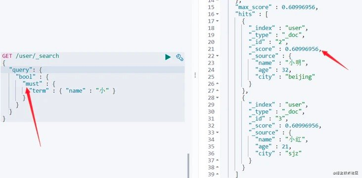
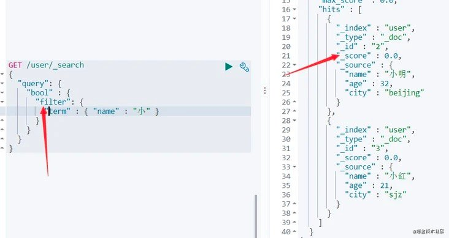

资料来源：

[Elasticsearch操作实践手册|建议收藏篇](https://segmentfault.com/a/1190000038278910)

[总结ES的各种查询与打分方式:](https://blog.csdn.net/u011467621/article/details/100065071)

[全文检索-ELASTICSEARCH-进阶-QUERYDSL基本使用&MATCH_ALL](https://www.freesion.com/article/7026743230/)

### DSL 介绍

> Elasticsearch提供了一个完整的基于JSON的查询DSL(领域特定语言)来定义查询。可以将查询DSL看作查询的AST(抽象语法树)，它由两种类型的子句组成:Leaf query clauses(叶查询子句)和Compound query clauses(复合查询子句)

以上摘自官网，简单来说，DSL就是将查询条件放到JSON中，进行查询。

**Leaf query clauses**在特定字段上查找特定的值，例如`match`、`term`、`range`查询等等。

**Compound query clauses**将叶查询子句和其他符合查询子句结合起来，例如`bool`查询等等。

match_all: 查询所有字段
match 查询某个字段，并且根据(tfidf or bm25)打分
match_pharse 查询短语，区别于match他要考虑前后顺序. 可以设置slop=整数，来设定词语之间的最大距离
term: 查询单个词(区别于match, 是查询没有被analysize的语料(即比如大小写转换。。)).
terms: 查询多个词
query_string: 支持复杂语法，一般不用
区分查询与过滤器: 过滤器是筛选(bool)，查询是要打分的
match, phrase_prefix查询前缀
bool查询与过滤器: must, should, must_not. (最小should, minimum_should_match)
range查询与过滤器

~~~~json
# 创建索引
PUT /user
{
  "mappings": {
    "properties": {
      "name": { "type": "text" },
      "age": {"type": "short"},
      "city":{"type": "keyword"}
    }
  }
}

# 单条写入
POST /user/_doc/1
{
  "name":"pjjlt",
  "age":26,
  "city":"sjz"
}

# 多条写入
POST _bulk
{"create":{"_index":"user","_id":"2"}}
{"name":"小明","age":32,"city":"beijing"}
{"create":{"_index":"user","_id":"3"}}
{"name":"小红","age":21,"city":"sjz"}
{"index":{"_index":"user","_id":"4"}}
{"name":"mark","age":22,"city":"tianjin"}
~~~~

测试数据

| id   | Name  | age  | City    |
| ---- | ----- | ---- | ------- |
| 1    | pjjlt | 26   | sjz     |
| 2    | 小明    | 32   | beijing |
| 3    | 小红    | 21   | sjz     |
| 4    | mark  | 22   | tianjin |


### match

match是一个标准查询，当查询一个文本的时候，会先将文本分词。当查询确切值的时候，会搜索给定的值，例如数字、日期、布尔或者被not_analyzed的字符串。

```json
GET /user/_search
{
  "query": {
    "match": {
      "name":"小明"
    }
  }
}
```

上面的操作会先将“小明”分词为“小”、“明”(当然具体还要看你的分词器)，然后再去所有文档中查找与之相匹配的文档，并根据关联度排序返回。

查询结果

~~~~json
{
  "took" : 1,
  "timed_out" : false,
  "_shards" : {
    "total" : 1,
    "successful" : 1,
    "skipped" : 0,
    "failed" : 0
  },
  "hits" : {
    "total" : {
      "value" : 2,
      "relation" : "eq"
    },
    "max_score" : 1.9243729,
    "hits" : [
      {
        "_index" : "user",
        "_type" : "_doc",
        "_id" : "2",
        "_score" : 1.9243729,
        "_source" : {
          "name" : "小明",
          "age" : 32,
          "city" : "beijing"
        }
      },
      {
        "_index" : "user",
        "_type" : "_doc",
        "_id" : "3",
        "_score" : 0.74487394,
        "_source" : {
          "name" : "小红",
          "age" : 21,
          "city" : "sjz"
        }
      }
    ]
  }
}
~~~~

查询的结果，小明，小红两个对象。小明的分值明显高于小红

### match_phrase

> match_phrase会保留空格，match会把空格忽略。


match_phrase 会将检索关键词分词。match_phrase的分词结果必须在被检索字段的分词中都包含，而且顺序必须相同，而且默认必须都是连续的。

~~~~json
GET /user/_search
{
  "query": {
    "match_phrase": {
      "name":"小 明"
    }
  }
}
~~~~

注意，分词是空格会给前一个元素，比如上面的字符串分子之后是，“小 ”，“明”。

查询结果只有小明

### multi_match

> 多字段查询，一个查询条件，看所有多个字段是否有与之匹配的字段。后面我们也可以使用`should`更加灵活。
>

~~~~json
GET /user/_search
{
  "query": {
    "multi_match": {
      "query":    "小明", 
      "fields": [ "name","city" ] 
    }
  }
}
~~~~

name /city 中有match 小明。因为city中没有小明相关的内容，查询结果小明和小红两条记录

### match_all

> 匹配所有，并可设置这些文档的`_score`，默认`_score`为1，这里没有计算`_score`，所以速度会快很多。

~~~~json
GET /user/_search
{
  "query": {
    "match_all": { "boost" : 1.2 }
  }
}
~~~~

`boost`参数可以省略，默认是1。

### term

term是一种完全匹配，主要用于精确查找，例如数字、ID、邮件地址等。

~~~~json
# term
GET /user/_search
{
  "query": {
    "term": {
      "age": 22
    }
  }
}
~~~~

结果只有mark

### terms

> terms是term多条件查询，参数可以传递多个，以数组的形式表示。

~~~~json
# terms
GET /user/_search
{
  "query": {
    "terms": {
      "age": [
        21,
        22
      ]
    }
  }
}
~~~~

查询的结果是小红，mark

### wildcard

> 通配符，看示例容易理解，通配符可以解决分词匹配不到的问题，例如'haha' 可以通过'*a'匹配。

~~~~json
# wildcard
GET /user/_search
{
  "query": {
    "wildcard": {
      "name":"*小"
    }
  }
}
~~~~

查询结果是小明和小红

### exists

> 查看某文档是否有某属性，返回包含这个`Filed`的文档。

~~~~json
GET /user/_search
{
  "query": {
    "exists": {
      "field": "name"
    }
  }
}
~~~~

查询结果是全部数据

### fuzzy

> 返回与查询条件相同或者相似的匹配内容。

~~~~json
GET /user/_search
{
  "query": {
    "fuzzy": {
      "name":"pjjlt"
    }
  }
}
~~~~

查询结果是：pjjlt

?> 换成小明，就查询不到数据

### ids

> 多id查询，这个id是主键id，即你规定或者自动生成那个。

~~~~json
GET /user/_search
{
  "query": {
    "ids": {
      "values":[1,2]
    }
  }
}
~~~~

查询id=1, id=2 的结果，pjjlt，和小明

### prefix

> 前缀匹配

~~~~json
GET /user/_search
{
  "query": {
    "prefix": {
      "name":"小"
    }
  }
}
~~~~

查询结果是小明和小红

### range

> 范围匹配。参数可以是 **gt**(大于)、**gte**(大于等于)、**lt**(小于)、**lte**(小于等于)

~~~~json
GET /user/_search
{
  "query": {
    "range": {
      "age":{
          "gt":30,
          "lt":40
      }
    }
  }
}
~~~~

查询结果是：小明

### regexp

> 正则匹配。value是正则表达式，flags是匹配格式，默认是ALL，开启所有。更多格式[请戳](https://link.segmentfault.com/?enc=sfRN6Ei7p2NbtarfSDOjbg%3D%3D.%2FXn9EUoe8HsW5jYgZBGH4W285ytc85VT15FldSWx9vFAj5cK5TkaOPOlbo5n1QFPmxjepBx50qn7zOVhOSyeoG5yvV4YWUSlFraj7z1dYp9mJ9jua5G4jGPuQeMKAXsU1DQ7WDFFjKYVbJT43APMkA%3D%3D)

~~~~json
GET /user/_search
{
  "query": {
    "regexp": {
      "name":{
          "value": "p.*t",
          "flags": "ALL"
      }
    }
  }
}
~~~~

### bool

> bool 可以用来组合其他子查询。其中常包含的子查询包含：must、filter、should、must_not

#### must

`must`内部的条件必须包含，内部条件是`and`的关系。如查看所有name中包含“小”并且age是32的用户文档。

~~~~json
GET /user/_search
{
  "query": {
    "bool": {
      "must": [
        {
          "term": {
            "name": "小"
          }
        },
        {
          "term": {
            "age": 32
          }
        }
      ]
    }
  }
}
~~~~

小明，年龄30岁两个条件

#### filter

`filter`是文档通过一些条件过滤下，这是四个关键词中唯一**和关联度无关的，不会计算_score**，经常使用的过滤器会产生缓存。

~~~~json
GET /user/_search
{
  "query": {
    "bool" : {
      "filter": {
        "term" : { "name" : "小" }
      }
    }
  }
}
~~~~






对比两张图可以看出，filter并没有计算_score，搜索速度较快。

#### must_not

这个和`must`相反，文档某字段中一定不能包含某个值，相当于“非”。

#### should

`should`可以看做`or`的关系，例如下面查询name包含"小"或者年龄是18岁的用户。

~~~json
GET /user/_search
{
  "query": {
    "bool" : {
      "should": [
        {"term" : { "name" : "小" }},
        {"term" : { "age" : 26 }}
      ]
    }
  }
}
~~~

查询到小明和小红，同时间把年龄26的pjjlt也查询到了

### 其他

分页

- query 定义如何查询；
- match_all 查询类型【代表查询所有的所有】， es 中可以在 query 中组合非常多的查询类型完成复杂查询
- 除了 query 参数之外，我们也可以传递其它的参数以改变查询结果。如 sort，size；
- from+size 限定，完成分页功能；
- sort 排序，多字段排序，会在前序字段相等时后续字段内部排序，否则以前序为准
~~~~Json
GET /user/_search
{
  "query": {
    "match_all": {}
  },
  "_source": [
    "name",
    "age"
  ],
  "sort": [
    {
      "age": {
        "order": "desc"
      }
    }
  ],
  "from": 0,
  "size": 2
}
~~~~

只返回 `_source` 中指定的字段，类似于 MySQL 中的 `select field_1,field_2,... from table`