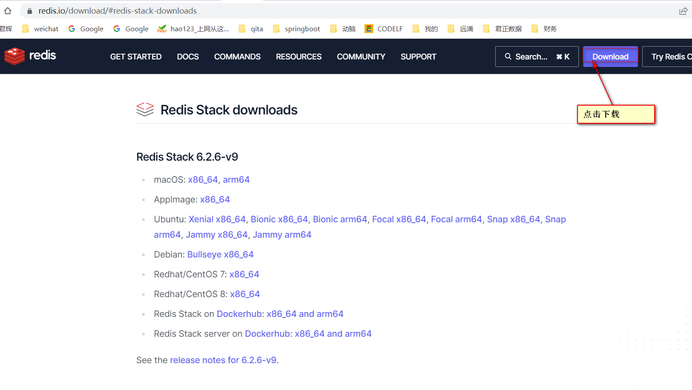
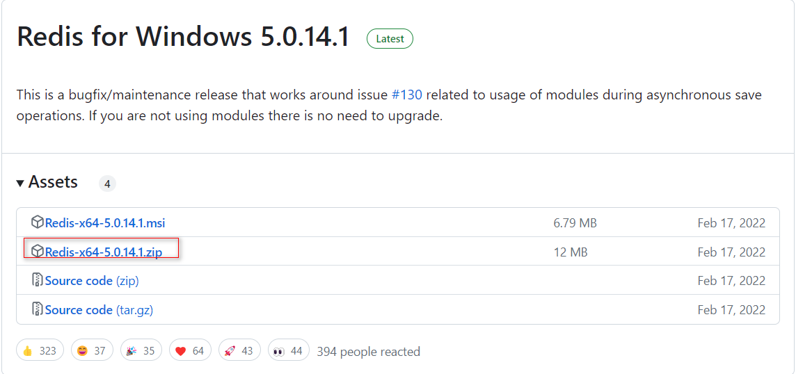
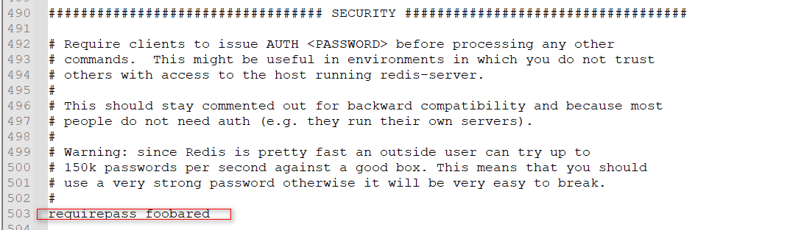
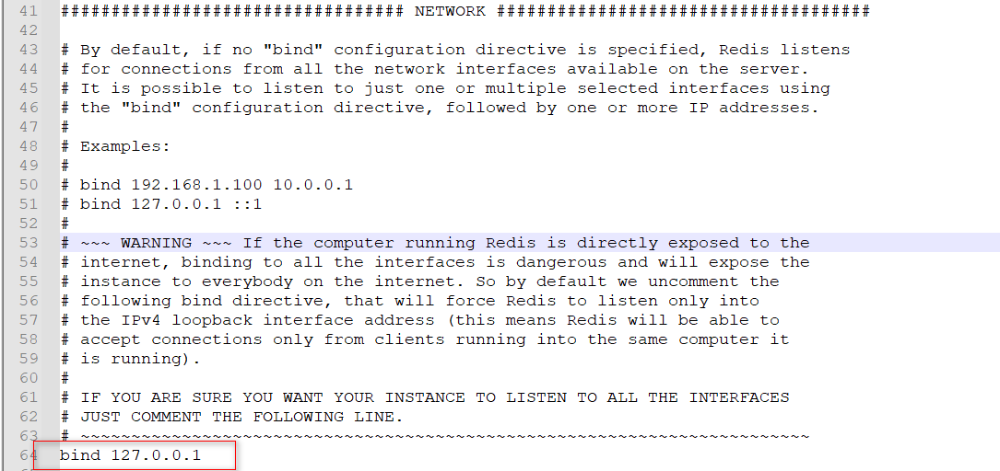
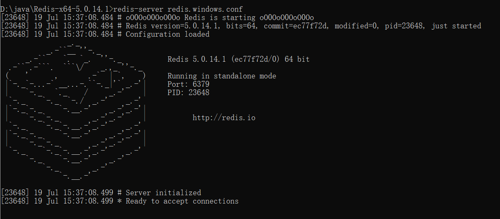
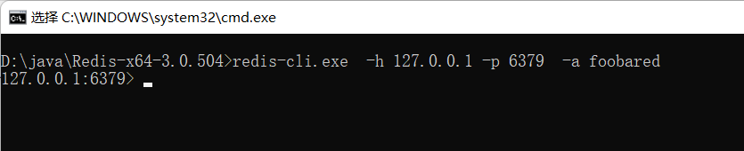

资料来源：<br/>
[为什么我推荐你使用 Redis 实现用户签到系统](https://mrhelloworld.com/redis-sign/)<br/>
[最通俗易懂的 Redis 架构模式详解](https://mrhelloworld.com/redis-architecture/)<br/>
[16个 Redis 常见使用场景](https://mp.weixin.qq.com/s/c-86kFGd3M33sRsKhTUOPA)<br/>
[这份 Redis 使用规范，拿走不谢](https://mp.weixin.qq.com/s/mBNEgdpJyA7fOw-4A2YXWQ)<br/>
[Redis为什么这么快？Redis的线程模型与Redis多线程](https://mp.weixin.qq.com/s/-4OrfWjrNVDpyx5IILcq7Q)<br/>
[Redis下载和安装（Windows系统）](https://blog.csdn.net/Itmastergo/article/details/131569908)<br/>
[既然有Map了，为什么还要有Redis？](https://juejin.cn/post/7207743145998794789)


## window 版本的安装


虽然 [Redis 官方网站](https://redis.io/)没有提供 Windows 版的安装包，但可以通过 GitHub 来下载 Windows 版 Redis 安装包，下载地址：[点击前往](https://github.com/tporadowski/redis/releases)。

!> 注意：Windows 安装包是某位民间“大神”根据 Redis 源码改造的，并非 Redis 官方网站提供。



### 下载redis

选择需要下载的版本，找到`assets`下面需要下载文件，我选择`.zip`版本 



### 启动服务和连接

**修改配置**

配置信息在`redis.windows.conf`文件中



打开`#`注释，设置密码



`bind 127.0.0.1`

表示只能本地访问，不能远程访问。如果其他需要访问，需要注释掉

**启动服务**

创建一个脚本`start.bat`文件

```shell
redis-server redis.windows.conf
```



**本地连接**

创建一个脚本`startTestCli.bat`文件

```shell
redis-cli.exe  -h 127.0.0.1 -p 6379  -a foobared
```



可以看到服务器启动，可以进行连接成功