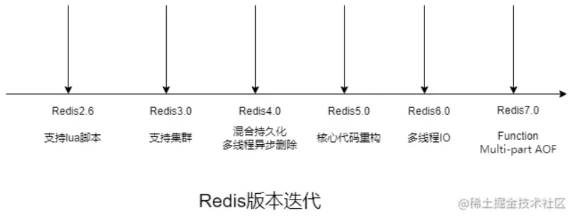
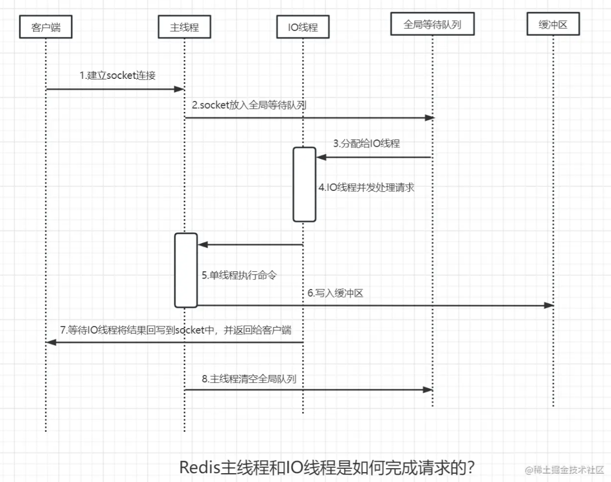

资料来源： 
[既然有Map了，为什么还要有Redis？](https://juejin.cn/post/7207743145998794789)
[Redis为什么选择单线程？Redis为什么这么快？](https://juejin.cn/post/7212616585767993403)

## 常见的问题

###  同样是缓存，用map不行吗？

1. Redis可以存储几十个G的数据，Map行吗？
2. Redis的缓存可以进行本地持久化，Map行吗？
3. Redis可以作为分布式缓存，Map只能在同一个JVM中进行缓存；
4. Redis支持每秒百万级的并发，Map行吗？
5. Redis有过期机制，Map有吗？
6. Redis有丰富的API，支持非常多的应用场景，Map行吗？

### Redis为什么是单线程的？

1. 代码更清晰，处理逻辑更简单；
2. 不用考虑各种锁的问题，不存在加锁和释放锁的操作，没有因为可能出现死锁而导致的性能问题；
3. 不存在多线程切换而消耗CPU；
4. 无法发挥多核CPU的优势，但可以采用多开几个Redis实例来完善；

### Redis真的是单线程的吗？

Redis6.0之前是单线程的，Redis6.0之后开始支持多线程；

Redis内部使用了基于epoll的多路服用，也可以多部署几个Redis服务器解决单线程的问题；

Redis主要的性能瓶颈是内存和网络；

内存好说，加内存条就行了，而网络才是大麻烦，所以Redis6内存好说，加内存条就行了；

而网络才是大麻烦，所以Redis6.0引入了多线程的概念，

Redis6.0在网络IO处理方面引入了多线程，如网络数据的读写和协议解析等，需要注意的是，执行命令的核心模块还是单线程的。

### Redis优缺点

#### 1、优点

1. Redis是KV数据库，MySQL是关系型数据库，Redis速度更快；
2. Redis数据操作主要在内存中，MySQL主要将数据存储在硬盘，Redis速度更快；
3. Redis同样支持持久化（RDB+AOF），Redis支持将数据异步将内存的数据持久化到硬盘上，避免Redis宕机出现数据丢失的问题；
4. Redis性能极高，读的速度是110000次/秒，写的速度是81000次/秒；
5. Redis数据类型丰富，不仅支持KV键值对，还支持list、set、zset、hash等数据结构的存储；
6. Redis支持数据的备份，即master-slave模式的数据备份；
7. Redis支持简单的事务，操作满足原子性；
8. Redis支持读写分离，分担读的压力；
9. Redis支持哨兵模式，实现故障的自动转移；
10. 单线程操作，避免了频繁的上下文切换；
11. 采用了非阻塞I/O多路复用机制，性能卓越；

#### 2、缺点

1. 数据存储在内存，容易造成数据丢失；
2. 存储容量受内存的限制，只能存储少量的常用数据；
3. 缓存和数据库双写一致性问题；
4. 用于缓存时，容易出现内存穿透、缓存击穿、缓存雪崩的问题；
5. 修改配置文件后，需要进行重启，将硬盘中的数据同步到内存中，消耗的时间较长，而且数据同步的时间里Redis不能提供服务；

### Redis常见业务场景

1. Redis是基于内存的nosql数据库，可以通过新建线程的形式进行持久化，不影响Redis单线程的读写操作
2. 通过list取最新的N条数据
3. 模拟类似于token这种需要设置过期时间的场景
4. 发布订阅消息系统
5. 定时器、计数器
6. 缓存加速、分布式会话、排行榜、分布式计数器、分布式锁；
7. Redis支持事务、持久化、LUA脚本、发布/订阅、缓存淘汰、流技术等特性；

## Redis为什么选择单线程？Redis为什么这么快？

### Redis版本迭代
>Redis2.6，支持lua脚本；
>
>Redis3.0，支持集群；
>
>Redis4.0，混合持久化，多线程异步删除；
>
>Redis5.0，核心代码重构；
>
>Redis6.0，多线程IO；
>
>Redis7.0，Function、Multi-part-AOF；

### Redis4.0之前为什么一直采用单线程？

1、Redis采用单线程模型方便开发和维护；

2、单线程模型也可以通过IO多路复用和非阻塞IO并发处理多客户端请求；

3、对于Redis来说，主要的性能瓶颈是内存和网络，而不是CPU；

### Redis6.0引入多线程

Redis6.0之前，Redis从网络IO处理到实际的读写命令处理，都是单线程的，只不过在数据删除、数据持久化的时候使用的是多线程。

Redis的性能瓶颈主要是网络IO，因此，Redis6.0开始，采用多个IO线程来处理网络请求，提高网络请求处理的并行度。

### Redis主线程和IO线程是如何完成请求的？

#### 1、服务端和客户端建立socket连接

主线程负责建立连接，并把socket放入全局等待队列，主线程通过轮询的方法将socket连接分配给IO线程。

#### 2、IO线程读取并解析请求

主线程一旦把socket分配给IO线程，就会进入阻塞状态，等待IO线程完成客户端请求，此时，采用多个IO线程并行处理。

#### 3、主线程执行请求命令

IO线程解析完请求，主线程还是会以单线程的方式执行这些命令。

#### 4、IO线程会写回socket和主线程清空全局队列

当主线程执行完请求命令后，会将结果写入缓冲区，主线程进入阻塞状态，等待IO线程将结果回写到socket中，并返回给客户端。

回写socket完毕后，主线程清空全局队列。

### 总结
Redis是一个基于内存操作、KV形式的数据库，采取多路复用、非阻塞IO、避免了不必要的上下文切换等特性。
Redis一直存在BigKey问题，因此在Redis4.0引入了多线程异步删除，正式打开Redis多线程新篇章。
Redis6.0引入IO多线程的读写，更高效的处理请求，Redis只是将IO读写变成了多线程，命令的执行还是由主线程单线程执行，因此，多线程下操作Redis不会出现线程安全的问题，不用像Java那样加锁，解锁，这也是Redis为什么这么快的根本原因。
