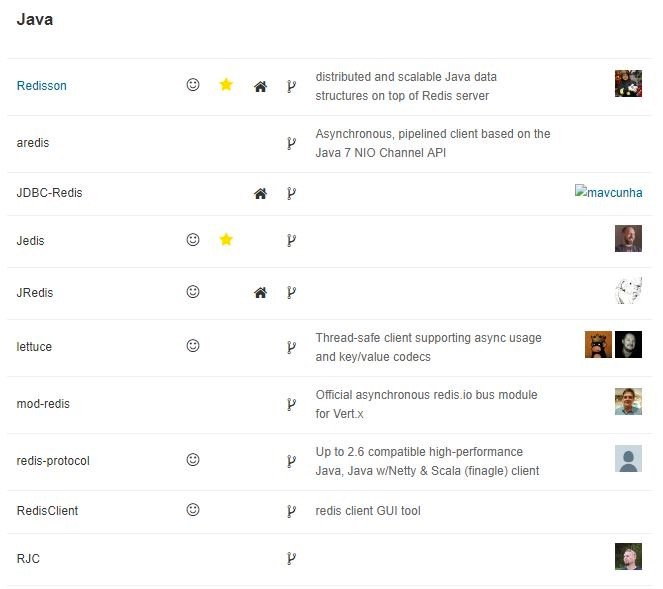
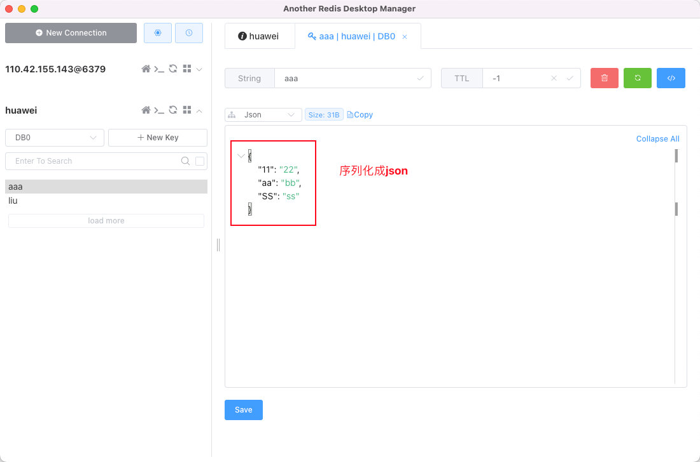

资料来源： 
[为什么我推荐你使用 Redis 实现用户签到系统](https://mrhelloworld.com/redis-sign) 
[RedisTemplate Api总结](https://www.jianshu.com/p/19e851a3edba) 
[全面解析下Spring Boot操作Redis的几种方案](https://www.toutiao.com/article/6734570604680184334/?tt_from=weixin&utm_campaign=client_share&wxshare_count=1&timestamp=1568108248&app=news_article&utm_source=weixin&utm_medium=toutiao_android&req_id=201909101737270100100582030331B163&group_id=6734570604680184334) 
[如何使用RedisTemplate访问Redis数据结构](https://www.jianshu.com/p/7bf5dc61ca06) 
[Spring Boot(三)：Spring Boot 中 Redis 的使用](http://www.ityouknow.com/springboot/2016/03/06/spring-boot-redis.html) [springboot集成redis (Lettuce)](https://blog.csdn.net/u014082714/article/details/105294268?utm_medium=distribute.pc_feed_404.none-task-blog-2defaultBlogCommendFromBaidu~default-7.nonecase)

## springboot集成Redis方案
参考代码：

使用 Java 操作 Redis 的方案很多，Jedis 是目前较为流行的一种方案，除了 Jedis ，还有很多其他解决方案，如下：

在 Spring Boot 中，默认集成的 Redis 就是 Spring Data Redis，默认底层的连接池使用了 lettuce ，开发者可以自行修改为自己的熟悉的，例如 Jedis。

目前java操作redis的客户端有jedis跟Lettuce。在springboot1.x系列中，其中使用的是jedis,但是到了springboot2.x其中使用的是Lettuce。 因为我们的版本是springboot2.x系列，所以今天使用的是Lettuce。

**关于jedis跟lettuce的区别：**

Lettuce 和 Jedis 的定位都是Redis的client，所以他们当然可以直接连接redis server。
Jedis在实现上是直接连接的redis server，如果在多线程环境下是非线程安全的，这个时候只有使用连接池，为每个Jedis实例增加物理连接
Lettuce的连接是基于Netty的，连接实例（StatefulRedisConnection）可以在多个线程间并发访问，应为StatefulRedisConnection是线程安全的，所以一个连接实例（StatefulRedisConnection）就可以满足多线程环境下的并发访问，当然这个也是可伸缩的设计，一个连接实例不够的情况也可以按需增加连接实例。

## Spring Data Redis（推荐）

### 父类的pom

~~~~xml
<?xml version="1.0" encoding="UTF-8"?>
<project xmlns="http://maven.apache.org/POM/4.0.0" xmlns:xsi="http://www.w3.org/2001/XMLSchema-instance" xsi:schemaLocation="http://maven.apache.org/POM/4.0.0 https://maven.apache.org/xsd/maven-4.0.0.xsd">
	<modelVersion>4.0.0</modelVersion>
	<packaging>pom</packaging>
	<modules>
		<module>springboot-data-redis</module>
	</modules>
	<parent>
		<groupId>org.springframework.boot</groupId>
		<artifactId>spring-boot-starter-parent</artifactId>
		<version>2.1.10.RELEASE</version>
		<!--<version>2.2.6.RELEASE</version>-->
		<relativePath /> <!-- lookup parent from repository -->
	</parent>

	<groupId>xyz.guqing</groupId>
	<artifactId>project</artifactId>
	<version>0.0.1-SNAPSHOT</version>
	<name>project</name>
	<description>Demo project for Spring Boot</description>

	<!-- 统计版本管理 -->
	<properties>
		<java.version>8</java.version>
		<mybatis-plus.version>3.3.1.tmp</mybatis-plus.version>
		<!-- Spring Cloud Hoxton.SR5 依赖 -->
		<spring-cloud.version>Hoxton.SR5</spring-cloud.version>
		<!-- spring cloud alibaba 依赖 -->
		<spring-cloud-alibaba.version>2.1.0.RELEASE</spring-cloud-alibaba.version>
		<project.version>0.0.1-SNAPSHOT</project.version>
		<dubbo.version>3.0.7</dubbo.version>
		<nacos-client.version>2.1.0</nacos-client.version>
	</properties>

	<!-- 项目依赖管理 父项目只是声明依赖，子项目需要写明需要的依赖(可以省略版本信息) -->
	<dependencyManagement>
		<dependencies>
			<!--fastjson -->
			<dependency>
				<groupId>com.alibaba</groupId>
				<artifactId>fastjson</artifactId>
				<version>1.1.41</version>
			</dependency>

			<!-- 工具类 -->
			<dependency>
				<groupId>cn.hutool</groupId>
				<artifactId>hutool-all</artifactId>
				<version>5.0.5</version>
			</dependency>
		</dependencies>
	</dependencyManagement>

</project>
~~~~

### 项目的依赖的jar

添加依赖的jar

~~~~xml
<dependency>
            <groupId>org.springframework.boot</groupId>
            <artifactId>spring-boot-starter-data-redis</artifactId>
        </dependency>
        <!-- lettuce pool 缓存连接池-->
        <dependency>
            <groupId>org.apache.commons</groupId>
            <artifactId>commons-pool2</artifactId>
        </dependency>
~~~~

注意点：**使用pool，那么必须在pom.xml添加上commons-pool2的依赖**。没配置pool的话，可以不引用。

完整的依赖的

~~~~Xml
<?xml version="1.0" encoding="UTF-8"?>
<project xmlns="http://maven.apache.org/POM/4.0.0"
         xmlns:xsi="http://www.w3.org/2001/XMLSchema-instance"
         xsi:schemaLocation="http://maven.apache.org/POM/4.0.0 http://maven.apache.org/xsd/maven-4.0.0.xsd">
    <parent>
        <artifactId>project</artifactId>
        <groupId>xyz.guqing</groupId>
        <version>0.0.1-SNAPSHOT</version>
    </parent>
    <modelVersion>4.0.0</modelVersion>

    <artifactId>springboot-data-redis</artifactId>

    <dependencies>
        <dependency>
            <groupId>org.springframework.boot</groupId>
            <artifactId>spring-boot-starter-data-redis</artifactId>
        </dependency>
        <!-- lettuce pool 缓存连接池-->
        <dependency>
            <groupId>org.apache.commons</groupId>
            <artifactId>commons-pool2</artifactId>
        </dependency>
        <dependency>
            <groupId>org.springframework.boot</groupId>
            <artifactId>spring-boot-starter-web</artifactId>
        </dependency>

        <dependency>
            <groupId>org.projectlombok</groupId>
            <artifactId>lombok</artifactId>
            <optional>true</optional>
        </dependency>
        <dependency>
            <groupId>org.springframework.boot</groupId>
            <artifactId>spring-boot-starter-test</artifactId>
            <scope>test</scope>
        </dependency>
        <dependency>
            <groupId>junit</groupId>
            <artifactId>junit</artifactId>
            <scope>test</scope>
        </dependency>
    </dependencies>

    <repositories>
        <repository>
            <id>aliyun-repos</id>
            <url>https://maven.aliyun.com/nexus/content/groups/public/</url>
            <snapshots>
                <enabled>false</enabled>
            </snapshots>
        </repository>
    </repositories>

    <pluginRepositories>
        <pluginRepository>
            <id>aliyun-plugin</id>
            <url>https://maven.aliyun.com/nexus/content/groups/public/</url>
            <snapshots>
                <enabled>false</enabled>
            </snapshots>
        </pluginRepository>
    </pluginRepositories>

    <build>
        <plugins>
            <plugin>
                <groupId>org.springframework.boot</groupId>
                <artifactId>spring-boot-maven-plugin</artifactId>
                <configuration>
                    <excludes>
                        <exclude>
                            <groupId>org.projectlombok</groupId>
                            <artifactId>lombok</artifactId>
                        </exclude>
                    </excludes>
                </configuration>
            </plugin>
        </plugins>
    </build>
</project>
~~~~

配置文件（采用分成模块的配置文件）

**application.yml**

~~~~yaml
server:
  port: 8082

spring:
  profiles:
    include: redis
~~~~

子配置**application-redis.yml**

~~~~yaml
## redis
spring:
  redis:
    host: 121.36.8.180 # Redis 服务器地址
    port: 6379 # Redis 服务器端口
    password: foobared # Redis 服务器密码
    timeout: 3000 # 连接超时时间
    database: 0 # 几号库
    lettuce:
      pool:
        max-active: 8  #连接池最大链接数默认值为8
        max-wait: -1 #连接池最大阻塞时间（使用负值表示没有限制）默认为-1
        max-idle: 8  #连接池中的最大空闲连接数 默认为8
        min-idle: 0  #连接池中的最小空闲连接数 默认为8
~~~~

reids配置类：

接下来我们需要配置redis的key跟value的序列化方式，默认使用的JdkSerializationRedisSerializer 这样的会导致我们通过redis desktop manager显示的我们key跟value的时候显示不是正常字符。 所以我们需要手动配置一下序列化方式 新建一个config包，在其下新建一个RedisConfig.java 具体代码如下

[序列化的方法](java/其他/03序列化的使用.md)很多

> 　`RedisTemplate` 序列化默认使用 `JdkSerializationRedisSerializer` 存储二进制字节码，为了方便使用，自定义序列化策略。

~~~~java

import com.fasterxml.jackson.annotation.JsonAutoDetect;
import com.fasterxml.jackson.annotation.PropertyAccessor;
import com.fasterxml.jackson.databind.ObjectMapper;
import org.springframework.context.annotation.Bean;
import org.springframework.context.annotation.Configuration;
import org.springframework.data.redis.connection.RedisConnectionFactory;
import org.springframework.data.redis.core.RedisTemplate;
import org.springframework.data.redis.serializer.Jackson2JsonRedisSerializer;
import org.springframework.data.redis.serializer.StringRedisSerializer;

@Configuration
public class RedisTemplateConfiguration {

    /**
     * RedisTemplate 序列化默认使用 JdkSerializationRedisSerializer 存储二进制字节码
     * 为了方便使用，自定义序列化策略
     *
     * @param redisConnectionFactory
     * @return
     */
    @Bean
    public RedisTemplate<String, Object> redisTemplate(RedisConnectionFactory redisConnectionFactory) {
        RedisTemplate<String, Object> redisTemplate = new RedisTemplate<>();
        redisTemplate.setConnectionFactory(redisConnectionFactory);
        // 使用 Jackson2JsonRedisSerialize 替换默认序列化
        Jackson2JsonRedisSerializer jackson2JsonRedisSerializer =
                new Jackson2JsonRedisSerializer(Object.class);
        // JSON 对象处理
        ObjectMapper objectMapper = new ObjectMapper();
        objectMapper.setVisibility(PropertyAccessor.ALL, JsonAutoDetect.Visibility.ANY);
        jackson2JsonRedisSerializer.setObjectMapper(objectMapper);
        // 为 String 类型 key/value 设置序列化器
        redisTemplate.setKeySerializer(new StringRedisSerializer());
        redisTemplate.setValueSerializer(jackson2JsonRedisSerializer);
        // 为 Hash 类型 key/value 设置序列化器
        redisTemplate.setHashKeySerializer(new StringRedisSerializer());
        redisTemplate.setHashValueSerializer(jackson2JsonRedisSerializer);
        redisTemplate.afterPropertiesSet();
        return redisTemplate;
    }
}
~~~~

封装的工具类

~~~~java

import org.springframework.beans.factory.annotation.Autowired;
import org.springframework.data.redis.core.BoundListOperations;
import org.springframework.data.redis.core.RedisTemplate;
import org.springframework.stereotype.Component;
import org.springframework.util.CollectionUtils;

import java.util.Collection;
import java.util.List;
import java.util.Map;
import java.util.Set;
import java.util.concurrent.TimeUnit;

@Component
public class RedisUtil {

    @Autowired
    private RedisTemplate<String, Object> redisTemplate;

    public RedisUtil(RedisTemplate<String, Object> redisTemplate) {
        this.redisTemplate = redisTemplate;
    }

    /**
     * 指定缓存失效时间
     *
     * @param key  键
     * @param time 时间(秒)
     * @return
     */
    public boolean expire(String key, long time) {
        try {
            if (time > 0) {
                redisTemplate.expire(key, time, TimeUnit.SECONDS);
            }
            return true;
        } catch (Exception e) {
            e.printStackTrace();
            return false;
        }
    }

    /**
     * 根据key 获取过期时间
     *
     * @param key 键 不能为null
     * @return 时间(秒) 返回0代表为永久有效
     */
    public long getExpire(String key) {
        return redisTemplate.getExpire(key, TimeUnit.SECONDS);
    }

    /**
     * 判断key是否存在
     *
     * @param key 键
     * @return true 存在 false不存在
     */
    public boolean hasKey(String key) {
        try {
            return redisTemplate.hasKey(key);
        } catch (Exception e) {
            e.printStackTrace();
            return false;
        }
    }

    /**
     * 删除缓存
     *
     * @param key 可以传一个值 或多个
     */
    @SuppressWarnings("unchecked")
    public void del(String... key) {
        if (key != null && key.length > 0) {
            if (key.length == 1) {
                redisTemplate.delete(key[0]);
            } else {
                redisTemplate.delete((Collection<String>) CollectionUtils.arrayToList(key));
            }
        }
    }

    //============================String=============================

    /**
     * 普通缓存获取
     *
     * @param key 键
     * @return 值
     */
    public Object get(String key) {
        return key == null ? null : redisTemplate.opsForValue().get(key);
    }

    /**
     * 普通缓存放入
     *
     * @param key   键
     * @param value 值
     * @return true成功 false失败
     */
    public boolean set(String key, Object value) {
        try {
            redisTemplate.opsForValue().set(key, value);
            return true;
        } catch (Exception e) {
            e.printStackTrace();
            return false;
        }
    }

    /**
     * 普通缓存放入并设置时间
     *
     * @param key   键
     * @param value 值
     * @param time  时间(秒) time要大于0 如果time小于等于0 将设置无限期
     * @return true成功 false 失败
     */
    public boolean set(String key, Object value, long time) {
        try {
            if (time > 0) {
                redisTemplate.opsForValue().set(key, value, time, TimeUnit.SECONDS);
            } else {
                set(key, value);
            }
            return true;
        } catch (Exception e) {
            e.printStackTrace();
            return false;
        }
    }

    /**
     * 递增
     *
     * @param key   键
     * @param delta 要增加几(大于0)
     * @return
     */
    public long incr(String key, long delta) {
        if (delta < 0) {
            throw new RuntimeException("递增因子必须大于0");
        }
        return redisTemplate.opsForValue().increment(key, delta);
    }

    /**
     * 递减
     *
     * @param key   键
     * @param delta 要减少几(小于0)
     * @return
     */
    public long decr(String key, long delta) {
        if (delta < 0) {
            throw new RuntimeException("递减因子必须大于0");
        }
        return redisTemplate.opsForValue().increment(key, -delta);
    }

    //================================Map=================================

    /**
     * HashGet
     *
     * @param key  键 不能为null
     * @param item 项 不能为null
     * @return 值
     */
    public Object hget(String key, String item) {
        return redisTemplate.opsForHash().get(key, item);
    }

    /**
     * 获取hashKey对应的所有键值
     *
     * @param key 键
     * @return 对应的多个键值
     */
    public Map<Object, Object> hmget(String key) {
        return redisTemplate.opsForHash().entries(key);
    }

    /**
     * HashSet
     *
     * @param key 键
     * @param map 对应多个键值
     * @return true 成功 false 失败
     */
    public boolean hmset(String key, Map<String, Object> map) {
        try {
            redisTemplate.opsForHash().putAll(key, map);
            return true;
        } catch (Exception e) {
            e.printStackTrace();
            return false;
        }
    }

    /**
     * HashSet 并设置时间
     *
     * @param key  键
     * @param map  对应多个键值
     * @param time 时间(秒)
     * @return true成功 false失败
     */
    public boolean hmset(String key, Map<String, Object> map, long time) {
        try {
            redisTemplate.opsForHash().putAll(key, map);
            if (time > 0) {
                expire(key, time);
            }
            return true;
        } catch (Exception e) {
            e.printStackTrace();
            return false;
        }
    }

    /**
     * 向一张hash表中放入数据,如果不存在将创建
     *
     * @param key   键
     * @param item  项
     * @param value 值
     * @return true 成功 false失败
     */
    public boolean hset(String key, String item, Object value) {
        try {
            redisTemplate.opsForHash().put(key, item, value);
            return true;
        } catch (Exception e) {
            e.printStackTrace();
            return false;
        }
    }

    /**
     * 向一张hash表中放入数据,如果不存在将创建
     *
     * @param key   键
     * @param item  项
     * @param value 值
     * @param time  时间(秒)  注意:如果已存在的hash表有时间,这里将会替换原有的时间
     * @return true 成功 false失败
     */
    public boolean hset(String key, String item, Object value, long time) {
        try {
            redisTemplate.opsForHash().put(key, item, value);
            if (time > 0) {
                expire(key, time);
            }
            return true;
        } catch (Exception e) {
            e.printStackTrace();
            return false;
        }
    }

    /**
     * 删除hash表中的值
     *
     * @param key  键 不能为null
     * @param item 项 可以使多个 不能为null
     */
    public void hdel(String key, Object... item) {
        redisTemplate.opsForHash().delete(key, item);
    }

    /**
     * 判断hash表中是否有该项的值
     *
     * @param key  键 不能为null
     * @param item 项 不能为null
     * @return true 存在 false不存在
     */
    public boolean hHasKey(String key, String item) {
        return redisTemplate.opsForHash().hasKey(key, item);
    }

    /**
     * hash递增 如果不存在,就会创建一个 并把新增后的值返回
     *
     * @param key  键
     * @param item 项
     * @param by   要增加几(大于0)
     * @return
     */
    public double hincr(String key, String item, double by) {
        return redisTemplate.opsForHash().increment(key, item, by);
    }

    /**
     * hash递减
     *
     * @param key  键
     * @param item 项
     * @param by   要减少记(小于0)
     * @return
     */
    public double hdecr(String key, String item, double by) {
        return redisTemplate.opsForHash().increment(key, item, -by);
    }

    //============================set=============================

    /**
     * 根据key获取Set中的所有值
     *
     * @param key 键
     * @return
     */
    public Set<Object> sGet(String key) {
        try {
            return redisTemplate.opsForSet().members(key);
        } catch (Exception e) {
            e.printStackTrace();
            return null;
        }
    }

    /**
     * 根据value从一个set中查询,是否存在
     *
     * @param key   键
     * @param value 值
     * @return true 存在 false不存在
     */
    public boolean sHasKey(String key, Object value) {
        try {
            return redisTemplate.opsForSet().isMember(key, value);
        } catch (Exception e) {
            e.printStackTrace();
            return false;
        }
    }

    /**
     * 将数据放入set缓存
     *
     * @param key    键
     * @param values 值 可以是多个
     * @return 成功个数
     */
    public long sSet(String key, Object... values) {
        try {
            return redisTemplate.opsForSet().add(key, values);
        } catch (Exception e) {
            e.printStackTrace();
            return 0;
        }
    }

    /**
     * 将set数据放入缓存
     *
     * @param key    键
     * @param time   时间(秒)
     * @param values 值 可以是多个
     * @return 成功个数
     */
    public long sSetAndTime(String key, long time, Object... values) {
        try {
            Long count = redisTemplate.opsForSet().add(key, values);
            if (time > 0) {
                expire(key, time);
            }
            return count;
        } catch (Exception e) {
            e.printStackTrace();
            return 0;
        }
    }

    /**
     * 获取set缓存的长度
     *
     * @param key 键
     * @return
     */
    public long sGetSetSize(String key) {
        try {
            return redisTemplate.opsForSet().size(key);
        } catch (Exception e) {
            e.printStackTrace();
            return 0;
        }
    }

    /**
     * 移除值为value的
     *
     * @param key    键
     * @param values 值 可以是多个
     * @return 移除的个数
     */
    public long setRemove(String key, Object... values) {
        try {
            Long count = redisTemplate.opsForSet().remove(key, values);
            return count;
        } catch (Exception e) {
            e.printStackTrace();
            return 0;
        }
    }
    //===============================list=================================

    /**
     * 获取list缓存的内容
     *
     * @param key   键
     * @param start 开始
     * @param end   结束  0 到 -1代表所有值
     * @return
     */
    public List<Object> lGet(String key, long start, long end) {
        try {
            return redisTemplate.opsForList().range(key, start, end);
        } catch (Exception e) {
            e.printStackTrace();
            return null;
        }
    }

    /**
     * 获取list缓存的长度
     *
     * @param key 键
     * @return
     */
    public long lGetListSize(String key) {
        try {
            return redisTemplate.opsForList().size(key);
        } catch (Exception e) {
            e.printStackTrace();
            return 0;
        }
    }

    /**
     * 通过索引 获取list中的值
     *
     * @param key   键
     * @param index 索引  index>=0时， 0 表头，1 第二个元素，依次类推；index<0时，-1，表尾，-2倒数第二个元素，依次类推
     * @return
     */
    public Object lGetIndex(String key, long index) {
        try {
            return redisTemplate.opsForList().index(key, index);
        } catch (Exception e) {
            e.printStackTrace();
            return null;
        }
    }

    /**
     * 将list放入缓存
     *
     * @param key   键
     * @param value 值
     * @return
     */
    public boolean lSet(String key, Object value) {
        try {
            redisTemplate.opsForList().rightPush(key, value);
            return true;
        } catch (Exception e) {
            e.printStackTrace();
            return false;
        }
    }

    /**
     * 将list放入缓存
     *
     * @param key   键
     * @param value 值
     * @param time  时间(秒)
     * @return
     */
    public boolean lSet(String key, Object value, long time) {
        try {
            redisTemplate.opsForList().rightPush(key, value);
            if (time > 0) {
                expire(key, time);
            }
            return true;
        } catch (Exception e) {
            e.printStackTrace();
            return false;
        }
    }

    /**
     * 将list放入缓存
     *
     * @param key   键
     * @param value 值
     * @return
     */
    public boolean lSet(String key, List<Object> value) {
        try {
            redisTemplate.opsForList().rightPushAll(key, value);
            return true;
        } catch (Exception e) {
            e.printStackTrace();
            return false;
        }
    }

    /**
     * 将list放入缓存
     *
     * @param key   键
     * @param value 值
     * @param time  时间(秒)
     * @return
     */
    public boolean lSet(String key, List<Object> value, long time) {
        try {
            redisTemplate.opsForList().rightPushAll(key, value);
            if (time > 0) {
                expire(key, time);
            }
            return true;
        } catch (Exception e) {
            e.printStackTrace();
            return false;
        }
    }

    /**
     * 根据索引修改list中的某条数据
     *
     * @param key   键
     * @param index 索引
     * @param value 值
     * @return
     */
    public boolean lUpdateIndex(String key, long index, Object value) {
        try {
            redisTemplate.opsForList().set(key, index, value);
            return true;
        } catch (Exception e) {
            e.printStackTrace();
            return false;
        }
    }

    /**
     * 移除N个值为value
     *
     * @param key   键
     * @param count 移除多少个
     * @param value 值
     * @return 移除的个数
     */
    public long lRemove(String key, long count, Object value) {
        try {
            Long remove = redisTemplate.opsForList().remove(key, count, value);
            return remove;
        } catch (Exception e) {
            e.printStackTrace();
            return 0;
        }
    }

    /**
     * 模糊查询获取key值
     *
     * @param pattern
     * @return
     */
    public Set keys(String pattern) {
        return redisTemplate.keys(pattern);
    }

    /**
     * 使用Redis的消息队列
     *
     * @param channel
     * @param message 消息内容
     */
    public void convertAndSend(String channel, Object message) {
        redisTemplate.convertAndSend(channel, message);
    }

    /**
     * 根据起始结束序号遍历Redis中的list
     *
     * @param listKey
     * @param start   起始序号
     * @param end     结束序号
     * @return
     */
    public List<Object> rangeList(String listKey, long start, long end) {
        //绑定操作
        BoundListOperations<String, Object> boundValueOperations = redisTemplate.boundListOps(listKey);
        //查询数据
        return boundValueOperations.range(start, end);
    }

    /**
     * 弹出右边的值 --- 并且移除这个值
     *
     * @param listKey
     */
    public Object rifhtPop(String listKey) {
        //绑定操作
        BoundListOperations<String, Object> boundValueOperations = redisTemplate.boundListOps(listKey);
        return boundValueOperations.rightPop();
    }

    //=========BoundListOperations 用法 End============
}
~~~~

测试方法；

~~~~java
import org.junit.Test;
import org.junit.runner.RunWith;
import org.springframework.beans.factory.annotation.Autowired;
import org.springframework.boot.test.context.SpringBootTest;
import org.springframework.data.redis.core.RedisTemplate;
import org.springframework.test.context.junit4.SpringRunner;

import java.util.HashMap;
import java.util.Map;

@SpringBootTest
@RunWith(SpringRunner.class)
public class SpringDataRedisApplicationTests {

    @Autowired
    private RedisTemplate redisTemplate;

    @Test
    public void test01(){
        redisTemplate.opsForValue().set("liu", 123);
    }

    @Test
    public void test02(){
        Object liu = redisTemplate.opsForValue().get("liu");
        System.out.println(liu);
    }

    @Test
    public void test03(){
        Map<String, Object> map = new HashMap<>();
        map.put("aa","bb");
        map.put("11","22");
        map.put("SS","ss");

        redisTemplate.opsForValue().set("aaa", map);
    }
}
~~~~

到此处，介绍完成springboot-data的方法

