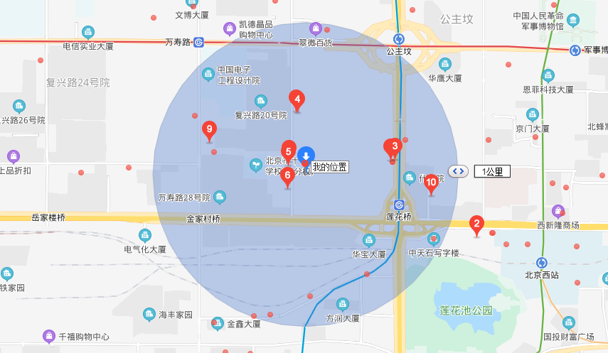

资料来源：<br/>
[利用Redis的Geo功能实现查找附近的位置](https://mp.weixin.qq.com/s/g8tq_572yBe7PhaRgCoeuA)


## Redis的Geo功能实现查找附近的位置

###  前言
老板突然要上线一个需求，获取当前位置方圆一公里的业务代理点。明天上线！当接到这个需求的时候我差点吐血，这时间也太紧张了。赶紧去查相关的技术选型。经过一番折腾，终于在晚上十点完成了这个需求。现在把大致实现的思路总结一下。


### MySQL 不合适
遇到需求，首先要想到现有的东西能不能满足，成本如何。

MySQL是我首先能够想到的，毕竟大部分数据要持久化到MySQL。但是使用MySQL需要自行计算Geohash。需要使用大量数学几何计算，并且需要学习地理相关知识，门槛较高，短时间内不可能完成需求，而且长期来看这也不是MySQL擅长的领域，所以没有考虑它。

Geohash 参考 https://www.cnblogs.com/LBSer/p/3310455.html

### Redis 中的 GEO
`Redis`是我们最为熟悉的`K-V`数据库，它常被拿来作为高性能的缓存数据库来使用，大部分项目都会用到它。从3.2版本开始它开始提供了`GEO`能力，用来实现诸如附近位置、计算距离等这类依赖于地理位置信息的功能。`GEO`相关的命令如下：

| Redis 命令        | 描述                                                        |
| ----------------- | ----------------------------------------------------------- |
| GEOHASH           | 返回一个或多个位置元素的 Geohash 表示                       |
| GEOPOS            | 从 key 里返回所有给定位置元素的位置（经度和纬度）           |
| GEODIST           | 返回两个给定位置之间的距离                                  |
| GEORADIUS         | 以给定的经纬度为中心， 找出某一半径内的元素                 |
| GEOADD            | 将指定的地理空间位置（纬度、经度、名称）添加到指定的 key 中 |
| GEORADIUSBYMEMBER | 找出位于指定范围内的元素，中心点是由给定的位置元素决定      |


Redis 会假设地球为完美的球形, 所以可能有一些位置计算偏差，据说<=0.5%，对于有严格地理位置要求的需求来说要经过一些场景测试来检验是否能够满足需求。

### 写入地理信息
那么如何实现目标单位半径内的所有元素呢？我们可以将所有的位置的经纬度通过上表中的GEOADD将这些地理信息转换为 52 位的Geohash写入Redis。

该命令格式：

```java
geoadd key longitude latitude member [longitude latitude member ...]
```


对应例子：

```
redis> geoadd cities:locs 117.12 39.08 tianjin 114.29 38.02  shijiazhuang
(integer) 2
```


意思是将经度为117.12纬度为39.08的地点tianjin和经度为114.29纬度为38.02的地点shijiazhuang加入key为cities:locs的 sorted set集合中。可以添加一到多个位置。然后我们就可以借助于其他命令来进行地理位置的计算了。

>  有效的经度从-180 度到 180 度。有效的纬度从-85.05112878 度到 85.05112878 度。当坐标位置超出上述指定范围时，该命令将会返回一个错误。

2.2 统计单位半径内的地区
我们可以借助于GEORADIUS来找出以给定经纬度，某一半径内的所有元素。

该命令格式：

```java
georadius key longtitude latitude radius m|km|ft|mi [WITHCOORD] [WITHDIST] [WITHHASH] [COUNT count] [ASC|DESC]

```

这个命令比GEOADD要复杂一些：


- radius 半径长度，必选项。后面的m、km、ft、mi、是长度单位选项，四选一。
- WITHCOORD 将位置元素的经度和维度也一并返回，非必选。
- WITHDIST 在返回位置元素的同时， 将位置元素与中心点的距离也一并返回。距离的单位和查询单位一致，非必选。
- WITHHASH 返回位置的 52 位精度的Geohash值，非必选。这个我反正很少用，可能其它一些偏向底层的LBS应用服务需要这个。
- COUNT 返回符合条件的位置元素的数量，非必选。比如返回前 10 个，以避免出现符合的结果太多而出现性能问题。
- ASC|DESC 排序方式，非必选。默认情况下返回未排序，但是大多数我们需要进行排序。参照中心位置，从近到远使用ASC ，从远到近使用DESC。
  例如，我们在 cities:locs 中查找以（115.03，38.44）为中心，方圆200km的城市，结果包含城市名称、对应的坐标和距离中心点的距离（km），并按照从近到远排列。命令如下： 

```
redis> georadius cities:locs 115.03 38.44 200 km WITHCOORD WITHDIST ASC
1) 1) "shijiazhuang"
   2) "79.7653"
   3) 1) "114.29000169038772583"
      2) "38.01999994251037407"
2) 1) "tianjin"
   2) "186.6937"
   3) 1) "117.02000230550765991"
      2) "39.0800000535766543"

```
你可以加上 COUNT 1来查找最近的一个位置。
### 基于 Redis GEO 实战
大致的原理思路说完了，接下来就是实操了。结合Spring Boot应用我们应该如何做？

3.1 开发环境
需要具有GEO特性的Redis版本，这里我使用的是Redis 4 。另外我们客户端使用 `spring-boot-starter-data-redis` 。这里我们会使用到` RedisTemplate`对象。

3.2 批量添加位置信息
第一步，我们需要将位置数据初始化到Redis中。在`Spring Data Redis`中一个位置坐标(lng,lat) 可以封装到`org.springframework.data.geo.Point`对象中。然后指定一个名称，就组成了一个位置Geo信息。`RedisTemplate`提供了批量添加位置信息的方法。我们可以将章节 2.1中的添加命令转换为下面的代码：

```java
 Map<String, Point> points = new HashMap<>();
   points.put("tianjin", new Point(117.12, 39.08));
   points.put("shijiazhuang", new Point(114.29, 38.02));
   // RedisTemplate 批量添加 Geo
   redisTemplate.boundGeoOps("cities:locs").add(points);
可以结合Spring Boot 提供的 ApplicationRunner 接口来实现初始化。

@Bean
public ApplicationRunner cacheActiveAppRunner(RedisTemplate<String, String> redisTemplate) {

    return args -> {
        final String GEO_KEY = "cities:locs";
    
        // 清理缓存
        redisTemplate.delete(GEO_KEY);
    
        Map<String, Point> points = new HashMap<>();
        points.put("tianjin", new Point(117.12, 39.08));
        points.put("shijiazhuang", new Point(114.29, 38.02));
        // RedisTemplate 批量添加 GeoLocation
        BoundGeoOperations<String, String> geoOps = redisTemplate.boundGeoOps(GEO_KEY);
        geoOps.add(points);
    };

}
```

3.3 查询附近的特定位置
RedisTemplate 针对GEORADIUS命令也有封装：

```
GeoResults<GeoLocation<M>> radius(K key, Circle within, GeoRadiusCommandArgs args)
```

Circle对象是封装覆盖的面积（图 1），需要的要素为中心点坐标Point对象、半径（radius）、计量单位（metric）, 例如：

```java
Point point = new Point(115.03, 38.44);

Metric metric = RedisGeoCommands.DistanceUnit.KILOMETERS;
Distance distance = new Distance(200, metric);

Circle circle = new Circle(point, distance);
```

`GeoRadiusCommandArgs`用来封装GEORADIUS的一些可选命令参数，参见章节 2.2中的WITHCOORD、COUNT、ASC等，例如我们需要在返回结果中包含坐标、中心距离、由近到远排序的前 5 条数据：

```java
RedisGeoCommands.GeoRadiusCommandArgs args = RedisGeoCommands
        .GeoRadiusCommandArgs
        .newGeoRadiusArgs()
        .includeDistance()
        .includeCoordinates()
        .sortAscending()
        .limit(limit);
```


然后执行 radius方法就会拿到`GeoResults<RedisGeoCommands.GeoLocation<String>>`封装的结果，我们对这个可迭代对象进行解析就可以拿到我们想要的数据：

```java
GeoResults<RedisGeoCommands.GeoLocation<String>> radius = redisTemplate.opsForGeo()
        .radius(GEO_STAGE, circle, args);

if (radius != null) {
    List<StageDTO> stageDTOS = new ArrayList<>();
    radius.forEach(geoLocationGeoResult -> {
        RedisGeoCommands.GeoLocation<String> content = geoLocationGeoResult.getContent();
        //member 名称  如  tianjin
        String name = content.getName();
        // 对应的经纬度坐标
        Point pos = content.getPoint();
        // 距离中心点的距离
        Distance dis = geoLocationGeoResult.getDistance();
    });
}
```

3.4 删除元素
有时候我们可能需要删除某个位置元素，但是Redis的Geo并没有删除成员的命令。不过由于它的底层是zset，我们可以借助zrem命令进行删除，对应的Java代码为：

```java
redisTemplate.boundZSetOps(GEO_STAGE).remove("tianjin");
```

### 总结
今天我们使用Redis的Geo特性实现了常见的附近的地理信息查询需求，简单易上手。其实使用另一个Nosql数据库MongoDB也可以实现。在数据量比较小的情况下Redis已经能很好的满足需要。如果数据量大可使用MongoDB来实现。