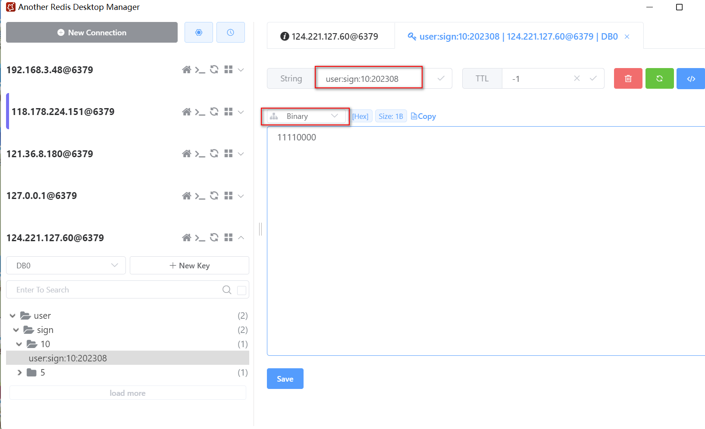

资料来源：<br/>
[为什么我推荐你使用 Redis 实现用户签到系统](https://mrhelloworld.com/redis-sign/)<br/>


## BitMap

BitMap 叫位图，它不是 Redis 的基本数据类型（String、Hash、List、Set、Stored Set），而是基于 String 数据类型的按位操作，高阶数据类型的一种。BitMap 支持的最大位数是 2^32 位。使用 512M 内存就可以存储多达 42.9 亿的字节信息（2^32 = 4,294,967,296）。

  它是由一组 bit 位组成的，每个 bit 位对应 0 和 1 两个状态，虽然内部还是采用 String 类型存储，但 Redis 提供了一些指令用于直接操作位图，可以把它看作是一个 bit 数组，数组的下标就是偏移量。它的优点是内存开销小、效率高且操作简单，很适合用于签到这类场景。

　　比如按月进行存储，一个月最多 31 天，那么我们将该月用户的签到缓存二进制就是 00000000000000000000000000000000，当用户某天签到时将 0 改成 1 即可，而且 Redis 提供对 BitMap 的很多操作比如存储、获取、统计等指令，使用起来非常方便。

　　

| 命令     | 功能                                          | 参数                                                         |
| -------- | --------------------------------------------- | ------------------------------------------------------------ |
| SETBIT   | 指定偏移量 bit 位置设置值                     | key offset value【0 =< offset < 2^32】                       |
| GETBIT   | 查询指定偏移位置的 bit 值                     | key offset                                                   |
| BITCOUNT | 统计指定区间被设置为 1 的 bit 数              | key [start end]                                              |
| BITFIELD | 操作多字节位域                                | key [GET type offset] [SET type offset value] [INCRBY type offset increment] [OVERFLOW WRAP\|SAT\|FAIL] |
| BITPOS   | 查询指定区间第一个被设置为 1 或者 0 的 bit 位 | key bit [start] [end]                                        |

　　考虑到每月初需要重置连续签到次数，最简单的方式是按用户每月存一条签到数据（也可以每年存一条数据）。Redis Key 的格式为 `user:sign:userId:yyyyMM`，Value 则采用长度为 4 个字节（32位）的位图（因为最大月份只有 31 天）。位图的每一位代表一天的签到，1 表示已签到，0 表示未签到。**从高位插入，也就是说左边位是开始日期**。

我做一个excel表，


日期是从1开始，但是索引是从0开始的。一个月最多31天，有32位。完全是够用的


```shell
# 2021年3月1号签到
127.0.0.1:6379> SETBIT user:sign:5:202103 0 1
(integer) 0

# 2021年3月2号签到
127.0.0.1:6379> SETBIT user:sign:5:202103 1 1
(integer) 0

# 2021年3月3号签到
127.0.0.1:6379> SETBIT user:sign:5:202103 2 1
(integer) 0

# 获取2021年3月3号签到情况
127.0.0.1:6379> GETBIT user:sign:5:202103 2
(integer) 1

# 获取2021年3月4号签到情况
127.0.0.1:6379> GETBIT user:sign:5:202103 3
(integer) 0

# 统计2021年3月签到次数
127.0.0.1:6379> BITCOUNT user:sign:5:202103
(integer) 3

# 获取2021年3月首次签到（返回索引）
127.0.0.1:6379> BITPOS user:sign:5:202103 1
(integer) 0

# 获取2021年3月前3天签到情况，返回7，二进制111，意味着前三天都签到了
127.0.0.1:6379> BITFIELD user:sign:5:202103 get u3 0
(integer) 7　
```

备注：`BITFIELD`这个就比较的复杂

```shell
> BITFIELD user:sign:5:202103 get u3 0
7
> BITFIELD user:sign:5:202103 get u2 0
3
> BITFIELD user:sign:5:202103 get u4 0
14
> BITFIELD user:sign:5:202103 get u2 1
3
> BITFIELD user:sign:5:202103 get u4 1
12
```

举例：`BITFIELD user:sign:5:202103 get u3 0`这个结果分析，`u3`值的是三个位置，0表示索引从0开始


举例：`BITFIELD user:sign:5:202103 get u4 1`这个结果分析，`u3`值的是三个位置，0表示索引从0开始


例如 `user:sign:5:202103` 表示用户 id=5 的用户在 2021 年 3 月的签到记录。那么：

可以看出在`redis`中实际保存的是二进制的值



## 集成到项目中


依赖jar包

```xml
<?xml version="1.0" encoding="UTF-8"?>
<project xmlns="http://maven.apache.org/POM/4.0.0"
         xmlns:xsi="http://www.w3.org/2001/XMLSchema-instance"
         xsi:schemaLocation="http://maven.apache.org/POM/4.0.0 http://maven.apache.org/xsd/maven-4.0.0.xsd">
    <modelVersion>4.0.0</modelVersion>
    <parent>
        <groupId>store.liuwei</groupId>
        <artifactId>redis</artifactId>
        <version>1.0-SNAPSHOT</version>
    </parent>

    <artifactId>redis-bitmap</artifactId>


    <dependencies>
        <dependency>
            <groupId>org.springframework.boot</groupId>
            <artifactId>spring-boot-starter-data-redis</artifactId>
        </dependency>
        <!-- lettuce pool 缓存连接池-->
        <dependency>
            <groupId>org.apache.commons</groupId>
            <artifactId>commons-pool2</artifactId>
        </dependency>
        <dependency>
            <groupId>org.springframework.boot</groupId>
            <artifactId>spring-boot-starter-web</artifactId>
        </dependency>

        <dependency>
            <groupId>org.projectlombok</groupId>
            <artifactId>lombok</artifactId>
            <optional>true</optional>
        </dependency>
        <dependency>
            <groupId>org.springframework.boot</groupId>
            <artifactId>spring-boot-starter-test</artifactId>
            <scope>test</scope>
        </dependency>
        <dependency>
            <groupId>junit</groupId>
            <artifactId>junit</artifactId>
            <scope>test</scope>
        </dependency>

        <dependency>
            <groupId>cn.hutool</groupId>
            <artifactId>hutool-all</artifactId>
        </dependency>
    </dependencies>

</project>
```

### 配置文件

主配置文件`application.yml`

```yml
server:
  port: 8086
  servlet:
    # 项目contextPath
    context-path: /
  tomcat:
    # tomcat的URI编码
    uri-encoding: UTF-8
    # tomcat最大线程数，默认为200
    max-threads: 800
    # Tomcat启动初始化的线程数，默认值25
    min-spare-threads: 30

# 指定配置环境
spring:
  profiles:
    include: redis
```

`application-redis.yml`配置

```yml
spring:
  redis:
    host: 124.221.127.60 # Redis 服务器地址
    port: 6379 # Redis 服务器端口
    password: foobared # Redis 服务器密码
    timeout: 3000 # 连接超时时间
    database: 0 # 几号库
    lettuce:
      pool:
        max-active: 8  #连接池最大链接数默认值为8
        max-wait: -1 #连接池最大阻塞时间（使用负值表示没有限制）默认为-1
        max-idle: 8  #连接池中的最大空闲连接数 默认为8
        min-idle: 0  #连接池中的最小空闲连接数 默认为8
```

### 启动类

```java
import org.springframework.boot.SpringApplication;
import org.springframework.boot.autoconfigure.SpringBootApplication;

//https://mrhelloworld.com/redis-sign/

@SpringBootApplication
public class RedisBitmapApplication {

    public static void main(String[] args) {
        SpringApplication.run(RedisBitmapApplication.class, args);
    }

}
```

### 配置

```java
import com.fasterxml.jackson.annotation.JsonAutoDetect;
import com.fasterxml.jackson.annotation.PropertyAccessor;
import com.fasterxml.jackson.databind.ObjectMapper;
import org.springframework.context.annotation.Bean;
import org.springframework.context.annotation.Configuration;
import org.springframework.data.redis.connection.RedisConnectionFactory;
import org.springframework.data.redis.core.RedisTemplate;
import org.springframework.data.redis.serializer.Jackson2JsonRedisSerializer;
import org.springframework.data.redis.serializer.StringRedisSerializer;

/**
 * @author 哈喽沃德先生
 * @微信公众号 哈喽沃德先生
 * @website https://mrhelloworld.com
 * @wechat 124059770
 */
@Configuration
public class RedisTemplateConfiguration {

    /**
     * RedisTemplate 序列化默认使用 JdkSerializationRedisSerializer 存储二进制字节码
     * 为了方便使用，自定义序列化策略
     *
     * @param redisConnectionFactory
     * @return
     */
    @Bean
    public RedisTemplate<String, Object> redisTemplate(RedisConnectionFactory redisConnectionFactory) {
        RedisTemplate<String, Object> redisTemplate = new RedisTemplate<>();
        redisTemplate.setConnectionFactory(redisConnectionFactory);
        // 使用 Jackson2JsonRedisSerialize 替换默认序列化
        Jackson2JsonRedisSerializer jackson2JsonRedisSerializer =
                new Jackson2JsonRedisSerializer(Object.class);
        // JSON 对象处理
        ObjectMapper objectMapper = new ObjectMapper();
        objectMapper.setVisibility(PropertyAccessor.ALL, JsonAutoDetect.Visibility.ANY);
        jackson2JsonRedisSerializer.setObjectMapper(objectMapper);
        // 为 String 类型 key/value 设置序列化器
        redisTemplate.setKeySerializer(new StringRedisSerializer());
        redisTemplate.setValueSerializer(jackson2JsonRedisSerializer);
        // 为 Hash 类型 key/value 设置序列化器
        redisTemplate.setHashKeySerializer(new StringRedisSerializer());
        redisTemplate.setHashValueSerializer(jackson2JsonRedisSerializer);
        redisTemplate.afterPropertiesSet();
        return redisTemplate;
    }

}
```

### 实现类

```java
package store.liuwei.blog.redis.bitpmap.service;

import cn.hutool.core.date.DateUtil;
import cn.hutool.core.util.StrUtil;
import org.springframework.data.redis.connection.BitFieldSubCommands;
import org.springframework.data.redis.core.RedisCallback;
import org.springframework.data.redis.core.RedisTemplate;
import org.springframework.stereotype.Service;

import javax.annotation.Resource;
import java.util.Date;
import java.util.HashMap;
import java.util.List;
import java.util.Map;

/**
 * @author 哈喽沃德先生
 * @微信公众号 哈喽沃德先生
 * @website https://mrhelloworld.com
 * @wechat 124059770
 */
@Service
public class SignService {

    @Resource
    private RedisTemplate redisTemplate;

    /**
     * 用户签到，可以补签
     *
     * @param userId  用户ID
     * @param dateStr 查询的日期，默认当天 yyyy-MM-dd
     * @return 连续签到次数和总签到次数
     */
    public Map<String, Object> doSign(Integer userId, String dateStr) {
        Map<String, Object> result = new HashMap<>();
        // 获取日期
        Date date = getDate(dateStr);
        // 获取日期对应的天数，多少号
        int day = DateUtil.dayOfMonth(date) - 1; // 从 0 开始
        // 构建 Redis Key
        String signKey = buildSignKey(userId, date);
        // 查看指定日期是否已签到
        boolean isSigned = redisTemplate.opsForValue().getBit(signKey, day);
        if (isSigned) {
            result.put("message", "当前日期已完成签到，无需再签");
            result.put("code", 400);
            return result;
        }
        // 签到
        redisTemplate.opsForValue().setBit(signKey, day, true);
        // 根据当前日期统计签到次数
        Date today = new Date();
        // 统计连续签到次数
        int continuous = getContinuousSignCount(userId, today);
        // 统计总签到次数
        long count = getSumSignCount(userId, today);
        result.put("message", "签到成功");
        result.put("code", 200);
        result.put("continuous", continuous);
        result.put("count", count);
        return result;
    }

    /**
     * 统计连续签到次数
     *
     * @param userId 用户ID
     * @param date   查询的日期
     * @return
     */
    public int getContinuousSignCount(Integer userId, Date date) {
        // 获取日期对应的天数，多少号，假设是 31
        int dayOfMonth = DateUtil.dayOfMonth(date);
        // 构建 Redis Key
        String signKey = buildSignKey(userId, date);
        // e.g. bitfield user:sign:5:202103 u31 0
        BitFieldSubCommands bitFieldSubCommands = BitFieldSubCommands.create()
                .get(BitFieldSubCommands.BitFieldType.unsigned(dayOfMonth))
                .valueAt(0);
        // 获取用户从当前日期开始到 1 号的所有签到状态
        List<Long> list = redisTemplate.opsForValue().bitField(signKey, bitFieldSubCommands);
        if (list == null || list.isEmpty()) {
            return 0;
        }
        // 连续签到计数器
        int signCount = 0;
        long v = list.get(0) == null ? 0 : list.get(0);
        // 位移计算连续签到次数
        for (int i = dayOfMonth; i > 0; i--) {// i 表示位移操作次数
            // 右移再左移，如果等于自己说明最低位是 0，表示未签到
            if (v >> 1 << 1 == v) {
                // 用户可能当前还未签到，所以要排除是否是当天的可能性
                // 低位 0 且非当天说明连续签到中断了
                if (i != dayOfMonth) break;
            } else {
                // 右移再左移，如果不等于自己说明最低位是 1，表示签到
                signCount++;
            }
            // 右移一位并重新赋值，相当于把最低位丢弃一位然后重新计算
            v >>= 1;
        }
        return signCount;
    }

    /**
     * 统计总签到次数
     *
     * @param userId 用户ID
     * @param date   查询的日期
     * @return
     */
    private Long getSumSignCount(Integer userId, Date date) {
        // 构建 Redis Key
        String signKey = buildSignKey(userId, date);
        // e.g. BITCOUNT user:sign:5:202103
        return (Long) redisTemplate.execute(
                (RedisCallback<Long>) con -> con.bitCount(signKey.getBytes())
        );
    }

    /**
     * 获取日期
     *
     * @param dateStr yyyy-MM-dd
     * @return
     */
    private Date getDate(String dateStr) {
        return StrUtil.isBlank(dateStr) ?
                new Date() : DateUtil.parseDate(dateStr);
    }

    /**
     * 构建 Redis Key - user:sign:userId:yyyyMM
     *
     * @param userId 用户ID
     * @param date   日期
     * @return
     */
    private String buildSignKey(Integer userId, Date date) {
        return String.format("user:sign:%d:%s", userId,
                DateUtil.format(date, "yyyyMM"));
    }

}
```

### 测试类

```java

@SpringBootTest
@RunWith(SpringRunner.class)
public class SignDemo {

    @Autowired
    private SignService service;


    // 签到测试
    @Test
   public void test01(){
        Map<String, Object> stringObjectMap = service.doSign(10, "2023-08-04");
        System.out.println(stringObjectMap);
    }

}
```

