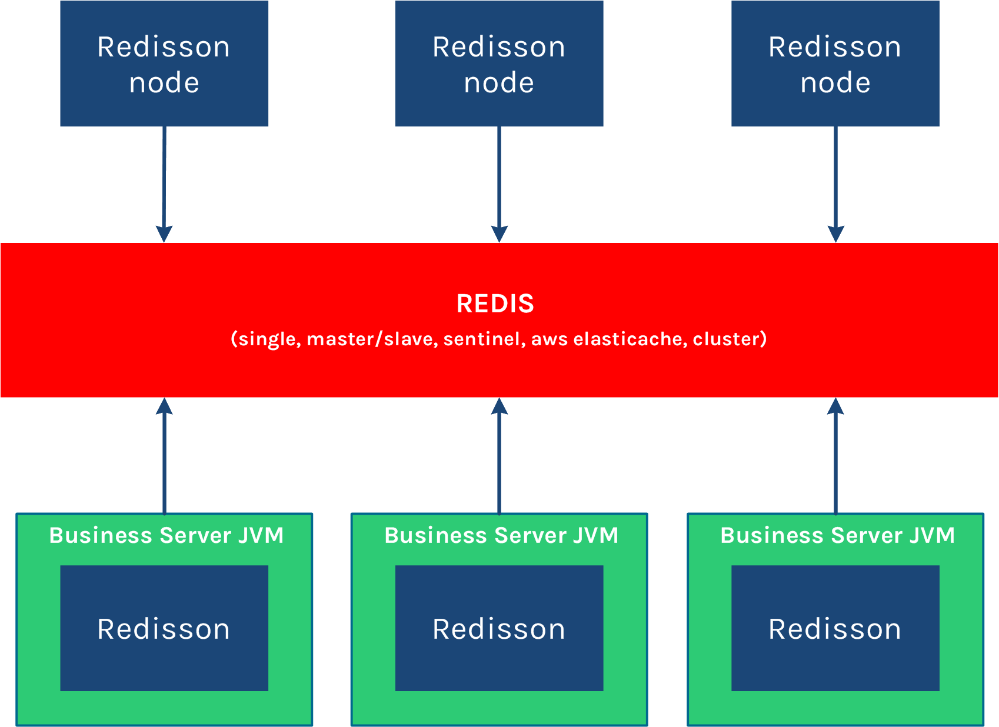

资料来源：
[分布式锁和同步器#84-红锁redlock](https://github.com/redisson/redisson/wiki/8.-%E5%88%86%E5%B8%83%E5%BC%8F%E9%94%81%E5%92%8C%E5%90%8C%E6%AD%A5%E5%99%A8#84-%E7%BA%A2%E9%94%81redlock)

## Redisson

[Redisson](https://redisson.org/)是架设在[Redis](http://redis.cn/)基础上的一个Java驻内存数据网格（In-Memory Data Grid）。充分的利用了Redis键值数据库提供的一系列优势，基于Java实用工具包中常用接口，为使用者提供了一系列具有分布式特性的常用工具类。使得原本作为协调单机多线程并发程序的工具包获得了协调分布式多机多线程并发系统的能力，大大降低了设计和研发大规模分布式系统的难度。同时结合各富特色的分布式服务，更进一步简化了分布式环境中程序相互之间的协作。

Redisson采用了基于NIO的[Netty](http://netty.io/)框架，不仅能作为Redis底层驱动客户端，具备提供对Redis各种组态形式的[连接功能](https://github.com/redisson/redisson#features)，对Redis命令能以同步发送、[异步形式发送](https://github.com/redisson/redisson/wiki/3.-程序接口调用方式#31-异步执行方式)、[异步流形式发送](https://github.com/redisson/redisson/wiki/3.-程序接口调用方式#32-异步流执行方式)或[管道形式发送](https://github.com/redisson/redisson/wiki/10.-额外功能#103-命令的批量执行)的功能，[LUA脚本执行](https://github.com/redisson/redisson/wiki/10.-额外功能#104-脚本执行)处理，以及[处理返回结果](https://github.com/redisson/redisson/wiki/4.-数据序列化)的功能，还在此基础上融入了更高级的应用方案，不但将原生的Redis [`Hash`](http://redis.cn/topics/data-types-intro.html#hashes)，[`List`](http://redis.cn/topics/data-types-intro.html#redis-lists)，[`Set`](http://redis.cn/topics/data-types-intro.html#sets)，[`String`](http://redis.cn/topics/data-types-intro.html#redis-strings)，[`Geo`](http://redis.cn/commands/geoadd.html)，[`HyperLogLog`](http://redis.cn/topics/data-types-intro.html#hyperloglogs)等数据结构封装为Java里大家最熟悉的[`映射（Map）`](https://github.com/redisson/redisson/wiki/7.-分布式集合#71-映射map)，[`列表（List）`](https://github.com/redisson/redisson/wiki/7.-分布式集合#77-列表list)，[`集（Set）`](https://github.com/redisson/redisson/wiki/7.-分布式集合#73-集set)，[`通用对象桶（Object Bucket）`](https://github.com/redisson/redisson/wiki/6.-分布式对象#61-通用对象桶object-bucket)，[`地理空间对象桶（Geospatial Bucket）`](https://github.com/redisson/redisson/wiki/6.-分布式对象#62-地理空间对象桶geospatial-bucket)，[`基数估计算法（HyperLogLog）`](https://github.com/redisson/redisson/wiki/6.-分布式对象#68-基数估计算法hyperloglog)等结构，在这基础上还提供了分布式的[`多值映射（Multimap）`](https://github.com/redisson/redisson/wiki/7.-分布式集合#72-多值映射multimap)，[`本地缓存映射（LocalCachedMap）`](https://github.com/redisson/redisson/wiki/7.-分布式集合#712-本地缓存映射localcachedmap)，[`有序集（SortedSet）`](https://github.com/redisson/redisson/wiki/7.-分布式集合#74-有序集sortedset)，[`计分排序集（ScoredSortedSet）`](https://github.com/redisson/redisson/wiki/7.-分布式集合#75-计分排序集scoredsortedset)，[`字典排序集（LexSortedSet）`](https://github.com/redisson/redisson/wiki/7.-分布式集合#76-字典排序集lexsortedset)，[`列队（Queue）`](https://github.com/redisson/redisson/wiki/7.-分布式集合#78-列队queue)，[`阻塞队列（Blocking Queue）`](https://github.com/redisson/redisson/wiki/7.-分布式集合#710-阻塞队列blocking-queue)，[`有界阻塞列队（Bounded Blocking Queue）`](https://github.com/redisson/redisson/wiki/7.-分布式集合#711-有界阻塞列队bounded-blocking-queue)，[`双端队列（Deque）`](https://github.com/redisson/redisson/wiki/7.-分布式集合#79-双端队列deque)，[`阻塞双端列队（Blocking Deque）`](https://github.com/redisson/redisson/wiki/7.-分布式集合#712-阻塞双端列队blocking-deque)，[`阻塞公平列队（Blocking Fair Queue）`](https://github.com/redisson/redisson/wiki/7.-分布式集合#713-阻塞公平列队blocking-fair-queue)，[`延迟列队（Delayed Queue）`](https://github.com/redisson/redisson/wiki/7.-分布式集合#714-延迟列队delayed-queue)，[`布隆过滤器（Bloom Filter）`](https://github.com/redisson/redisson/wiki/6.-分布式对象#67-布隆过滤器bloom-filter)，[`原子整长形（AtomicLong）`](https://github.com/redisson/redisson/wiki/6.-分布式对象#64-原子整长形atomiclong)，[`原子双精度浮点数（AtomicDouble）`](https://github.com/redisson/redisson/wiki/6.-分布式对象#65-原子双精度浮点数atomicdouble)，[`BitSet`](https://github.com/redisson/redisson/wiki/6.-分布式对象#63-bitset)等Redis原本没有的分布式数据结构。不仅如此，Redisson还实现了Redis[文档中提到](http://www.redis.cn/topics/distlock.html)像分布式锁[`Lock`](https://github.com/redisson/redisson/wiki/8.-分布式锁和同步器#81-可重入锁reentrant-lock)这样的更高阶应用场景。事实上Redisson并没有不止步于此，在分布式锁的基础上还提供了[`联锁（MultiLock）`](https://github.com/redisson/redisson/wiki/8.-分布式锁和同步器#83-联锁multilock)，[`读写锁（ReadWriteLock）`](https://github.com/redisson/redisson/wiki/8.-分布式锁和同步器#85-读写锁readwritelock)，[`公平锁（Fair Lock）`](https://github.com/redisson/redisson/wiki/8.-分布式锁和同步器#82-公平锁fair-lock)，[`红锁（RedLock）`](https://github.com/redisson/redisson/wiki/8.-分布式锁和同步器#84-红锁redlock)，[`信号量（Semaphore）`](https://github.com/redisson/redisson/wiki/8.-分布式锁和同步器#86-信号量semaphore)，[`可过期性信号量（PermitExpirableSemaphore）`](https://github.com/redisson/redisson/wiki/8.-分布式锁和同步器#87-可过期性信号量permitexpirablesemaphore)和[`闭锁（CountDownLatch）`](https://github.com/redisson/redisson/wiki/8.-分布式锁和同步器#88-闭锁countdownlatch)这些实际当中对多线程高并发应用至关重要的基本部件。正是通过实现基于Redis的高阶应用方案，使Redisson成为构建分布式系统的重要工具。

Redisson是一个在Redis的基础上实现的Java驻内存数据网格（In-Memory Data Grid）。它不仅提供了一系列的分布式的Java常用对象，还提供了许多分布式服务。其中包括(`BitSet`, `Set`, `Multimap`, `SortedSet`, `Map`, `List`, `Queue`, `BlockingQueue`, `Deque`, `BlockingDeque`, `Semaphore`, `Lock`, `AtomicLong`, `CountDownLatch`, `Publish / Subscribe`, `Bloom filter`, `Remote service`, `Spring cache`, `Executor service`, `Live Object service`, `Scheduler service`) Redisson提供了使用Redis的最简单和最便捷的方法。Redisson的宗旨是促进使用者对Redis的关注分离（Separation of Concern），从而让使用者能够将精力更集中地放在处理业务逻辑上。

关于Redisson项目的详细介绍可以在[官方网站](http://redisson.org/redisson_introduction_zh-cn.html)找到。

每个Redis服务实例都能管理多达1TB的内存。



如果你现在正在使用其他的Redis的Java客户端，那么[Redis命令和Redisson对象匹配列表](https://github.com/redisson/redisson/wiki/11.-redis命令和redisson对象匹配列表) 能够帮助你轻松的将现有代码迁徙到Redisson框架里来。

Redisson底层采用的是[Netty](http://netty.io/) 框架。支持[Redis](http://redis.cn/) 2.8以上版本，支持Java1.6+以上版本。

在[02_redis分布式锁](java/lock/02_redis分布式锁.md)有介绍，这里不重复介绍

### 配置

以下是关于`org.redisson.Config`类的配置参数，它适用于所有Redis组态模式（单机，集群和哨兵）

### 单机举例

```java
public class Demo01 {

    @SneakyThrows
    @Test
    public void test01(){
        // 1. 配置文件
        Config config = new Config();
        config.useSingleServer()
                .setAddress("redis://124.221.127.60:6379")
                .setPassword("foobared")
                .setDatabase(0);
//2. 构造RedissonClient
        RedissonClient redissonClient = Redisson.create(config);

//3. 设置锁定资源名称
        RLock lock = redissonClient.getLock("redlock");
        lock.lock();
        try {
            System.out.println("获取锁成功，实现业务逻辑");
            Thread.sleep(10000);
        } catch (InterruptedException e) {
            e.printStackTrace();
        } finally {
            lock.unlock();
        }

    }
}
```

#### codec（编码）

默认值: `org.redisson.codec.JsonJacksonCodec`

Redisson的对象编码类是用于将对象进行序列化和反序列化，以实现对该对象在Redis里的读取和存储。Redisson提供了以下几种的对象编码应用，以供大家选择：

| 编码类名称                                      | 说明                                                         |
| ----------------------------------------------- | ------------------------------------------------------------ |
| `org.redisson.codec.JsonJacksonCodec`           | [Jackson JSON](https://github.com/FasterXML/jackson) 编码 **默认编码** |
| `org.redisson.codec.AvroJacksonCodec`           | [Avro](http://avro.apache.org/) 一个二进制的JSON编码         |
| `org.redisson.codec.SmileJacksonCodec`          | [Smile](http://wiki.fasterxml.com/SmileFormatSpec) 另一个二进制的JSON编码 |
| `org.redisson.codec.CborJacksonCodec`           | [CBOR](http://cbor.io/) 又一个二进制的JSON编码               |
| `org.redisson.codec.MsgPackJacksonCodec`        | [MsgPack](http://msgpack.org/) 再来一个二进制的JSON编码      |
| `org.redisson.codec.IonJacksonCodec`            | [Amazon Ion](https://amzn.github.io/ion-docs/) 亚马逊的Ion编码，格式与JSON类似 |
| `org.redisson.codec.KryoCodec`                  | [Kryo](https://github.com/EsotericSoftware/kryo) 二进制对象序列化编码 |
| `org.redisson.codec.SerializationCodec`         | JDK序列化编码                                                |
| `org.redisson.codec.FstCodec`                   | [FST](https://github.com/RuedigerMoeller/fast-serialization) 10倍于JDK序列化性能而且100%兼容的编码 |
| `org.redisson.codec.LZ4Codec`                   | [LZ4](https://github.com/jpountz/lz4-java) 压缩型序列化对象编码 |
| `org.redisson.codec.SnappyCodec`                | [Snappy](https://github.com/xerial/snappy-java) 另一个压缩型序列化对象编码 |
| `org.redisson.client.codec.JsonJacksonMapCodec` | 基于Jackson的映射类使用的编码。可用于避免序列化类的信息，以及用于解决使用`byte[]`遇到的问题。 |
| `org.redisson.client.codec.StringCodec`         | 纯字符串编码（无转换）                                       |
| `org.redisson.client.codec.LongCodec`           | 纯整长型数字编码（无转换）                                   |
| `org.redisson.client.codec.ByteArrayCodec`      | 字节数组编码                                                 |
| `org.redisson.codec.CompositeCodec`             | 用来组合多种不同编码在一起                                   |

#### threads（线程池数量）

默认值: `当前处理核数量 * 2`

这个线程池数量被所有`RTopic`对象监听器，`RRemoteService`调用者和`RExecutorService`任务共同共享。

#### nettyThreads （Netty线程池数量）

默认值: `当前处理核数量 * 2`

这个线程池数量是在一个Redisson实例内，被其创建的所有分布式数据类型和服务，以及底层客户端所一同共享的线程池里保存的线程数量。

#### executor（线程池）

单独提供一个用来执行所有`RTopic`对象监听器，`RRemoteService`调用者和`RExecutorService`任务的线程池（ExecutorService）实例。

#### eventLoopGroup

用于特别指定一个EventLoopGroup. EventLoopGroup是用来处理所有通过Netty与Redis服务之间的连接发送和接受的消息。每一个Redisson都会在默认情况下自己创建管理一个EventLoopGroup实例。因此，如果在同一个JVM里面可能存在多个Redisson实例的情况下，采取这个配置实现多个Redisson实例共享一个EventLoopGroup的目的。

只有`io.netty.channel.epoll.EpollEventLoopGroup`或`io.netty.channel.nio.NioEventLoopGroup`才是允许的类型。

#### transportMode（传输模式）

默认值：`TransportMode.NIO`

可选参数：
`TransportMode.NIO`,
`TransportMode.EPOLL` - 需要依赖里有`netty-transport-native-epoll`包（Linux） `TransportMode.KQUEUE` - 需要依赖里有 `netty-transport-native-kqueue`包（macOS）

#### lockWatchdogTimeout（监控锁的看门狗超时，单位：毫秒）

默认值：`30000`

监控锁的看门狗超时时间单位为毫秒。该参数只适用于分布式锁的加锁请求中未明确使用`leaseTimeout`参数的情况。如果该看门口未使用`lockWatchdogTimeout`去重新调整一个分布式锁的`lockWatchdogTimeout`超时，那么这个锁将变为失效状态。这个参数可以用来避免由Redisson客户端节点宕机或其他原因造成死锁的情况。

#### keepPubSubOrder（保持订阅发布顺序）

默认值：`true`

通过该参数来修改是否按订阅发布消息的接收顺序出来消息，如果选否将对消息实行并行处理，该参数只适用于订阅发布消息的情况。

#### performanceMode（高性能模式）

默认值：`HIGHER_THROUGHPUT`

用来指定高性能引擎的行为。由于该变量值的选用与使用场景息息相关（`NORMAL`除外）我们建议对每个参数值都进行尝试。

*该参数仅限于[Redisson PRO](https://redisson.pro/)版本。*

可选模式：
`HIGHER_THROUGHPUT` - 将高性能引擎切换到 **高通量** 模式。 `LOWER_LATENCY_AUTO` - 将高性能引擎切换到 **低延时** 模式并自动探测最佳设定。 `LOWER_LATENCY_MODE_1` - 将高性能引擎切换到 **低延时** 模式并调整到预设模式1。 `LOWER_LATENCY_MODE_2` - 将高性能引擎切换到 **低延时** 模式并调整到预设模式2。 `NORMAL` - 将高性能引擎切换到 **普通** 模式


```java 
RCountDownLatch latch = redisson.getCountDownLatch("anyCountDownLatch");
latch.trySetCount(1);
latch.await();

// 在其他线程或其他JVM里
RCountDownLatch latch = redisson.getCountDownLatch("anyCountDownLatch");
latch.countDown();
```