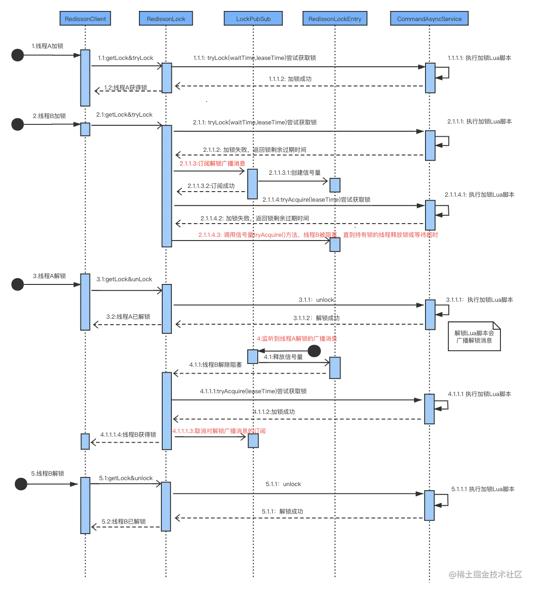
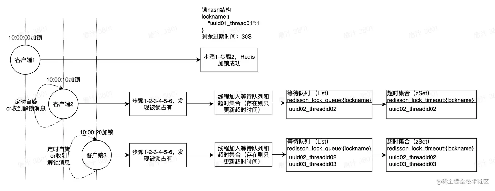

资料来源：
[最强分布式工具Redisson（一）：分布式锁](https://juejin.cn/post/6961380552519712798#heading-6)


## Redisson分布式锁

**号称简单的Redisson分布式锁的使用姿势是什么？**

依赖

```xml
<!-- 原生，本章使用-->
<dependency>
    <groupId>org.redisson</groupId>
    <artifactId>redisson</artifactId>
    <version>3.13.6</version>
</dependency>

<!-- 另一种Spring集成starter，本章未使用 -->
<dependency>
    <groupId>org.redisson</groupId>
    <artifactId>redisson-spring-boot-starter</artifactId>
    <version>3.13.6</version>
</dependency>

```

**配置**

```java
@Configuration
public class RedissionConfig {
    @Value("${spring.redis.host}")
    private String redisHost;

    @Value("${spring.redis.password}")
    private String password;

    private int port = 6379;

    @Bean
    public RedissonClient getRedisson() {
        Config config = new Config();
        config.useSingleServer().
                setAddress("redis://" + redisHost + ":" + port).
                setPassword(password);
        config.setCodec(new JsonJacksonCodec());
        return Redisson.create(config);
    }
}

```

**启用分布式锁**

```java
@Resource
private RedissonClient redissonClient;

RLock rLock = redissonClient.getLock(lockName);
try {
    boolean isLocked = rLock.tryLock(expireTime, TimeUnit.MILLISECONDS);
    if (isLocked) {
        // TODO
                }
    } catch (Exception e) {
            rLock.unlock();
    }

```

简洁明了，只需要一个RLock，既然推荐Redisson，就往里面看看他是怎么实现的。

## 原理介绍

RLock是Redisson分布式锁的最核心接口，继承了concurrent包的Lock接口和自己的RLockAsync接口，RLockAsync的返回值都是RFuture，是Redisson执行异步实现的核心逻辑，也是Netty发挥的主要阵地。

**RLock如何加锁？**

从RLock进入，找到RedissonLock类，找到**tryLock**方法再递进到干事的**tryAcquireOnceAsync**方法，这是加锁的主要代码（版本不一此处实现有差别，和最新3.15.x有一定出入，但是核心逻辑依然未变。此处以3.13.6为例）

```kotlin
private RFuture<Boolean> tryAcquireOnceAsync(long waitTime, long leaseTime, TimeUnit unit, long threadId) {
        if (leaseTime != -1L) {
            return this.tryLockInnerAsync(waitTime, leaseTime, unit, threadId, RedisCommands.EVAL_NULL_BOOLEAN);
        } else {
            RFuture<Boolean> ttlRemainingFuture = this.tryLockInnerAsync(waitTime, this.commandExecutor.getConnectionManager().getCfg().getLockWatchdogTimeout(), TimeUnit.MILLISECONDS, threadId, RedisCommands.EVAL_NULL_BOOLEAN);
            ttlRemainingFuture.onComplete((ttlRemaining, e) -> {
                if (e == null) {
                    if (ttlRemaining) {
                        this.scheduleExpirationRenewal(threadId);
                    }

                }
            });
            return ttlRemainingFuture;
        }
    }

```

此处出现leaseTime时间判断的2个分支，实际上就是加锁时是否设置过期时间，未设置过期时间（-1）时则会有**watchDog**的**锁续约**（下文），一个注册了加锁事件的续约任务。我们先来看有过期时间**tryLockInnerAsync**部分，

evalWriteAsync是eval命令执行lua的入口

```kotlin
<T> RFuture<T> tryLockInnerAsync(long leaseTime, TimeUnit unit, long threadId, RedisStrictCommand<T> command) {
        this.internalLockLeaseTime = unit.toMillis(leaseTime);
        return this.commandExecutor.evalWriteAsync(this.getName(), LongCodec.INSTANCE, command, "if (redis.call('exists', KEYS[1]) == 0) then redis.call('hset', KEYS[1], ARGV[2], 1); redis.call('pexpire', KEYS[1], ARGV[1]); return nil; end; if (redis.call('hexists', KEYS[1], ARGV[2]) == 1) then redis.call('hincrby', KEYS[1], ARGV[2], 1); redis.call('pexpire', KEYS[1], ARGV[1]); return nil; end; return redis.call('pttl', KEYS[1]);", Collections.singletonList(this.getName()), new Object[]{this.internalLockLeaseTime, this.getLockName(threadId)});
    }


```

这里揭开真面目，eval命令执行Lua脚本的地方，此处的Lua脚本展开

```lua
-- 不存在该key时
if (redis.call('exists', KEYS[1]) == 0) then 
  -- 新增该锁并且hash中该线程id对应的count置1
  redis.call('hincrby', KEYS[1], ARGV[2], 1); 
  -- 设置过期时间
  redis.call('pexpire', KEYS[1], ARGV[1]); 
  return nil; 
end; 

-- 存在该key 并且 hash中线程id的key也存在
if (redis.call('hexists', KEYS[1], ARGV[2]) == 1) then 
  -- 线程重入次数++
  redis.call('hincrby', KEYS[1], ARGV[2], 1); 
  redis.call('pexpire', KEYS[1], ARGV[1]); 
  return nil; 
end; 
return redis.call('pttl', KEYS[1]);

```

和前面我们写自定义的分布式锁的脚本几乎一致，看来redisson也是一样的实现，具体参数分析：

```lua
// keyName
KEYS[1] = Collections.singletonList(this.getName())
// leaseTime
ARGV[1] = this.internalLockLeaseTime
// uuid+threadId组合的唯一值
ARGV[2] = this.getLockName(threadId)

```

总共3个参数完成了一段逻辑：

> 判断该锁是否已经有对应hash表存在，
>
> • 没有对应的hash表：则set该hash表中一个entry的key为锁名称，value为1，之后设置该hash表失效时间为leaseTime
>
> • 存在对应的hash表：则将该lockName的value执行+1操作，也就是计算进入次数，再设置失效时间leaseTime
>
> • 最后返回这把锁的ttl剩余时间

也和上述自定义锁没有区别

既然如此，那解锁的步骤也肯定有对应的-1操作，再看unlock方法，同样查找方法名，一路到

```jaVA
protected RFuture<Boolean> unlockInnerAsync(long threadId) {
        return this.commandExecutor.evalWriteAsync(this.getName(), LongCodec.INSTANCE, RedisCommands.EVAL_BOOLEAN, "if (redis.call('exists', KEYS[1]) == 0) then redis.call('publish', KEYS[2], ARGV[1]); return 1; end;if (redis.call('hexists', KEYS[1], ARGV[3]) == 0) then return nil;end; local counter = redis.call('hincrby', KEYS[1], ARGV[3], -1); if (counter > 0) then redis.call('pexpire', KEYS[1], ARGV[2]); return 0; else redis.call('del', KEYS[1]); redis.call('publish', KEYS[2], ARGV[1]); return 1; end; return nil;", Arrays.asList(this.getName(), this.getChannelName()), new Object[]{LockPubSub.unlockMessage, this.internalLockLeaseTime, this.getLockName(threadId)});
    }
```

掏出Lua部分

```lua
-- 不存在key
if (redis.call('hexists', KEYS[1], ARGV[3]) == 0) then 
  return nil;
end;
-- 计数器 -1
local counter = redis.call('hincrby', KEYS[1], ARGV[3], -1); 
if (counter > 0) then 
  -- 过期时间重设
  redis.call('pexpire', KEYS[1], ARGV[2]); 
  return 0; 
else
  -- 删除并发布解锁消息
  redis.call('del', KEYS[1]); 
  redis.call('publish', KEYS[2], ARGV[1]); 
  return 1;
end; 
return nil;
```

该Lua KEYS有2个`Arrays.asList(getName(), getChannelName())`

```
name 锁名称
channelName，用于pubSub发布消息的channel名称
```

ARGV变量有三个`LockPubSub.UNLOCK_MESSAGE, internalLockLeaseTime, getLockName(threadId)`

```
LockPubSub.UNLOCK_MESSAGE，channel发送消息的类别，此处解锁为0
internalLockLeaseTime，watchDog配置的超时时间，默认为30s
lockName 这里的lockName指的是uuid和threadId组合的唯一值
```

步骤如下：

> 1.如果该锁不存在则返回nil；
>
> 2.如果该锁存在则将其线程的hash key计数器-1，
>
> 3.计数器counter>0，重置下失效时间，返回0；否则，删除该锁，发布解锁消息unlockMessage，返回1；

其中unLock的时候使用到了Redis发布订阅PubSub完成消息通知。

而订阅的步骤就在RedissonLock的加锁入口的lock方法里

```kotlin
long threadId = Thread.currentThread().getId();
        Long ttl = this.tryAcquire(-1L, leaseTime, unit, threadId);
        if (ttl != null) {
            // 订阅
            RFuture<RedissonLockEntry> future = this.subscribe(threadId);
            if (interruptibly) {
                this.commandExecutor.syncSubscriptionInterrupted(future);
            } else {
                this.commandExecutor.syncSubscription(future);
            }
            // 省略
```

**当锁被其他线程占用时，通过监听锁的释放通知（在其他线程通过RedissonLock释放锁时，会通过发布订阅pub/sub功能发起通知），等待锁被其他线程释放，也是为了避免自旋的一种常用效率手段。**

### 1.解锁消息

为了一探究竟通知了什么，通知后又做了什么，进入LockPubSub。

这里只有一个明显的监听方法onMessage，其订阅和信号量的释放都在父类PublishSubscribe，我们只关注监听事件的实际操作

```java
protected void onMessage(RedissonLockEntry value, Long message) {
        Runnable runnableToExecute;
        if (message.equals(unlockMessage)) {
            // 从监听器队列取监听线程执行监听回调
            runnableToExecute = (Runnable)value.getListeners().poll();
            if (runnableToExecute != null) {
                runnableToExecute.run();
            }
            // getLatch()返回的是Semaphore，信号量，此处是释放信号量
            // 释放信号量后会唤醒等待的entry.getLatch().tryAcquire去再次尝试申请锁
            value.getLatch().release();
        } else if (message.equals(readUnlockMessage)) {
            while(true) {
                runnableToExecute = (Runnable)value.getListeners().poll();
                if (runnableToExecute == null) {
                    value.getLatch().release(value.getLatch().getQueueLength());
                    break;
                }
                runnableToExecute.run();
            }
        }
    }
```

发现一个是**默认解锁消息**，一个是**读锁解锁消息****，**因为redisson是有提供读写锁的，而读写锁读读情况和读写、写写情况互斥情况不同，我们只看上面的默认解锁消息unlockMessage分支

LockPubSub监听最终执行了2件事

1. runnableToExecute.run() 执行监听回调
2. value.getLatch().release(); 释放信号量

Redisson通过**LockPubSub**监听解锁消息，执行监听回调和释放信号量通知等待线程可以重新抢锁。

这时再回来看tryAcquireOnceAsync另一分支

```kotlin
private RFuture<Boolean> tryAcquireOnceAsync(long waitTime, long leaseTime, TimeUnit unit, long threadId) {
        if (leaseTime != -1L) {
            return this.tryLockInnerAsync(waitTime, leaseTime, unit, threadId, RedisCommands.EVAL_NULL_BOOLEAN);
        } else {
            RFuture<Boolean> ttlRemainingFuture = this.tryLockInnerAsync(waitTime, this.commandExecutor.getConnectionManager().getCfg().getLockWatchdogTimeout(), TimeUnit.MILLISECONDS, threadId, RedisCommands.EVAL_NULL_BOOLEAN);
            ttlRemainingFuture.onComplete((ttlRemaining, e) -> {
                if (e == null) {
                    if (ttlRemaining) {
                        this.scheduleExpirationRenewal(threadId);
                    }

                }
            });
            return ttlRemainingFuture;
        }
    }
```

可以看到，无超时时间时，在执行加锁操作后，还执行了一段费解的逻辑

```java
ttlRemainingFuture.onComplete((ttlRemaining, e) -> {
                if (e == null) {
                    if (ttlRemaining) {
                        this.scheduleExpirationRenewal(threadId);
                    }

                }
            })
```

此处涉及到Netty的Future/Promise-Listener模型（参考[Netty中的异步编程](https://link.juejin.cn?target=https%3A%2F%2Fwww.cnblogs.com%2Frickiyang%2Fp%2F12742091.html)），Redisson中几乎全部以这种方式通信（所以说Redisson是基于Netty通信机制实现的），理解这段逻辑可以试着先理解

> 在 Java 的 Future 中，业务逻辑为一个 Callable 或 Runnable 实现类，该类的 call()或 run()执行完毕意味着业务逻辑的完结，在 Promise 机制中，可以在业务逻辑中人工设置业务逻辑的成功与失败，这样更加方便的监控自己的业务逻辑。

这块代码的表面意义就是，在执行异步加锁的操作后，加锁成功则根据加锁完成返回的ttl是否过期来确认是否执行一段定时任务。

这段定时任务的就是watchDog的核心。

### 2.锁续约

查看RedissonLock.this.scheduleExpirationRenewal(threadId)

```java
java复制代码private void scheduleExpirationRenewal(long threadId) {
        RedissonLock.ExpirationEntry entry = new RedissonLock.ExpirationEntry();
        RedissonLock.ExpirationEntry oldEntry = (RedissonLock.ExpirationEntry)EXPIRATION_RENEWAL_MAP.putIfAbsent(this.getEntryName(), entry);
        if (oldEntry != null) {
            oldEntry.addThreadId(threadId);
        } else {
            entry.addThreadId(threadId);
            this.renewExpiration();
        }

    }

private void renewExpiration() {
        RedissonLock.ExpirationEntry ee = (RedissonLock.ExpirationEntry)EXPIRATION_RENEWAL_MAP.get(this.getEntryName());
        if (ee != null) {
            Timeout task = this.commandExecutor.getConnectionManager().newTimeout(new TimerTask() {
                public void run(Timeout timeout) throws Exception {
                    RedissonLock.ExpirationEntry ent = (RedissonLock.ExpirationEntry)RedissonLock.EXPIRATION_RENEWAL_MAP.get(RedissonLock.this.getEntryName());
                    if (ent != null) {
                        Long threadId = ent.getFirstThreadId();
                        if (threadId != null) {
                            RFuture<Boolean> future = RedissonLock.this.renewExpirationAsync(threadId);
                            future.onComplete((res, e) -> {
                                if (e != null) {
                                    RedissonLock.log.error("Can't update lock " + RedissonLock.this.getName() + " expiration", e);
                                } else {
                                    if (res) {
                                        RedissonLock.this.renewExpiration();
                                    }

                                }
                            });
                        }
                    }
                }
            }, this.internalLockLeaseTime / 3L, TimeUnit.MILLISECONDS);
            ee.setTimeout(task);
        }
    }
```

拆分来看，这段连续嵌套且冗长的代码实际上做了几步

> • 添加一个netty的Timeout回调任务，每（internalLockLeaseTime / 3）毫秒执行一次，执行的方法是renewExpirationAsync
>
> • renewExpirationAsync重置了锁超时时间，又注册一个监听器，监听回调又执行了renewExpiration

renewExpirationAsync 的Lua如下

```lua
protected RFuture<Boolean> renewExpirationAsync(long threadId) {
        return this.commandExecutor.evalWriteAsync(this.getName(), LongCodec.INSTANCE, RedisCommands.EVAL_BOOLEAN, "if (redis.call('hexists', KEYS[1], ARGV[2]) == 1) then redis.call('pexpire', KEYS[1], ARGV[1]); return 1; end; return 0;", Collections.singletonList(this.getName()), new Object[]{this.internalLockLeaseTime, this.getLockName(threadId)});
    }

if (redis.call('hexists', KEYS[1], ARGV[2]) == 1) then 
  redis.call('pexpire', KEYS[1], ARGV[1]); 
  return 1; 
end; 
return 0;
```

重新设置了超时时间。

**Redisson加这段逻辑的目的是什么？**

目的是为了某种场景下保证业务不影响，如任务执行超时但未结束，锁已经释放的问题。

**当一个线程持有了一把锁，由于并未设置超时时间leaseTime，Redisson默认配置了30S，开启watchDog，每10S对该锁进行一次续约，维持30S的超时时间，直到任务完成再删除锁。**

这就是Redisson的**锁续约**，也就是**WatchDog**实现的基本思路。

### 3.流程概括

通过整体的介绍，流程简单概括：

> 1. A、B线程争抢一把锁，A获取到后，B阻塞
> 2. B线程阻塞时并非主动CAS，而是PubSub方式订阅该锁的广播消息
> 3. A操作完成释放了锁，B线程收到订阅消息通知
> 4. B被唤醒开始继续抢锁，拿到锁

详细加锁解锁流程总结如下图：



## RedissonFairLock

RedissonFairLock 用法依然很简单

> RLock fairLock = redissonClient.getFairLock(lockName);
>
> fairLock.lock();

RedissonFairLock继承自RedissonLock，同样一路向下找到加锁实现方法**tryLockInnerAsync**。

这里有2段冗长的Lua，但是Debug发现，公平锁的入口在 command == RedisCommands.EVAL_LONG 之后，此段Lua较长，参数也多，我们着重分析Lua的实现规则

**参数**

```lua
-- lua中的几个参数
KEYS = Arrays.<Object>asList(getName(), threadsQueueName, timeoutSetName)
KEYS[1]: lock_name, 锁名称                   
KEYS[2]: "redisson_lock_queue:{xxx}"  线程队列
KEYS[3]: "redisson_lock_timeout:{xxx}"  线程id对应的超时集合

ARGV =  internalLockLeaseTime, getLockName(threadId), currentTime + threadWaitTime, currentTime
ARGV[1]: "{leaseTime}" 过期时间
ARGV[2]: "{Redisson.UUID}:{threadId}"   
ARGV[3] = 当前时间 + 线程等待时间:（10:00:00） + 5000毫秒 = 10:00:05
ARGV[4] = 当前时间（10:00:00）  部署服务器时间，非redis-server服务器时间
```

**公平锁实现的Lua脚本**

```lua
ini复制代码-- 1.死循环清除过期key
while true do 
  -- 获取头节点
    local firstThreadId2 = redis.call('lindex', KEYS[2], 0);
    -- 首次获取必空跳出循环
  if firstThreadId2 == false then 
    break;
  end;
  -- 清除过期key
  local timeout = tonumber(redis.call('zscore', KEYS[3], firstThreadId2));
  if timeout <= tonumber(ARGV[4]) then
    redis.call('zrem', KEYS[3], firstThreadId2);
    redis.call('lpop', KEYS[2]);
  else
    break;
  end;
end;

-- 2.不存在该锁 && （不存在线程等待队列 || 存在线程等待队列而且第一个节点就是此线程ID)，加锁部分主要逻辑
if (redis.call('exists', KEYS[1]) == 0) and 
  ((redis.call('exists', KEYS[2]) == 0)  or (redis.call('lindex', KEYS[2], 0) == ARGV[2])) then
  -- 弹出队列中线程id元素，删除Zset中该线程id对应的元素
  redis.call('lpop', KEYS[2]);
  redis.call('zrem', KEYS[3], ARGV[2]);
  local keys = redis.call('zrange', KEYS[3], 0, -1);
  -- 遍历zSet所有key，将key的超时时间(score) - 当前时间ms
  for i = 1, #keys, 1 do 
    redis.call('zincrby', KEYS[3], -tonumber(ARGV[3]), keys[i]);
  end;
    -- 加锁设置锁过期时间
  redis.call('hset', KEYS[1], ARGV[2], 1);
  redis.call('pexpire', KEYS[1], ARGV[1]);
  return nil;
end;

-- 3.线程存在，重入判断
if redis.call('hexists', KEYS[1], ARGV[2]) == 1 then
  redis.call('hincrby', KEYS[1], ARGV[2],1);
  redis.call('pexpire', KEYS[1], ARGV[1]);
  return nil;
end;

-- 4.返回当前线程剩余存活时间
local timeout = redis.call('zscore', KEYS[3], ARGV[2]);
    if timeout ~= false then
  -- 过期时间timeout的值在下方设置，此处的减法算出的依旧是当前线程的ttl
  return timeout - tonumber(ARGV[3]) - tonumber(ARGV[4]);
end;

-- 5.尾节点剩余存活时间
local lastThreadId = redis.call('lindex', KEYS[2], -1);
local ttl;
-- 尾节点不空 && 尾节点非当前线程
if lastThreadId ~= false and lastThreadId ~= ARGV[2] then
  -- 计算队尾节点剩余存活时间
  ttl = tonumber(redis.call('zscore', KEYS[3], lastThreadId)) - tonumber(ARGV[4]);
else
  -- 获取lock_name剩余存活时间
  ttl = redis.call('pttl', KEYS[1]);
end;

-- 6.末尾排队
-- zSet 超时时间（score），尾节点ttl + 当前时间 + 5000ms + 当前时间，无则新增，有则更新
-- 线程id放入队列尾部排队，无则插入，有则不再插入
local timeout = ttl + tonumber(ARGV[3]) + tonumber(ARGV[4]);
if redis.call('zadd', KEYS[3], timeout, ARGV[2]) == 1 then
  redis.call('rpush', KEYS[2], ARGV[2]);
end;
return ttl;
```

#### 1.公平锁加锁步骤

通过以上Lua，可以发现，lua操作的关键结构是列表（list）和有序集合（zSet）。

其中list维护了一个等待的线程队列**redisson_lock_queue:{xxx}**，zSet维护了一个线程超时情况的有序集合**redisson_lock_timeout:{xxx}**，尽管lua较长，但是可以拆分为6个步骤

1. 队列清理

- 保证队列中只有未过期的等待线程

1. 首次加锁

- hset加锁，pexpire过期时间

1. 重入判断

- 此处同可重入锁lua

1. 返回ttl
2. 计算尾节点ttl

- 初始值为锁的剩余过期时间

1. 末尾排队

- ttl + 2 * currentTime + waitTime是score的默认值计算公式

#### 2.模拟

如果模拟以下顺序，就会明了redisson公平锁整个加锁流程

假设 t1 10:00:00 < t2 10:00:10 < t3 10:00:20

t1：当线程1初次获取锁

> 1.等待队列无头节点，跳出死循环->2
>
> 2.不存在该锁 && 不存在线程等待队列 成立
>
> 2.1 lpop和zerm、zincrby都是无效操作，只有加锁生效，说明是首次加锁，加锁后返回nil
>
> 加锁成功，线程1获取到锁，结束

t2：线程2尝试获取锁（线程1未释放锁）

> 1.等待队列无头节点，跳出死循环->2
>
> 2.不存在该锁 不成立->3
>
> 3.非重入线程 ->4
>
> 4.score无值 ->5
>
> 5.尾节点为空，设置ttl初始值为lock_name的ttl -> 6
>
> 6.按照ttl + waitTime + currentTime + currentTime 来设置zSet超时时间score，并且加入等待队列，线程2为头节点
>
> score = 20S + 5000ms + 10:00:10 + 10:00:10 = 10:00:35 + 10:00:10

t3：线程3尝试获取锁（线程1未释放锁）

> 1.等待队列有头节点
>
> 1.1未过期->2
>
> 2.不存在该锁不成立->3
>
> 3.非重入线程->4
>
> 4.score无值 ->5
>
> 5.尾节点不为空 && 尾节点线程为2，非当前线程
>
> 5.1取出之前设置的score，减去当前时间：ttl = score - currentTime ->6
>
> 6.按照ttl + waitTime + currentTime + currentTime 来设置zSet超时时间score，并且加入等待队列
>
> score = 10S + 5000ms + 10:00:20 + 10:00:20 = 10:00:35 + 10:00:20

如此一来，三个需要抢夺一把锁的线程，完成了一次排队，在list中排列他们等待线程id，在zSet中存放过期时间（便于排列优先级）。其中返回ttl的线程2客户端、线程3客户端将会一直按一定间隔自旋重复执行该段Lua，尝试加锁，如此一来便和AQS有了异曲同工之处。

而当线程1释放锁之后（这里依旧有通过Pub/Sub发布解锁消息，通知其他线程获取）

10:00:30 线程2尝试获取锁（线程1已释放锁）

> 1.等待队列有头节点，未过期->2
>
> 2.不存在该锁 & 等待队列头节点是当前线程 成立
>
> 2.1删除当前线程的队列信息和zSet信息，超时时间为：
>
> 线程2 10:00:35 + 10:00:10 - 10:00:30 = 10:00:15
>
> 线程3 10:00:35 + 10:00:20 - 10:00:30 = 10:00:25
>
> 2.2线程2获取到锁，重新设置过期时间
>
> 加锁成功，线程2获取到锁，结束

排队结构如图



公平锁的释放脚本和重入锁类似，多了一步加锁开头的清理过期key的while true逻辑，在此不再展开篇幅描述。

由上可以看出，Redisson公平锁的玩法类似于延迟队列的玩法，核心都在Redis的List和zSet结构的搭配，但又借鉴了AQS实现，在定时判断头节点上如出一辙（watchDog），保证了锁的竞争公平和互斥。并发场景下，lua脚本里，zSet的score很好地解决了顺序插入的问题，排列好优先级。并且为了防止因异常而退出的线程无法清理，每次请求都会判断头节点的过期情况给予清理，最后释放时通过CHANNEL通知订阅线程可以来获取锁，重复一开始的步骤，顺利交接到下一个顺序线程。