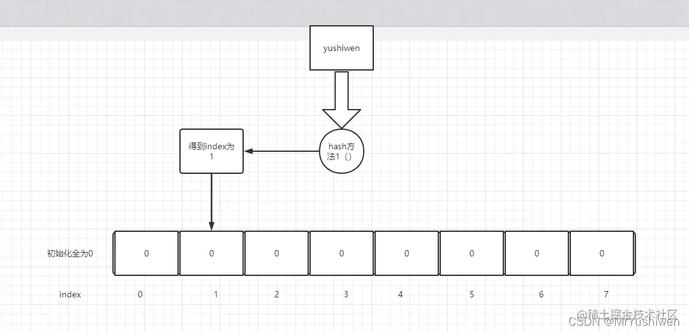
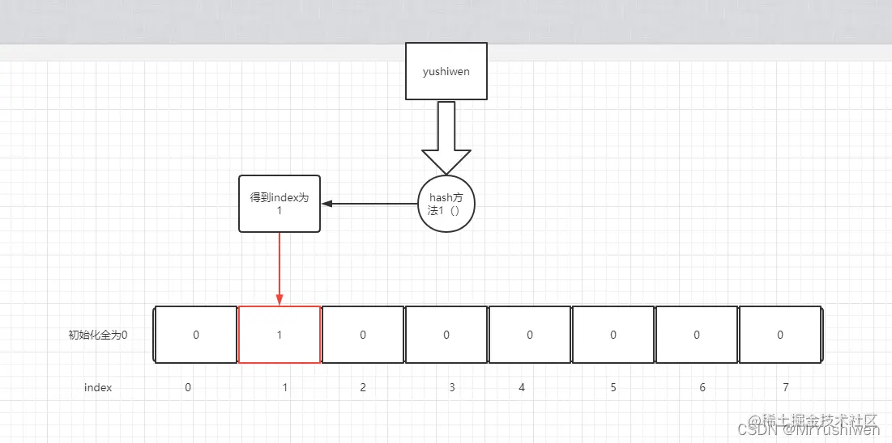
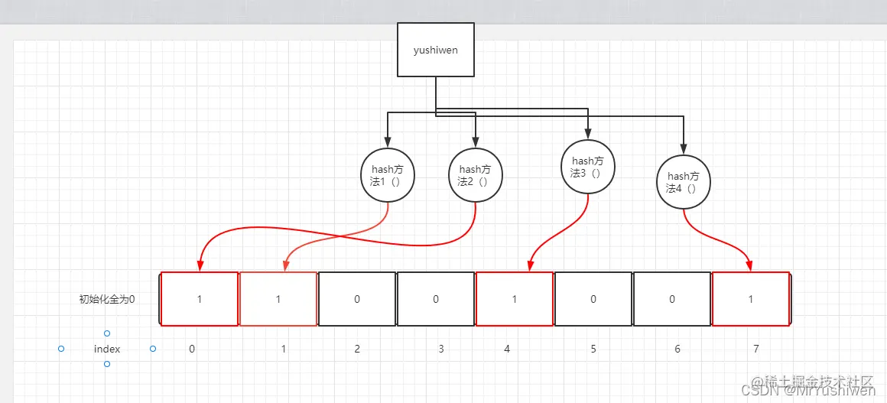
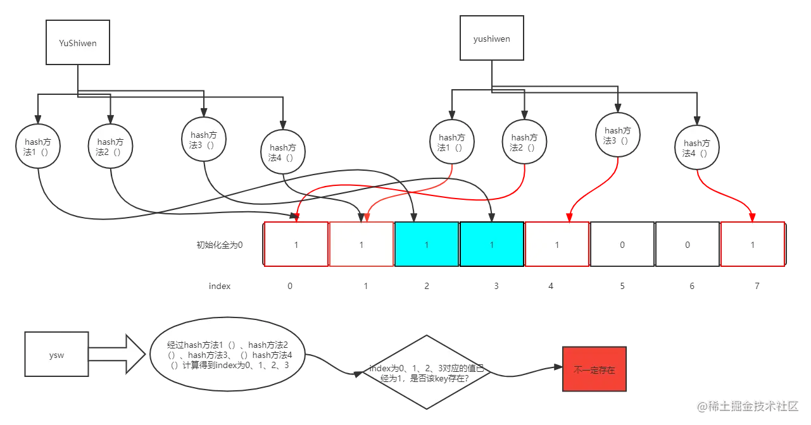
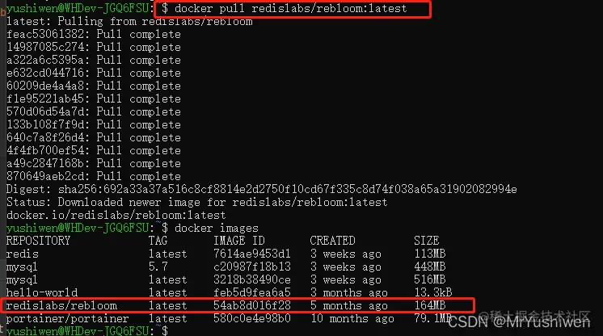
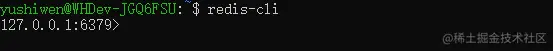
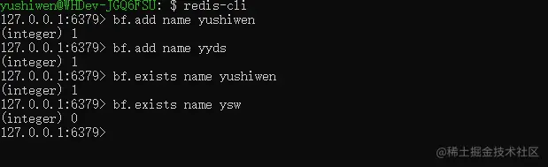
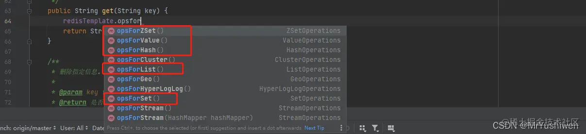

资料来源:<br/>
[Bloom Filter布隆过滤器（解决redis缓存穿透）](https://juejin.cn/post/7080731551335448607#heading-1)

## 1.什么是布隆过滤器：

布隆过滤器（英语：Bloom Filter）是 1970 年由布隆提出的。它实际上是一个很长的二进制向量和一系列随机映射函数。布隆过滤器可以用于检索一个元素是否在一个集合中。它的优点是空间效率和查询时间都比一般的算法要好的多，缺点是有一定的误识别率和删除困难。

如果想要判断一个元素是不是在一个集合里，一般想到的是将所有元素保存起来，然后通过比较确定，链表，树等等数据结构都是这种思路. 但是随着集合中元素的增加，我们需要的存储空间越来越大，检索速度也越来越慢。 比如：

- 链表O(n),
- 树O(logn)。

但是hash的速度却很快：

- 散列表（又叫哈希表，Hash table）：O(1)。

它可以通过一个Hash函数将一个元素映射成一个位阵列（Bit array）中的一个点。这样一来，我们只要看看这个点是不是1就可以知道集合中有没有它了。这就是布隆过滤器的基本思想。如下图是一个key经过一个hash函数计算得到的hash索引：  算出值后把其index里面的内容改为1.  Hash面临的问题就是冲突。假设Hash函数是良好的，如果我们的位阵列长度为m个点，那么如果我们想将冲突率降低到例如 1%, 这个散列表就只能容纳m / 100个元素。显然这就不叫空间效率了（Space-efficient）了。解决方法也简单，就是对同一个key用多个Hash计算后，然后改变其对应的index的值。 下面重点来了，一个key经过下图的多个hash方法计算，得到index并把其值变成1。

 只要这个key之前经过了这些hash方法计算了一遍，那么当我们的程序来了这个key的时候，再次经过这些hash方法的计算，得到的idnex还是直接计算的那些index，对应值也被改为1了；那么我们可以说，当计算某个key的时候，上图的四个hansh方法得到的index对应的值全是1，就说这个key一定存在（之前计算过），答案是否定的，我们不能保证整个key一定存在，如下图， 但是可以保证一个key经过hash计算，得到index对应的值有为0的，那么这个key一定不存在。  利用一个key经过hash计算，得到index对应的值有为0的，那么这个key一定不存在这个特点，可以很好的解决redis中的缓存穿透问题。

------

## 2.用BitSet手写简单的布隆过滤器

为更方便大家理解，下面用BitSet写了一个简单的demo，这里说明一下java中的BitSet类：

- Java平台的BitSet用于存放一个位序列，如果要高效的存放一个位序列，就可以使用位集(BitSet)。由于位集将位包装在字节里，所以使用位集比使用Boolean对象的List更加高效和更加节省存储空间。
- BitSet是位操作的对象，值只有0或1即false和true，内部维护了一个long数组，初始只有一个long，所以BitSet最小的size是64，当随着存储的元素越来越多，BitSet内部会动态扩充，一次扩充64位，最终内部是由N个long来存储。

为什么BitSet使用long数组做内部存储？

- JDK选择long数组作为BitSet的内部存储结构是出于性能的考虑，因为BitSet提供and和or这种操作，需要对两个BitSet中的所有bit位做and或者or，实现的时候需要遍历所有的数组元素。使用long能够使得循环的次数降到最低，所以Java选择使用long数组作为BitSet的内部存储结构。
- 从数据在栈上的存储来说，使用long和byte基本是没有什么差别的，除了编译器强制地址对齐的时候，使用byte最多会浪费7个字节(强制按照8的倍数做地址对其)，另外从内存读数组元素的时候，也是没有什么区别的，因为汇编指令有对不同长度数据的mov指令。所以说，JDK选择使用long数组作为BitSet的内部存储结构的根本原因就是在and和or的时候减少循环次数，提高性能。
- 例如我们进行BitSet中的and, or,xor操作时，要对整个bitset中的bit都进行操作，需要依次读出bitset中所有的word，如果是long数组存储，我们可以每次读入64个bit,而int数组存储时，只能每次读入32个bit。另外我们在查找bitset中下一个置为1的bit时,word首先会和0进行比较，如果word的值为0，则表示该word中没有为1的bit，可以忽略这个word，如果是long数组存储，可以一次跳过64个bit，如果是int数组存储时，一次只能跳过32个bit。

好，我们回到正题，下面这段代码，定义了8个hash函数，每次插入值的时候都会经过8个hash方法计算然后把对应位置设置为1，每次判断是否存在时，都是经过8个hash方法，如果有一个hash方法计算的位置所对应的值不为1，就返回false，表示该值不存在，如果都为1，就返回true，当然，前面我们提到过，虽然返回true，但是不能保证该元素一定存在。

```java
java复制代码public class MyBloomFilter {

    /**
     * 一个长度为10 亿的比特位
     */
    private static final int DEFAULT_SIZE = 256 << 22;

    /**
     * 为了降低错误率，使用加法hash算法，所以定义一个8个元素的质数数组，相当于构建 8 个不同的hash算法
     */
    private static final int[] seeds = {3, 5, 7, 11, 13, 31, 37, 61};

    /**
     * 相当于构建 8 个不同的hash算法
     */
    private static HashFunction[] functions = new HashFunction[seeds.length];

    /**
     * 初始化布隆过滤器的 bitmap
     */
    private static BitSet bitset = new BitSet(DEFAULT_SIZE);

    /**
     * 添加数据
     *
     * @param value 需要加入的值
     */
    public static void add(String value) {
        if (value != null) {
            for (HashFunction f : functions) {
                //计算 hash 值并修改 bitmap 中相应位置为 true
                bitset.set(f.hash(value), true);
            }
        }
    }

    /**
     * 判断相应元素是否存在
     * @param value 需要判断的元素
     * @return 结果
     */
    public static boolean contains(String value) {
        if (value == null) {
            return false;
        }
        boolean ret = true;
        for (HashFunction f : functions) {
            ret = bitset.get(f.hash(value));
            //一个 hash 函数返回 false 则跳出循环
            if (!ret) {
                break;
            }
        }
        return ret;
    }

    /**
     * 测试
     */
    public static void main(String[] args) {

        for (int i = 0; i < seeds.length; i++) {
            functions[i] = new HashFunction(DEFAULT_SIZE, seeds[i]);
        }

        // 添加1亿数据
        for (int i = 0; i < 100000000; i++) {
            add(String.valueOf(i));
        }
        System.out.println(contains("99999999"));   // true

        String id = "123456789";
        add(id);

        System.out.println(contains(id));   // true
        System.out.println("" + contains("234567890"));  //false
    }
}

class HashFunction {

    private int size;
    private int seed;

    public HashFunction(int size, int seed) {
        this.size = size;
        this.seed = seed;
    }

    public int hash(String value) {
        int result = 0;
        int len = value.length();
        for (int i = 0; i < len; i++) {
            result = seed * result + value.charAt(i);
        }
        return (size - 1) & result;
    }
}
```

------

## 3.redis中的缓存穿透

缓存穿透，即穿透过缓存，直接访问mysql等其他关系型数据库， 比如： 查询一个数据库中不存在的数据，比如商品详情，查询一个不存在的name，每次都会访问DB，如果有人恶意破坏，很可能直接对DB造成过大地压力。 当前的解决方法有两种：

1. 直接用redis存一个过期时间就可以，当通过某一个key去查询数据的时候，如果对应在数据库中的数据都不存在，我们将此key对应的value设置为一个默认的值，比如“NULL”，并设置一个缓存的失效时间，这时在缓存失效之前，所有通过此key的访问都被缓存挡住了。后面如果此key对应的数据在DB中存在时，缓存失效之后，通过此key再去访问数据，就能拿到新的value了。
2. 常见的则是采用布隆过滤器（可以用很小的内存保留很多的数据），将所有可能存在的数据哈希到一个足够大的bitmap中，`一个一定不存在的数据会被 这个bitmap拦截掉，从而避免了对底层存储系统的查询压力。`（布隆过滤器：实际上是一个很长的二进制向量和一系列随机映射函数。布隆过滤器可以用于检索一个元素是否在一个集合中。它的优点是空间效率和查询时间都远远超过一般的算法，缺点是有一定的误识别率和删除困难。）

本篇文章重点讲解采用布隆过滤器,它的优缺点如下：

优点：

- 相比于其它的数据结构，布隆过滤器在空间和时间方面都有巨大的优势。布隆过滤器存储空间和插入/查询时间都是常数。另外, Hash函数相互之间没有关系，方便由硬件并行实现。布隆过滤器不需要存储元素本身，在某些对保密要求非常严格的场合有优势。布隆过滤器可以表示全集，其它任何数据结构都不能。

缺点：

- 上述我们提到过，布隆过滤器它可以判断一个元素一定不存在，但是不能判断一个元素一定存在，它存在一定的误算率。
- 一般情况下不能从布隆过滤器中删除元素，我们很容易想到把位列阵变成整数数组，每插入一个元素相应的计数器加1, 这样删除元素时将计数器减掉就可以了。然而要保证安全的删除元素并非如此简单。首先我们必须保证删除的元素的确在布隆过滤器里面，这一点单凭这个过滤器是无法保证的。
- 布谷鸟过滤器号称可以解决布隆过滤器删除这个软肋，但是布谷鸟过滤器要想删除必须限制相同元素不能被插入多于某个阈值的次数，可用性不高。

------

## 4.Redis中的布隆过滤器

### 4.1 RedisBloom

Redis 提供的 bitMap 可以实现布隆过滤器，但是需要自己设计映射函数和一些细节，这和我们自定义没啥区别。

Redis 官方提供的布隆过滤器到了 Redis 4.0 提供了插件功能之后才正式登场。布隆过滤器作为一个插件加载到 Redis Server 中，给 Redis 提供了强大的布隆去重功能。

在已安装 Redis 的前提下，安装 RedisBloom，有两种方式：

#### 4.1.1直接编译进行安装

```bash
bash复制代码git clone https://github.com/RedisBloom/RedisBloom.git
cd RedisBloom
make     #编译 会生成一个rebloom.so文件
redis-server --loadmodule /path/to/rebloom.so   #运行redis时加载布隆过滤器模块
redis-cli    # 启动连接容器中的 redis 客户端验证
```

#### 4.1.2使用Docker进行安装

1. 拉取镜像（该镜像包含redis和RedisBloom） `docker pull redislabs/rebloom:latest` # 拉取镜像



1. 用刚拉去的镜像创建一个新的容器，并运行 `docker run -p 6379:6379 --name redisbloom_ysw redislabs/rebloom:latest` 运行容器 
2. 
3. 用redis客户端连接刚启动的带有RedisBloom的redis服务

```
redis-cli 
```


布隆过滤器基本指令：

- bf.add 添加元素到布隆过滤器

- bf.exists 判断元素是否在布隆过滤器

- bf.madd 添加多个元素到布隆过滤器，bf.add 只能添加一个

- bf.mexists 判断多个元素是否在布隆过滤器

   

### 4.2 在springboot项目中使用Lettuce +Redisson

- Jedis 和 Lettuce 是比较纯粹的 Redis 客户端，几乎没提供什么高级功能。Jedis 的性能比较差，所以如果你不需要使用 Redis 的高级功能的话，优先推荐使用 Lettuce 。
- Redisson 的优势是提供了很多开箱即用的 Redis 高级功能，如果你的应用中需要使用到 Redis 的高级功能，建议使用 Redisson。在这种情况下，一般是Lettuce +Redisson一起使用。

#### 4.2.1使用lettuce：

1. 在pom中引入依赖：

```xml
xml复制代码<dependency>
    <groupId>org.springframework.boot</groupId>
    <artifactId>spring-boot-starter-data-redis</artifactId>
    <version>2.3.5.RELEASE</version>
</dependency>
<dependency>
    <groupId>org.apache.commons</groupId>
    <artifactId>commons-pool2</artifactId>
</dependency>
```

1. 配置文件

```yaml
yaml复制代码spring:
  datasource:
    #redis相关配置
    redis:
      database: 0
      host: 99.248.217.222
      prot: 6379
      password:
      lettuce:
        pool:
          max-active: 8
          max-wait: -1
          max-idle: 10
          min-idle: 2
      timeout: 6000
    ###########
```

1. 编写配置类

```java
java复制代码/**
 *
 *  <p>Redis配置类
 *  <p>因为默认的模板只能存储字符串类型的，所以我们需要自定义RedisTemplate，满足可以存放更多类型的数据,设置序列化器，这样我们可以很方便的操作实例对象。
 *
 *
 * @author ysw
 * @date 2022-01-12
 */

@Configuration
public class LettuceRedisConfig {

    @Bean
    public RedisTemplate<String, Serializable> redisTemplate(LettuceConnectionFactory connectionFactory) {
        RedisTemplate<String, Serializable> redisTemplate = new RedisTemplate<>();
        // 设置key的序列化器
        redisTemplate.setKeySerializer(new StringRedisSerializer());
        // 设置String的value采用什么的序列化方式
        redisTemplate.setValueSerializer(new GenericJackson2JsonRedisSerializer());
        // hash的key也采用String的序列化方式
        redisTemplate.setHashKeySerializer(new StringRedisSerializer());
        redisTemplate.setHashValueSerializer(new Jackson2JsonRedisSerializer(Object.class));
        // 设置数据源的连接工厂（默认会传入框架中自带的（也就是读取完配置文件装配的）LettuceConnectionFactory ）
        // 也可以自己定义，注入容器，再通过@Qualifier("")传进来
        redisTemplate.setConnectionFactory(connectionFactory);
        return redisTemplate;
    }

}
```

1. 编写自己的Redis工具类

 上面红框中的五个方法具体对应redis中的五种数据结构：

- `opsForZSet()`：对应redis中的zset （有序集合）
- `opsForValue()`：对应redis中的String (字符串类型)
- `opsForHash()`：对应redis中的Hash （哈希）
- `opsForList()`：对应redis中的List（链表）
- `opsForSet()`：对应redis中的Set（集合）

具体的工具类如下：

```java
java复制代码**
 *
 * <p>Redis工具类
 *
 *
 * @author ysw
 */
@Component
public class RedisUtils {

    @Resource
    private RedisTemplate redisTemplate;

    /**
     * 设置key-value
     * @param key 键
     * @param value 值
     */
    public void set(String key, String value) {
        redisTemplate.opsForValue().set(key, value);
    }

    /**
     * 设置带生存时间的key-value
     * @param key 键
     * @param value 值
     * @param timeout 生存时间
     * @param unit 时间单位
     */
    public void set(String key, String value, long timeout, TimeUnit unit) {
        redisTemplate.opsForValue().set(key, value, timeout, unit);
    }

    /**
     * 设置指定数据的生存时间。
     *
     * @param key 键
     * @param time 生存时间（秒）
     */
    public void expire(String key, long time) {
        redisTemplate.expire(key, time, TimeUnit.SECONDS);
    }

    /**
     * 根据key，获取值
     * @param key 键
     * @return 获取到的值
     */
    public String get(String key) {
        return String.valueOf(redisTemplate.opsForValue().get(key));
    }

    /**
     * 删除指定信息。
     *
     * @param key 键
     * @return 是否删除成功
     */
    public boolean delete(String key) {
        return redisTemplate.delete(key);
    }


    public void zSetOrderPrepare(String key,BackOrderPrepareVO member,int score){
        ZSetOperations<String, BackOrderPrepareVO> operations = redisTemplate.opsForZSet();
        operations.add(key,member,score);
    }


    /**
     * 删除指定信息。
     *
     * @param key 键
     * @return 是否删除成功
     */
    public boolean existsOrderPrepareKey(String key){
        return redisTemplate.hasKey("key");
    }

    public Set getAllOrderPrepareValueAndScore(String key){
        Set set = redisTemplate.opsForZSet().reverseRange(key, 0, -1);
        return set;
    }
}
```

至此整合Lettuce 结束，我们可以在其他地方调用我们自己写的工具类中的方法去与redis服务进行交互。

#### 4.2.2使用Redisson

1. 在pom中引入依赖：

```xml
       <dependency>
            <groupId>org.redisson</groupId>
            <artifactId>redisson</artifactId>
            <version>3.11.1</version>
        </dependency>
```

1. 配置文件，与Lettuce的配置文件公用同一个
2. 编写相关配置类

```java
/**
 *
 *  <p>Redisson配置类
 *
 *
 *
 * @author ysw
 * @date 2022-01-12
 */
@Configuration
public class RedissonConfig {

    @Value("${spring.redis.host:99.248.217.222}")
    private String host;
    @Value("${spring.redis.port:6379}")
    private String port;

    @Bean
    public RedissonClient redissonClient() {
        Config config = new Config();
        // redis为单机模式
        // starter依赖进来的redisson要以redis://开头，其他不用
        config.useSingleServer()
                .setAddress("redis://" + host + ":" + port);
        return Redisson.create(config);
    }
}
```

1. 布隆过滤器demo

```java
@Slf4j
@SpringBootTest(webEnvironment = SpringBootTest.WebEnvironment.RANDOM_PORT)
public class RedissonBloomFilter {
    @Resource(name = "redissonClient")
    private RedissonClient redissonClient;

    @Test
    public void bloomFilterDemo(){
        RBloomFilter<Object> bloomFilter = redissonClient.getBloomFilter("bloom-filter");
        //初始化，容器10000.容错率千分之一
        bloomFilter.tryInit(10000,0.001);
        //添加10000个
        for (int i = 0; i < 10000; i++) {
            bloomFilter.add("YuShiwen" + i);
        }
        //用来统计误判的个数
        int count = 0;
        //查询不存在的数据一千次
        for (int i = 0; i < 1000; i++) {
            if (bloomFilter.contains("xiaocheng" + i)) {
                count++;
            }
        }
        System.out.println("判断错误的个数："+count);
        System.out.println("YuShiwen9999是否在过滤器中存在："+bloomFilter.contains("YuShiwen9999"));
        System.out.println("YuShiwen11111是否在过滤器中存在："+bloomFilter.contains("YuShiwen11111"));
        System.out.println("预计插入数量：" + bloomFilter.getExpectedInsertions());
        System.out.println("容错率：" + bloomFilter.getFalseProbability());
        System.out.println("hash函数的个数：" + bloomFilter.getHashIterations());
        System.out.println("插入对象的个数：" + bloomFilter.count());
    }
}
```

输出结果：

```bash
判断错误的个数：1
YuShiwen9999是否在过滤器中存在：true
YuShiwen11111是否在过滤器中存在：false
预计插入数量：10000
容错率：0.001
hash函数的个数：10
插入对象的个数：9999
```


