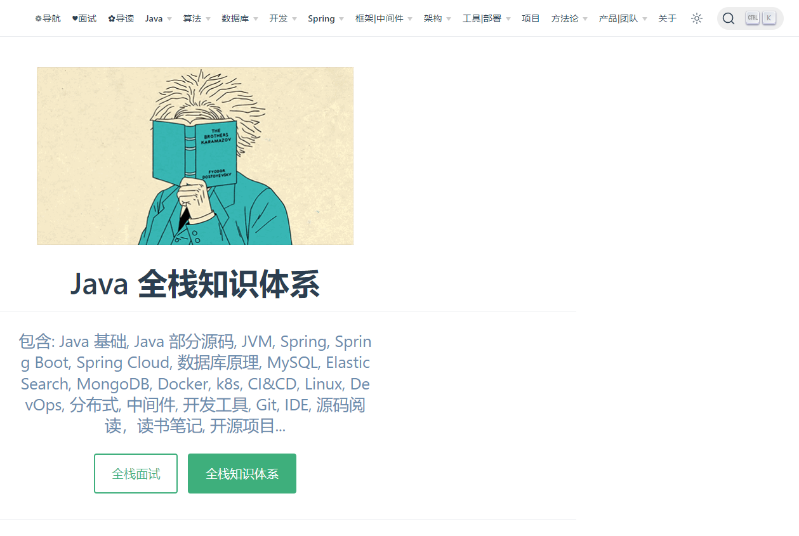
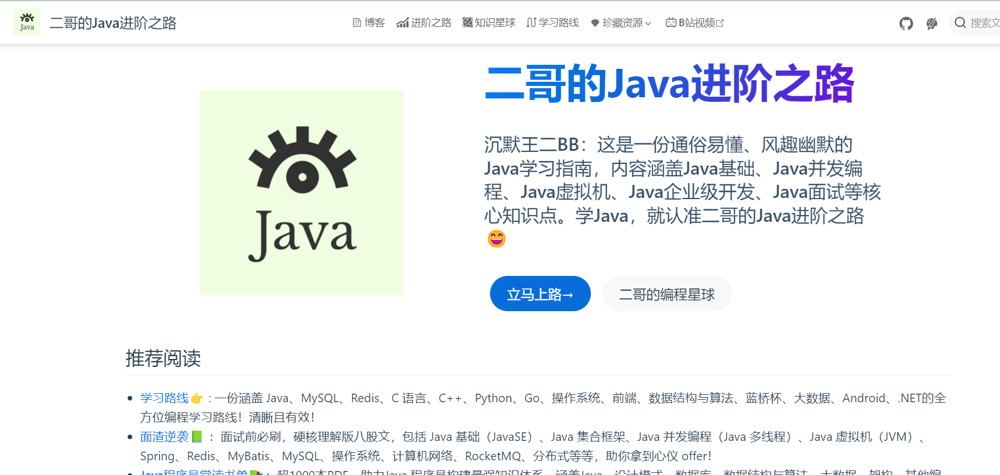
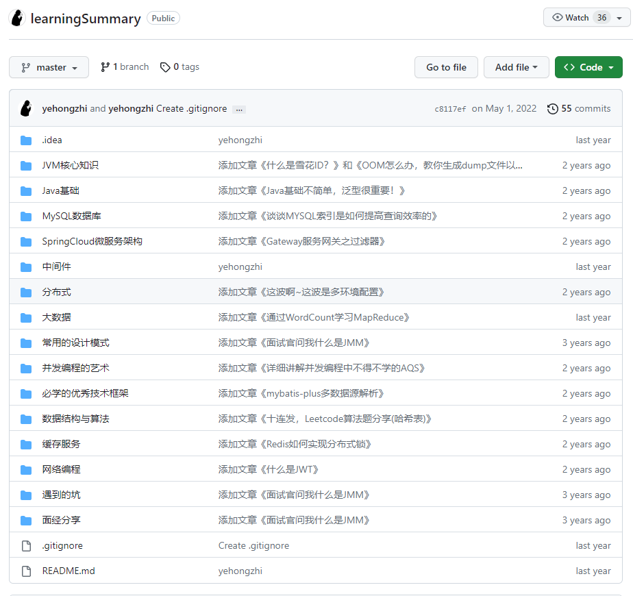
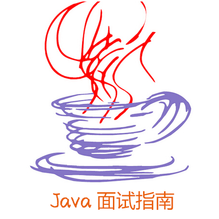
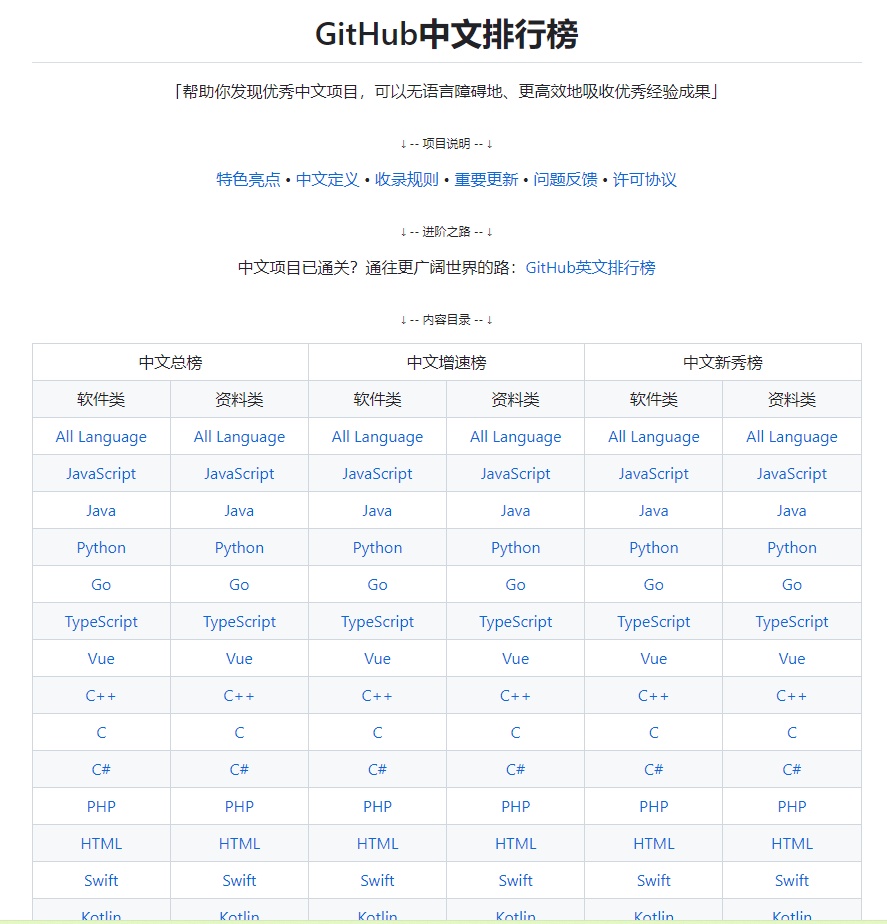
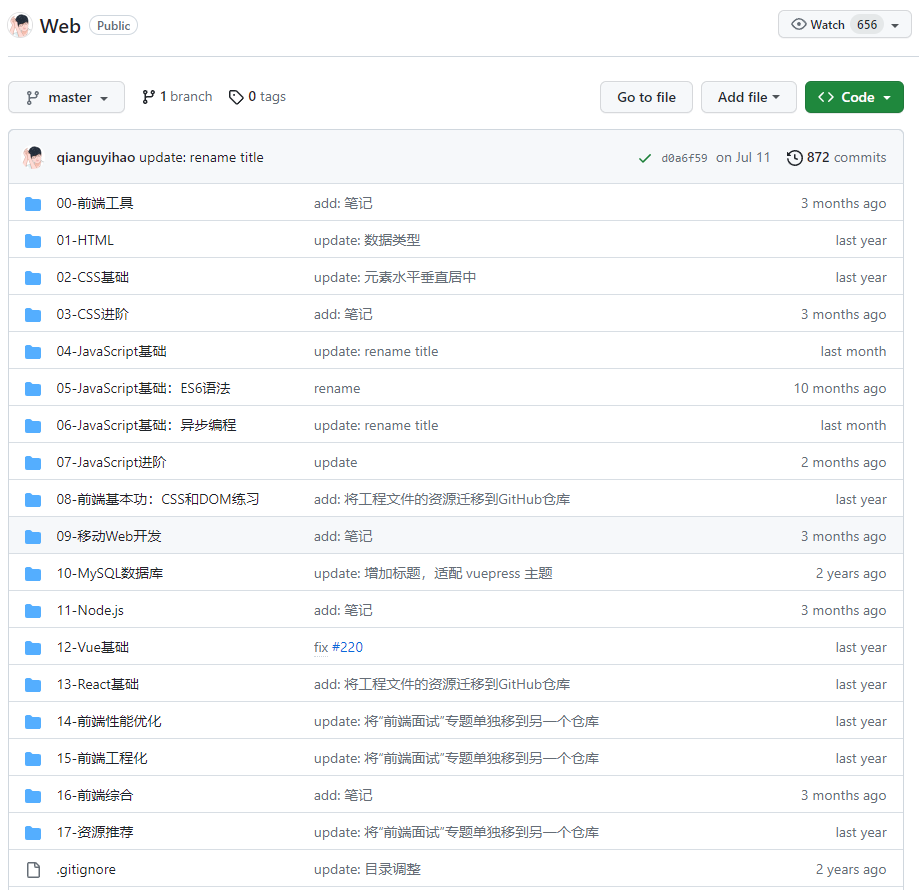

## 推荐网站

### Java 全栈知识体系

[Java 全栈知识体系](https://pdai.tech/) `https://pdai.tech/`

这个网站是我目前为止，见到最用心、最整洁、最舒服、java知识最全面的网站，同时这个网站的代码显示风格非常好，后面学习java就你这个私人博客了，大神

----

### 二哥的Java进阶之路

地址：https://javabetter.cn/

### learningSummary

[github地址](https://github.com/yehongzhi/learningSummary)`https://github.com/yehongzhi/learningSummary`

涵盖大部分Java进阶需要掌握的知识，包括【微服务】【中间件】【缓存】【数据库优化】【搜索引擎】【分布式】等等，欢迎Star~

宝藏级的知识库

### 面试

[Java 面试题汇总](https://github.com/vipstone/interview)`https://github.com/vipstone/interview`

也是非常不错的，值得推荐

在本篇文章开始之前，我想先来回答一个问题：我为什么要写这样一篇关于面试的文章？原因有三个：第一，我想为每一个为梦想时刻准备着的“有心人”，尽一份自己的力量，提供一份高度精华的 java 面试清单；第二，目前市面上的面试题不是答案不准确就是内容覆盖面太窄，所以提供一份经典而又准确的面试题是非常有必要的；第三，本文会对部分面试题提供详细解读和代码案例，让读者知其然并知其所以然，从而学到更多的知识。

或许这份面试题还不足以囊括所有 java 问题，但有了它，我相信你一定不会“败”的很惨，因为有了它，足以应对目前市面上绝大部分的 java 面试了，因为这篇文章不论是从深度还是广度上来讲，都已经囊括了非常多的知识点了。

凡事预则立，不预则废。能读到这里的人，我相信都是这个世界上的“有心人”，还是那句老话：上天不负有心人！我相信你的每一步努力，都会收获意想不到的回报。

#### 适宜阅读人群

- 准备跳槽的初/中/高级 Java 程序员
- 想要查漏补缺的人
- 想要不断完善和扩充自己 Java 技术栈的人
- Java 面试官

#### 阅读建议

本文会按技能模块划分文章段落，每个模块里的内容，从易到难依次进行排序，各模块之间不存在互相关联的关系，读者可选择文章顺序阅读或者跳跃式阅读。

### github中文排行榜

**绝对推荐，这个资料绝对的王炸**

[GitHub中文排行榜](https://github.com/GrowingGit/GitHub-Chinese-Top-Charts)`https://github.com/GrowingGit/GitHub-Chinese-Top-Charts`

### 前端推荐

[千古前端图文教程github](https://github.com/qianguyihao/Web)`https://github.com/qianguyihao/Web`

[网站地址](https://web.qianguyihao.com/)：https://web.qianguyihao.com/

千古前端图文教程，超详细的前端入门到进阶知识库。从零开始学前端，做一名精致优雅的前端工程师。

