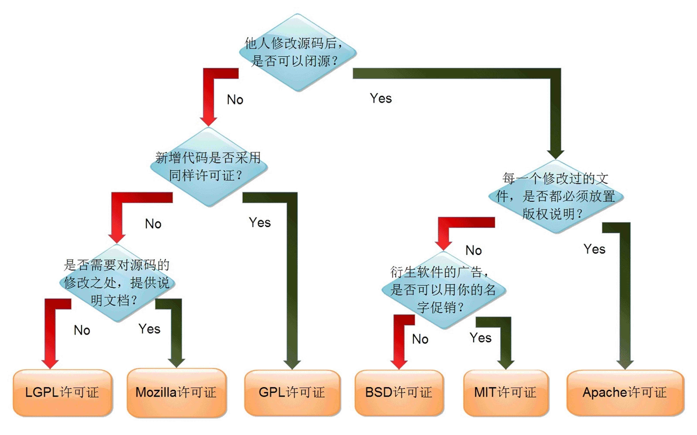
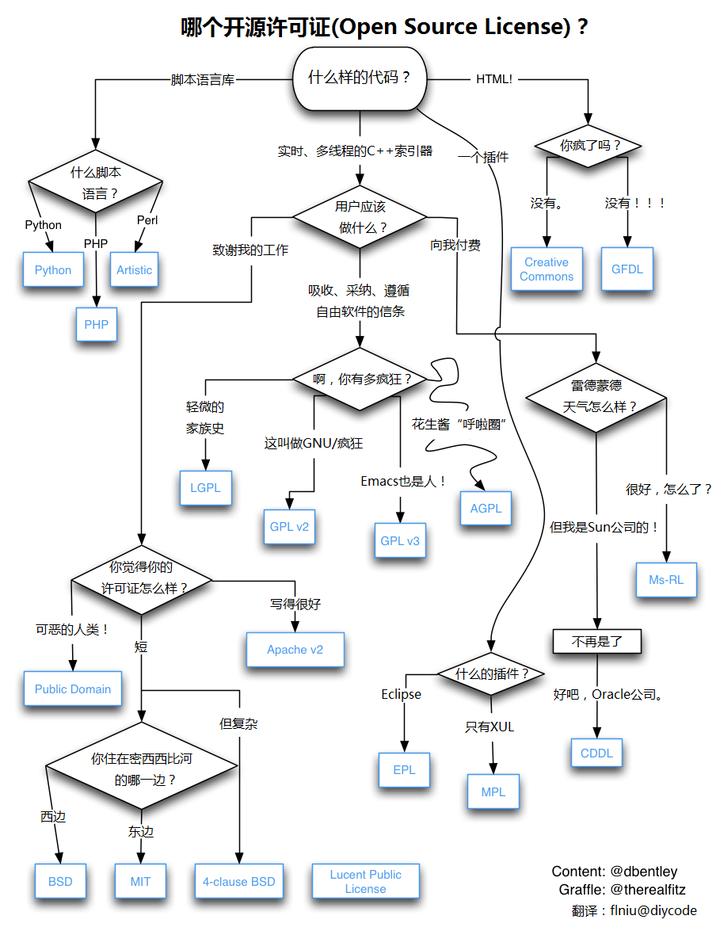

资料来源： 
[（大集合）可供选择的软件开源协议的罗列](https://blog.csdn.net/Staokgo/article/details/121865177)

#### 用图描述开源协议的选择

下图出处：乌克兰程序员 Paul Bagwell 画了一张分析图（图为阮一峰汉化版 [阮一峰的网络日志](http://www.ruanyifeng.com/blog/) Cc-By-3.0 / 2011.5.2）

下图出处：见图中右下角

